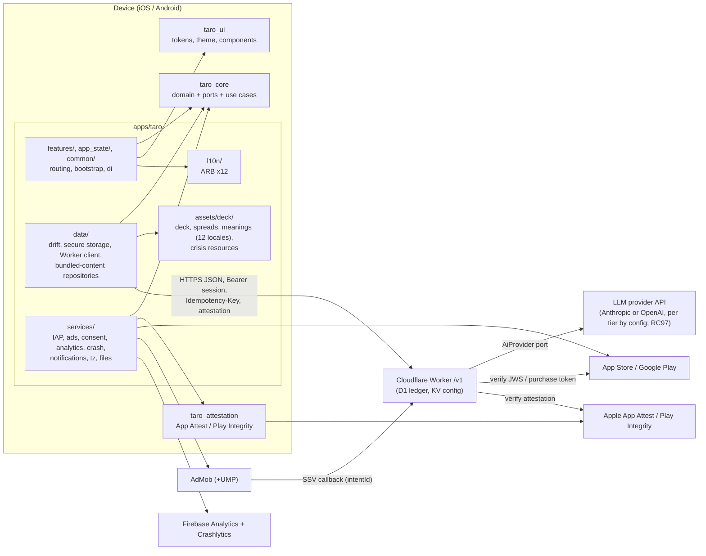
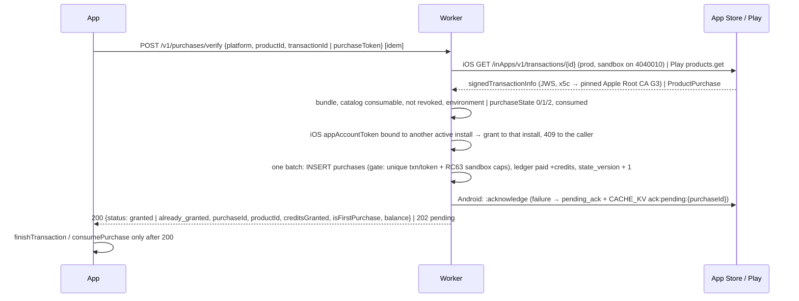
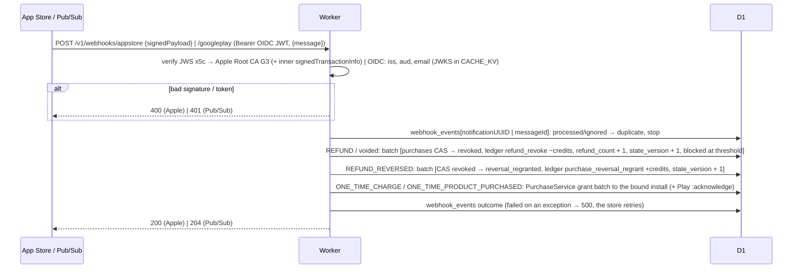
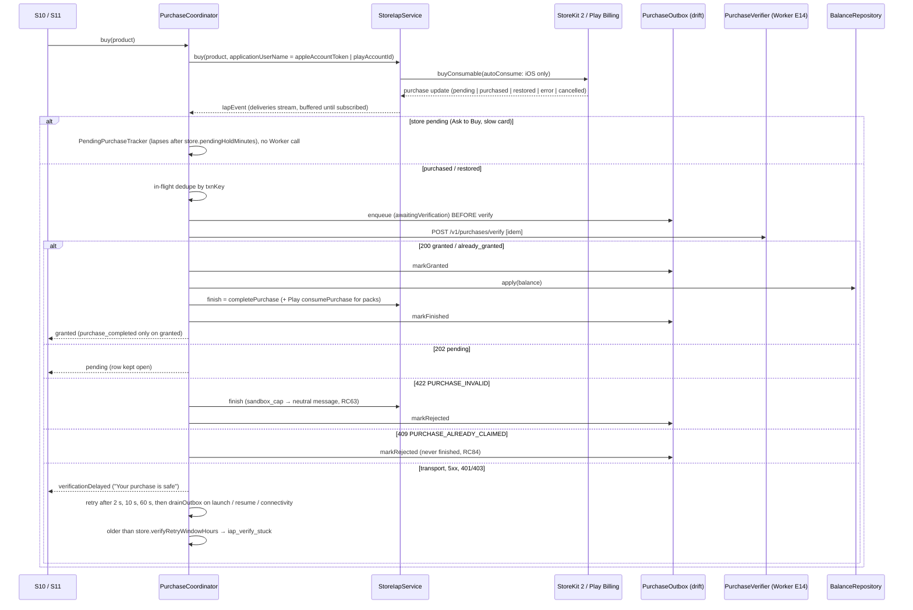

# Taro architecture

**Status:** stub (Phase 2). This is the living architecture doc (06 §13). It is derived from `specs/02_ARCHITECTURE.md` and `specs/03_BACKEND_WORKER.md` and is updated as the code changes. When this doc and the specs disagree about what the code *does*, this doc wins; about what it *should* do, the specs win.

§Domain and §Ports describe `taro_core` (Phase 4), §Data layer the app's `data/` (Phase 11) and §Services layer the platform adapters with the client purchase, rewarded and consent sequences (Phase 12). Phase 13 adds the reading flow and the DI wiring.

## Packages and system context

From 02 §1 and §2 (RC95): three packages (`taro_core`, `taro_ui`, `taro_attestation`) and the app `apps/taro`, whose layers are folders (`lib/data/`, `lib/services/`, `lib/l10n/`, `assets/deck/`, `lib/features/`, …). Arrows are allowed imports; the full package and folder rules are in 02 §2.1 and are enforced by the import-graph check `tools/check_architecture.dart` (Phase 3).



Test support has no package (RC95): port fakes and contract suites live in `packages/taro_core/test/fakes/` and `test/contracts/` (Riverpod-free, RC77), the golden comparator and test fonts in `packages/taro_ui/test/helpers/golden/`, and `pumpTaro`, `pumpTaroWidget` and `TaroFakes` in `apps/taro/test/helpers/`.

## Design tokens

- Source: [`docs/design/taro.tokens.json`](design/taro.tokens.json), a W3C DTCG export of the approved Claude Design system with light and dark modes (`$extensions.taro.modes`). Token paths follow `01_PRODUCT.md` §14 (for example `color.bg.canvas`).
- Pipeline (02 AR16, §14; RC15): `tools/tokens/` (Phase 15) compiles the file into Dart constants under `packages/taro_ui/lib/src/tokens/generated/` and a `TaroTokens` `ThemeExtension`. The generated output is excluded from coverage; the generator is covered under `tools`.
- Widgets never use raw colors, sizes, radii or durations (CLAUDE.md rule 15). See [`docs/design/README.md`](design/README.md) for the design system, fonts and screen canvas.

## Design system (`taro_ui`, Phase 15)

- **Generator.** `dart run tools/tokens/generate.dart` (`melos run gen:tokens`) reads the DTCG file (`$value`/`$type`, group `$type` inheritance, `{a.b}` aliases resolved per mode, alias cycles and missing modes are errors) and writes `taro_tokens.g.dart`: one immutable class per group (`TaroColorTokens` → `TaroColorBgTokens` …, `TaroTypeTokens`, `TaroSpaceTokens`, `TaroRadiusTokens`, `TaroElevationTokens`, `TaroMotionTokens`, `TaroSizeTokens`, `TaroLayoutTokens`, `TaroOpacityTokens`, plus `TaroFontTokens` and `TaroHapticTokens`), each with `const light`/`dark` instances (mode-invariant groups alias `dark = light`), `TaroMotionTokens.reduced` from `$extensions["taro.reducedMotion"]`, and a static `lerp`. Accessors are the token keys in camelCase; numeric keys take the group's initial (`space.4` → `space.s4`, `elevation.1` → `elevation.e1`). Output goes through `dart format`, so it is deterministic; `--check` fails on a stale file. The generator refuses a file whose names differ from the 01 §14 contract (02 §14.2). The logic lives in `tools/dart_tools/lib/src/tokens/` (covered with the `tools` unit, fixture files in `tools/dart_tools/test/fixtures/tokens/`); `tools/tokens/*.dart` are thin entry points.
- **Validator.** `dart run tools/tokens/validate_tokens.dart` checks the 166 01 §14 names (no missing, no extra), per-mode colours, reduced-motion values on every `motion.*`, `font.family.{role}.{script}` for 10 roles × 5 scripts, the five properties of every `type.*` (REVIEW K5), haptic values, the constraints (body ≥ 16, caption ≥ 12, reading line height ≥ 1.5, `space.adGap` ≥ 16, `layout.gutter` ≥ 16, touch target 48) and the contrast pairs of REVIEW K6–K10 (44 over both modes) plus K11 (`color.suit.major` text). CI (`reusable-static.yml`) and `tools/verify.sh` run it and `generate.dart --check`.
- **Runtime.** `TaroTheme.light({script})` / `.dark({script})` build Material 3 `ThemeData` (`ColorScheme` from the semantic colours, text theme from the type roles, component themes from tokens) with `TaroTokens` attached. Read tokens with `context.tokens` (`context.tokens.color.text.primary`, `context.tokens.space.s4`, `context.tokens.typography.body`; the type roles are `typography` because `ThemeExtension.type` is the extension key). `context.motion` returns `TaroMotionTokens.reduced` when `MediaQuery.disableAnimations` or `TaroA11yScope.reduceMotion` is set; `TaroHaptics.pick/flip/ready(context)` play the `haptic.*` tokens unless `TaroA11yScope.hapticsEnabled` is false. The app maps `UserSettings.reduceMotion`/`hapticsEnabled` into a `TaroA11yScope` (taro_ui cannot import taro_core, RC95).
- **Fonts per script.** `TaroScript.forLocale(locale)` picks the script; `TaroTypeTokens.forScript` puts that script's `font.family.{role}.{script}` first and the other scripts' families as fallbacks, so mixed-script text still renders from bundled fonts. Pass the script to `TaroTheme.light/dark(script: …)` when the locale changes.
- **Bundled fonts** (`packages/taro_ui/fonts/`, OFL 1.1, from `github.com/google/fonts`; details in its `README.md`): Literata, IBM Plex Sans (+ Arabic, JP, KR; subset files renamed "Taro Sans" for the "Plex" Reserved Font Name), Noto Naskh Arabic (declared as the token family "Noto Serif Arabic", which Google Fonts does not publish), Noto Serif JP/KR, IM Fell English SC. Subsets: Latin + Cyrillic, Arabic, JIS X 0208 level 1, KS X 1001 Hangul; CJK faces in 400 and 600 only. **Size budget (02 §17): 11,693,148 bytes raw, ≈ 6.0 MB deflated** (Latin/Cyrillic 0.93 MB, Arabic 0.76 MB, Japanese 5.99 MB, Korean 4.01 MB raw), about 10 % of the 60 MB iOS and 15 % of the 40 MB Android download budget. `build_fonts.sh` rebuilds them deterministically. The licences ship as `taro_ui` assets (`fonts/licenses/`); the app calls `registerTaroFontLicenses()` at startup so they appear on the licences page (OFL 1.1 condition 2).
- **Stroke widths** are not tokens; `TaroStrokes` (`lib/src/tokens/taro_strokes.dart`) names them from components.md: hairline 1, control 1.5, focus ring 2 with a 2 px gap.
- **Components** (Sprints 15.1–15.2; inventory, tokens and states per component in [`docs/design/components.md`](design/components.md)): structure and navigation (`TaroScaffold`, `TaroAppBar`, `TaroTabBar`, `TaroSheet`, `TaroDialog`, `SettingsTile`, `SettingsSection`, `SegmentedChoice`, `TaroTabStrip`, `StepIndicator`, `TaroBrandMark`), actions and inputs (`TaroButton`, `TaroIconButton`, `TaroTextField`, `TaroChip`, `TaroRadioTile`, `WeekdayPicker`, `TaroAccordion`), containers (`TaroSurfaceCard`, `TaroListTile`, `JournalEntryTile`, `IconBulletList`, `NotificationPreview`), deck (`TaroCardFace`, `TaroCardBack`, `TaroCardFlip`, `CardFan`, `SpreadCanvas`, `SpreadDiagram`, `CardGridTile`, `SuitGlyph` + `TaroIcons`), reading (`ReadingTextView`, `ReadingSectionHeader`, `AiGeneratedLabel` incl. `classic`, `ReadingRatingControl`), feedback (`TaroCoachmark`, `TaroToast`), monetization (`BalancePill`, `ProductOfferTile`, `BannerContainer`, `PatternsChart`, `TaroBadge`, `CountdownText`) and the 01 §8.2 state kit: `TaroLoadingView` (skeleton layouts `list`/`text`/`cards`, one live-region label), `SkeletonBlock` + `TaroShimmer` (still under reduced motion), `TaroEmptyView`, `TaroErrorView(kind: TaroErrorKind, …)` (mirrors `ErrorKind`; the app maps it and passes localised text), `TaroOfflineBanner`, `TaroInlineNotice(kind: TaroNoticeKind, prominent:)`. No component takes a raw colour, size or duration: `check_forbidden_apis.py` (raw-visual rule, RC90) has no exceptions in `taro_ui` outside `lib/src/tokens/` and `lib/src/motion/`, and `stub_tokens.dart` never existed in this line of work (Phase 13 used the real kit).
- **Golden baseline (Sprint 15.3, 2026-09-30).** 37 golden sheets (36 component sheets + the harness `sample`) / 190 PNGs in `packages/taro_ui/test/golden/goldens/<sheet>/<size>_<theme>_<locale>[_x2].png`: every sheet at `kPhoneSmall` × light/dark × en/ar, `_x2` (200 % text, en light) for the text-heavy components, `kTabletIpad13` (en light, ar dark) for layout-level and navigation components (RC24). `components.md` links each component to its sheet. Regenerated once on the reference platform (macOS arm64, Flutter 3.44.8 pin) with `melos run golden:update` (`tools/golden_update.py`, refuses elsewhere without `--force-local`); `melos run test:golden` passes. `TaroCardFlip` has its own sheet with timed mid-animation frames (full-motion Y rotation and the reduced-motion cross-fade), registered by hand because `goldenMatrix` settles animations. Design review against `docs/design/screens/frames/` fixed: `SettingsTile` value + chevron now sit at the row end (title keeps 2/3 of the row; before, the value floated mid-row and short titles wrapped), `JournalEntryTile` meta uses `color.text.tertiary` (components.md), and the reduced-motion `TaroCardFlip` cross-fade is top-aligned so the back and the face card overlap in place. Open for the MANUAL visual check (spec and canvas disagree, or the fix belongs to the screen phase): `ReadingTextView` question is `type.body` italic `text.secondary` per components.md but upright `type.caption` `text.tertiary` on S09; the `status` `TaroBadge` (Classic) is filled `bg.sunken` per components.md but outlined `border.strong` on S14; `JournalEntryTile` titles wrap to two lines (a11y choice) where S14 ellipsizes one line, and the leading thumb slot is caller-sized where S14 reserves a fixed 3-thumb column; `SettingsTile` chevron is `text.secondary` rounded where the canvas draws a 1.5 px `text.tertiary` chevron; `TaroCardFace` name/numeral sit under the card at `type.cardName` where S08/S09 print them inside the frame (depends on the Phase 18 art); `TaroScaffold` puts the body flush under `TaroOfflineBanner` (screens add their own top spacing). Goldens render with the bundled fonts, so the remaining differences to the frames are 1× vs 2× scale and sample data.
- **Tests.** `flutter_test_config.dart` also loads the bundled fonts under `packages/taro_ui/<family>` and the SDK's Material Icons, so goldens render the real typefaces and icons; `withTaroTestFonts(theme)` now returns the theme unchanged.

## Dependencies and build notes (Phase 2, 2026-09-27)

Resolved versions, deviations from 02 §18, build fixes and the RC91 FTS5 spike results.

### Flutter workspace and app

Toolchain: Flutter 3.44.8 (Dart 3.12.2), melos 8.9.0, Xcode + iPhone 17 simulator (iOS 26), Android emulator Pixel_9a (API 36), AGP 9.0.1, Kotlin 2.3.20, CocoaPods 1.16.2.

#### Workspace layout (owner decision 2026-09-27: 3 packages + app)

Workspace members: `apps/taro`, `packages/taro_core` (pure Dart), `packages/taro_ui`, `packages/taro_attestation` (plugin), `packages/taro_attestation/example` (host app for the plugin's XCTest/JUnit and integration test), `tools/dart_tools`.
The former `taro_data`, `taro_services`, `taro_content`, `taro_l10n`, `taro_testing` live in the app:
`apps/taro/lib/data/` (drift, secure storage, API client; `lib/data/content/`, later `lib/data/backup/`), `apps/taro/lib/services/` (adapters; widgets in `lib/services/presentation/`), `apps/taro/assets/deck/`, `apps/taro/l10n.yaml` + `lib/l10n/arb/` → `lib/l10n/generated/` (not committed; `melos bootstrap` post-hook and `melos run gen` run `flutter gen-l10n`), `apps/taro/test/helpers/`. `taro_ui` has no taro dependencies.

#### Dependencies: resolved versions and deviations from 02 §18

The root cause of every deviation: Flutter 3.44.8 pins `meta 1.18.0`, `clock 1.1.2`, `test_api 0.7.11` and ships Dart 3.12.2.

| Package | 02 §18 | Used | Resolved | Why |
|---|---|---|---|---|
| very_good_analysis | ^11.0.0 | ^10.3.0 | 10.3.0 | 11.x needs Dart ^3.13 |
| freezed | ^4.0.2 | ^3.2.5 | 3.2.5 | 4.x stable needs Dart 3.13; `test` (test_api 0.7.11) caps analyzer < 13, freezed 4 dev builds need analyzer 13 |
| build_runner | ^2.16.1 | ^2.15.1 | 2.15.1 | 2.16 needs analyzer >= 13.3 (which needs meta ^1.18.3) |
| drift / drift_dev | ^2.35.0 | 2.34.0 (pinned) / ^2.34.0 | 2.34.0 / 2.34.0 | drift_dev >= 2.34.1 needs analyzer 13; drift_dev 2.34.0's CLI (`make-migrations`, `schema`) and `SchemaVerifier` do not compile against drift 2.34.4, so drift is pinned to 2.34.0 (Phase 11.1) |
| meta | ^1.19.0 | ^1.18.0 | 1.18.0 | SDK pin |
| clock | ^1.1.3 | ^1.1.2 | 1.1.2 | SDK pin |
| intl | ^0.20.2 | ^0.20.2 | 0.20.2 | SDK pin |
| test (dev, taro_core, dart_tools) | – | ^1.31.0 | 1.31.0 | highest compatible with test_api 0.7.11 |
| cli_util (transitive) | – | root `dependency_overrides: ^0.5.0` | 0.5.2 | drift_dev 2.34.0 declares ^0.4, melos 8 needs >= 0.5; drift_dev only uses `Ansi`/`Logger` (unchanged; 2.34.1 widened to <0.6). Remove with the upgrade below. |

All other §18 constraints resolved as written (latest): flutter_riverpod 3.4.3, go_router 18.0.1, freezed_annotation 3.1.0, json_annotation 4.12.0, json_serializable 6.14.1, collection 1.19.1, crypto 3.0.7, uuid 4.6.0, drift_flutter 0.3.1 (sqlite3 3.5.2 via build hooks, no sqlite3_flutter_libs), flutter_secure_storage 11.2.0, dio 5.11.1, logging 1.3.0, firebase_core 4.15.0, firebase_analytics 12.6.0, firebase_crashlytics 5.4.0, google_mobile_ads 9.1.0, app_tracking_transparency 2.0.7, in_app_purchase 3.3.1, in_app_purchase_storekit 0.4.13, in_app_purchase_android 0.5.3, in_app_purchase_platform_interface 1.4.1 (direct since Phase 12.2: the adapter takes the platform by injection), flutter_local_notifications 22.3.1, timezone 0.11.1, flutter_timezone 5.1.0, share_plus 13.3.0, file_picker 13.1.0, package_info_plus 10.2.1, device_info_plus 13.2.0, connectivity_plus 7.3.1, in_app_review 2.0.12, url_launcher 6.3.2 (BSD-3-Clause; direct since Phase 16.4, the `UrlLauncher` adapter; already resolved transitively), plugin_platform_interface 2.1.8, flutter_native_splash 2.4.8, flutter_launcher_icons 0.14.4 (dev; MIT; Phase 16.1 app icon from `apps/taro/flutter_launcher_icons.yaml`), mocktail 1.0.5, patrol 4.10.0, patrol_finders 3.6.0 (direct dev dependency since Phase 13.6: the flows' finders; already resolved through patrol, BSD-3-Clause like patrol), melos 8.9.0. `pubspec.lock` at the root is the single workspace lock (commit it).

`apps/taro` (Phase 11.1) also depends directly on `path_provider` ^2.1.6 (resolved 2.1.6, BSD-3-Clause, already in the lock through drift_flutter) for the database directory in `lib/data/db/database_location.dart`, the only file allowed to import it (`tools/import_rules.yaml`).

`tools/dart_tools` (Phase 5, `tools/content`) depends on `args` ^2.7.0, `crypto` ^3.0.7, `http` ^1.6.0 and `yaml` ^3.1.4 (resolved 2.7.0, 3.0.7, 1.6.0, 3.1.4; `yaml` MIT, the others BSD-3-Clause; all already in the lock as transitive dependencies). `http` is the Claude Messages API call of `tools/content translate`, behind the `ClaudeClient` interface (tests use a fake; the key comes from `ANTHROPIC_API_KEY`). Repo tooling only, never bundled. Sprint 5.4 adds `image` ^4.10.1 (resolved 4.10.1, MIT, already in the lock as a transitive dependency) for `tools/content/placeholder_art`: its pure-Dart `WebPEncoder` writes the placeholder cards as lossless WebP, so no native `cwebp` is needed.

Phase 12 adds, for the services layer: `in_app_purchase_platform_interface` (above, BSD-3-Clause); dev dependencies `firebase_core_platform_interface` ^8.1.1, `firebase_analytics_platform_interface` ^6.0.7 and `firebase_crashlytics_platform_interface` ^3.9.0 (resolved 8.1.1, 6.0.7, 3.9.0; BSD-3-Clause; already in the lock through the Firebase plugins) so tests replace the platform instances with fakes; and, in `packages/taro_attestation/android`, `com.google.android.play:integrity` 1.6.0 (Play Integrity Standard API only, RC87; distributed under the Play Core Software Development Kit Terms of Service, which allow use in apps distributed on Google Play; no Classic API). JVM tests of the plugin use `mockito-core` 5.0.0 (already present) with `unitTests.isReturnDefaultValues = true`.

`taro_core` (Phase 4) also depends on `characters` ^1.4.1 (resolved 1.4.1, pinned by the Flutter SDK; grapheme counting in `QuestionPrecheck`, BSD-3-Clause). It is not in 02 §18. `json_annotation`/`json_serializable` stay app-only: core JSON mappers are hand-written.

**Upgrade trigger:** when Flutter ships Dart >= 3.13 with newer SDK pins, move to very_good_analysis ^11, freezed ^4.0.2, build_runner ^2.16.1, drift/drift_dev ^2.35.0 and drop the `cli_util` override.

#### Build notes

- iOS: CocoaPods (SPM is off in this Flutter config). Build configurations `{Debug,Profile,Release}-{dev,staging,prod}`; the unflavored ones were removed, so every build needs `--flavor`. xcconfigs in `apps/taro/ios/Config/` (`Dev|Staging|Prod.xcconfig` hold bundle id, `APP_DISPLAY_NAME`, `ADMOB_APP_ID`; `Common.xcconfig` shared). Podfile maps the 9 configs and forces pod deployment target 16.0.
- iOS: `CLANG_ALLOW_NON_MODULAR_INCLUDES_IN_FRAMEWORK_MODULES = YES` (Config/Common.xcconfig) is required: google_mobile_ads 9.1.0 headers import the SDK's private `GoogleMobileAds_Beta.h` and the Runner module import fails under `use_frameworks!`.
- AdMob app IDs are required at launch by the SDK (Info.plist `GADApplicationIdentifier`, manifest `com.google.android.gms.ads.APPLICATION_ID`). All flavors, including prod, use Google's sample app IDs natively until Phase 10; `config/prod.json` ad IDs stay `TBD`.
- Android: AGP 9 disables `resValue` by default, so the launcher label comes from the `appName` manifest placeholder. Core library desugaring (`desugar_jdk_libs 2.1.5`) is enabled for flutter_local_notifications. `minSdk 24`, `targetSdk 36`.
- Android: build warns that firebase_analytics, firebase_core, firebase_crashlytics, flutter_timezone, in_app_review and patrol apply the Kotlin Gradle Plugin ("future Flutter versions will fail"). Watch plugin updates.
- Android orientation: `screenOrientation="portrait"`; Android 16 (targetSdk 36) ignores it on sw >= 600dp, so tablets rotate (01 PR16).
- Android backup: `data_extraction_rules.xml` (cloud-backup + device-transfer) and `full_backup_content.xml` exclude flutter_secure_storage's prefs (`FlutterSecureStorage.xml`, `FlutterSecureKeyStorage.xml`, `FlutterSecureStorageConfiguration*.xml`, default names; Phase 11.2 `FlutterSecureStore` keeps them and sets only `resetOnError: false`) and `app_flutter/taro_device.db` + `-wal/-shm/-journal` (Phase 11.1: `DatabaseLocation` passes drift_flutter an explicit `databasePath`, so the `.sqlite` names and the `database` domain were dropped; `test/data/db/backup_rules_test.dart` pins the lists). iOS excludes the same files at every open through the `BackupExclusion` port (`PlatformBackupExclusion` → `BackupExclusionPlugin` in `ios/Runner/AppDelegate.swift`).
- Cleartext: `network_security_config.xml` denies cleartext; the `dev` source set overrides it for localhost/127.0.0.1/10.0.2.2, and `usesCleartextTraffic` is a placeholder (`true` only for dev).
- Flavor config: `--dart-define-from-file` needs flat primitive values, so `config/*.json` uses dotted keys (`admob.ios.banner`, ...). A build without the file still starts (empty values); a file for another flavor throws at bootstrap.
- `prodStaging` (RC78) build configuration / build type is not created yet.

#### Spike RC91: drift + drift_flutter + sqlite3 build hooks + FTS5

`Fts5Probe` (`apps/taro/lib/data/db/fts5_probe.dart`) creates an FTS5 virtual table, inserts two rows and runs `MATCH 'moon'`, both in memory and through `driftDatabase` (file, `shareAcrossIsolates: true`).

| Where | SQLite | FTS5 MATCH |
|---|---|---|
| Host `flutter test` (macOS, hook-bundled SQLite, not the system one) | 3.53.4 | OK (1 row) |
| iOS simulator iPhone 17, `flutter test integration_test/fts5_spike_test.dart --flavor dev` | 3.53.4 | OK (memory + file) |
| Android emulator Pixel_9a API 36, same command | 3.53.4 | OK (memory + file) |
| CI runner image | not run (no CI yet, Phase 3) | – |

FTS5 is available everywhere tested; the LIKE fallback (indexed lowercase `search_text`) is not needed so far. Re-run the integration test on the CI runner in Phase 3.

### Worker

Items for the docs owner to fold into specs / ARCHITECTURE.md.

#### Resolved versions (worker/package.json, exact pins)

| Package | Version | Note |
|---|---|---|
| hono | 4.13.9 | BE1 |
| @hono/zod-openapi | 1.6.3 | BE1 |
| zod | 4.6.5 | |
| jose | 6.2.12 | |
| @anthropic-ai/sdk | 0.128.0 | imported only by `adapters/anthropic/` (RC97); the OpenAI adapter uses plain `fetch` against the Responses API, no `openai` SDK (Sprint 8.1, 2026-09-30) |
| cbor-x | 1.6.6 | |
| @peculiar/x509 | 2.1.0 | |
| wrangler | 4.142.0 | |
| @cloudflare/vitest-pool-workers | 0.22.0 | requires vitest ^4.1 |
| vitest / @vitest/coverage-istanbul | 4.1.11 | vitest 5 is out but pool-workers does not support it yet |
| typescript | 6.0.3 | TS 7.0 is out but typescript-eslint 8.70 supports `<6.1` only |
| typescript-eslint | 8.70.1 | |
| eslint / @eslint/js | 10.11.0 / 10.0.1 | |
| prettier | 3.9.9 | |
| fast-check | 4.10.2 | |
| esbuild | 0.28.1 | MIT; dev only. Already in the tree via wrangler/vite; pinned directly because `scripts/run.mjs` bundles the owner CLIs (`npm run config:push`, `config:schema`) for Node (Phase 6.2) |
| @types/node | 22.20.4 | for config files only (`tsconfig.node.json`) |

#### Deviations / spec updates suggested

1. **06 §5.2 vitest config shape is outdated.** `@cloudflare/vitest-pool-workers` 0.22 (vitest 4) no longer
   exports `defineWorkersConfig`/`poolOptions.workers`. The config is now
   `defineConfig({ plugins: [cloudflareTest({ wrangler: { configPath, environment: 'dev' } })], test: { coverage } })`.
   Bindings come from `[env.dev]` of `wrangler.toml`, so the `miniflare: { d1Databases, kvNamespaces }` block
   is unnecessary. Coverage settings are unchanged (istanbul, 90/90/90/85, `perFile: false`).
   `isolatedStorage` is no longer an option (storage is isolated per test file by default). Resolved in
   Phase 6.1: `cloudflareTest(async () => …)` injects `TEST_MIGRATIONS` via `readD1Migrations`,
   `test/setup/apply_migrations.ts` applies them once per test file, and tests inside a file share D1/KV, so
   they use unique install IDs and keys (`uniqueId()` in `test/fakes/testDeps.ts`). 06 §7 "Pool setup" and
   the Phase 6.2 "`isolatedStorage: true`" note still need the matching spec edit.
2. **Health response.** Phase 2 doc says `{status, workerVersion}`; 03 §2.1/§14.2 and GLOSSARY say
   `{status, workerVersion, environment}`. Implemented the spec/GLOSSARY shape (superset). Suggest editing PHASE_02.
3. **compatibility_date = 2026-08-15.** Must not exceed the workerd bundled with vitest-pool-workers
   (1.20260815.1), otherwise tests would run on a different runtime date than deploy. Bump both together.
4. **Top-level wrangler `name` is `taro-api-dev`**, not `taro-api`: a bare `wrangler deploy` without
   `--env` must never overwrite prod. Bindings are declared per env only (they are not inherited).
5. **Rate-limit binding placeholders** use 03 §2.4 values (`RL_BURST` 60/60 s, `RL_READINGS` 6/60 s) and
   namespace IDs 1001/1002 (dev), 2001/2002 (staging), 3001/3002 (prod).
6. **`src/env.ts` is hand-written.** `wrangler types` merges all envs into `Cloudflare.Env` with every
   binding optional, so it is unusable as the `Env` type. `worker-configuration.d.ts` is still generated and
   committed (runtime types); `npm run types:check` verifies it is current (candidate CI step, Phase 3).
7. **Two tsconfigs.** `tsconfig.json` (workerd types, `src/` + `test/`) and `tsconfig.node.json`
   (`vitest.config.ts`, `eslint.config.js` with Node types). `npm run typecheck` runs both. ESLint uses both
   via `parserOptions.project`.
8. **`makeProdDeps(env)` already enforces BE20/RC86** (throws if `ALLOW_DEBUG_ATTESTATION`, `AI_PROVIDER`
   or `DEBUG_ATTESTATION_TOKEN` is set with `ENVIRONMENT=prod`); unit tests in
   `test/unit/deps.prodConfig.test.ts` (renamed in Phase 6.1).
9. **Phase 2 leftovers, done in Phase 6:** error envelope / `X-Request-Id` middleware, `scheduled`
   handler and cron triggers (03 §12), `migrations/0001_init.sql`, `openapi/openapi.json`,
   `worker/COVERAGE.md`.
10. **Identity (Phase 6.3).** `@peculiar/x509` 2.x pulls in `tsyringe`, which refuses to load without
   `Reflect.getMetadata`. Instead of adding `reflect-metadata`, `src/adapters/apple/reflectShim.ts` installs
   the three metadata functions tsyringe uses; always import X.509 classes from `src/adapters/apple/x509.ts`
   (shim first). The pinned Apple App Attestation Root CA is checked by fingerprint and self-signature in
   `test/unit/adapters/appAttest.test.ts`. The "real-format" App Attest fixture
   (`test/fixtures/app_attest/attestation.dev.json`) has Apple's exact CBOR/x5c/authData layout but is signed
   by a test CA; add a device-captured one when a physical device is available (Phase 12). Registration and
   `[attest]` hashes concatenate the UTF-8 strings as sent (challenge in base64url); the per-call hash uses
   the raw 32-byte body digest and an empty `Idempotency-Key` when none is sent (02 client must match).
11. **Contract and ops (Phase 6.5).**
   - **Route wiring:** every app route builds its middleware with `routeGuards(deps, { auth, rateLimit,
     flags })` (`src/http/routeGuards.ts`); the same call writes `security`, `x-taro-auth` and
     `x-taro-flags` into the OpenAPI operation. `test/integration/routes/routeWiring.test.ts` compares them
     with the GLOSSARY §4 table and checks the running behaviour (missing key → `IDEMPOTENCY_KEY_REQUIRED`,
     missing attestation → `ATTESTATION_REQUIRED`, no token → `UNAUTHENTICATED`). Chain order: auth →
     required `X-Taro-*` headers → `RL_BURST` → attestation → idempotency.
   - **OpenAPI:** `npm run openapi` writes `openapi/openapi.json` from `buildApp(documentDeps())`
     (`src/admin/openapi.ts`; `info.version` is the API major `v1`, so a Worker version bump does not make
     it stale). `npm run openapi:check`, `test/contract/openapi.test.ts` and the static CI job fail on drift.
   - **Contract fixtures:** `test/contract/fixtures.test.ts` drives the real app with fakes, a fixed clock,
     `SeqIdGenerator` and `SeededCrypto` (deterministic `randomBytes`), validates each body with its zod
     schema and writes it with vitest `toMatchFileSnapshot` (works in pool-workers 0.22: the snapshot file
     I/O goes through the Node side). `npm run contract:update` rewrites them; in CI (`CI=true`) a missing
     or changed fixture fails. `openapi/` and `test/contract/fixtures/` are Prettier-ignored (their bytes
     are the contract). `melos run contract:sync` → `apps/taro/test/contract/fixtures/`.
   - **Cron:** `src/scheduled.ts` (`CRON`, `CRON_JOBS`, bounded `drain` loops) and `[env.*.triggers]` in
     `wrangler.toml`; a test keeps both in sync.
   - **Deploy:** `.gitea/workflows/worker-deploy.yml` (see its header). It skips with a warning while
     `CLOUDFLARE_API_TOKEN` is absent or `wrangler.toml` still holds placeholder IDs, so it can live on
     `main` before Sprint 6.0. The staging smoke step reads `worker.staging_debug_attestation_token` from
     the secrets bundle.
   - **Owner CLIs:** `gen-keys`, `smoke`, `export-openapi` join `config-push` and `export-config-schema`
     under `scripts/run.mjs`; `CliDeps.env` passes `process.env` so secrets never travel in argv.
12. **Foundation decisions (Phase 6.1, 6.2, 6.4) to fold into 03.**
   - **Idempotency (03 §2.3):** keys must be UUIDs (else `400 VALIDATION_FAILED`); every row write is a
     compare-and-set on `(state, created_at)`, so a late original never overwrites a takeover; the row is
     finalised after the handler, not in the handler's last batch; after `deleteIdempotentBody` or a retired
     body key a retry runs the handler again. `IDEMPOTENCY_ENC_KEY` = `kid:base64url32,…`, current first.
   - **Rate limits (03 §2.4):** binding limits are fixed in `wrangler.toml`, so `rl.*` keys cannot tune them;
     the spec's 20/60 s per-IP public limit runs at `RL_BURST` 60/60 s until a third binding or a spec change.
     Registration caps answer `429 RATE_LIMITED` with `reason` `lowTrustCap` (type `none`) or `burst`.
   - **No-CORS 403** has an empty body (no GLOSSARY §5 code fits).
   - **Remote config (03 §8):** `config/remote_config.default.json` is `{ $schema, public, server }` with flat
     dotted keys; a push must be complete and strict, a read lays the stored document over the defaults and
     drops unknown keys; a KV error keeps the last valid document; ranges for keys without a 03/04 range are
     commented in `src/config/schema.ts`. `reading_reports` uses the 03 §4 `payload_enc` column (RC7), not
     the phase doc's three columns.
   - **Erasure (RC37):** readings still `held` and the running DELETE's own idempotency row are kept.
   - **Wire format:** token `expiresAt` carries milliseconds, `BalanceDto` instants do not; the Dart client
     must accept both (or the Worker settles on one before Phase 11).
13. **Phase 6 status (2026-09-29): code complete, run locally only.** No Cloudflare access yet (the owner's
   token lacks Workers/D1/KV rights): Sprint 6.0 (resources, real binding IDs, secrets, Anthropic
   workspaces), applying migrations to staging, the first staging deploy and smoke, and the rollback and
   rotation drills are pending. Local `wrangler dev` needs a `.dev.vars` with `IDEMPOTENCY_ENC_KEY`,
   `IP_HASH_KEY`, `CHALLENGE_KEY`, `TOKEN_SIGNING_KEYS`, `PLAY_ACCOUNT_KEY`, `DEVICE_KEY_SECRET`,
   `APPLE_ACCOUNT_NS`, `DEBUG_ATTESTATION_TOKEN` and `APPLE_TEAM_ID` (`npm run gen-keys -- --env dev`).

#### Toolchain / local environment

- `.nvmrc` = 22 (QA14); `engines.node` is `>=22`, so it also runs on the owner's local Node 25.6.1
  (all checks were run on Node 25.6.1 / npm 11.9.0; nvm is not installed locally). CI must use `.nvmrc`.
- `npm audit --omit=dev --audit-level=high` is clean. Full `npm audit` reports 4 high findings, all
  dev-only, via `sharp` in the `miniflare`/`wrangler` copies pinned inside `@cloudflare/vitest-pool-workers`
  0.22.0; clears when pool-workers updates its pins.
- Port 8787 was occupied by an unrelated local process on the owner's machine; `wrangler dev --port 8799`
  was used for the smoke check. Default port stays 8787 (GLOSSARY §6.1).

## Ledger (Worker, Phase 7)

### Spike: conditional statements in a D1 batch (Phase 7.1, 03 §5.3 step 1)

**Question.** Can later statements of one D1 `batch` depend on whether an earlier statement changed a row,
or does a hold need separate batches with an explicit rollback?

**Finding** (`worker/test/integration/db/batchConditional.test.ts`, run on workerd's D1, i.e. SQLite):

- A batch runs its statements in order, in one serialised transaction, on one connection. Parallel batches
  never interleave (four racing CAS gates → exactly one follow-up).
- `changes()` is the row count of the most recently **completed** INSERT/UPDATE/DELETE. Inside statement N it
  therefore reads statement N−1 (or the last DML before it: a SELECT in between does not reset it), and a
  multi-row UPDATE does not see its own count.
- `INSERT … SELECT … WHERE (SELECT changes()) = 1 ON CONFLICT … DO UPDATE` reports 1 on both the insert and the
  update path; an upsert whose `DO UPDATE … WHERE` is false and an UPDATE that matches nothing report 0.
- Any failing statement (CHECK, UNIQUE) rolls back the whole batch, earlier statements included.

**Chosen pattern** (`worker/src/repos/batchGuard.ts`, `PREV_APPLIED = '(SELECT changes()) = 1'`): no second
batch, no rollback statement.

1. The **gate** is the batch's first statement of a path: one compare-and-set on `readings.hold_state` and
   `attempt` that also carries every balance condition (free: `free_used < MAX(free_limit, current)` on today's
   `daily_usage` and, on Android, `device_daily_usage.free_used < current`; bonus/paid:
   `SUM(ledger.delta) >= 1`).
2. Every later statement is guarded by `PREV_APPLIED` and shaped to change **exactly one row** while the chain
   is live (single-row UPDATEs on rows that must exist, upserts for usage rows, including refunds on a day row
   that erasure removed), so the chain can never stop half way. A zero-change statement would silently break
   it; that is why refund decrements are floored upserts, not `WHERE free_used > 0` updates.
3. What cannot happen fails loudly: a ledger entry is a plain `INSERT … SELECT` (no `ON CONFLICT`), so a
   duplicate `(reason, ref_type, ref_id, bucket)` aborts the batch; `free_used > free_limit` hits the CHECK.
4. Alternative paths share one batch: `hold` sends the free, bonus and paid chains together. Once one gate
   applies, the row is `held` and the later gates no longer match. After the chains, a state-guarded
   `no_credit` update and a read of the row finish the batch: one round trip per hold, commit or refund.

A hold, refund and commit each apply at most once per `(reading, attempt)`. A new hold after a refund is a new
attempt (`attempt + 1`), including the re-hold of a commit that lost to the stale-hold cron. 03 §5.3 step 4 says
"for the same attempt"; reusing it would collide with the ledger UNIQUE key and break "one hold per attempt".
Every applied chain bumps `installs.state_version` (RC67).

**Production caveat.** The spike ran on the D1 simulator in workerd (SQLite 3 with the same statement
semantics). Production D1 is also SQLite, so the same behaviour is expected, but it has not been run against
a remote database yet (no Cloudflare access, Phase 6.0 pending). Once staging exists, run the spike file's
statements there once (or take one hold per bucket in the staging smoke test) before relying on it in prod.

### Other Phase 7.1 decisions

- `BalanceService.hold/refund/commit` take a `readings.id`. Until Phase 8 adds `POST /v1/readings/holds`, the
  test driver `worker/test/helpers/readingDriver.ts` creates or loads the row by `clientReadingId` the way the
  route will.
- The daily-limit gate (`readings.maxPerInstallPerDay` → `429 dailyLimit`), the hard budget and kill-switch
  gates, and "at most one open hold per install" (refund reason `released`) belong to the Phase 8 route. The
  free-stop and hard tiers skip the free bucket inside `hold` (`details.reason = freePaused`).
- A refund of a bonus or paid hold also decrements `readings_total` on the hold date (03 §5.3 names it only
  for free), so failed or declined readings never count toward the daily limit.
- Low-trust caps: a free hold of a low-trust install is skipped when `lt:ip:{hash}:{yyyymmdd}` has reached
  `abuse.lowTrust.freePerIpPerDay` (`freePerCgnatPrefixPerDay` for `abuse.lowTrust.cgnatAsns`); an applied
  one counts that key and the alert-only `lt:bucket:{plat}:{ver}:{yyyymmdd}`. A refund does not give the KV
  count back (approximate soft cap, 03 §2.4).

### End-to-end money flow (03 §15.2)

`worker/test/integration/flows/moneyFlow.test.ts` walks one iOS install through the whole Phase 7 path over
`buildApp` and real D1/KV: register → `GET /v1/balance` → free hold + commit → `402 INSUFFICIENT_CREDITS` →
`POST /v1/rewards/intents` → signed `GET /v1/ads/admob/ssv` → bonus hold → `POST /v1/purchases/verify`
(`FakeAppStoreServerApi`) → paid holds → `POST /v1/webhooks/appstore` `REFUND` → balance `paid = -3`,
`paidBlocked`, `purchasesAllowed = false` (`refundDebt`), `canRead = false`. Reading holds go through
`ReadingDriver` until Phase 8 adds the readings routes.

## Purchases (Worker, Phase 7.2)

`services/PurchaseService.ts` (`verifyApple`, `verifyGoogle`), route `routes/purchases.ts` (E14), adapters
`adapters/apple/{AppStoreServerApi,AppleJwsVerifier,appleRootG3}.ts` and `adapters/google/PlayDeveloperApi.ts`
(wired by `src/storeDeps.ts`), grant batch `PurchaseRepo.grantBatch` (03 §6, BE8; RC4, RC9, RC10, RC63, RC66, RC85).



Decisions:

- **Sandbox caps live in the insert gate.** `INSERT … SELECT … WHERE is_test = 0 OR (per-install SUM + credits
  ≤ cap AND global SUM + credits ≤ cap) ON CONFLICT DO NOTHING`, so parallel test purchases cannot overshoot.
  When the gate inserts nothing the service reads the existing row (`already_granted` / `409`); no row means
  `422 sandbox_cap`. Caps count per UTC day in every environment (staging sets its own values).
- **RC85 binding:** a transaction whose `appAccountToken` maps to a different `active` install is granted to
  that install (the same routine as the ASSN `ONE_TIME_CHARGE` safety net), never to the caller, who gets
  `409 PURCHASE_ALREADY_CLAIMED`. A `blocked`/`deleted` or unknown binding falls back to first claim wins.
- **Transfer proof (03 §6.6):** `transferEligible = true` and a `transferToken` are returned only when the caller
  proved the store account: on iOS a client `signedTransaction` (StoreKit 2 JWS) of the same transaction, on
  Android the purchase token itself. A transaction ID alone (receipts, screenshots) never earns a token. The
  token is `tt1.<base64url {p: purchaseId, n: newInstallId, e: exp}>.<HMAC(TRANSFER_TOKEN_KEY)>`, 7 days;
  single use is the Sprint 7.5 script's job. A missing key degrades to `409` without a token.
- **Quantity:** credits = catalog credits × store `quantity` (Apple `quantity`, Play `quantity`).
- **Play test purchases** (`purchaseType = 0`) are stored with `is_test = 1` and `environment = 'sandbox'` so
  revenue KPIs exclude them like Apple sandbox.
- **Store outages** (network, 401/429/5xx, missing `APPLE_ASC_*` or service account) answer `500 INTERNAL`
  (retryable; the idempotency row is released, the client keeps the transaction in its outbox). Not found and
  failed JWS verification are `422 PURCHASE_INVALID` (`not_found`, `invalid_signature`).
- The Play `androidpublisher` OAuth token is cached in `CACHE_KV` `google:oauth:androidpublisher` (50 min).

## Store webhooks and refunds (Worker, Phase 7.3)

`services/WebhookService.ts` (App Store and Play webhooks, Voided Purchases backstop), `services/RefundService.ts`
(`revoke`, `regrant`), route `routes/webhooks.ts` (E19, E20), adapter `adapters/google/GoogleOidcVerifier.ts`
(`GoogleJwksOidcVerifier`), crons `retryPendingAcks` (hourly) and `voidedPurchasesBackstop` (daily) in
`src/scheduled.ts` (03 §6.4–§6.5, §12; MO16, RC66).



Decisions:

- **Dedupe is outcome-based.** The event row is written after the handler with its outcome (`processed`,
  `ignored`, or `failed` on an exception). A `failed` event runs again on the store's retry; the handlers are
  idempotent on their own (CAS on `purchases.status`, unique store transaction), so two racing deliveries of one
  event still move the ledger once.
- **Refund cycles.** A purchase can be refunded, reversed and refunded again. Each ledger movement of one reason
  needs its own `ref_id` under `UNIQUE (reason, ref_type, ref_id, bucket)`: the first is `purchaseId`, the n-th
  `purchaseId#n`, counted inside the batch (`LedgerRepo.purchaseMovementAfterStmt`).
- **Block threshold** is applied in the same `UPDATE installs` as `refund_count + 1` (SET reads the old row), so
  it is exact under races. A reversal does not lower `refund_count` or unblock; support decides that
  (`scripts/ledger-adjust.ts --unblock`).
- **Webhook grants never 409.** `ONE_TIME_CHARGE` / `ONE_TIME_PRODUCT_PURCHASED` grant only to the install bound
  by `appAccountToken` / `obfuscatedExternalAccountId`, through the same checks and grant batch as verify.
  Anything verify would reject (unknown product, revoked, wrong bundle, sandbox cap, unbound) is `ignored` with
  a 200/204, so the store stops retrying.
- **`CONSUMPTION_REQUEST`** is answered only while `purchases.apple.sendConsumptionInfo` is on (default off, BE Q4):
  delivery status 0 and a consumption status from the paid balance vs the purchase's credits (≥ credits → not
  consumed, ≤ 0 → fully consumed, else partially); every other field is "undeclared".
- **Pub/Sub auth runs before body validation** (route middleware), so an unauthenticated caller learns nothing.
  Missing `GOOGLE_PUBSUB_AUDIENCE` / `GOOGLE_PUBSUB_SA` refuses every push (logged `pubsub_push_unconfigured`).
- **Store outages** in a webhook (Play `products.get` unavailable, consumption PUT failing) answer 500 so the store
  retries; the backstop cron fails the job (logged) and tomorrow's two-day window overlaps.

## Rewarded ads (Worker, Phase 7.4)

`services/RewardService.ts`, routes `routes/rewards.ts` (E15–E17) and `routes/admobSsv.ts` (E18), adapters
`adapters/admob/{AdmobKeyProvider,SsvVerifier}.ts`, rules `domain/rewardRules.ts` (03 §7, 04 §9; BE14, RC56, RC57).

```mermaid
sequenceDiagram
  participant C as App
  participant W as Worker
  participant A as AdMob
  C->>W: POST /v1/rewards/intents {adUnitId} [idem][attest]
  W->>W: enabled, cap (install + device), cooldown from last grant, device_reused, low-trust IP cap
  W->>W: one batch: INSERT ad_rewards (cap + cooldown re-checked in SQL), state_version + 1, cancel other open intent
  W-->>C: 201 {intentId, customData = userId = intentId, amount, expiresAt}
  C->>A: show ad (SSV userId = customData = intentId)
  A->>W: GET /v1/ads/admob/ssv?...&signature=…&key_id=…
  W->>W: ECDSA-SHA256 over the raw query prefix (keys: gstatic, CACHE_KV 24 h) → 403 if bad
  W->>W: dedupe ssv:{transaction_id}; user_id == custom_data; ad_unit allowed; intent live (no cap re-check)
  W->>W: one batch: ad_rewards granted, ledger bonus +snapshot, daily_usage (+ device) rewarded_granted + 1, state_version + 1
  W-->>A: 200 (also for every signed rejection, logged ssv_rejected{reason})
  loop every 1.5 s, up to rewarded.grantPollTimeoutSec
    C->>W: GET /v1/rewards/intents/{intentId}
    W-->>C: {status, amount, balance once granted}
  end
```

Decisions:

- **Cancel grace without a new column.** Cancelling (the cancel route, or a new intent replacing an open one)
  sets `status = 'cancelled'` and lowers `expires_at` to `MIN(expires_at, now + 120 s)`. For a `cancelled` row
  `expires_at` is therefore the SSV grant deadline, and the grant gate is simply `status IN ('issued',
  'cancelled') AND expires_at > now`. No migration was needed. The expiry cron only touches `issued` rows.
- **Ad unit forms.** The app sends the full ID (`ca-app-pub-…/1712485313`); an SSV callback carries only the
  numeric part. `adUnitAllowed` accepts either form against `rewarded.allowedAdUnitIds`.
- **Low-trust installs** (03 Q8) share the per-IP-prefix free cap `lt:ip:*`: an intent is refused with
  `409 REWARDED_DAILY_CAP` `reason=cap` (available at the next UTC midnight) once the prefix is used up, and an
  issued intent counts one. Cancelled intents are not given back (approximate soft cap).
- **Order of intent errors:** `403 REWARDED_DISABLED` (also `rewarded.dailyCap = 0`), `409` cap / cooldown,
  then `400 VALIDATION_FAILED` (`adUnitId` not allowed), then the low-trust cap.
- **The grant counts on the grant's local date** (install timezone at SSV time), which is what the cap and
  cooldown read.
- **Key refetch throttle.** An unknown `key_id` refetches gstatic at most once per 60 s, so signed-looking
  forgeries cannot hammer it; a fetch failure answers `500` so AdMob retries. An unknown key after the refetch
  is a bad signature (`403`).
- **SSV response bodies are empty** (`200`/`403`): AdMob reads only the status, and the error envelope is
  for the app.
- `expireRewardIntents` (15-minute cron) expires `issued` rows past `expires_at` and bumps `state_version`
  of their installs in the same batch (RC67).

## Support tooling and metrics (Worker, Phase 7.5)

Owner-run CLIs, no admin route (RC84). Each is a thin `main(argv, deps)` in `worker/scripts/` over a tested
module in `src/admin/` (RC61); `scripts/run.mjs` bundles and runs them. Runbook: `docs/runbooks/SUPPORT_CREDITS.md`.

```mermaid
sequenceDiagram
  participant O as Owner (credits-transfer)
  participant W as wrangler d1 execute DB
  participant D as D1
  O->>O: verify transfer code (TRANSFER_TOKEN_KEY, 7 d) + Support ID = SHA-256(newInstallId)[0..8]
  O->>W: snapshot SELECT (purchase, both installs, ticket legs, other tickets for the purchase)
  W->>D: read
  O->>O: planTransfer: min(unspent paid of old, purchase credits) or refuse / already applied
  O->>W: guarded #out insert, #in copy of #out, state_version bump (one --command)
  W->>D: write
  O->>W: snapshot again; success only if both legs exist
```

- **D1 access** is `wrangler d1 execute DB --env <env> --remote|--local --json --command <sql>` (the binding
  name works as the database argument; the JSON is one result object per statement). Values are validated and
  rendered as SQL literals (`src/admin/d1.ts`); statements are joined with `;\n`, which no literal contains.
- **Paired legs need distinct `ref_id`s.** The ledger's unique key `(reason, ref_type, ref_id, bucket)` has no
  install column, so the two legs of a ticket are `{ticket}#out` and `{ticket}#in` (03 §6.6 says
  `ref_id = ticket id`). Both start with the ticket, so a re-run is a no-op.
- **Single use** is per purchase: the `#out` note carries `purchase=<id> ` and the `#out` insert only runs while
  no other `#out` row names that purchase. A transfer code names one purchase, so it moves credits once, and a
  second code for the same purchase (a third device) is refused too.
- **Every statement guards itself** (`#out` on the old balance, `#in` copies the `#out` delta), so a command
  that failed half way is completed by re-running it (`resume`), never doubled. Remote `--command` execution
  is not relied on to be atomic.
- **ledger-adjust** resolves the install by Support ID: with `--txn` / `--install` it checks the hash; with the
  Support ID alone it scans install IDs in keyset pages of 1,000 and hashes them locally (D1 has no SHA-256).
- **Metrics.** `purchase_verify` (outcome in `code`, latency) gives the verify error rate (`internal` / all);
  `ssv_grant_lag_ms` is derived from `reward_granted.latencyMs` rather than written twice. `scripts/metrics.ts`
  queries the Analytics Engine SQL API (`SUM(_sample_interval)` counts, `quantileExactWeighted`) and evaluates
  the alert rules of `src/admin/metrics.ts`; the Phase 8 `AlertService` is meant to run the same rules in the
  15-minute cron. `blocked_purchase` grants alert at grant time through the `Alerter`.


## AI pipeline and cost (Worker, Phase 8)

Checked 2026-09-30 against platform.claude.com (pricing, models overview, deprecations, structured outputs, prompt caching) and developers.openai.com (pricing, models, structured outputs, reasoning, prompt caching, moderation). Decisions: 03 §9.3 *API notes*, §9.6; 00_DECISIONS RC32, CS16. Prices: `worker/src/domain/pricing.ts`.

**Routing defaults (RC97 amendment, 2026-10-01): OpenAI only.** Every tier (`paid`, `free`, `freeFallback`) runs `openai/gpt-6.1-sol` at `ai.effort` `low` (sol rejects only `none` / `minimal`), `ai.timeoutMs` 50 s within the 55 s `ai.deadlineMs`, OpenAI moderation on, `ai.disclosedProviders = ["openai"]`. The Anthropic adapter, its fixtures and tests stay; Anthropic is re-enabled by config only (disclose it, push the tiers) after its own passing safety eval and the consent/privacy copy change. `gpt-6-luna` is not routable until it passes the 05 §4.3 bar. Measured cost on the default: mean $0.004 (`single`) / $0.006 (three-card) per reading (03 §9.6). Eval runs against sol use low concurrency: concurrency 4 hit 429 rate limits.

**Future work (not built):** a split pipeline where `gpt-6.1-sol` does only the L2 safety classification (short, cheap output) and `gpt-6-luna` writes the reading for questions classified `answer`, so the cheap model never decides safety. It needs its own prompt version, a two-call cost and latency budget within `ai.deadlineMs`, and a passing combined eval before any routing change.

### Reading pipeline (Sprint 8.3)

One service, `worker/src/services/ReadingService.ts` (`hold`, `create`, `status`, `ack`), behind `src/routes/readings.ts`. Order per 03 §9.0/§9.1:

1. **Gates** (in order): consent, kill switch `readings.enabled` and region (`ai.blockedCountries`, 403), spread check (`domain/spreadValidation.ts`, `SPREAD_INVALID.details.reason`), budget (`BudgetService.assertHoldAllowed`: 503 `AI_BUDGET_EXHAUSTED` `tier=hard`), `RL_READINGS` per minute, then the day limits for a new hold (daily limit, `safety.maxDeclinedPerDay` → 429 `declinedLimit`).
2. **Hold** (`POST /v1/readings/holds`, RC44/RC50): `BalanceService.hold` compare-and-set; insufficient → 402, or 503 `tier=freeStop` for a free-only install in the free-stop tier. Then `AiRouter.checkAvailable` for the charged tier: no keyed provider → the hold is refunded and 503 `AI_UNAVAILABLE`, nothing charged. Holds are never replayed from the idempotency store (a replay would return a stale `expiresAt`).
3. **Generate** (`POST /v1/readings`): row `held → generating`; L1 prefilter (`src/safety/prefilter.ts`, hard block = declined with no model call; hints go to the model); optional provider moderation (`ai.moderation.provider`, default `openai`); `BudgetService.assertModelCallAllowed`; `AiRouter.generate` (tier from `aiTierFor`, soft budget tier → `freeFallback`; one outage fallback on timeout / rate-limit / upstream with ≥ 15 s left); L2 (model classification) and L3 (`domain/outputValidator.ts`), with one regeneration while ≥ 15 s of `ai.deadlineMs` remain.
4. **Finish**: completed → commit the hold; declined → refund, `declined_count + 1`, crisis resources (`domain/safetyPolicy.ts`, `cf.country` → locale fallback → international, ≤ 3); failed → refund and 503 `AI_UNAVAILABLE` (a retry with the same `clientReadingId` is a new attempt, RC49). Row metadata, the metric and `ai_spend_daily` are written in one D1 batch.
5. **Crons** (`src/scheduled.ts`): `releaseExpiredHolds`, `refundStaleHolds` (every 15 min), `refundUndeliveredReadings` (hourly; an acknowledged reading is never refunded).

Adapters: `src/adapters/anthropic/AnthropicProvider.ts` (SDK) and `src/adapters/openai/OpenAiProvider.ts` (fetch), both through `src/adapters/ai/callPolicy.ts` (`runWithPolicy`: per-call timeout `min(ai.timeoutMs, deadline − elapsed)`, `ai.maxRetries` jittered retries only in the first 15 s, one ×1.5 `max_tokens` retry) and `src/adapters/ai/output.ts` (vendor schema stripping + zod). `src/aiDeps.ts` builds an adapter only for a present key; `AI_PROVIDER=fake` outside prod uses `test/fakes/FakeAiProvider.ts`. Every adapter passes `test/contracts/aiProvider.contract.ts`.

### Safety, budget and evals (Sprints 8.4–8.6)

- **Lexicons**: `worker/safety/lexicons/<locale>.json` + the global phrases of `tools/store_copy/banned_phrases.yaml` → `npm run safety:lexicons` → `src/generated/safety_lexicons.json` (checked by `safety:lexicons:check` in `tools/verify.sh` and CI static). Production L3 and the eval graders share `src/safety/*`.
- **Budget** (`src/services/BudgetService.ts`, `src/domain/budget.ts`, RC64): every model call of every provider is priced by `callCost` (`src/domain/pricing.ts`) and summed into the row, the `reading_*` metric (`model` = `provider/model`) and `ai_spend_daily`; tiers alert → soft → free stop → hard. Alerts: `src/services/AlertService.ts` (15-minute cron; needs `ANALYTICS_ACCOUNT_ID` / `ANALYTICS_API_TOKEN`, otherwise skipped).
- **Reports and retention**: `POST /v1/readings/{clientReadingId}/report` (AES-GCM, 90 days), nightly `RETENTION_JOBS`.
- **Evals**: offline `npm run eval:offline` (rule graders over recorded outputs); live `npm run eval` / `npm run eval:safety` (`evals/lib/live.ts`; real adapters, `--max-usd` required, exit 3 = incomplete, 4 = budget stop); weekly smoke run in `.gitea/workflows/nightly.yml`. Runbook: `docs/runbooks/AI_SAFETY.md`.

### Prompt size (v1, estimate)

Estimate = characters / 3.5 over `worker/test/unit/prompts/__snapshots__/reading.v1.*.txt`, **not yet measured**: replace with Anthropic `POST /v1/messages/count_tokens` and OpenAI reported `usage` once keys exist (Sprint 8.0). Claude 4.7+ tokenizers produce ~30 % more tokens than older ones; OpenAI's is usually leaner on Latin text; ja/ko/ar/uk count more tokens per character than the heuristic assumes.

| Part | Characters | ≈ Tokens |
|---|---|---|
| Static prefix (`system`, identical for every reading; cache boundary after it) | 10,085 | ≈ 2,900 |
| User message, `single` (en) | 2,814 | ≈ 800 (+ ≤ 90 question) |
| User message, `three_ppf` / `three_sao` (en) | 3,962 / 4,003 | ≈ 1,130 / 1,140 (+ ≤ 90) |
| User message, `two_paths` / `relationship` (en) | 4,969 / 5,014 | ≈ 1,420 / 1,430 (+ ≤ 90) |
| User message, `celtic_cross` (en) | 6,603 | ≈ 1,890 (+ ≤ 90) |
| User message, `three_ppf` across the 12 locales | 3,581 (ja) – 4,217 (pt) | ≈ 1,020 – 1,200 |

Caching consequence: the ≈ 2.9k prefix is above the Opus 5 (512), Sonnet 5 (1,024) and OpenAI GPT-5.6+/GPT-6 (1,024) minimums but **below Haiku 4.5's 4,096**, so Haiku 4.5 would pay full input price for it; the soft-tier fallback therefore defaults to Sonnet 5 (2026-09-30, 00_DECISIONS "Free fallback model"). Per-reading cost estimates per model: 03 §9.6.

### Normalised `AiUsage` (pricing contract)

`inputTokens` = uncached input only; `cacheReadTokens`, `cacheWriteTokens` separate; `outputTokens` include thinking/reasoning. Anthropic: `input_tokens`, `cache_read_input_tokens`, `cache_creation_input_tokens`, `output_tokens` map 1:1. OpenAI: `inputTokens = input_tokens − input_tokens_details.cached_tokens − input_tokens_details.cache_write_tokens` (fields may be absent → 0), `cacheReadTokens = cached_tokens`, `cacheWriteTokens = cache_write_tokens`, `outputTokens = output_tokens`. With Anthropic `fallbacks`, price at the model in the response `model` (e.g. `claude-opus-4-8`). `callCost` logs `pricing_unknown` and charges the table's per-component maximum for unknown `provider/model`.

### Anthropic request / response (adapter shape)

```
client = new Anthropic({ apiKey, maxRetries: 0, timeout })            // per request
client.beta.messages.stream({
  model,                                    // ai.model.<tier>
  max_tokens,                               // ai.maxTokensBySpread[spread] (× 1.5 on the truncation retry)
  system: [{ type: "text", text: system, cache_control: { type: "ephemeral" } }],
  messages: [{ role: "user", content: user }],
  output_config: { format: { type: "json_schema", schema: stripped }, effort },   // effort omitted for claude-haiku-*
  thinking: { type: "adaptive" },           // omitted for claude-haiku-*
  betas: ["server-side-fallback-2026-07-01"], fallbacks: "default",               // claude-opus-* and ai.refusalFallbacks only
}).finalMessage()
```

No `temperature`/`top_p`/`top_k` (400 on 4.7+), no assistant prefill (400), no `metadata.user_id`. Schema stripping (400 otherwise): `minLength`, `maxLength`, `maxItems`, `minItems` > 1, `minimum`/`maximum`/`multipleOf`, `$comment`. Counts are therefore fixed by keyed, required properties instead: the per-request schema (`outputSchemaFor`) has one `cards` key per position and `prompt1…N` (2026-09-30, after Opus 5 returned 4 cards for 3 and once none). Response: `stop_reason` `end_turn` → first `text` block → `JSON.parse` + zod; `max_tokens` → `truncated`; `refusal` → `refused` (`stop_details.category` may be null). `thinking` blocks come back with empty text (`display` defaults to `omitted`); skip non-`text` blocks, including `fallback` blocks. Errors: `RateLimitError` 429 → `rate_limited`; 529 `overloaded_error` and 5xx → `upstream`; `APIConnectionTimeoutError` → `timeout`; `APIConnectionError` → `upstream`; 400/401/403/404 → `upstream`, not retried.

### OpenAI request / response (adapter shape)

```
POST https://api.openai.com/v1/responses
Authorization: Bearer <OPENAI_API_KEY>, Content-Type: application/json, signal: AbortSignal.timeout(timeout)
{
  "model": "<ai.model.tier>",
  "input": [
    { "role": "developer", "content": [{ "type": "input_text", "text": system }] },
    { "role": "user",      "content": [{ "type": "input_text", "text": user }] }
  ],
  "text": { "format": { "type": "json_schema", "name": "tarot_reading", "schema": stripped, "strict": true } },
  "reasoning": { "effort": "<ai.effort>" },
  "max_output_tokens": <ai.maxTokensBySpread[spread]>,
  "store": false
}
```

No `user` / `safety_identifier` (Q7), no `temperature`, no `prompt_cache_key` (not needed on GPT-5.6+; implicit caching places the breakpoint at the end of the latest message, so the static prefix is the first message). Schema stripping: `minLength`, `maxLength`, `$comment` (keep `minItems`/`maxItems`, `enum`). Response: `status == "completed"` → concatenate `output[type=message].content[type=output_text].text` → parse + zod; any `content[type=refusal]` → `refused`; `status == "incomplete"` with `incomplete_details.reason == "max_output_tokens"` → `truncated`, `"content_filter"` → `refused`; `status == "failed"` / other → `upstream`. Errors: 429 with `error.code == "insufficient_quota"` → `upstream` (no retry), other 429 → `rate_limited`; 5xx → `upstream`; abort → `timeout`; network → `upstream`. Moderation (`ai.moderation.provider = openai`): `POST /v1/moderations {"model": "omni-moderation-latest", "input": text}` → `results[0].flagged`, `results[0].categories`.

## Domain (`taro_core`, Phase 4)

`packages/taro_core` is pure Dart (no Flutter, no `dart:io`; `check_architecture.dart`). `lib/taro_core.dart` exports only sub-barrels: `result/`, `model/` (plus `monetization/`), `logic/`, `ports/`, `usecases/`, `analytics/`. Models are freezed (RC13); `*.freezed.dart` is committed and excluded from coverage (RC16). JSON mappers are hand-written: they throw `FormatException`, which the data layer maps to a `Failure`. Instants are written as UTC `…Z`.

| Area | Types | Key invariants |
|---|---|---|
| Result | `Result<T>` (`Ok`/`Err`, `fold`, `map`, `then`, `valueOrNull`), `Failure` (27 subtypes, a factory each on `Failure`), `ErrorKind`, `RefusalCategory`, IDs (`CardId`, `SpreadId`, `PositionId`, `ReadingId`, `InstallId`, `ProductId`, `IntentId`) | Repositories and use cases return `Result`, never throw (rule 3). `Failure.code` is the 03 wire code where there is one; `Failure.messageKey` = `failure<Name>` (GLOSSARY §5, RC94); contract and unexpected failures always go to crash. `CardId.parse` enforces the RC1 regex. A declined reading is `ReadingStatus.refused(SafetyInfo)`, never a `Failure`. |
| Deck | `DeckCard`, `Arcana`, `Suit`, `Element`, `CardText`, `CardAspects`, `ReviewStatus`, `Deck` | A `Deck` holds exactly the 78 canonical card IDs, each once. |
| Spreads and draws | `SpreadDefinition`, `SpreadPosition`, `DrawnCard`, `Draw` | Positions have unique IDs and a dense `order`; every spread costs 1 credit (RC62). A `Draw` fills every position once with distinct cards. |
| Readings | `Reading` (holds `draw`), `ReadingStatus` (`pending`, `complete`, `refused`, `failed`, `classic`), `ReadingContent` (RC30), `SafetyInfo`, `Rating`, `RatingReason`, `ChargeSource` | Classic readings are local and never charge (RC20). Backup-imported readings get `spreadVersion 1`, `drawnAt = createdAt`, `deliveryAcked = true`. |
| Daily card | `DailyCard` | One per `localDate`; same local day → same card (`DailyCardRules`). |
| Credits | `CreditBalance` (`FreeAllowance`, `RewardedStatus`, `CanReadReason`, `PurchasesBlockedReason`) | Only a Worker response changes it (rule 7). `shouldReplace` implements RC67 (higher `ledgerVersion`, or equal with newer `serverTime`); `displayPaid` shows a refund debt as 0 (MO16); `total` = free remaining + bonus + `displayPaid`; `isStaleAt(now, staleAfter)`. |
| Entitlements and identity | `Entitlement` (`EntitlementState`, `EntitlementSource`), `InstallIdentity` (`Trust`, `PurchaseBinding`, RC9) | Remove Banner Ads is the only entitlement; `unknown` until verified. |
| Config and consent | `RemoteConfig` (`defaults`, `StorePack`), `ConsentState` (`AdsConsent`, `TrackingStatus`, `AiConsent`, `OnboardingStep`), `UserSettings` (`ThemeMode`, `ReminderSettings`) | `RemoteConfig.fromJson` never throws: unknown keys are ignored, out-of-range values are clamped to 03 §8.2 and reported through `onClamped` (`config_value_clamped`). |
| Backup and safety | `BackupV1`/`BackupData` (`backup_schema_v1.json`, RC70), `CrisisResource`/`CrisisDirectory` (RC81) | A backup never carries credits, balance, install ID, entitlements or consent. A crisis resource needs `verifiedAt` and at least one of phone, SMS or URL. |
| Monetization | `TaroProducts`, `TaroProduct`, `ProductKind`, `IapCatalog`, `ProductOffer` | IDs are fully qualified; `IapCatalog.validate()` throws otherwise (rule 9). No credit amounts on the client (RC3). `bestValue` is computed from per-reading prices rounded to the currency's minor unit, never asserted (MO18). |

Pure logic (`logic/`): `CardDrawer` (Fisher–Yates over rejection-sampled `nextInt`, `uniformIntBelow`), `ReadingGate` (RC44 order → `GateDecision`, `PaywallOptions`), `ServerClockOffset`, `ResetSchedule`, `BackupMerge` (`MergeMode`, `MergeReport`), `BackupValidator` (`BackupSchemaV1` mirrors the JSON schema; a test fails on drift), `BackupChecksum` (RFC 8785 JCS + SHA-256), `BannerPolicy` (`BannerScreen`; `kBannerAllowList` lives in `model/remote_config.dart`, re-exported by `logic/banner_policy.dart`), `JournalPatterns`, `QuestionPrecheck`, `DailyCardRules`, `LocalDates`.

Use cases (`usecases/`, constructor-injected ports): `DrawCards` (needs a live `ReadingHold`, RC50), `RequestReading`, `ResumeReading`, `SyncAccount`, `PurchaseCredits` (outbox → verify → grant → finish, rule 8), `EarnReward`, `ExportBackup`, `ImportBackup`, `ResolveReadingGate`, `ReportReading`, `DeleteAllData`, `StartClassicReading`.

Analytics (`analytics/`): sealed `TaroAnalyticsEvent` (74 events in 13 groups) with enum, int and bool parameters only; documented in [`ANALYTICS_EVENTS.md`](ANALYTICS_EVENTS.md) (`check_analytics_events.py`).

## Ports (`taro_core/lib/src/ports/`, Phase 4)

Every port is an `abstract interface class` (02 §5, AR18, rule 2). Fakes live in `packages/taro_core/test/fakes/` (exported by `fakes.dart`, builders in `fakes/builders/`); each port has a `run<Port>Contract` suite in `test/contracts/`, run against the fake now and against the real adapter in Phases 11–12. "—" in the NoOp column means 02 §5 defines none.

| Port | Purpose | Prod adapter (phase) | NoOp | Fake |
|---|---|---|---|---|
| `InstallRepository` | install identity, registration, token refresh, timezone update | `InstallRepositoryImpl` (11) | — | `FakeInstallRepository` |
| `SessionTokenStore` | session token persistence | `SecureSessionTokenStore` (11) | — | `FakeSessionTokenStore` |
| `BalanceRepository` | cached `CreditBalance`, sync, apply Worker balances (RC67) | `BalanceRepositoryImpl` (11) | — | `FakeBalanceRepository` |
| `ReadingRepository` | hold, submit, resume, ack, Classic save, journal edits | `ReadingRepositoryImpl` (11) | — | `FakeReadingRepository` |
| `JournalRepository` | journal list, search, snapshot and replace for backup | drift (11) | — | `FakeJournalRepository` |
| `DailyCardRepository` | today's card, notes, favourites | drift (11) | — | `FakeDailyCardRepository` |
| `ContentRepository` | bundled deck, spreads, card texts, fallback crisis resources | `apps/taro/lib/data/content/` (11) | — | `FakeContentRepository` |
| `CrisisResourcesRepository` | crisis resources by region (RC25) | data layer (11) | — | `FakeCrisisResourcesRepository` |
| `RemoteConfigRepository` | `GET /v1/config` with ETag and cache | Worker + drift (11) | `StaticRemoteConfigRepository` | `FakeRemoteConfigRepository` |
| `SettingsRepository` | `UserSettings` | drift (11) | — | `FakeSettingsRepository` |
| `ConsentStore` | persisted `ConsentState` | drift (11) | — | `FakeConsentStore` |
| `IapService` | store products, buy, finish, restore, deliveries | `StoreIapService` (12) | `NoOpIapService` | `FakeIapService` |
| `PurchaseVerifier` | `POST /v1/purchases/verify` | Worker client (11) | — | `FakePurchaseVerifier` |
| `PurchaseOutbox` | unfinished purchases (rule 8) | drift `purchase_outbox` (11) | — | `FakePurchaseOutbox` |
| `EntitlementCache` | Remove Banner Ads entitlement | drift `entitlements` (11) | — | `FakeEntitlementCache` |
| `AdsService` | ads SDK init, rewarded show | `AdMobAdsService` (12) | `NoOpAdsService` | `FakeAdsService` |
| `RewardGateway` | reward intents (create, status, cancel) | Worker client (11) | — | `FakeRewardGateway` |
| `ConsentService` | UMP consent | `UmpConsentService` (12) | `NoOpConsentService` | `FakeConsentService` |
| `TrackingAuthorization` | ATT | `AttTrackingAuthorization` (12) | `NotSupportedTrackingAuthorization` | `FakeTrackingAuthorization` |
| `AnalyticsService` | typed events, screens, collection toggle | `FirebaseAnalyticsService` (12) | `NoOpAnalyticsService` | `FakeAnalyticsService` |
| `CrashReporter` | errors and breadcrumbs | `FirebaseCrashReporter` (12) | `NoOpCrashReporter` | `FakeCrashReporter` |
| `ReminderScheduler` | daily reminder notifications | `LocalReminderScheduler` (12) | `NoOpReminderScheduler` | `FakeReminderScheduler` |
| `AttestationService` | App Attest / Play Integrity | `PlatformAttestationService` (12) | `DebugAttestationService` | `FakeAttestationService` |
| `ReportGateway` | `POST` reading report (CS7) | Worker client (11) | — | `FakeReportGateway` |
| `DataDeletionGateway` | server-side erasure with retry (CS15, RC37) | Worker client (11) | — | `FakeDataDeletionGateway` |
| `Clock` | UTC and local time (rule 5) | `SystemClock` (in core, over `package:clock`) | — | `FakeClock` |
| `TimezoneProvider` | current IANA zone | `FlutterTimezoneProvider` (12) | `FixedTimezoneProvider` | `FakeTimezoneProvider` (also `FakeClock`) |
| `RandomSource` | CSPRNG for draws | `SecureRandomSource` (in core, `Random.secure()`) | — | `SeededRandomSource`, `ScriptedRandomSource` |
| `IdGenerator` | UUIDv4 IDs and idempotency keys | `SecureIdGenerator` (11) | — | `SequentialIdGenerator` |
| `Logger` | leveled logging (RC41) | `PackageLoggingLogger` (12) | `SilentLogger` | `CapturingLogger` |
| `FileTransfer` | share and pick backup files | `PlatformFileTransfer` (12) | — | `FakeFileTransfer` |
| `UrlLauncher` | `tel:` / `sms:` / `https:` links outside the app (S27, S28, S30) | `PlatformUrlLauncher` (16.4) | `NoOpUrlLauncher` | `FakeUrlLauncher` |
| `ConnectivityMonitor` | online hint | `ConnectivityPlusMonitor` (12) | `AlwaysOnlineMonitor` | `FakeConnectivityMonitor` |
| `ReviewPrompter` | in-app review | `InAppReviewPrompter` (12) | `NoOpReviewPrompter` | `FakeReviewPrompter` |
| `AppInfo` | version, build, platform | `PackageInfoAppInfo` (12) | — | `FakeAppInfo` |
| `SecureStore` | keychain / keystore | `FlutterSecureStore` (11) | — | `InMemorySecureStore` |

Port value types: `IapEvent`, `PurchaseOutcome`, `StoreBuyResult`, `StorePurchase`, `StoreProduct`, `GrantResult`, `RewardedShowResult`, `SyncReason`, `SyncStatus`. `BannerSlotView` is a presentation port with its adapters in `apps/taro/lib/services/presentation/` (Phase 12), so it is not in core. There is no `DailyCardWidgetBridge` in v1 (RC89).

## Data layer (`apps/taro/lib/data/`, Phase 11)

`data/` imports only `taro_core` and its storage/HTTP dependencies (drift, dio, flutter_secure_storage, crypto, path_provider in `db/database_location.dart` only). It never imports `services/`, `features/`, `taro_ui` or Riverpod (`check_architecture.dart`, `tools/import_rules.yaml`). Every port adapter here runs its `run<Port>Contract` suite from `packages/taro_core/test/contracts/` in `apps/taro/test/data/`. The client is **LLM-provider agnostic**: `promptVersion` and `modelId` are opaque strings stored and shown as-is, no class or field names a provider, and a backup carries only `promptVersion` (RC97).

| Folder | Contents |
|---|---|
| `db/` | `JournalDatabase` (`taro_journal.db`, backed up) and `DeviceDatabase` (`taro_device.db`, excluded from backup through the `BackupExclusion` port, RC75); SQL schemas in `.drift` files; DAOs (`ReadingsDao`, `DailyCardsDao`, `SettingsDao`, `CacheDao`, `EntitlementsDao`, `OutboxDao`, `PendingAcksDao`); `JournalRowMapper` (lossless row ↔ domain); `DatabaseLocation` (WAL, `shareAcrossIsolates`) |
| `secure/` | `SecureKeys`, `FlutterSecureStore` (`first_unlock_this_device`, Android `resetOnError: false`), `SecureSessionTokenStore` |
| `install/` | `InstallRepositoryImpl` (ID + secret first, registration, re-registration, timezone), `InstallSecret`, proof of work |
| `api/` | `WorkerClient`, `Endpoints` (RC4, E02–E17), `ApiTimeouts`, `ApiErrorMapper`, `ServerClockTracker` (holds the core `ServerClockOffset`), the six interceptors, `json_serializable` DTOs in `api/dto/` (`*.g.dart` committed, excluded from coverage) |
| `repositories/` | `BalanceRepositoryImpl`, `RemoteConfigRepositoryImpl`, `SettingsRepositoryImpl`, `ConsentStoreImpl`, `DailyCardRepositoryImpl`, `EntitlementCacheImpl`, `PurchaseOutboxImpl`, `ReadingRepositoryImpl`, `JournalRepositoryImpl`, `PurchaseVerifierImpl`, `RewardGatewayImpl`, `ReportGatewayImpl`, `DataDeletionGatewayImpl`; `SerialValue` (serialised writes + reload on table change) |
| `backup/` | `BackupCodec` (encode/decode in `Isolate.run`), `BackupMigrator`, `JournalBackupStore` (import in one transaction), `backup_schema_v1.json` |
| `content/` | bundled deck, spreads and crisis repositories (Phase 5) |

**Interceptor chain** (`WorkerClient`, 02 §6.3). Requests go down the list, responses and errors come back up. The client encodes each body once; the same bytes are hashed for attestation and sent.

```
request ──▶ HeadersInterceptor    X-Taro-Platform/-App-Version/-Locale, -Flavor (dev/staging), X-Request-Id per attempt,
                                   Idempotency-Key per user action (= clientReadingId for holds/readings, RC42;
                                   fresh per registration attempt, RC55); feeds every Date header to ServerClockTracker
        ──▶ AuthInterceptor       Bearer token from SessionTokenStore; 401 TOKEN_EXPIRED → single-flight
                                   POST /v1/installs/token + one retry; UNAUTHENTICATED → SessionExpiredFailure
                                   + onSessionExpired (re-register)
        ──▶ AttestationInterceptor X-Taro-Attestation aa1./pi1./none on the RC11/RC50 routes over
                                   SHA256(method ‖ path ‖ SHA256(body) ‖ Idempotency-Key); fresh per attempt
        ──▶ AiConsentInterceptor  X-Taro-AI-Consent on POST /v1/readings/holds and POST /v1/readings (RC28)
        ──▶ RetryInterceptor      ≤ 3 attempts, 0.5 s × 2ⁿ ±30 % jitter capped at 8 s; GET or Idempotency-Key only;
                                   connection errors, 408, 429 (Retry-After ≤ 30 s), 502/503/504; a reading
                                   receive timeout is never retried (→ TimeoutFailure → GET polling 1/2/4/8 s in 30 s)
        ──▶ ErrorInterceptor      ApiErrorMapper: UPPER_SNAKE code → Failure (RC5); unknown → ServerFailure(code);
                                   426 → UpgradeRequiredFailure
        ──▶ dio adapter ──▶ Worker
```

`WorkerClient` never throws: every call returns `Result`. Tests replace the adapter with `ScriptedHttpAdapter` and the retry sleep with `FakeClock`.

**Balance (RC67).** Every Worker response that carries a balance (sync, hold, reading, refund, purchase, reward) goes through `BalanceRepositoryImpl.apply`, which replaces the cache only when `incoming.shouldReplace(cached)`, inside one `CacheDao.replaceBalanceIf` transaction. Concurrent `sync()` calls share one request.

**Purchase outbox (MO8, AR10, rule 8).** `PurchaseOutboxImpl` over `purchase_outbox` in `taro_device.db`:

```
store delivery ─▶ enqueue (awaitingVerification) ─▶ PurchaseVerifier (POST /v1/purchases/verify)
                     │ recordAttempt on failure          │ ok / already_granted
                     ▼                                   ▼
                 pending() on launch/resume ──▶      markGranted ─▶ IapService.finish ─▶ markFinished
                                                     rejected ─▶ markRejected       (pruned 30 days after finish)
```

The row is written **before** verification, so a crash between the store callback and the Worker grant is replayed from `pending()`. `verification_data` holds the iOS JWS or the Play token and is never logged. The outbox and `entitlements` survive "Delete all data" (RC37).

**Readings.** `ReadingRepositoryImpl.submit` stores the draw as `pending` before `POST /v1/readings` (PR6); a delivered reading is stored, then queued in `pending_acks` before the ack (RC51). `409 HOLD_CONFLICT` and `402` keep the draw face-down for a resubmit with the same `clientReadingId` (RC48, RC49); `410` and `503 AI_UNAVAILABLE` store a refunded failure.

**Open wiring (Phase 13 DI, closed in Phase 13 except the ATT pre-prompt UI, the debug-EEA menu hook and the TCF purpose read):** the providers, `open()`/`close()` of the stateful repositories, `WorkerClient.onSessionExpired` → `InstallRepositoryImpl.reRegister`, and `PlatformBackupExclusion` (iOS) / `NoOpBackupExclusion` (Android).

## Services layer (`apps/taro/lib/services/`, Phase 12)

`services/` holds every platform-SDK adapter behind its `taro_core` port (02 §5, AR18, rule 2) plus the monetization orchestration that runs outside the widget tree. It imports only `taro_core`, `taro_attestation`, Flutter and its own SDKs; never `data/`, `features/`, `taro_ui` or Riverpod (`check_architecture.dart`). Each SDK is imported only by the files `tools/import_rules.yaml` allows (`check_forbidden_apis.py` reads the same file, so the two cannot drift). Adapters take SDK entry points by injection (platform-interface instances, method channels, callbacks, delays), so every branch runs in `flutter test` without a device. Every adapter and NoOp runs its `run<Port>Contract` suite from `apps/taro/test/services/<area>/`.

| Folder | Adapters (port) | NoOp / alternative | SDK |
|---|---|---|---|
| `iap/` | `StoreIapService` (`IapService`, also `StoreOwnership`); `PurchaseCoordinator`, `PendingPurchaseTracker`, `RemoveAdsEntitlement` (SDK-free orchestration) | `NoOpIapService` | `in_app_purchase*` (only `store_iap_service.dart`) |
| `ads/` | `AdMobAdsService` (`AdsService`) | `NoOpAdsService` (`applies(config, entitlement)`) | `google_mobile_ads` |
| `presentation/` | `AdMobBannerSlotView`, `AdMobBanner` widget (`BannerSlotView`, app-side presentation port) | `NoOpBannerSlotView` | `google_mobile_ads` |
| `consent/` | `UmpConsentService` (`ConsentService`), `AttTrackingAuthorization` (`TrackingAuthorization`), `ConsentOrchestrator` | `NoOpConsentService`, `NotSupportedTrackingAuthorization` | `google_mobile_ads` (UMP), `app_tracking_transparency` |
| `analytics/` | `FirebaseAnalyticsService` (`AnalyticsService` + `TaroAnalyticsBackend.setUserProperties`), `ConsentAwareAnalytics`, `CompositeAnalyticsService`, `ConsoleAnalyticsService` | `NoOpAnalyticsService` | `firebase_analytics`, `firebase_core` |
| `crash/` | `FirebaseCrashReporter` (`CrashReporter`) | `NoOpCrashReporter` | `firebase_crashlytics`, `firebase_core` |
| `logging/` | `PackageLoggingLogger` (`Logger`), `Redactor`, `ConsoleLogSink`, `CrashBreadcrumbSink` | `SilentLogger` | `logging` |
| `attestation/` | `PlatformAttestationService` (`AttestationService`, over the `taro_attestation` plugin) | `DebugAttestationService` (non-prod only) | `taro_attestation` |
| `notifications/` | `LocalReminderScheduler` (`ReminderScheduler`), `ReminderCopy` | `NoOpReminderScheduler` | `flutter_local_notifications`, `timezone` |
| `timezone/` | `FlutterTimezoneProvider` (`TimezoneProvider`) | `FixedTimezoneProvider` | `flutter_timezone`, `timezone` |
| `files/` | `PlatformFileTransfer` (`FileTransfer`) | — | `share_plus`, `file_picker` |
| `connectivity/` | `ConnectivityPlusMonitor` (`ConnectivityMonitor`) | `AlwaysOnlineMonitor` | `connectivity_plus` |
| `review/` | `InAppReviewPrompter` (`ReviewPrompter`), `SecureStoreReviewPromptLedger` (`taro.review_prompt`) | `NoOpReviewPrompter` | `in_app_review` |
| `links/` | `PlatformUrlLauncher` (`UrlLauncher`, Phase 16.4) | `NoOpUrlLauncher` | `url_launcher` |
| `device/` | `PackageInfoAppInfo` (`AppInfo`) | — | `package_info_plus`, `device_info_plus` |
| `ids/` | `SecureIdGenerator` (`IdGenerator`, Phase 11) | — | `uuid` |
| `backup/` | `PlatformBackupExclusion` (`BackupExclusion`, Phase 11) | — | method channel |

`SystemClock` and `SecureRandomSource` stay in `taro_core` (`ports/`): they are the only files allowed to call `DateTime.now` and `Random.secure` (`api_allowlist` in `import_rules.yaml`). `SecureRandomSource` draws 32-bit words with explicit rejection sampling and has a `slow`-tagged χ² smoke test (06 §2.1).

**Rules the adapters keep.**

- **Money (rule 7, 8; MO7, MO8).** `PurchaseCoordinator` is built at bootstrap and subscribes to the store deliveries at construction. It never finishes a transaction before the Worker answered `granted`, `already_granted` or `422`; a seeded randomized-order property test checks it. `RemoveAdsEntitlement` reads the cache instantly, bounds the silent ownership check at 10 s, and revokes only when the store answers without the product, never on silence.
- **Consent first (RC19, RC68).** Firebase consent mode is denied natively (`Info.plist`, `AndroidManifest.xml`) and by `setConsent(allDenied)` before the first event; `ConsentAwareAnalytics` buffers ≤ 50 events until `ConsentOrchestrator.whenResolved`. `AdsService.initialize` never runs before `canRequestAds`.
- **No secrets in logs (PR18).** Every log line goes through the one `Redactor` in `PackageLoggingLogger` before any sink; Crashlytics gets breadcrumbs INFO+ in prod only. The install ID is cut to 8 characters; registered exact secrets (install secret, device key) are replaced wherever they appear.
- **Attestation (AR9, RC87).** iOS: App Attest key + `SHA256(challenge ‖ installId ‖ deviceCheckToken?)`, headers `aa1.`; Android: Play Integrity Standard, `requestHash = base64url(SHA256(challenge ‖ installId ‖ deviceKey))`, `deviceKey = base64url(SHA-256("taro-device-v1" ‖ ANDROID_ID))` computed in Dart; unsupported devices answer `none`. `DebugAttestationService.select` never returns the debug service for a prod `FlavorConfig`.

### Purchase (client, 04 §6.2, 02 §9.5)



### Rewarded ad (client, 04 §9.2, 02 §9.6)

```mermaid
sequenceDiagram
  participant U as S10 / S11 (RewardedController, Phase 13)
  participant E as EarnReward (taro_core)
  participant G as RewardGateway (Worker E15–E17)
  participant A as AdMobAdsService
  participant M as AdMob
  U->>E: call(adUnitId) (explicit tap only, RC34)
  E->>E: unavailableReason(): ads/rewarded enabled, canRequestAds, free.remaining == 0, cap, cooldown
  E->>E: ConnectivityMonitor.isOnline() else NetworkFailure
  E->>G: POST /v1/rewards/intents
  G-->>E: intentId (userId = customData = intentId, never the install ID)
  E->>A: showRewarded(intent)
  A->>M: use the preloaded ad (≤ 1 h old) or load within rewarded.loadTimeoutSec
  A->>M: setServerSideOptions(userId, customData = intentId), show
  alt earned
    M-->>A: onUserEarnedReward
    A-->>E: earned
    loop every 1.5 s up to rewarded.grantPollTimeoutSec
      E->>G: GET /v1/rewards/intents/{intentId}
    end
    E-->>U: granted (balance applied) | delayed | notGranted
  else dismissed early / failed to show / noFill
    A-->>E: dismissedEarly | failedToShow | noFill
    E->>G: POST /v1/rewards/intents/{intentId}/cancel (best effort, no poll, RC57)
  end
  Note over U: back to S07 with Begin enabled; nothing auto-starts (RC58)
```

### Consent (client, 02 §9.7, 04 §6.7, 05 CS14)

```mermaid
sequenceDiagram
  participant Boot as bootstrap
  participant CA as ConsentAwareAnalytics
  participant CO as ConsentOrchestrator
  participant UMP as UmpConsentService
  participant ATT as AttTrackingAuthorization
  participant Ads as AdMobAdsService
  Boot->>CA: setConsent(allDenied) before any event (native defaults also denied)
  Note over CA: buffers ≤ 50 events + user properties
  Boot->>CO: run() (null until onboarding reaches the UMP step)
  CO->>UMP: gather: requestConsentInfoUpdate (tagForUnderAgeOfConsent false) + loadAndShowConsentFormIfRequired
  UMP-->>CO: AdsConsent{status, canRequestAds, privacyOptionsRequired}
  CO->>CO: persist ConsentState.ads; analyticsConsentFor(ads, TCF purposes)
  CO->>CA: setConsent(from UMP) → whenResolved completes
  CA->>CA: flush buffer in order, or drop it when analytics storage is denied
  alt canRequestAds
    CO->>ATT: status()
    opt iOS and notDetermined
      CO->>CO: neutral pre-prompt when ads.attPrepromptEnabled (RC19)
      CO->>ATT: request()
    end
    CO->>Ads: initialize(policy) when the policy needs the SDK
  else canRequestAds == false
    Note over CO: no ATT, no SDK init this launch; banners hidden, rewarded "Ads unavailable"
  end
```

**Open wiring (Phase 13 DI):** providers for every adapter, `PurchaseCoordinator` + `RemoveAdsEntitlement.refresh()` + `drainOutbox()` in `SyncCoordinator`, `PlatformAttestationService.warmUp()` (02 §9.1 step 7), the `X-Taro-Debug-Attestation` header from `DebugAttestationService.headers` in the Worker client, the ATT pre-prompt and debug-EEA hooks on `ConsentOrchestrator`, `ReminderCopy` from ARB, and the on-device TCF purpose read (`IABTCF_PurposeConsents`).

## App shell: composition root, state, sync, routing (Phase 13.1–13.3)

**Composition root (02 §9.1, RC76).** `main_<flavor>.dart` = `bootstrap(ProductionEnvironment(Flavor.x))`. `bootstrap(TaroEnvironment)`: `initFirebase` (a missing Firebase project leaves analytics and crash NoOp) → `openDatabases` + `buildOverrides` (every adapter built by `di/app_graph.dart` `buildAppOverrides(GraphInputs)` with the drift caches opened, so the first frame is right offline; `prodOverrides` / `devOverrides` refuse the wrong flavor) → `ProviderContainer(retry: noProviderRetry)` → `setConsent(allDenied)` → `installErrorHandlers(crash)` → `assertStartup` (`IapCatalog.validate()`; prod: `SecureRandomSource`, no `DebugAttestationService`, no `TARO_ENV=test`) → `InstallRepository.getOrCreate()` (install ID, secret and session token registered with the `Redactor`) → `purchaseCoordinatorProvider` read (store deliveries before any UI) → `runApp(UncontrolledProviderScope)` → post-frame: lifecycle observer, launch sync, `ConsentOrchestrator.run()`. A storage failure shows `StorageErrorApp` (S01 `storageError`, Try again re-runs bootstrap). `ProductionEnvironment` delegates to `PlatformHooks` (Firebase, DB open, app info, `runApp`, platform, locales, `GraphSdks`), which tests replace.

Per flavor (02 §15): IAP is `StoreIapService` in prod only (NoOp in dev/staging); Crashlytics off in dev; console analytics in dev; `DebugAttestationService` (and its `X-Taro-Debug-Attestation` header through `WorkerClientConfig.extraHeaders`, refused for prod) only outside prod when `TARO_DEBUG_ATTESTATION_TOKEN` is defined. Analytics: `ConsentAwareAnalytics` over `Composite(Firebase?, Console?)`; `ConsentOrchestrator` sets the consent mode through `AnalyticsConsentTap`, which completes the buffer's resolution with the UMP-derived mode. `ReminderCopy` is resolved per schedule from `TaroLocalizations` (`reminderCopyFor`).

**Providers (02 §7).** `di/providers.dart`: one provider per port, throwing `UnimplementedError` until overridden; derived providers for the orchestration (`removeAdsEntitlementProvider`, `purchaseCoordinatorProvider`, `pendingPurchaseTrackerProvider`) and every use case. `app_state/` holds the keep-alive app-wide notifiers, each seeded synchronously from its repository (no loading flash) and following its stream: `balanceProvider` (+ `balanceStaleProvider`), `entitlementProvider`, `consentProvider` (+ `aiConsentValidProvider`), `remoteConfigProvider` (+ `updateRequiredProvider`, `updateAvailableProvider`), `connectivityProvider`, `settingsProvider`, `syncStatusProvider`. The single purchase path is `StoreController` → `PurchaseCoordinator` (the former core `PurchaseCredits` was removed; `SyncAccount` drains through the `PurchaseOutboxDrainer` port that `PurchaseCoordinator` implements).

**Sync (02 §9.2).** `SyncCoordinator` runs `SyncAccount` (token/registration → config → time zone (409 keeps the server boundary) → balance → outbox drain → pending readings → `pending_acks` → queued erasure → reminders) then the attestation warm-up and `RemoveAdsEntitlement.refresh`, on launch, resume (`AppLifecycleObserver`), the `ResetTimer` (`free.resetsAt + 5 s`, device clock via `ResetSchedule`, cancelled on pause, re-armed on every balance) and connectivity regained. Runs coalesce (a run in flight is joined); resume / connectivity runs are skipped only inside `balance.resumeSyncThrottleSec` on the same local date, the same time zone and before `resetsAt`.

**Routing (02 §8, RC17).** `routing/routes.dart` `taroRoutes`: S01–S33 with a `StatefulShellRoute.indexedStack` for Today / Journal / Learn / Settings (`TaroTabShell`); the reading flow, store, daily card, help, legal and update on the root navigator; `/reading/:id?mode=classic` → S32; S10 / S12 / S33 are `TaroModals` (not routes). Screens come from `screenBuilders` (placeholders until each feature replaces its entry). The top-level redirect `redirectFor` = deep-link sanitising (`DeepLinkPolicy` allowlist, anything else → `/home`) → `updateGuard` → `onboardingGuard` (resume at the persisted step; links during onboarding are queued in `PendingDeepLink` until Home). Reminder taps go through the same sanitising and log `reminder_opened`. Back: `ReadingResultBackScope` (S09 → Home), `DrawBackScope` (confirm after the first pick). Platform: iOS `Runner.entitlements` `applinks:taro.vshyrochuk.com` and the `taro` URL scheme; Android App Links intent filter (`autoVerify`, `/app/`) and the `taro` scheme; AASA / `assetlinks.json` hosting is Phase 20.

**Root widget and design-system wiring (Phase 13 + 15).** `TaroApp` (`app.dart`) is `MaterialApp.router` with `TaroTheme.light/dark`; its `builder` wraps every route in `TaroA11yScope` (Settings → Reduce motion and Haptics, so `context.motion` and `TaroHaptics` honour the in-app switches on top of the system setting), re-themes with the font families of the resolved locale's script (`themeForScript` + `TaroScript.forLocale`: Latin/Cyrillic, Arabic, CJK, Hangul; 01 §13) and hosts `AttPrePromptHost` above the navigator. Bootstrap sets `ConsentOrchestrator.prePrompt` to `attPrePromptProvider.request()` (RC19: UMP → neutral pre-prompt → system ATT prompt, iOS only; the Android tracking adapter is `notSupported`) and registers the OFL font licences once (`registerTaroFontLicenses`, shown by S29 licences). S08 is entered through `DrawEntry`, which honours `?resume=<readingId>` from the Journal (S14/S15 "Finish reading", RC49) before showing `DrawScreen`.

## Localization and common widgets (Phase 13.5)

**ARB (02 §11, RC95).** `apps/taro/lib/l10n/arb/app_en.arb` is the template and holds every UI string of S01–S33; key prefixes follow the screen or area (`home*`, `question*`, `draw*`, `store*`, `settings*`, `error*`, `balance*`, `common*` …), the fixed names are `failure*` / `safetyDeclined*` (GLOSSARY §5), the 05 §3 compliance keys and `spread_{spreadId}_{name|meta|whenToUse}`, `spread_{spreadId}_pos_{positionId}_{name|desc}`, `spread_{spreadId}_suggestion_{n}` (the keys `spreads.json` lists). Until Phase 18 a non-`en` ARB carries the English text with `"@key": {"x-translate": true}`; position, suit, arcana and term names are taken from `content/source/glossary.yaml` instead (identical spellings are in `tools/l10n_untranslated_allowlist.yaml`). `ja` / `ko` copies keep only the CLDR `other` plural branch. `check_l10n.py` reports markers as notices; `--strict-translations` (Phase 18) fails on any. `nsUserTrackingUsageDescription` is the source text for the localized `InfoPlist.strings`, not rendered by Flutter.

**Common widgets (`apps/taro/lib/common/`, 01 §8.2).** `BalanceChip` (`balanceChipProvider` → `BalanceChipView`: synced / syncing (live region) / stale (last known + offline glyph) / unavailable (Retry runs a sync pass)); `BannerSlot(BannerScreen)` (`bannerVisibleProvider` = `BannerPolicy.shouldShow` over the remote config, `entitlementProvider`, UMP `canRequestAds` and `completedAiReadingsProvider`; the ad widget comes from `bannerSlotViewProvider`, so `common/` never imports `services/`; `AdGapFrame` paints `color.ad.container` with `space.adGap` above and below and collapses to zero while the ad has no height); `DisclaimerFooter` (`disclaimerShort` + optional "Full disclaimer" link); `OfflineBanner` (over `connectivityProvider`); `FailureMessage` (exhaustive `Failure` → `failure*` text, `RefusalCategory` → `safetyDeclined*` / `refusalGeneric`, `forKey` for Worker `messageKey`s that never shows a raw key, `ErrorKind` titles / bodies and the `TaroErrorKind` mapping) with `FailureView`; `formatCountdown` (server-time countdowns over ARB strings).

**State inventory.** `dart run tools/dart_tools/bin/gen_state_inventory.dart` (`melos run gen:state_inventory`; `--check` fails when stale, and a `tools/dart_tools` test does the same) writes `docs/design/STATE_INVENTORY.md` from the `@freezed sealed` state unions under `apps/taro/lib/features/**` and the GLOSSARY §10 screen table. The screen → union map, the ★ states and the 01 §8.3 states that are view flags live in `tools/dart_tools/lib/src/state_inventory/screens.dart`; a renamed union or state fails the generator with the stale entry.

## Integration flows and performance baseline (Phase 13.6)

**Flows (06 §4, RC13).** `apps/taro/integration_test/flows/` holds the 14 fake-backed flows: `first_launch_free_reading`, `out_of_credits_purchase`, `hold_lost`, `classic_reading`, `rewarded_ad`, `remove_ads_restore`, `daily_reset_resume`, `export_import`, `reading_failure_refund`, `consent_denied` (2 cases), `rtl_locale`, `reinstall_same_install_id`, `os_restore`, `timezone_change`. Each boots the real `bootstrap()` over `FakeTaroEnvironment` (`TaroFakes`, in-memory drift) and drives the real router and screens with patrol finders (`patrolWidgetTest`; the harness is `integration_test/support/flow_harness.dart`, see `docs/TESTING.md`). They need `--dart-define=TARO_ENV=test` and run with `flutter test integration_test` (`melos run test:integration`); no native automation is involved because UMP, ATT, StoreKit / Play Billing and AdMob are the `taro_core` fakes. Analytics run through the production `AnalyticsConsentTap` + `ConsentAwareAnalytics` pair, so RC68 buffering is exercised end to end. Green on 2026-09-30 on the iOS simulator (iPhone 17 Pro, iOS 26.5; 15 tests in 14 files, about 8.5 min including one app build per file) and on the Android emulator (API 36, arm64).

**Staging smoke.** `integration_test/staging/smoke_test.dart` boots `ProductionEnvironment(Flavor.staging)` and, through the container, registers (debug attestation bypass, RC86), syncs the balance and takes one free reading (hold → `DrawCards` → submit → ack). It skips unless `TARO_STAGING_SMOKE=1` and `TARO_DEBUG_ATTESTATION_TOKEN` are defined (manual dispatch only).

**Performance baseline (02 §17; budgets enforced in Phase 19).** `integration_test/perf/cold_start_test.dart` (the real `dev` composition root: drift files, Keychain / Keystore, the dev Worker unreachable; only the crash handlers stay the test framework's) measures `bootstrap()` → first rasterized frame → first screen; `integration_test/perf/draw_screen_perf_test.dart` summarizes the frame timings of the S08 ritual (shuffle → "Draw for me" → "Reveal all" → S09) with `FrameTimingSummarizer` (`watchPerformance` without the GC counts, which need a VM-service connection that `flutter test` on Android does not give the app). Both print `PERF <name> {json}`. Recorded on 2026-09-30 (debug JIT builds, so only a regression baseline; engine start-up before `main` is not included):

| Measure | iOS simulator (iPhone 17 Pro, iOS 26.5, Apple M4 Pro host) | Android emulator (`sdk_gphone64_arm64`, API 36) |
|---|---|---|
| cold start: `bootstrap()` done (ms) | 258 / 274 / 288 | 484 / 515 (4 699 on the first run after the APK install) |
| cold start: first frame rasterized (ms) | 573 / 587 / 601 | 900 / 913 (7 992 first run) |
| cold start: first screen (S02, fresh install) (ms) | 577 / 591 / 605 | 906 / 918 (8 078 first run) |
| S08 ritual: frames | 16–17 | 16 |
| S08 ritual: build time avg / p90 / worst (ms) | 3.8–4.9 / 10.0–21.2 / 28.1–31.6 | 5.3–6.1 / 20.4–28.6 / 30.2–33.1 |
| S08 ritual: missed build budget (16 ms) | 1–3 | 3 |
| S08 ritual: raster time avg / p90 / worst (ms) | 0.9–1.4 / 1.5–2.1 / 2.2–7.2 (0 missed) | 4.7–6.1 / 15.4–17.1 / 21.2–29.4 (1–2 missed) |

Three runs each (cold start: min / mid / max; S08: ranges over five to six runs). The emulator rasterizes in software-assisted GPU emulation, hence its raster times. The S08 build-time spikes are the screen transitions and the reveal in debug (JIT) mode; Phase 19 re-measures on physical devices in profile mode (`flutter drive --profile`), where the budgets of 02 §17 apply. Re-run with `flutter test integration_test/perf -d <device> --flavor dev --dart-define-from-file=config/dev.json --dart-define=TARO_ENV=test` and read the `PERF` lines.

**Phase 19.5 re-run (2026-10-02, iPhone 16e simulator, iOS 26.2, debug):** cold start `bootstrap()` 268 ms, first frame 661 ms, first screen 665 ms (budgets ≤ 1.5 s / ≤ 2.0 s). S08: 40 frames (the card-back art adds frames), build avg / p90 / worst 5.6 / 11.1 / 64.0 ms with 3 missed (transitions and reveal), raster avg / p90 / worst 1.0 / 1.7 / 2.9 ms with 0 missed (budget p90 < 8 ms). Profile mode is not available on the iOS simulator, so the budget evidence comes from the MANUAL device runs (iPhone 12, Pixel 6a). Details, reading latency and status: `docs/compliance/PERF_REPORT.md`. Security review: `docs/compliance/SECURITY_REVIEW.md`. Two outcomes changed the Worker: a 256 KiB request body limit (`requestSizeLimit`, mounted after `noCors`; it never replaces the request, so `request.cf` survives), and npm `overrides` for the dev-only `undici` 7.29.1 and `sharp` 0.35.4 until `wrangler` and `@cloudflare/vitest-pool-workers` ship patched pins.

## Content pipeline (Phase 5)

- **Source layout:** `apps/taro/content/source/` (format: its `README.md`; schemas: `tools/content/schema/{card,spreads,crisis}.schema.json`): `deck.yaml` (deck id, version, `artSet`), `glossary.yaml` (names, suits, positions, key terms × 12 locales), `<locale>/cards/<cardId>.yaml` ×78, `<locale>/spreads.yaml`, `<locale>/articles/{about,faq}.md`, `crisis/crisis_resources.yaml`. `en` is authored (LLM drafts, `reviewStatus: machine`, owner edit pass pending; voice rules in `docs/content/STYLE_GUIDE.md`); the other 11 locales are translated in Phase 18 from the reviewed glossary. Non-`en` locales carry a `sourceHash` of the `en` text they were made from, so `validate` can flag them as stale.
- **Tools** (`tools/content/*`, Dart in `tools/dart_tools/lib/src/content/`): `validate` (errors for `en`, reports for missing or stale locales), `build` (deterministic, idempotent; `--check`), `translate` (Claude, `reviewStatus: machine`), `sync_check` (app assets vs Worker feeds), `placeholder_art` (`--check`), `import_art` (D15 art → WebP @2x + `3.0x/` @3x, `--check`).
- **Generated, committed, never hand-edited:** `apps/taro/assets/deck/{deck_meta,en,spreads,crisis_resources}.json` and `art/placeholder/*.webp`; `worker/src/generated/{deck/cards,deck/spreads,deck/names,deck_prompt.en,crisis_resources}.json` (`deck/names.json`: glossary card and position names per locale for the reading prompt) (excluded from coverage and Prettier).
- **Manifest:** `deck_meta.json` holds the deck identity, the 78 `DeckCard`s, the compiled locales and a SHA-256 per content file. `ContentManifest` verifies every file at load; a mismatch or missing checksum is a `ContentIntegrityException`, returned by the repositories as `StorageFailure`.
- **Repositories** (`apps/taro/lib/data/content/`, over one `ContentAssetStore` per `AssetBundle`): `AssetDeckRepository`, `AssetSpreadRepository`, `AssetMeaningRepository` (per-locale file hashed, decoded and parsed in `Isolate.run`, cached; a locale without a compiled file falls back to `en`), `AssetCrisisResourcesRepository` (country → locale default → international, at most 3). `AssetContentRepository` implements `ContentRepository`; DI: `contentRepositoryProvider`, `crisisResourcesRepositoryProvider`.
- **Unverified crisis entries:** the source keeps `verifiedAt: null` until the owner verifies them (Phase 18.4). The app parses `null` as the epoch (`kUnverifiedCrisisResourceAt`), so it always counts as stale; `tools/content/validate --release` fails on it.
- **Art:** `artSet` from `deck.yaml` (`codex_v1`, the D15 set since Phase 18.1; `CardArt.defaultArtSet` must match it, `content_assets_test.dart`); `ContentAssets.art(artSet, artKey)` = `assets/deck/art/<artSet>/<artKey>.webp`, card back `card_back.webp`. Provenance: `docs/ART_PROVENANCE.md`.
- **Parity:** `sync_check` confirms that the Worker feeds (`deck/cards.json`, `deck/spreads.json`, `deck_prompt.<locale>.json`, `crisis_resources.json`) match the app assets card by card, spread by spread and byte for byte for the crisis file (RC26, replaces `tools/sync_deck`).
- **Placeholder art:** `tools/content/placeholder_art` draws 480×800 lossless WebP cards (name, numeral, suit glyph) with a project-owned 5×7 pixel font, so no third-party font or image is bundled; deterministic, `--check` in CI. Replaced by the D15 set `codex_v1` (Phase 18.1); the placeholder folder stays bundled (316 KB) for the content tooling checks.
- **D15 art import:** `tools/content/import_art --source <folder> --art-set <key>` needs `cwebp` from libwebp (`brew install webp`; Linux: the `webp` package; `--cwebp` overrides the binary) because the pure-Dart `image` encoder is lossless only and real art would not fit 150 KB. Layout per set: `<artKey>.webp` is the main asset entry and carries the @2x pixels (440 × 759; no 1x file is shipped, Flutter picks the main entry up to 2.0 dpr), `3.0x/<artKey>.webp` the @3x variant (660 × 1138, 3 × `size.card.lg`), `art_manifest.json` the sizes, qualities and `cacheWidth` hints. `CardArt.face(cacheWidth:)` still decodes at the layout width (02 §17).
- **Install size:** `tools/check_install_size.py` (nightly `install-size` job) estimates the iOS download from the `.ipa` or the deflated `Runner.app` (upper bound; App Store thinning is smaller) and each Android split from the `.aab` minus the other ABIs' native libraries.
- **l10n gate:** `check_l10n.py` requires all 78 `en` cards and a built `en.json`; untranslated locales are notices until Phase 18 (`--require-all-locales` makes them findings).
- **Gates:** `tools/verify.sh` and `reusable-static.yml` run `validate`, `build --check`, `sync_check`, `placeholder_art --check`, `import_art --check`; `worker/test/unit/content/deck_parity.test.ts` checks the prompt feed against the card feed.

## Quality gates (Phase 3)

- Local gate: `tools/verify.sh` (full) and `--fast` (pre-push hook). CI: `.gitea/workflows/ci.yml` on the self-hosted Gitea runner.
- Coverage: `tools/check_coverage.py` gates 9 units (taro_core, taro_ui, taro_attestation, its iOS and Android native code, apps/taro, dart_tools, worker, tools) at ≥ 90 % per unit and ≥ 70 % per file; exclusions in `tools/coverage_exclusions.txt` (mirrored in `sonar-project.properties`).
- ARB checks: `check_arb.dart` (02 §11) is folded into `tools/check_l10n.py` (one Python check for keys, placeholders, ICU plurals per CLDR and deck content).
- CI first green run: Gitea run 740 (2026-09-28). FTS5 on the runner: SQLite 3.53.4, `MATCH` ok in memory and via `driftDatabase` (RC91 closed).
- CI fixes found on the first runs: flutter-action `pub-cache: false` on the host-mode runner; fixture files un-ignored; `test_coverage.sh` builds the tools venv; the flutter-test job runs `TARO_COVERAGE_SCOPE=dart` (worker, tools and native have their own jobs); the Gradle wrapper is regenerated on clean checkouts.
- Details: `docs/TESTING.md`, `docs/phase3_notes/{COVERAGE,CHECKS,CI}.md`.
