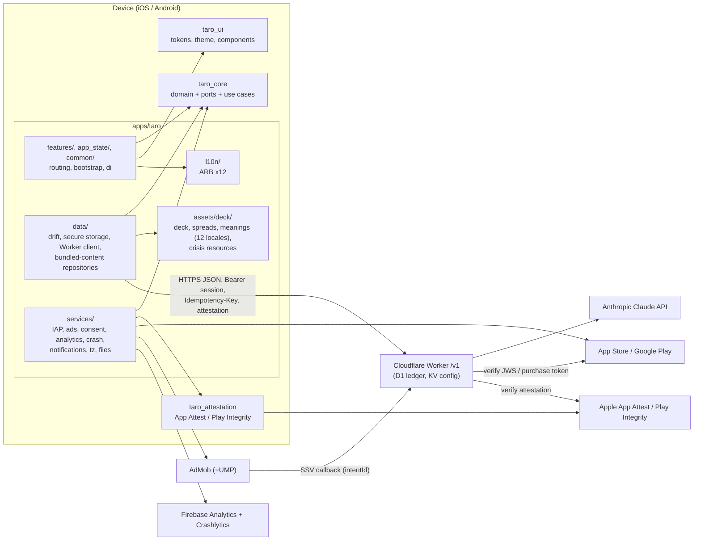

# Taro architecture

**Status:** stub (Phase 2). This is the living architecture doc (06 §13). It is derived from `specs/02_ARCHITECTURE.md` and `specs/03_BACKEND_WORKER.md` and is updated as the code changes. When this doc and the specs disagree about what the code *does*, this doc wins; about what it *should* do, the specs win.

§Domain and §Ports describe `taro_core` (Phase 4). Later phases add: data flow and sequence diagrams for the reading, purchase and rewarded-grant flows (Phases 11–13).

## Packages and system context

From 02 §1 and §2 (RC95): three packages (`taro_core`, `taro_ui`, `taro_attestation`) and the app `apps/taro`, whose layers are folders (`lib/data/`, `lib/services/`, `lib/l10n/`, `assets/deck/`, `lib/features/`, …). Arrows are allowed imports; the full package and folder rules are in 02 §2.1 and are enforced by the import-graph check `tools/check_architecture.dart` (Phase 3).

Test support has no package (RC95): port fakes and contract suites live in `packages/taro_core/test/fakes/` and `test/contracts/` (Riverpod-free, RC77), the golden comparator and test fonts in `packages/taro_ui/test/helpers/golden/`, and `pumpTaro`, `pumpTaroWidget` and `TaroFakes` in `apps/taro/test/helpers/`.

## Design tokens

- Source: [`docs/design/taro.tokens.json`](design/taro.tokens.json), a W3C DTCG export of the approved Claude Design system with light and dark modes (`$extensions.taro.modes`). Token paths follow `01_PRODUCT.md` §14 (for example `color.bg.canvas`).
- Pipeline (02 AR16, §14; RC15): `tools/tokens/` (Phase 15) compiles the file into Dart constants under `packages/taro_ui/lib/src/tokens/generated/` and a `TaroTokens` `ThemeExtension`. The generated output is excluded from coverage; the generator is covered under `tools`.
- Widgets never use raw colors, sizes, radii or durations (CLAUDE.md rule 15). See [`docs/design/README.md`](design/README.md) for the design system, fonts and screen canvas.

## Dependencies and build notes (Phase 2, 2026-09-27)

Resolved versions, deviations from 02 §18, build fixes and the RC91 FTS5 spike results.

### Flutter workspace and app

Toolchain: Flutter 3.44.8 (Dart 3.12.2), melos 8.9.0, Xcode + iPhone 17 simulator (iOS 26), Android emulator Pixel_9a (API 36), AGP 9.0.1, Kotlin 2.3.20, CocoaPods 1.16.2.

#### Workspace layout (owner decision 2026-09-27: 3 packages + app)

Workspace members: `apps/taro`, `packages/taro_core` (pure Dart), `packages/taro_ui`, `packages/taro_attestation` (plugin), `packages/taro_attestation/example` (host app for the plugin's XCTest/JUnit and integration test), `tools/dart_tools`.
The former `taro_data`, `taro_services`, `taro_content`, `taro_l10n`, `taro_testing` live in the app:
`apps/taro/lib/data/` (drift, secure storage, API client; `lib/data/content/`, later `lib/data/backup/`), `apps/taro/lib/services/` (adapters; widgets in `lib/services/presentation/`), `apps/taro/assets/deck/`, `apps/taro/l10n.yaml` + `lib/l10n/arb/` → `lib/l10n/generated/` (not committed; `melos bootstrap` post-hook and `melos run gen` run `flutter gen-l10n`), `apps/taro/test/helpers/`. `taro_ui` has no taro dependencies.

#### Dependencies: resolved versions and deviations from 02 §18

The root cause of every deviation: Flutter 3.44.8 pins `meta 1.18.0`, `clock 1.1.2`, `test_api 0.7.11` and ships Dart 3.12.2.

| Package | 02 §18 | Used | Resolved | Why |
|---|---|---|---|---|
| very_good_analysis | ^11.0.0 | ^10.3.0 | 10.3.0 | 11.x needs Dart ^3.13 |
| freezed | ^4.0.2 | ^3.2.5 | 3.2.5 | 4.x stable needs Dart 3.13; `test` (test_api 0.7.11) caps analyzer < 13, freezed 4 dev builds need analyzer 13 |
| build_runner | ^2.16.1 | ^2.15.1 | 2.15.1 | 2.16 needs analyzer >= 13.3 (which needs meta ^1.18.3) |
| drift / drift_dev | ^2.35.0 | ^2.34.0 | 2.34.4 / 2.34.0 | drift_dev >= 2.34.1 needs analyzer 13 |
| meta | ^1.19.0 | ^1.18.0 | 1.18.0 | SDK pin |
| clock | ^1.1.3 | ^1.1.2 | 1.1.2 | SDK pin |
| intl | ^0.20.2 | ^0.20.2 | 0.20.2 | SDK pin |
| test (dev, taro_core, dart_tools) | – | ^1.31.0 | 1.31.0 | highest compatible with test_api 0.7.11 |
| cli_util (transitive) | – | root `dependency_overrides: ^0.5.0` | 0.5.2 | drift_dev 2.34.0 declares ^0.4, melos 8 needs >= 0.5; drift_dev only uses `Ansi`/`Logger` (unchanged; 2.34.1 widened to <0.6). Remove with the upgrade below. |

All other §18 constraints resolved as written (latest): flutter_riverpod 3.4.3, go_router 18.0.1, freezed_annotation 3.1.0, json_annotation 4.12.0, json_serializable 6.14.1, collection 1.19.1, crypto 3.0.7, uuid 4.6.0, drift_flutter 0.3.1 (sqlite3 3.5.2 via build hooks, no sqlite3_flutter_libs), flutter_secure_storage 11.2.0, dio 5.11.1, logging 1.3.0, firebase_core 4.15.0, firebase_analytics 12.6.0, firebase_crashlytics 5.4.0, google_mobile_ads 9.1.0, app_tracking_transparency 2.0.7, in_app_purchase 3.3.1, in_app_purchase_storekit 0.4.13, in_app_purchase_android 0.5.3, flutter_local_notifications 22.3.1, timezone 0.11.1, flutter_timezone 5.1.0, share_plus 13.3.0, file_picker 13.1.0, package_info_plus 10.2.1, device_info_plus 13.2.0, connectivity_plus 7.3.1, in_app_review 2.0.12, plugin_platform_interface 2.1.8, flutter_native_splash 2.4.8, mocktail 1.0.5, patrol 4.10.0, melos 8.9.0. `pubspec.lock` at the root is the single workspace lock (commit it).

`tools/dart_tools` (Phase 5, `tools/content`) depends on `args` ^2.7.0, `crypto` ^3.0.7, `http` ^1.6.0 and `yaml` ^3.1.4 (resolved 2.7.0, 3.0.7, 1.6.0, 3.1.4; `yaml` MIT, the others BSD-3-Clause; all already in the lock as transitive dependencies). `http` is the Claude Messages API call of `tools/content translate`, behind the `ClaudeClient` interface (tests use a fake; the key comes from `ANTHROPIC_API_KEY`). Repo tooling only, never bundled. Sprint 5.4 adds `image` ^4.10.1 (resolved 4.10.1, MIT, already in the lock as a transitive dependency) for `tools/content/placeholder_art`: its pure-Dart `WebPEncoder` writes the placeholder cards as lossless WebP, so no native `cwebp` is needed.

`taro_core` (Phase 4) also depends on `characters` ^1.4.1 (resolved 1.4.1, pinned by the Flutter SDK; grapheme counting in `QuestionPrecheck`, BSD-3-Clause). It is not in 02 §18. `json_annotation`/`json_serializable` stay app-only: core JSON mappers are hand-written.

**Upgrade trigger:** when Flutter ships Dart >= 3.13 with newer SDK pins, move to very_good_analysis ^11, freezed ^4.0.2, build_runner ^2.16.1, drift/drift_dev ^2.35.0 and drop the `cli_util` override.

#### Build notes

- iOS: CocoaPods (SPM is off in this Flutter config). Build configurations `{Debug,Profile,Release}-{dev,staging,prod}`; the unflavored ones were removed, so every build needs `--flavor`. xcconfigs in `apps/taro/ios/Config/` (`Dev|Staging|Prod.xcconfig` hold bundle id, `APP_DISPLAY_NAME`, `ADMOB_APP_ID`; `Common.xcconfig` shared). Podfile maps the 9 configs and forces pod deployment target 16.0.
- iOS: `CLANG_ALLOW_NON_MODULAR_INCLUDES_IN_FRAMEWORK_MODULES = YES` (Config/Common.xcconfig) is required: google_mobile_ads 9.1.0 headers import the SDK's private `GoogleMobileAds_Beta.h` and the Runner module import fails under `use_frameworks!`.
- AdMob app IDs are required at launch by the SDK (Info.plist `GADApplicationIdentifier`, manifest `com.google.android.gms.ads.APPLICATION_ID`). All flavors, including prod, use Google's sample app IDs natively until Phase 10; `config/prod.json` ad IDs stay `TBD`.
- Android: AGP 9 disables `resValue` by default, so the launcher label comes from the `appName` manifest placeholder. Core library desugaring (`desugar_jdk_libs 2.1.5`) is enabled for flutter_local_notifications. `minSdk 24`, `targetSdk 36`.
- Android: build warns that firebase_analytics, firebase_core, firebase_crashlytics, flutter_timezone, in_app_review and patrol apply the Kotlin Gradle Plugin ("future Flutter versions will fail"). Watch plugin updates.
- Android orientation: `screenOrientation="portrait"`; Android 16 (targetSdk 36) ignores it on sw >= 600dp, so tablets rotate (01 PR16).
- Android backup: `data_extraction_rules.xml` (cloud-backup + device-transfer) and `full_backup_content.xml` exclude flutter_secure_storage's prefs (`FlutterSecureStorage.xml`, `FlutterSecureKeyStorage.xml`, `FlutterSecureStorageConfiguration*.xml`, default names; update if Phase 11 sets `sharedPreferencesName`/`storageNamespace`) and `taro_device.{db,sqlite}` + `-wal/-shm/-journal` in `app_flutter/` and the `database` domain. drift_flutter's `driftDatabase(name:)` creates `<name>.sqlite`; Phase 11 must pass `databasePath` to get `taro_device.db` (or keep the `.sqlite` name; both are excluded).
- Cleartext: `network_security_config.xml` denies cleartext; the `dev` source set overrides it for localhost/127.0.0.1/10.0.2.2, and `usesCleartextTraffic` is a placeholder (`true` only for dev).
- Flavor config: `--dart-define-from-file` needs flat primitive values, so `config/*.json` uses dotted keys (`admob.ios.banner`, ...). A build without the file still starts (empty values); a file for another flavor throws at bootstrap.
- `prodStaging` (RC78) build configuration / build type is not created yet.

#### Spike RC91: drift + drift_flutter + sqlite3 build hooks + FTS5

`Fts5Probe` (`apps/taro/lib/data/db/fts5_probe.dart`) creates an FTS5 virtual table, inserts two rows and runs `MATCH 'moon'`, both in memory and through `driftDatabase` (file, `shareAcrossIsolates: true`).

| Where | SQLite | FTS5 MATCH |
|---|---|---|
| Host `flutter test` (macOS, hook-bundled SQLite, not the system one) | 3.53.4 | OK (1 row) |
| iOS simulator iPhone 17, `flutter test integration_test/fts5_spike_test.dart --flavor dev` | 3.53.4 | OK (memory + file) |
| Android emulator Pixel_9a API 36, same command | 3.53.4 | OK (memory + file) |
| CI runner image | not run (no CI yet, Phase 3) | – |

FTS5 is available everywhere tested; the LIKE fallback (indexed lowercase `search_text`) is not needed so far. Re-run the integration test on the CI runner in Phase 3.

### Worker

Items for the docs owner to fold into specs / ARCHITECTURE.md.

#### Resolved versions (worker/package.json, exact pins)

| Package | Version | Note |
|---|---|---|
| hono | 4.13.9 | BE1 |
| @hono/zod-openapi | 1.6.3 | BE1 |
| zod | 4.6.5 | |
| jose | 6.2.12 | |
| @anthropic-ai/sdk | 0.128.0 | |
| cbor-x | 1.6.6 | |
| @peculiar/x509 | 2.1.0 | |
| wrangler | 4.142.0 | |
| @cloudflare/vitest-pool-workers | 0.22.0 | requires vitest ^4.1 |
| vitest / @vitest/coverage-istanbul | 4.1.11 | vitest 5 is out but pool-workers does not support it yet |
| typescript | 6.0.3 | TS 7.0 is out but typescript-eslint 8.70 supports `<6.1` only |
| typescript-eslint | 8.70.1 | |
| eslint / @eslint/js | 10.11.0 / 10.0.1 | |
| prettier | 3.9.9 | |
| fast-check | 4.10.2 | |
| esbuild | 0.28.1 | MIT; dev only. Already in the tree via wrangler/vite; pinned directly because `scripts/run.mjs` bundles the owner CLIs (`npm run config:push`, `config:schema`) for Node (Phase 6.2) |
| @types/node | 22.20.4 | for config files only (`tsconfig.node.json`) |

#### Deviations / spec updates suggested

1. **06 §5.2 vitest config shape is outdated.** `@cloudflare/vitest-pool-workers` 0.22 (vitest 4) no longer
   exports `defineWorkersConfig`/`poolOptions.workers`. The config is now
   `defineConfig({ plugins: [cloudflareTest({ wrangler: { configPath, environment: 'dev' } })], test: { coverage } })`.
   Bindings come from `[env.dev]` of `wrangler.toml`, so the `miniflare: { d1Databases, kvNamespaces }` block
   is unnecessary. Coverage settings are unchanged (istanbul, 90/90/90/85, `perFile: false`).
   `isolatedStorage` is no longer an option (storage is isolated per test file by default). Resolved in
   Phase 6.1: `cloudflareTest(async () => …)` injects `TEST_MIGRATIONS` via `readD1Migrations`,
   `test/setup/apply_migrations.ts` applies them once per test file, and tests inside a file share D1/KV, so
   they use unique install IDs and keys (`uniqueId()` in `test/fakes/testDeps.ts`). 06 §7 "Pool setup" and
   the Phase 6.2 "`isolatedStorage: true`" note still need the matching spec edit.
2. **Health response.** Phase 2 doc says `{status, workerVersion}`; 03 §2.1/§14.2 and GLOSSARY say
   `{status, workerVersion, environment}`. Implemented the spec/GLOSSARY shape (superset). Suggest editing PHASE_02.
3. **compatibility_date = 2026-08-15.** Must not exceed the workerd bundled with vitest-pool-workers
   (1.20260815.1), otherwise tests would run on a different runtime date than deploy. Bump both together.
4. **Top-level wrangler `name` is `taro-api-dev`**, not `taro-api`: a bare `wrangler deploy` without
   `--env` must never overwrite prod. Bindings are declared per env only (they are not inherited).
5. **Rate-limit binding placeholders** use 03 §2.4 values (`RL_BURST` 60/60 s, `RL_READINGS` 6/60 s) and
   namespace IDs 1001/1002 (dev), 2001/2002 (staging), 3001/3002 (prod).
6. **`src/env.ts` is hand-written.** `wrangler types` merges all envs into `Cloudflare.Env` with every
   binding optional, so it is unusable as the `Env` type. `worker-configuration.d.ts` is still generated and
   committed (runtime types); `npm run types:check` verifies it is current (candidate CI step, Phase 3).
7. **Two tsconfigs.** `tsconfig.json` (workerd types, `src/` + `test/`) and `tsconfig.node.json`
   (`vitest.config.ts`, `eslint.config.js` with Node types). `npm run typecheck` runs both. ESLint uses both
   via `parserOptions.project`.
8. **`makeProdDeps(env)` already enforces BE20/RC86** (throws if `ALLOW_DEBUG_ATTESTATION`, `AI_PROVIDER`
   or `DEBUG_ATTESTATION_TOKEN` is set with `ENVIRONMENT=prod`); unit tests in
   `test/unit/deps.prodConfig.test.ts` (renamed in Phase 6.1).
9. **Phase 2 leftovers, done in Phase 6:** error envelope / `X-Request-Id` middleware, `scheduled`
   handler and cron triggers (03 §12), `migrations/0001_init.sql`, `openapi/openapi.json`,
   `worker/COVERAGE.md`.
10. **Identity (Phase 6.3).** `@peculiar/x509` 2.x pulls in `tsyringe`, which refuses to load without
   `Reflect.getMetadata`. Instead of adding `reflect-metadata`, `src/adapters/apple/reflectShim.ts` installs
   the three metadata functions tsyringe uses; always import X.509 classes from `src/adapters/apple/x509.ts`
   (shim first). The pinned Apple App Attestation Root CA is checked by fingerprint and self-signature in
   `test/unit/adapters/appAttest.test.ts`. The "real-format" App Attest fixture
   (`test/fixtures/app_attest/attestation.dev.json`) has Apple's exact CBOR/x5c/authData layout but is signed
   by a test CA; add a device-captured one when a physical device is available (Phase 12). Registration and
   `[attest]` hashes concatenate the UTF-8 strings as sent (challenge in base64url); the per-call hash uses
   the raw 32-byte body digest and an empty `Idempotency-Key` when none is sent (02 client must match).
11. **Contract and ops (Phase 6.5).**
   - **Route wiring:** every app route builds its middleware with `routeGuards(deps, { auth, rateLimit,
     flags })` (`src/http/routeGuards.ts`); the same call writes `security`, `x-taro-auth` and
     `x-taro-flags` into the OpenAPI operation. `test/integration/routes/routeWiring.test.ts` compares them
     with the GLOSSARY §4 table and checks the running behaviour (missing key → `IDEMPOTENCY_KEY_REQUIRED`,
     missing attestation → `ATTESTATION_REQUIRED`, no token → `UNAUTHENTICATED`). Chain order: auth →
     required `X-Taro-*` headers → `RL_BURST` → attestation → idempotency.
   - **OpenAPI:** `npm run openapi` writes `openapi/openapi.json` from `buildApp(documentDeps())`
     (`src/admin/openapi.ts`; `info.version` is the API major `v1`, so a Worker version bump does not make
     it stale). `npm run openapi:check`, `test/contract/openapi.test.ts` and the static CI job fail on drift.
   - **Contract fixtures:** `test/contract/fixtures.test.ts` drives the real app with fakes, a fixed clock,
     `SeqIdGenerator` and `SeededCrypto` (deterministic `randomBytes`), validates each body with its zod
     schema and writes it with vitest `toMatchFileSnapshot` (works in pool-workers 0.22: the snapshot file
     I/O goes through the Node side). `npm run contract:update` rewrites them; in CI (`CI=true`) a missing
     or changed fixture fails. `openapi/` and `test/contract/fixtures/` are Prettier-ignored (their bytes
     are the contract). `melos run contract:sync` → `apps/taro/test/contract/fixtures/`.
   - **Cron:** `src/scheduled.ts` (`CRON`, `CRON_JOBS`, bounded `drain` loops) and `[env.*.triggers]` in
     `wrangler.toml`; a test keeps both in sync.
   - **Deploy:** `.gitea/workflows/worker-deploy.yml` (see its header). It skips with a warning while
     `CLOUDFLARE_API_TOKEN` is absent or `wrangler.toml` still holds placeholder IDs, so it can live on
     `main` before Sprint 6.0. The staging smoke step reads `worker.staging_debug_attestation_token` from
     the secrets bundle.
   - **Owner CLIs:** `gen-keys`, `smoke`, `export-openapi` join `config-push` and `export-config-schema`
     under `scripts/run.mjs`; `CliDeps.env` passes `process.env` so secrets never travel in argv.
12. **Foundation decisions (Phase 6.1, 6.2, 6.4) to fold into 03.**
   - **Idempotency (03 §2.3):** keys must be UUIDs (else `400 VALIDATION_FAILED`); every row write is a
     compare-and-set on `(state, created_at)`, so a late original never overwrites a takeover; the row is
     finalised after the handler, not in the handler's last batch; after `deleteIdempotentBody` or a retired
     body key a retry runs the handler again. `IDEMPOTENCY_ENC_KEY` = `kid:base64url32,…`, current first.
   - **Rate limits (03 §2.4):** binding limits are fixed in `wrangler.toml`, so `rl.*` keys cannot tune them;
     the spec's 20/60 s per-IP public limit runs at `RL_BURST` 60/60 s until a third binding or a spec change.
     Registration caps answer `429 RATE_LIMITED` with `reason` `lowTrustCap` (type `none`) or `burst`.
   - **No-CORS 403** has an empty body (no GLOSSARY §5 code fits).
   - **Remote config (03 §8):** `config/remote_config.default.json` is `{ $schema, public, server }` with flat
     dotted keys; a push must be complete and strict, a read lays the stored document over the defaults and
     drops unknown keys; a KV error keeps the last valid document; ranges for keys without a 03/04 range are
     commented in `src/config/schema.ts`. `reading_reports` uses the 03 §4 `payload_enc` column (RC7), not
     the phase doc's three columns.
   - **Erasure (RC37):** readings still `held` and the running DELETE's own idempotency row are kept.
   - **Wire format:** token `expiresAt` carries milliseconds, `BalanceDto` instants do not; the Dart client
     must accept both (or the Worker settles on one before Phase 11).
13. **Phase 6 status (2026-09-29): code complete, run locally only.** No Cloudflare access yet (the owner's
   token lacks Workers/D1/KV rights): Sprint 6.0 (resources, real binding IDs, secrets, Anthropic
   workspaces), applying migrations to staging, the first staging deploy and smoke, and the rollback and
   rotation drills are pending. Local `wrangler dev` needs a `.dev.vars` with `IDEMPOTENCY_ENC_KEY`,
   `IP_HASH_KEY`, `CHALLENGE_KEY`, `TOKEN_SIGNING_KEYS`, `PLAY_ACCOUNT_KEY`, `DEVICE_KEY_SECRET`,
   `APPLE_ACCOUNT_NS`, `DEBUG_ATTESTATION_TOKEN` and `APPLE_TEAM_ID` (`npm run gen-keys -- --env dev`).

#### Toolchain / local environment

- `.nvmrc` = 22 (QA14); `engines.node` is `>=22`, so it also runs on the owner's local Node 25.6.1
  (all checks were run on Node 25.6.1 / npm 11.9.0; nvm is not installed locally). CI must use `.nvmrc`.
- `npm audit --omit=dev --audit-level=high` is clean. Full `npm audit` reports 4 high findings, all
  dev-only, via `sharp` in the `miniflare`/`wrangler` copies pinned inside `@cloudflare/vitest-pool-workers`
  0.22.0; clears when pool-workers updates its pins.
- Port 8787 was occupied by an unrelated local process on the owner's machine; `wrangler dev --port 8799`
  was used for the smoke check. Default port stays 8787 (GLOSSARY §6.1).

## Domain (`taro_core`, Phase 4)

`packages/taro_core` is pure Dart (no Flutter, no `dart:io`; `check_architecture.dart`). `lib/taro_core.dart` exports only sub-barrels: `result/`, `model/` (plus `monetization/`), `logic/`, `ports/`, `usecases/`, `analytics/`. Models are freezed (RC13); `*.freezed.dart` is committed and excluded from coverage (RC16). JSON mappers are hand-written: they throw `FormatException`, which the data layer maps to a `Failure`. Instants are written as UTC `…Z`.

| Area | Types | Key invariants |
|---|---|---|
| Result | `Result<T>` (`Ok`/`Err`, `fold`, `map`, `then`, `valueOrNull`), `Failure` (27 subtypes, a factory each on `Failure`), `ErrorKind`, `RefusalCategory`, IDs (`CardId`, `SpreadId`, `PositionId`, `ReadingId`, `InstallId`, `ProductId`, `IntentId`) | Repositories and use cases return `Result`, never throw (rule 3). `Failure.code` is the 03 wire code where there is one; `Failure.messageKey` = `failure<Name>` (GLOSSARY §5, RC94); contract and unexpected failures always go to crash. `CardId.parse` enforces the RC1 regex. A declined reading is `ReadingStatus.refused(SafetyInfo)`, never a `Failure`. |
| Deck | `DeckCard`, `Arcana`, `Suit`, `Element`, `CardText`, `CardAspects`, `ReviewStatus`, `Deck` | A `Deck` holds exactly the 78 canonical card IDs, each once. |
| Spreads and draws | `SpreadDefinition`, `SpreadPosition`, `DrawnCard`, `Draw` | Positions have unique IDs and a dense `order`; every spread costs 1 credit (RC62). A `Draw` fills every position once with distinct cards. |
| Readings | `Reading` (holds `draw`), `ReadingStatus` (`pending`, `complete`, `refused`, `failed`, `classic`), `ReadingContent` (RC30), `SafetyInfo`, `Rating`, `RatingReason`, `ChargeSource` | Classic readings are local and never charge (RC20). Backup-imported readings get `spreadVersion 1`, `drawnAt = createdAt`, `deliveryAcked = true`. |
| Daily card | `DailyCard` | One per `localDate`; same local day → same card (`DailyCardRules`). |
| Credits | `CreditBalance` (`FreeAllowance`, `RewardedStatus`, `CanReadReason`, `PurchasesBlockedReason`) | Only a Worker response changes it (rule 7). `shouldReplace` implements RC67 (higher `ledgerVersion`, or equal with newer `serverTime`); `displayPaid` shows a refund debt as 0 (MO16); `total` = free remaining + bonus + `displayPaid`; `isStaleAt(now, staleAfter)`. |
| Entitlements and identity | `Entitlement` (`EntitlementState`, `EntitlementSource`), `InstallIdentity` (`Trust`, `PurchaseBinding`, RC9) | Remove Banner Ads is the only entitlement; `unknown` until verified. |
| Config and consent | `RemoteConfig` (`defaults`, `StorePack`), `ConsentState` (`AdsConsent`, `TrackingStatus`, `AiConsent`, `OnboardingStep`), `UserSettings` (`ThemeMode`, `ReminderSettings`) | `RemoteConfig.fromJson` never throws: unknown keys are ignored, out-of-range values are clamped to 03 §8.2 and reported through `onClamped` (`config_value_clamped`). |
| Backup and safety | `BackupV1`/`BackupData` (`backup_schema_v1.json`, RC70), `CrisisResource`/`CrisisDirectory` (RC81) | A backup never carries credits, balance, install ID, entitlements or consent. A crisis resource needs `verifiedAt` and at least one of phone, SMS or URL. |
| Monetization | `TaroProducts`, `TaroProduct`, `ProductKind`, `IapCatalog`, `ProductOffer` | IDs are fully qualified; `IapCatalog.validate()` throws otherwise (rule 9). No credit amounts on the client (RC3). `bestValue` is computed from per-reading prices rounded to the currency's minor unit, never asserted (MO18). |

Pure logic (`logic/`): `CardDrawer` (Fisher–Yates over rejection-sampled `nextInt`, `uniformIntBelow`), `ReadingGate` (RC44 order → `GateDecision`, `PaywallOptions`), `ServerClockOffset`, `ResetSchedule`, `BackupMerge` (`MergeMode`, `MergeReport`), `BackupValidator` (`BackupSchemaV1` mirrors the JSON schema; a test fails on drift), `BackupChecksum` (RFC 8785 JCS + SHA-256), `BannerPolicy` (`BannerScreen`; `kBannerAllowList` lives in `model/remote_config.dart`, re-exported by `logic/banner_policy.dart`), `JournalPatterns`, `QuestionPrecheck`, `DailyCardRules`, `LocalDates`.

Use cases (`usecases/`, constructor-injected ports): `DrawCards` (needs a live `ReadingHold`, RC50), `RequestReading`, `ResumeReading`, `SyncAccount`, `PurchaseCredits` (outbox → verify → grant → finish, rule 8), `EarnReward`, `ExportBackup`, `ImportBackup`, `ResolveReadingGate`, `ReportReading`, `DeleteAllData`, `StartClassicReading`.

Analytics (`analytics/`): sealed `TaroAnalyticsEvent` (74 events in 13 groups) with enum, int and bool parameters only; documented in [`ANALYTICS_EVENTS.md`](ANALYTICS_EVENTS.md) (`check_analytics_events.py`).

## Ports (`taro_core/lib/src/ports/`, Phase 4)

Every port is an `abstract interface class` (02 §5, AR18, rule 2). Fakes live in `packages/taro_core/test/fakes/` (exported by `fakes.dart`, builders in `fakes/builders/`); each port has a `run<Port>Contract` suite in `test/contracts/`, run against the fake now and against the real adapter in Phases 11–12. "—" in the NoOp column means 02 §5 defines none.

| Port | Purpose | Prod adapter (phase) | NoOp | Fake |
|---|---|---|---|---|
| `InstallRepository` | install identity, registration, token refresh, timezone update | `InstallRepositoryImpl` (11) | — | `FakeInstallRepository` |
| `SessionTokenStore` | session token persistence | `SecureSessionTokenStore` (11) | — | `FakeSessionTokenStore` |
| `BalanceRepository` | cached `CreditBalance`, sync, apply Worker balances (RC67) | `BalanceRepositoryImpl` (11) | — | `FakeBalanceRepository` |
| `ReadingRepository` | hold, submit, resume, ack, Classic save, journal edits | `ReadingRepositoryImpl` (11) | — | `FakeReadingRepository` |
| `JournalRepository` | journal list, search, snapshot and replace for backup | drift (11) | — | `FakeJournalRepository` |
| `DailyCardRepository` | today's card, notes, favourites | drift (11) | — | `FakeDailyCardRepository` |
| `ContentRepository` | bundled deck, spreads, card texts, fallback crisis resources | `apps/taro/lib/data/content/` (11) | — | `FakeContentRepository` |
| `CrisisResourcesRepository` | crisis resources by region (RC25) | data layer (11) | — | `FakeCrisisResourcesRepository` |
| `RemoteConfigRepository` | `GET /v1/config` with ETag and cache | Worker + drift (11) | `StaticRemoteConfigRepository` | `FakeRemoteConfigRepository` |
| `SettingsRepository` | `UserSettings` | drift (11) | — | `FakeSettingsRepository` |
| `ConsentStore` | persisted `ConsentState` | drift (11) | — | `FakeConsentStore` |
| `IapService` | store products, buy, finish, restore, deliveries | `StoreIapService` (12) | `NoOpIapService` | `FakeIapService` |
| `PurchaseVerifier` | `POST /v1/purchases/verify` | Worker client (11) | — | `FakePurchaseVerifier` |
| `PurchaseOutbox` | unfinished purchases (rule 8) | drift `purchase_outbox` (11) | — | `FakePurchaseOutbox` |
| `EntitlementCache` | Remove Banner Ads entitlement | drift `entitlements` (11) | — | `FakeEntitlementCache` |
| `AdsService` | ads SDK init, rewarded show | `AdMobAdsService` (12) | `NoOpAdsService` | `FakeAdsService` |
| `RewardGateway` | reward intents (create, status, cancel) | Worker client (11) | — | `FakeRewardGateway` |
| `ConsentService` | UMP consent | `UmpConsentService` (12) | `NoOpConsentService` | `FakeConsentService` |
| `TrackingAuthorization` | ATT | `AttTrackingAuthorization` (12) | `NotSupportedTrackingAuthorization` | `FakeTrackingAuthorization` |
| `AnalyticsService` | typed events, screens, collection toggle | `FirebaseAnalyticsService` (12) | `NoOpAnalyticsService` | `FakeAnalyticsService` |
| `CrashReporter` | errors and breadcrumbs | `FirebaseCrashReporter` (12) | `NoOpCrashReporter` | `FakeCrashReporter` |
| `ReminderScheduler` | daily reminder notifications | `LocalReminderScheduler` (12) | `NoOpReminderScheduler` | `FakeReminderScheduler` |
| `AttestationService` | App Attest / Play Integrity | `PlatformAttestationService` (12) | `DebugAttestationService` | `FakeAttestationService` |
| `ReportGateway` | `POST` reading report (CS7) | Worker client (11) | — | `FakeReportGateway` |
| `DataDeletionGateway` | server-side erasure with retry (CS15, RC37) | Worker client (11) | — | `FakeDataDeletionGateway` |
| `Clock` | UTC and local time (rule 5) | `SystemClock` (in core, over `package:clock`) | — | `FakeClock` |
| `TimezoneProvider` | current IANA zone | `FlutterTimezoneProvider` (12) | `FixedTimezoneProvider` | `FakeTimezoneProvider` (also `FakeClock`) |
| `RandomSource` | CSPRNG for draws | `SecureRandomSource` (in core, `Random.secure()`) | — | `SeededRandomSource`, `ScriptedRandomSource` |
| `IdGenerator` | UUIDv4 IDs and idempotency keys | `SecureIdGenerator` (11) | — | `SequentialIdGenerator` |
| `Logger` | leveled logging (RC41) | `PackageLoggingLogger` (11) | `SilentLogger` | `CapturingLogger` |
| `FileTransfer` | share and pick backup files | `PlatformFileTransfer` (12) | — | `FakeFileTransfer` |
| `ConnectivityMonitor` | online hint | `ConnectivityPlusMonitor` (12) | `AlwaysOnlineMonitor` | `FakeConnectivityMonitor` |
| `ReviewPrompter` | in-app review | `InAppReviewPrompter` (12) | `NoOpReviewPrompter` | `FakeReviewPrompter` |
| `AppInfo` | version, build, platform | `PackageInfoAppInfo` (12) | — | `FakeAppInfo` |
| `SecureStore` | keychain / keystore | `FlutterSecureStore` (11) | — | `InMemorySecureStore` |

Port value types: `IapEvent`, `PurchaseOutcome`, `StoreBuyResult`, `StorePurchase`, `StoreProduct`, `GrantResult`, `RewardedShowResult`, `SyncReason`, `SyncStatus`. `BannerSlotView` is a presentation port with its adapters in `apps/taro/lib/services/presentation/` (Phase 12), so it is not in core. There is no `DailyCardWidgetBridge` in v1 (RC89).

## Content pipeline (Phase 5)

- **Source layout:** `apps/taro/content/source/` (format: its `README.md`; schemas: `tools/content/schema/{card,spreads,crisis}.schema.json`): `deck.yaml` (deck id, version, `artSet`), `glossary.yaml` (names, suits, positions, key terms × 12 locales), `<locale>/cards/<cardId>.yaml` ×78, `<locale>/spreads.yaml`, `<locale>/articles/{about,faq}.md`, `crisis/crisis_resources.yaml`. `en` is authored (LLM drafts, `reviewStatus: machine`, owner edit pass pending; voice rules in `docs/content/STYLE_GUIDE.md`); the other 11 locales are translated in Phase 18 from the reviewed glossary. Non-`en` locales carry a `sourceHash` of the `en` text they were made from, so `validate` can flag them as stale.
- **Tools** (`tools/content/*`, Dart in `tools/dart_tools/lib/src/content/`): `validate` (errors for `en`, reports for missing or stale locales), `build` (deterministic, idempotent; `--check`), `translate` (Claude, `reviewStatus: machine`), `sync_check` (app assets vs Worker feeds), `placeholder_art` (`--check`).
- **Generated, committed, never hand-edited:** `apps/taro/assets/deck/{deck_meta,en,spreads,crisis_resources}.json` and `art/placeholder/*.webp`; `worker/src/generated/{deck/cards,deck/spreads,deck_prompt.en,crisis_resources}.json` (excluded from coverage and Prettier).
- **Manifest:** `deck_meta.json` holds the deck identity, the 78 `DeckCard`s, the compiled locales and a SHA-256 per content file. `ContentManifest` verifies every file at load; a mismatch or missing checksum is a `ContentIntegrityException`, returned by the repositories as `StorageFailure`.
- **Repositories** (`apps/taro/lib/data/content/`, over one `ContentAssetStore` per `AssetBundle`): `AssetDeckRepository`, `AssetSpreadRepository`, `AssetMeaningRepository` (per-locale file hashed, decoded and parsed in `Isolate.run`, cached; a locale without a compiled file falls back to `en`), `AssetCrisisResourcesRepository` (country → locale default → international, at most 3). `AssetContentRepository` implements `ContentRepository`; DI: `contentRepositoryProvider`, `crisisResourcesRepositoryProvider`.
- **Unverified crisis entries:** the source keeps `verifiedAt: null` until the owner verifies them (Phase 18.4). The app parses `null` as the epoch (`kUnverifiedCrisisResourceAt`), so it always counts as stale; `tools/content/validate --release` fails on it.
- **Art:** `artSet` from `deck.yaml` (`placeholder` until D15); `ContentAssets.art(artSet, artKey)` = `assets/deck/art/<artSet>/<artKey>.webp`, card back `card_back.webp`. Provenance: `docs/ART_PROVENANCE.md`.
- **Parity:** `sync_check` confirms that the Worker feeds (`deck/cards.json`, `deck/spreads.json`, `deck_prompt.<locale>.json`, `crisis_resources.json`) match the app assets card by card, spread by spread and byte for byte for the crisis file (RC26, replaces `tools/sync_deck`).
- **Placeholder art:** `tools/content/placeholder_art` draws 480×800 lossless WebP cards (name, numeral, suit glyph) with a project-owned 5×7 pixel font, so no third-party font or image is bundled; deterministic, `--check` in CI. Replaced when the D15 art set lands (`deck.yaml` `artSet`, pubspec asset folder).
- **l10n gate:** `check_l10n.py` requires all 78 `en` cards and a built `en.json`; untranslated locales are notices until Phase 18 (`--require-all-locales` makes them findings).
- **Gates:** `tools/verify.sh` and `reusable-static.yml` run `validate`, `build --check`, `sync_check`, `placeholder_art --check`; `worker/test/unit/content/deck_parity.test.ts` checks the prompt feed against the card feed.

## Quality gates (Phase 3)

- Local gate: `tools/verify.sh` (full) and `--fast` (pre-push hook). CI: `.gitea/workflows/ci.yml` on the self-hosted Gitea runner.
- Coverage: `tools/check_coverage.py` gates 9 units (taro_core, taro_ui, taro_attestation, its iOS and Android native code, apps/taro, dart_tools, worker, tools) at ≥ 90 % per unit and ≥ 70 % per file; exclusions in `tools/coverage_exclusions.txt` (mirrored in `sonar-project.properties`).
- ARB checks: `check_arb.dart` (02 §11) is folded into `tools/check_l10n.py` (one Python check for keys, placeholders, ICU plurals per CLDR and deck content).
- CI first green run: Gitea run 740 (2026-09-28). FTS5 on the runner: SQLite 3.53.4, `MATCH` ok in memory and via `driftDatabase` (RC91 closed).
- CI fixes found on the first runs: flutter-action `pub-cache: false` on the host-mode runner; fixture files un-ignored; `test_coverage.sh` builds the tools venv; the flutter-test job runs `TARO_COVERAGE_SCOPE=dart` (worker, tools and native have their own jobs); the Gradle wrapper is regenerated on clean checkouts.
- Details: `docs/TESTING.md`, `docs/phase3_notes/{COVERAGE,CHECKS,CI}.md`.
