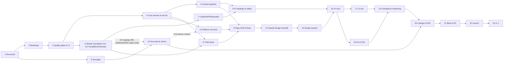

# Taro — Implementation Phases

**App:** `apps/taro` · **Bundle ID:** `com.vshyrochuk.taro` · **Repo:** `/Users/volodymyrshyrochuk/pet/taro`
**Specs:** `docs/specs/01_PRODUCT.md` … `06_QUALITY_TESTING_CI.md`, plus `00_DECISIONS.md` and `GLOSSARY.md`, both produced by Phase 1.
**Status:** ⬜ Not started (plan written 2026-09-26)

These phase docs turn the six specs into ordered, checkable work. The format follows `quiz_apps/docs/phases/new_app_template/`: one file per phase, `## Sprint N.M` sections with `- [ ]` tasks that name files, classes and tests, and a **Done when** block.

---

## Phase index

Status legend: ⬜ Not started · 🚧 In progress · ✅ Completed · ⏸️ Blocked

| Phase | Title | Status | Depends on | Output |
|---|---|---|---|---|
| [1](./PHASE_01_SPEC_RECONCILIATION.md) | Spec Reconciliation & Owner Decisions | ✅ (2026-09-27; owner-open: Play account type, support mailbox) | — | `00_DECISIONS.md` (RC1–RC94; RC49–RC93 are the review-pass decisions, RC94 the glossary-defined names; RC95 was added after Phase 1), `GLOSSARY.md`, specs 01–06 at v1.1 with no conflicts, owner answers on model, host, prices, territories |
| [2](./PHASE_02_REPO_BOOTSTRAP.md) | Repository Bootstrap & Toolchain | ✅ | 1 | melos 8 workspace, 3 package skeletons + app folders (RC95), app with 3 flavors, `worker/` + `tools/` skeletons, README, CLAUDE.md, CHANGELOGs, drift/sqlite spike |
| [3](./PHASE_03_QUALITY_GATES_CI.md) | Quality Gates & CI | ✅ | 2 | `check_coverage.py` (90% per unit, 70% per file, no pragmas, native units), all `tools/check_*.py`, golden harness, Gitea workflows, Sonar, hooks, `verify.sh`, `bump_version.sh` |
| [4](./PHASE_04_CORE_DOMAIN.md) | Core Domain, Ports & Test Kit | ✅ (2026-09-28) | 3 | `taro_core` (Result/Failure, models, ports, CardDrawer, ReadingGate, BackupMerge, BannerPolicy, analytics events), test kit in `taro_core/test/fakes/` + `test/contracts/` (fakes, contract suites, builders; RC95) |
| [5](./PHASE_05_CONTENT_PIPELINE.md) | Deck Content Pipeline (EN) | ⬜ | 4 | Style guide, glossary, 78 EN cards, 6 spreads, articles, crisis YAML, `tools/content` (validate, build, translate, sync_check), content repos in `apps/taro/lib/data/content/`, placeholder art, Worker feeds |
| [6](./PHASE_06_WORKER_FOUNDATION.md) | Worker Foundation: Identity, Attestation, Config | ⬜ | 3, 1 | **Sprint 6.0: Cloudflare, Anthropic workspaces, Worker secrets (moved from 10.1, RC83)**; Hono app + Deps, middleware, D1 migration 0001, config, challenge/installs/token/timezone/erasure/balance routes, install secret + device key, OpenAPI + contract fixtures, staging deploy |
| [7](./PHASE_07_WORKER_CREDITS_PURCHASES_REWARDS.md) | Worker Credits, Purchases & Rewarded Ads | ⬜ | 6 | Ledger hold/refund with CAS (no balance cache), device-scoped free allowance, `PRODUCT_CATALOG`, purchase verify (Apple and Google) with sandbox caps, webhooks, refunds, SSV rewarded with intent cancel, support transfer script, crons |
| [8](./PHASE_08_WORKER_AI_READINGS_SAFETY.md) | Worker AI Readings, Safety & Evals | ⬜ | 7, 5 | Prompt v1, Anthropic adapter, pre-draw hold, reading pipeline + state machine, delivery ack, stale-hold/undelivered crons, L1–L3 safety, crisis selection, budget tiers, alerts, report endpoint, retention, eval and safety suites + first report |
| [9](./PHASE_09_ASA_GAPS.md) | `asa` CLI Gap Fixes | ⬜ | 1 | ASA-1 to ASA-7, ASA-9 and ASA-10 in `app-store-automation` (Lifestyle, capabilities, age rating incl. advertising, localized IAPs and listings, `asa validate`, custom web pages, `.well-known` files, territories) |
| [10](./PHASE_10_ACCOUNTS_STORE_SETUP.md) | Accounts, Store Registration, AdMob, Firebase & Signing | ⬜ | 1, 9 (for 10.3), 6.5 (webhook/SSV URLs only) | Firebase/ASC/Play/AdMob set up, store-issued Worker secrets, IAP products, SSV/webhook URLs, `prodStaging` build, signing, fastlane, deploy workflows, first TestFlight + internal AAB |
| [11](./PHASE_11_CLIENT_DATA_LAYER.md) | Client Data Layer & Worker Client | ⬜ | 4, 6 | `apps/taro/lib/data/`: drift DB, secure store, WorkerClient + interceptors, repositories, purchase outbox, backup codec; contract tests |
| [12](./PHASE_12_PLATFORM_SERVICES.md) | Platform Services, IAP, Ads, Consent & Attestation | ⬜ | 4 (Sprint 12.6 device checks: 10, tracked as a separate exit criterion) | `apps/taro/lib/services/` adapters, `PurchaseCoordinator`, `RemoveAdsEntitlement`, `ConsentOrchestrator`, `RewardedController`, analytics consent defaults, `taro_attestation` plugin (Swift + Kotlin, Standard Play Integrity only) |
| [13](./PHASE_13_APP_SHELL_FLOWS.md) | App Shell, State Machines & Flows (skeleton UI) | ⬜ | 5, 11, 12 (12.1–12.5) | `bootstrap(TaroEnvironment)`, DI, router, SyncCoordinator, a controller per screen for all 01 §8.3 states (S01–S33), EN ARB, `STATE_INVENTORY.md`, patrol flows F1–F8 green |
| [14](./PHASE_14_CLAUDE_DESIGN_HANDOFF.md) | Claude Design Handoff | ✅ (2026-09-27, run early; REVIEW signed 2026-09-28) | 1 (done ahead of 13.4; Phase 13.4 state inventory reconciles against it) | `docs/design/`: BRIEF, `taro.tokens.json`, screens S01–S33 per ★ state, assets (card back, icon, illustrations), signed REVIEW |
| [15](./PHASE_15_DESIGN_SYSTEM.md) | Design System Implementation | ⬜ | 14 | Token generator, `TaroTokens` ThemeExtension, themes, motion, fonts, full `taro_ui` component set + goldens |
| [16](./PHASE_16_UI_ONBOARDING_READING.md) | UI — Onboarding, Today & Reading Flow | ⬜ | 15, 13, 8, 12.6 | Designed S01–S09, S13, S27, S31, S32 Classic reading, S33 Report sheet, splash/icon, goldens |
| [17](./PHASE_17_UI_MONETIZATION_JOURNAL_LEARN_SETTINGS.md) | UI — Monetization, Journal, Learn, Settings & Data | ⬜ | 16 | Designed S10–S12, S14–S26, S28–S30, banners on 3 screens, paywall compliance tests, goldens |
| [18](./PHASE_18_ART_LOCALIZATION.md) | Deck Art & Full Localization | ⬜ | 5, 13, 16 (17 for ARB) | Final art (D15), 11-locale ARB, 78×11 deck content to the launch gate, native-reviewed safety lexicons, verified crisis numbers |
| [19](./PHASE_19_COMPLIANCE_HARDENING.md) | Compliance, Privacy, Accessibility & Performance Hardening | ⬜ | 16, 17, 18, 8 | Apple and Play matrices with evidence, PrivacyInfo.xcprivacy, privacy labels, legal pages ×12, AASA/assetlinks, a11y, perf and security reports |
| [20](./PHASE_20_STORE_LISTING_ASO.md) | Store Listings, ASO & Screenshots | ⬜ | 9, 10, 18, 19 | Complete `aso.yaml` ×12 locales, keywords docs, automated screenshots, metadata pushed, console forms filled, IAPs ready |
| [21](./PHASE_21_BETA_RELEASE_CANDIDATE.md) | Beta Testing & Release Candidate | ⬜ | 19, 20 | Prod Worker live, TestFlight + Play closed test, full 06 §12 device checklist, runbook drills, beta report, owner re-confirmation of model and prices |
| [22](./PHASE_22_SUBMISSION_LAUNCH.md) | Store Submission & Launch | ⬜ | 21 | 1.0.0 live (phased/staged), rejection response plan, tags, portfolio-audit Day 0, 14-day monitoring log |
| [23](./PHASE_23_POST_LAUNCH_V1_1.md) | Post-Launch v1.1 — Widget, Share Images & ASO | ⬜ | 22 (21 if 4.3 escalation) | Home-screen widget (native, gated), share images, 2 new spreads, 4/8-week ASO reads, monetization decision memo |

---

## Tracks & ordering

- **Infrastructure and tests first:** Phases 2–4 build the repo, the ≥ 90% gates and the test kit before any feature code. The pure domain logic (paywall-before-draw gate, CSPRNG draw, backup merge) is test-driven in Phase 4.
- **Worker track (6 → 7 → 8)** runs in parallel with the client track (11, 12 → 13) once Phase 3 is done. Contract fixtures (QA15) keep the two in sync.
- **Store and admin track (9 → 10)** is mostly manual console work and can run beside coding from Phase 1 onwards. The Cloudflare and Anthropic setup lives in Phase 6 Sprint 6.0, so Phase 6 has no upstream store dependency; Phase 10 needs only the staging Worker URL from Sprint 6.5 for the webhook and SSV registration steps. Phase 12's on-device Sprint 12.6 waits for Phase 10 but is a separate exit criterion, so Phase 12 can close and Phase 13 can start without it (RC83).
- **UI is built after the design handoff:** Phase 13 ships every screen's state machine behind skeleton widgets and produces `STATE_INVENTORY.md`. Claude Design (Phase 14) designs against it, and Phases 15–17 implement visuals only.
- **Content workstreams:** English content comes early (Phase 5) so the Worker prompts and tests use real data. The art (D15) and the 11-locale translation come after the UI strings stabilise (Phase 18).
- **Compliance hardening → ASO → beta → submission** close out v1. Phase 23 holds the committed v1.1 backlog and is the 4.3 escalation lever (PR11).

---

## Working rules (from 06 §11, 02 §19, CLAUDE.md)

- **Per task:** the behaviour follows the owning spec (any deviation is noted next to the checkbox); tests ship in the same change; `tools/verify.sh --fast` is green; touched units stay ≥ 90% (`check_coverage.py --unit`); all 12 ARB files are updated; new dependencies go behind a port with a Fake and a contract suite; new analytics events are documented; new config keys get a default and a schema entry; time-based behaviour has a resume test. Tick the checkbox with the test names or file paths as evidence.
- **Per phase:** all tasks are done or deferred with a target phase; the full `tools/verify.sh` is green, including goldens and the Worker; iOS simulator integration is green; the docs (README, CLAUDE.md, ARCHITECTURE, ANALYTICS_EVENTS, TESTING, runbooks) are updated where the phase changed them; CHANGELOG `Unreleased` is updated; the phase status is set to ✅ with the date and `tools/phase_state.py` updated; there is **one commit** `feat(taro): Phase N — <title>` (or `feat(worker)`, `ci`, `docs`, `chore` as each phase states), authored by Volodymyr, with no AI attribution (QA12).
- **Manual steps** are marked *(MANUAL)* in the sprint headings or tasks. Record their evidence (IDs, dates, screenshots) in `docs/runbooks/STORE_SUBMISSION.md` or `RELEASE.md`, never secrets.
- **Names:** after Phase 1, `docs/specs/GLOSSARY.md` is the only source for IDs, endpoints, tables and config keys. Phases already use the RC defaults from Phase 1. If the owner overrides one, edit the affected phase tasks in the same commit.

---

## Important paths

| Resource | Path |
|---|---|
| Specs | `docs/specs/` (`00_DECISIONS.md`, `GLOSSARY.md`, `01`–`06`) |
| App | `apps/taro` (flavors `dev`, `staging`, `prod`; `config/<flavor>.json`) |
| Packages | `packages/{taro_core,taro_ui,taro_attestation}` (RC95) |
| App layers | `apps/taro/lib/{data,services,l10n,features,…}`, `apps/taro/assets/deck/`, `apps/taro/content/source/`, `apps/taro/test/helpers/` (RC95) |
| Worker | `worker/` (`wrangler.toml`, `migrations/`, `prompts/`, `safety/`, `evals/`, `test/contract/fixtures/`) |
| Tools | `tools/` (Python checks, `tools/dart_tools`, `tools/content`, `tools/tokens`, `tools/store_copy`) |
| Design drop | `docs/design/` (`taro.tokens.json`, `screens/`, `assets/`, `STATE_INVENTORY.md`) |
| Store config | `apps/taro/store/aso.yaml`, `store/whats_new/` |
| Runbooks | `docs/runbooks/{RELEASE,INCIDENT,WORKER_ROLLBACK,SECRET_ROTATION,STORE_SUBMISSION,AI_SAFETY,SUPPORT_CREDITS,DEPENDENCY_UPDATE}.md` |
| asa | `/Users/volodymyrshyrochuk/pet/app-store-automation` |
| Secure credentials | `~/pet/secure/taro/` + `.secrets/secrets.json.gpg` |
| Hosts | `taro.vshyrochuk.com` (landing/legal), `api.taro.vshyrochuk.com`, `api-staging.taro.vshyrochuk.com` |
| Repo / CI | origin `git@github.com:Mc231/taro.git`; CI on a self-hosted Gitea pull-mirror (`.gitea/workflows`) |

---

## Traceability: spec requirements → phases

Every locked decision in every spec maps to at least one phase and sprint below. "N.M" = Phase N, Sprint M.

### 01_PRODUCT (PR)

| ID | Requirement | Phase.Sprint |
|---|---|---|
| PR1 | Reflective positioning, no prediction language | 5.1, 8.2, 16, 19.1, 20.1 |
| PR2 | 4.3 differentiation stack ships in v1 | 5, 16, 17, 18, 19.1 (`DIFFERENTIATION.md`), 20.1 |
| PR3 | Fixed 1 credit per spread, no override (RC62) | 4.2, 7.1, 16.3 |
| PR4 | Free offline daily card; "Reflect deeper" | 4.3, 13.4, 16.2 |
| PR5 | Paywall before the draw; gate order; pre-draw hold | 4.3 (`ReadingGate`), 8.3 (holds), 11.4, 13.4, 16.3, 19.1 (RC50) |
| PR6 | Drawn cards are final; retry reuses them | 8.3, 11.4, 13.4, 16.3 (RC48, RC49) |
| PR7 | Reversals on at 50%; upright-only setting | 4.3, 13.4, 17.5 |
| PR8 | Non-streaming reading, latency targets | 8.3, 16.3, 19.5 (RC31) |
| PR9 | Structured output; client-rendered disclaimer | 8.2, 11.3, 16.4 (RC30) |
| PR10 | Onboarding order Welcome → Disclaimer → AI → UMP → ATT | 12.3, 13.4, 16.1 (RC19, RC21) |
| PR11 | Widget in v1.1 / 4.3 escalation | 22.2, 23.1 |
| PR12 | Declining AI consent does not block | 13.4, 16.1, 19.1 (RC20) |
| PR13 | Banners only on Home, Journal, Learn | 4.3 (`BannerPolicy`), 17.2 (RC18) |
| PR14 | Worker never stores the question; reading text only until delivered | 6.1, 8.3, 8.5, 19.2 (RC22, RC51, RC69) |
| PR15 | Deck content via YAML pipeline, not ARB | 5, 18.3 |
| PR16 | Universal (iPhone + iPad, Android phone + tablet), constrained width | 2.2, 14.1, 20 (RC24) |
| PR17 | Explicit state model per screen, tested | 13.4, 16, 17 |
| PR18 | Analytics without content or identifiers | 4.4, 12.4, 13.4 |
| PR19 | Text-only share in v1 | 13.4, 16.4; images 23.2 |
| §7.1–§7.12 features | Credits UX, question, draw, reading, safety, daily card, reminder, journal, learn, settings, export/import, onboarding | 13.4 (logic), 16–17 (UI) |
| §8 screens S01–S33 + states | Screen inventory | 13.4, 14, 16, 17 |
| §9 flows F1–F8 | Integration flows | 13.6, 21.3 |
| §11 content pipeline + launch gate | | 5, 18.3 |
| §12 accessibility | | 15.2, 16.5, 17.6, 19.4 |
| §13 RTL / l10n | | 13.5, 15.2, 18.2, 19.4 |
| §14 design-token contract | | 1.1 (RC15), 14, 15.1 |
| §15 analytics catalogue | | 4.4, 13.4, 12.4 |
| §16 NFRs (start time, fps, size, offline) | | 13.6, 18.1, 19.5, 21.3 |
| Q1–Q10 open questions | Defaults kept; revisit points | 1.3, 21.4, 23.3 |

### 02_ARCHITECTURE (AR)

| ID | Requirement | Phase.Sprint |
|---|---|---|
| AR1 | Pub workspace + melos 8; 3 packages + app (RC95) | 2.1 |
| AR2 | Features and layers as app folders; `check_architecture.dart` import-graph check (RC95) | 3.2, 11, 12, 13 |
| AR3 | Riverpod 3 as DI + state; no auto-retry | 13.1, 13.2 |
| AR4 | go_router, tab shell, guards, allowlisted deep links | 13.3 |
| AR5 | `Result` + sealed `Failure` | 4.1 |
| AR6 | freezed domain models; separate DTOs | 4.2, 11.3 (RC13) |
| AR7 | drift only (two files: journal + device); secure storage for identity | 2.2, 11.1, 11.2 (RC14, RC75) |
| AR8 | Worker authoritative; client caches only | 11.4, 13.2 |
| AR9 | Own `taro_attestation` plugin | 12.1 (RC12, RC40) |
| AR10 | `in_app_purchase` + SK2 + persistent outbox | 11.4, 12.2 |
| AR11 | AdMob + UMP + ATT sequencing; SSV nonce | 12.3 |
| AR12 | Request/response readings; reveal only under a valid pre-draw hold | 8.3, 11.4, 16.3 (RC50) |
| AR13 | `Random.secure()` via `RandomSource`; Fisher–Yates | 4.3, 12.5 |
| AR14 | `SyncCoordinator` on launch + resume + reset timer | 13.2 |
| AR15 | One ARB bundle; content JSON separate | 5, 13.5, 18.2 |
| AR16 | DTCG tokens → `TaroTokens` | 14, 15.1 |
| AR17 | Flavors dev, staging, prod + `prodStaging` build; no client secrets | 2.2, 10.3, 19.5 (RC78) |
| AR18 | Prod + NoOp + Fake per port; contract tests | 4.4, 4.5, 11, 12 |
| AR19 | Firebase Analytics + Crashlytics only | 10.2, 12.4 |
| AR20 | mocktail; goldens; patrol | 3.3, 4.5, 13.6 (RC13) |
| §6.3 API client behaviour | Headers, retries, timeouts, polling | 11.3 |
| §12 backup | | 11.5, 17.5 |
| §17 performance budgets | | 13.6, 19.5 |
| §18 dependencies | | 2.1 |
| §19 coding rules | | 2.4 (CLAUDE.md) |
| Open questions 1–9 | Defaults kept | 1.1 (RC37), 23 (7: widget), 8.1 (3: streaming) |

### 03_BACKEND_WORKER (BE)

| ID | Requirement | Phase.Sprint |
|---|---|---|
| BE1 | Hono + zod-openapi; OpenAPI committed | 6.1, 6.5 |
| BE2 | One Worker, D1, KV per env; no DOs | 6 (6.0) |
| BE3 | Client UUID + install secret + attestation → Ed25519 install token | 6.3 (RC54) |
| BE4 | Trust high/low with per-prefix low-trust caps + PoW | 6.1, 6.3, 7.1 (RC65) |
| BE5 | Append-only ledger, balances by SUM (no cache) | 6.2, 7.1 |
| BE6 | free → bonus → paid; hold and refund | 7.1, 8.3 |
| BE7 | Local-midnight boundary; tz change once per 24 h | 6.4 |
| BE8 | Grant once per txn; server-side Google ack | 7.2 (RC10) |
| BE9 | Stream upstream, single JSON to client | 8.3 |
| BE10 | Model from config, adaptive thinking, structured output, fallbacks | 8.1, 8.3, 21.4 |
| BE11 | Versioned prompts in repo | 8.2 |
| BE12 | Three-layer safety | 8.4, 18.4 |
| BE13 | No plaintext question or output in logs or D1 | 6.1, 8.3, 8.5 |
| BE14 | Rewarded via SSV with opaque session ID | 7.4, 12.3 |
| BE15 | Budget tiers soft/free-stop/hard | 8.5, 21.1 (RC64) |
| BE16 | Error envelope with stable codes | 6.1 (RC5) |
| BE17 | vitest pool-workers + istanbul thresholds | 2.3, 3.1, 6–8 |
| BE18 | wrangler deploys, gradual prod rollout | 6.5, 21.1 |
| BE19 | Device-scoped abuse key | 6.3, 7.1, 7.4, 12.1 (RC53) |
| BE20 | Test-only behaviour bound to deploy env | 3.2, 6.1, 6.3, 19.5 (RC86) |
| §2.4 rate limits / abuse | | 6.1, 7.1, 21.1 |
| §9.5 crisis resources | | 5.3, 8.4, 18.4 (RC25) |
| §11 secrets / environments | | 6.0, 10.3, 10.4 |
| §12 crons | | 6.5, 7.3, 7.4, 8.5 |
| §13 privacy & retention | | 8.5, 19.2 |
| §14 observability & deploy | | 6.5, 7.5, 21.1, 22.3 |
| §15.4 evals | | 8.6, 18.3, 19.3, 22.1 |
| Q1–Q8 | Model (Q1), prompt A/B (Q2), crisis verify (Q3), consumption info (Q4), host (Q5), DOs (Q6), user_id (Q7), low-trust rewarded (Q8) | 1.3, 8.1, 18.4, 21.4, 23.3 |

### 04_MONETIZATION (MO)

| ID | Requirement | Phase.Sprint |
|---|---|---|
| MO1 | Worker ledger is the only truth for credits | 7.1, 11.4, 13.2 |
| MO2 | Credits per product in Worker code; new ID per size | 4.2, 7.2 (RC3) |
| MO3 | No subscriptions in v1 | 10.3, 20.1, 23.3 |
| MO4 | One credit per reading | 4.2, 7.1 |
| MO5 | Consumption order free → rewarded → paid | 7.1 |
| MO6 | Credit consumed only on success | 7.1, 8.3 |
| MO7 | Remove Ads from the store; never revoke on silence | 12.2, 17.1 |
| MO8 | Finish or consume only after the Worker grant | 11.4, 12.2 |
| MO9 | Banner + user-initiated rewarded only | 12.3, 17.1, 17.2 |
| MO10 | Rewarded grants only via SSV | 7.4, 12.3 |
| MO11 | Hard-coded banner allowlist | 4.3, 17.2 (RC18) |
| MO12 | Consent order onboarding → AI → UMP → ATT → init | 12.3 |
| MO13 | Paywall before the draw, free path visible | 4.3, 13.4, 17.1 |
| MO14 | Free daily range 1–5 | 6.2 |
| MO15 | Purchases bound to the install | 6.3, 12.2 (RC9) |
| MO16 | Refund clawback; paid may go negative | 7.3, 17.1 |
| MO17 | Remove Ads Family Sharing on (iOS) | 10.3 |
| MO18 | Prices from store; computed best value | 4.2, 17.1 |
| §11 paywall UX rules | | 13.4, 14.1, 17.1, 19.1 |
| §12 edge cases 12.1–12.25 | | 7, 11.4, 12.2, 13.4, 21.3 |
| §13 config catalogue | | 1.1 (RC8), 6.2 |
| §14 analytics & KPIs | | 4.4, 13.4, 21.4, 23.3 |
| §15 testing + manual checklist | | 7, 12.2, 17.1, 21.3 |
| Q1–Q10 | | 1.3, 21.4, 23.3 |

### 05_COMPLIANCE_STORE_ASO (CS)

| ID | Requirement | Phase.Sprint |
|---|---|---|
| CS1 | Lifestyle + Entertainment | 9.2, 10.3, 20.1 |
| CS2 | Store name / on-device name | 10.3, 20.1 |
| CS3 | Framing + banned-phrase linter | 3.2, 5.1, 18.4, 20.1 |
| CS4 | 13+; Play 13+; AdMob T | 9.2, 10.5, 20.4 (RC23) |
| CS5 | No subscriptions | 10.3, 20.1 |
| CS6 | AI consent sheet names Anthropic; Classic reading on decline | 13.4, 16.1 (RC20) |
| CS7 | In-app "Report this reading" | 8.5, 13.4, 16.4 (RC22) |
| CS8 | Refusal categories + pre-submission safety suite | 8.4, 8.6, 19.3, 22.1 |
| CS9 | `aso.yaml` single source of truth | 20 |
| CS10 | Privacy, terms, support pages ×12 | 9.4, 19.2 |
| CS11 | Review notes pushed before every submission | 20.1, 22.1 |
| CS12 | Pack IDs size-neutral (**superseded by RC3**; lockstep rule kept via `check_pack_sizes.py`) | 1.1, 3.2, 20.1 |
| CS13 | Screenshot content rules | 14.2, 20.2 |
| CS14 | ATT once, after UMP, neutral pre-prompt | 12.3, 16.1 |
| CS15 | Delete my data in Settings | 6.4, 17.5 (RC37) |
| CS16 | Territory exclusions | 1.3, 8.3 (region), 19.2, 20.3 (RC29) |
| CS17 | Post-launch `portfolio-audit` | 22.3, 23.3 |
| §1 / §2 guideline matrices | | 19.1 |
| §5 privacy disclosures | | 19.2, 20.4 |
| §7 review notes | | 20.1, 22.1 |
| §8.2 ASA-1 … ASA-9 | | 9.1 (ASA-6), 9.2 (ASA-1, 2, 3), 9.3 (ASA-4, 5), 9.4 (ASA-7, 8, 9) |
| §8.3 M1 … M11 | | 10.5 (M1–M4), 10.4 (M5–M7), 20.4 (M8, M10), 10.3 (M9), 22.2 (M10), 6.0 (M11) |
| §9 ASO | | 20, 23.3 |
| Q1–Q10 | | 1.3, 20.1, 23.3 |

### 06_QUALITY_TESTING_CI (QA)

| ID | Requirement | Phase.Sprint |
|---|---|---|
| QA1 | ≥ 90% line coverage per unit | 3.1 (gate), every phase's Done when |
| QA2 | Per-file 70% floor | 3.1 |
| QA3 | Exclusions = generated only; pragmas banned | 3.1 (RC16) |
| QA4 | Untested files count as 0% | 3.1 |
| QA5 | mocktail + hand-written fakes | 4.5 |
| QA6 | very_good_analysis, `--fatal-infos` | 2.1 |
| QA7 | Worker vitest pool + istanbul 90/90/90/85 | 2.3, 3.1 |
| QA8 | Built-in goldens on the reference runner | 3.3, 15.3, 16.5, 17.6 (RC13) |
| QA9 | Determinism ports; forbidden APIs | 3.2, 4.5, 12.5 |
| QA10 | Gitea Actions, GPG secrets | 3.4 |
| QA11 | Local hard gate; Sonar advisory | 3.5 (RC88) |
| QA12 | Conventional commits, one per phase, no AI attribution | 2.4, 3.5 |
| QA13 | Keep a Changelog, app + worker | 2.4, 3.5, 21.2 |
| QA14 | Pinned toolchains | 2.1, 3.4 |
| QA15 | Client–Worker contract fixtures | 6.5, 11.3 (RC38) |
| QA16 | Port contract suites | 4.5, 11, 12 |
| QA17 | AI safety eval as a release gate | 8.6, 19.3, 22.1 |
| §3 goldens matrix; §3.1 12-locale smoke; §3.2 a11y | | 3.3, 13.5, 16.5, 17.6 |
| §4 integration flows | | 13.6 |
| §6.2 repo checks | | 3.2 |
| §8 workflows | | 3.4, 6.5, 10.6 |
| §12 release checklist | | 21.3, 22.1 |
| §13 documentation set | | 2.4, 3.5, 6.0, 6.5, 8.5, 19 |

### CONTEXT decisions (D)

| ID | Decision | Phase |
|---|---|---|
| D1 | Flutter | 2 |
| D2 | No RevenueCat; own StoreIapService | 12.2 |
| D3 | Specs first, phase docs | 1 (and this plan) |
| D4 | High-quality architecture | 2–4, 11–13 |
| D5 | ≥ 90% coverage of everything | 3 (gate), all phases |
| D6 | Full documentation | 2.4, 3.5, every phase |
| D7 | Store setup / ASO via `asa` | 9, 10.3, 20 |
| D8 | AdMob | 10.5, 12.3, 17.2 |
| D9 | quiz_apps is a reference, not a template | all (e.g. 3.4, 10.6, 12.2 re-implemented) |
| D10 | AI-generated readings | 8 |
| D11 | Cloudflare Worker backend | 6–8 |
| D12 | Monetization mix | 7, 12, 17 |
| D13 | No accounts; export/import | 11.5, 17.5 |
| D14 | 12 locales; bundle `com.vshyrochuk.taro` | 13.5, 18, 20 |
| D15 | Original deck art | 18.1 |
| D16 | UI designed in Claude Design | 14 |

### Cross-spec conflict resolutions (RC)

RC1–RC48 (cross-spec conflicts) and RC49–RC93 (review-pass decisions, already applied to the specs) are defined in Phase 1 Sprint 1.1. Each later phase lists in "Specs referenced" the RCs it depends on.

RC95 (owner, 2026-09-27; defined in `specs/00_DECISIONS.md`, after Phase 1): the client is 3 packages (`taro_core`, `taro_ui`, `taro_attestation`) + the app; the former data, services, content, l10n and test-kit packages are app folders (`lib/data/`, `lib/services/`, `assets/deck/` + `content/source/`, `lib/l10n/`, `test/helpers/`) plus `taro_core/test/fakes/`, and the layering is enforced by the `check_architecture.dart` import-graph check.

| RC | Topic | Phases |
|---|---|---|
| RC95 | Package consolidation (3 packages + app, folder layering, coverage units) | 2.1, 3.1, 3.2, 3.3, 4.5, 5, 11, 12, 13, 18, 23 |
