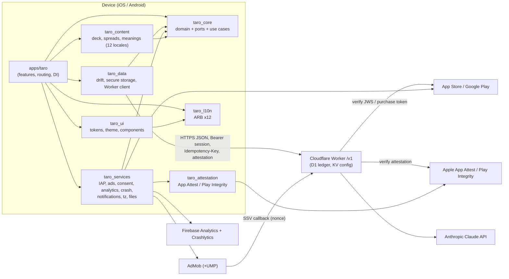

# 02 — Client Architecture (Flutter app + packages)

**Status:** 🟡 Draft v1.0.1 (2026-09-26): review fixes applied (RC49–RC93, see `../phases/PHASE_01_SPEC_RECONCILIATION.md`). Ready for review; nothing implemented.
**Prefix:** `AR` (locked decisions `AR1…`)
**Scope owner:** the Flutter client (`apps/taro`, `packages/*`).
**Related specs:** `01_PRODUCT.md` (screens, flows, copy), `03_BACKEND_WORKER.md` (API wire format, ledger, attestation verification, remote config schema), `04_MONETIZATION.md` (IAP catalogue, ad placements, rewarded rules), `05_COMPLIANCE_STORE_ASO.md` (consent texts, disclaimers, age rating, store forms), `06_QUALITY_TESTING_CI.md` (coverage tooling, CI, golden pipeline). Context: `../CONTEXT.md` (D1–D16).

---

## Why this exists

Taro must be (a) approvable by Apple/Google in a category Apple explicitly calls saturated, (b) honest about money — credits live on the Worker, never trusted from the client — and (c) maintainable at ≥ 90 % coverage in every package. `quiz_apps` proved the ports-and-adapters discipline and taught several expensive lessons (unqualified IAP ids, launch-only daily refills, entitlement cache wiped by an offline launch, no UMP). It also showed the costs of a home-made BLoC + two DI systems (InheritedWidget scope for widgets, a global `ServiceLocator` for everything that runs before or outside the tree). This spec fixes the client's structure, contracts and rules before a line is written, so the phase docs can be executed mechanically and Claude Design can produce screens against a known state model and token contract.

## Scope

- Monorepo/package layout, dependency rules and how they are enforced.
- State management, DI, navigation, deep links.
- Result/failure types, domain models, repositories, data sources.
- Ports for every external service, their production adapters, NoOp and fake implementations.
- Worker API client behaviour (headers, auth, retries, idempotency, attestation).
- App lifecycle (launch/resume sync), offline behaviour, l10n (12 locales, RTL), theming from design tokens, flavors/config/secrets, logging, performance budgets.
- Dependency list with version constraints; coding rules for the repo's `CLAUDE.md`.

## Non-goals

- Visual design (Claude Design, D16). This spec defines screens' **states** and a **token contract** only.
- Worker internals and wire schemas (owned by `03_BACKEND_WORKER.md`; this spec states what the client expects and marks each expectation as such).
- Pricing, pack sizes, ad placement policy (`04_MONETIZATION.md`), store copy and consent wording (`05_COMPLIANCE_STORE_ASO.md`).
- CI pipeline mechanics and coverage tooling implementation (`06_QUALITY_TESTING_CI.md`).
- User accounts, cloud sync, push notifications (FCM), web/desktop targets, subscriptions — all out of v1. The ports below leave room for push and subscriptions without restructuring.

---

## Locked decisions

| ID | Decision | Why |
|---|---|---|
| AR1 | **Pub workspace + melos 8** monorepo. Layered packages: `taro_core` (pure Dart), `taro_content`, `taro_data`, `taro_services`, `taro_attestation` (own plugin), `taro_l10n`, `taro_ui`, `taro_testing`; one app `apps/taro`. | Layer boundaries enforced by `pubspec` dependencies, not by discipline. Pure-Dart core tests run in milliseconds and cannot accidentally touch Flutter or I/O. |
| AR2 | **Features are folders inside `apps/taro/lib/features/`, not packages.** Import boundaries between features and toward infra packages are enforced by `tools/check_architecture.dart` in CI. | One app, one router, one l10n bundle: feature packages would add 7 pubspecs, 7 coverage reports and cross-package route coupling for zero reuse. Mechanical checks give the same isolation. |
| AR3 | **Riverpod 3 (`flutter_riverpod`) is both the DI container and the state-management layer.** Hand-written providers (no `riverpod_generator`). Only the app depends on Riverpod; packages expose plain constructors. | quiz_apps needed two DI mechanisms because InheritedWidget DI cannot reach code that runs outside the tree (purchase stream, lifecycle sync, notification taps). A `ProviderContainer` exists before `runApp`, is overridable per flavor and per test, and gives `AsyncValue` loading/error/data for free. Custom BLoC = boilerplate, manual dispose, no tooling. |
| AR4 | **`go_router`** with a `StatefulShellRoute` for the tab shell, route constants in `lib/routing/routes.dart`, redirect guards for onboarding/upgrade. Deep links via Flutter's built-in deep linking (Universal Links / App Links + `taro://`), allowlisted routes only. | Declarative, URL-addressable (deep links and notification taps use the same `router.go`), testable redirect logic. Navigator 1.0 + custom abstraction (quiz_apps) duplicated what go_router provides. |
| AR5 | **`Result<T>` sealed type + sealed `Failure` hierarchy** for every repository/gateway/use-case return. Exceptions are caught at adapter boundaries and never cross into features. No `fpdart`. | Exhaustive `switch` forces every screen to handle every failure (e.g. `InsufficientCredits` → paywall, `ContentRefused` → crisis resources). ~80 lines of own code beat a functional-programming dependency. |
| AR6 | **Domain models are immutable `freezed` classes in `taro_core`; wire/storage DTOs are separate (`json_serializable`, drift rows) in `taro_data`** with explicit mappers. | Wire format (owned by 03) and backup format can evolve without touching domain code; mappers are trivially testable. |
| AR7 | **drift** (SQLite) is the only local database, split into **two files** (RC75): `taro_journal.db` (readings, daily cards, settings; may be included in OS backups) and `taro_device.db` (purchase outbox, caches, entitlements, consent, sync state; **excluded** from iCloud backup, Android cloud backup and device transfer). **flutter_secure_storage** holds the install identity, install secret and session token; no `shared_preferences`. | Typed queries, reactive streams, versioned migrations, in-memory DB for tests. The split means an OS restore brings back the journal but never another device's purchase tokens, balance cache, entitlements or consent (which must be re-given per device). |
| AR8 | **The Worker is authoritative for credits, allowance, rewarded grants and remote config. The client caches, never computes, balances.** Local cache is display-only and marked stale. | Contract requirement; the client cannot be trusted and must not be able to mint credits (reinstall, clock change, import). |
| AR9 | **Own `taro_attestation` Flutter plugin** (Swift `DCAppAttestService`, Kotlin Play Integrity *Standard* API) behind an `AttestationService` port. | Pub.dev plugins for App Attest / Play Integrity are unmaintained or single-author (checked 2026-09-26). The native surface is ~150 lines per platform and security-critical. |
| AR10 | **IAP via `in_app_purchase` with StoreKit 2 enabled** and Android `autoConsume: false`. Own `StoreIapService` (learning from quiz_apps' `StoreIAPService`), with a **persistent purchase outbox**: a consumable transaction is finished/consumed only after the Worker confirms the grant. No RevenueCat (D2). | SK2 gives JWS signed transactions the Worker verifies with the App Store Server API; outbox makes "charged but not credited" impossible across crashes, offline launches and Ask to Buy. |
| AR11 | **Ads via `google_mobile_ads` (includes UMP) + `app_tracking_transparency`**, sequenced UMP → ATT → `MobileAds.initialize`. Rewarded grants only via **AdMob SSV** with a Worker-issued nonce in `customData`; the install id is never sent to Google. | UMP was quiz_apps' compliance gap; SSV means the client never claims a reward. |
| AR12 | **AI readings are request/response, not streamed**, in v1: `POST /v1/readings` returns the complete, output-moderated reading. **The draw starts only after a pre-draw hold succeeds** (`POST /v1/readings/holds`, RC50). The reveal may run in parallel with generation while the hold is valid (≥ 120 s left by server time); otherwise the hold is renewed first, and a renewal `402` keeps the picked cards face-down and opens the paywall. | Output moderation must see the whole text before the user does; streaming would show unmoderated text. The hold makes "paywall before the draw" true by construction, not by luck. |
| AR13 | **Cards are drawn on-device with `Random.secure()`** via a `RandomSource` port; Fisher–Yates over the 78-card deck. Seeded source for tests/goldens only. | Contract requirement; testable determinism without weakening production randomness. |
| AR14 | **Every clock-dependent behaviour runs on launch AND resume** through one `SyncCoordinator`, idempotently, plus a foreground timer armed for the server's `nextResetAt`. | quiz_apps rule 12 (shipped four times). |
| AR15 | **One ARB bundle in `taro_l10n`** (`flutter gen-l10n`, 12 locales); card meanings and spread texts are **content JSON** in `taro_content`, not ARB. | UI strings and ~78×12 long-form meanings have different authoring pipelines and sizes; keeping them apart keeps ARB reviewable. |
| AR16 | **Design tokens are a DTCG JSON file** compiled by `tools/tokens` into Dart constants and a `TaroTokens` `ThemeExtension`. Widgets never use raw colors, sizes or durations. | Claude Design output becomes a data drop, not a code rewrite; light/dark and reduced motion are handled once. |
| AR17 | **Three flavors: `dev`, `staging`, `prod`**, plus a **`prodStaging` build configuration** of the prod flavor (RC78): prod bundle ID, staging Worker URL, sandbox IAP. It is used for internal TestFlight / internal-track testing, because IAP products and App Attest app IDs exist only for the prod bundle. Configuration via `--dart-define-from-file=config/<config>.json`. The client holds **no secrets**. | Anything shipped in a binary is public; the Anthropic key, store API keys and SSV verification live only in the Worker. `prodStaging` lets testers buy sandbox packs without ever touching the prod ledger. |
| AR18 | **Ports + three implementations each:** production adapter (`taro_services`/`taro_data`), `NoOp…` (shipped, used when a feature is disabled or unsupported), `Fake…` (in `taro_testing`, controllable + recording). A shared **port contract test suite** runs against fake and real adapters. | Fakes that drift from reality give false confidence; contract tests keep them honest and cover `taro_testing` itself toward its 90 %. |
| AR19 | **Firebase Analytics + Crashlytics only** from Firebase. No Firebase Remote Config, no FCM, no Firebase App Check in v1. Analytics carries **no user id**; the install id never reaches Firebase. | Remote config and attestation are the Worker's job (single source of truth); avoiding a joinable identifier across vendors simplifies privacy labels. |
| AR20 | **`mocktail` + hand-written fakes; `alchemist` for goldens; `patrol` for integration tests** (native ATT/UMP/purchase dialogs). No `mockito` codegen. | No generated mocks to exclude from coverage; alchemist replaces the discontinued golden_toolkit and renders CI-stable goldens; patrol can drive system dialogs. |

---

## 1. System context



---

## 2. Repository and package layout

```
taro/
├── pubspec.yaml                  # workspace root: `workspace:` list + `melos:` scripts; dev_dep melos
├── analysis_options.yaml         # shared lints (very_good_analysis + overrides), included by all packages
├── apps/
│   └── taro/                     # the only app (package name `taro`)
├── packages/
│   ├── taro_core/                # pure Dart
│   ├── taro_content/             # Flutter (assets)
│   ├── taro_data/                # Flutter (drift_flutter, secure storage)
│   ├── taro_services/            # Flutter (platform SDK adapters)
│   ├── taro_attestation/         # Flutter plugin (Swift + Kotlin)
│   ├── taro_l10n/                # Flutter (ARB + generated localizations)
│   ├── taro_ui/                  # Flutter (design system)
│   └── taro_testing/             # Flutter, dev_dependency only (fakes, builders, golden harness)
├── worker/                       # Cloudflare Worker (TypeScript) — see 03
│   └── contracts/v1/             # JSON Schemas + example payloads shared with Dart contract tests
├── tools/
│   ├── check_architecture.dart   # import-boundary gate (AR2)
│   ├── tokens/                   # DTCG → Dart token generator (AR16)
│   ├── content/                  # meanings JSON validator / translation helpers
│   └── coverage/                 # per-package 90 % gate (owned by 06)
└── docs/ (specs/, phases/, ARCHITECTURE.md, ANALYTICS_EVENTS.md, runbooks/)
```

### 2.1 Dependency rules

| Package | May depend on (taro) | Must NOT depend on | Flutter? |
|---|---|---|---|
| `taro_core` | — | anything Flutter, any I/O package, Riverpod | No (pure Dart) |
| `taro_content` | `taro_core` | `taro_data`, `taro_services`, `taro_ui` | Yes (asset bundle) |
| `taro_data` | `taro_core` | `taro_services`, `taro_ui`, `taro_content`, Riverpod | Yes |
| `taro_attestation` | — | every taro package | Yes (plugin) |
| `taro_services` | `taro_core`, `taro_attestation` | `taro_data`, `taro_ui`, Riverpod | Yes |
| `taro_l10n` | — | every taro package | Yes |
| `taro_ui` | `taro_l10n` | `taro_core`, `taro_data`, `taro_services`, Riverpod | Yes |
| `taro_testing` | `taro_core`, `taro_ui`, `taro_l10n` | `taro_data`, `taro_services` (it fakes them) | Yes |
| `apps/taro` | all of the above (`taro_testing` as dev_dependency only) | — | Yes |

Inside `apps/taro/lib`:

| Folder | May import | Must NOT import |
|---|---|---|
| `bootstrap/`, `di/` | everything (composition root) | — |
| `features/<f>/` | `taro_core`, `taro_ui`, `taro_l10n`, `taro_content` (read models only), `di/providers.dart`, `app_state/**`, `routing/routes.dart`, `common/**` | `taro_data`, `taro_services` (except the `presentation.dart` barrel for `BannerSlot`), `package:google_mobile_ads`, `package:in_app_purchase`, `package:firebase_*`, `package:drift`, `package:dio`, other `features/<g>/**` |
| `app_state/` (app-wide controllers: balance, entitlement, consent, config, connectivity) | `taro_core`, `di/` | `features/**` |
| `common/` (shared widgets that need providers, e.g. `BalancePill`, `BannerSlot`) | `taro_ui`, `taro_l10n`, `app_state/`, `di/` | `features/**` |

`tools/check_architecture.dart` parses every `import`/`export` in `lib/` of each package and the app, applies these tables, and exits non-zero with the offending file:line. It runs in `melos run check` and CI. A `lib/src` import across packages is also a violation (only barrels are public).

### 2.2 Per-package structure

```
packages/taro_core/lib/
  taro_core.dart                        # barrel
  src/
    result/        result.dart, failure.dart
    model/         card.dart, deck.dart, spread.dart, spread_position.dart, drawn_card.dart,
                   draw.dart, reading.dart, reading_status.dart, interpretation.dart,
                   journal_entry.dart, credit_balance.dart, entitlement.dart,
                   remote_config.dart, consent_state.dart, install_identity.dart,
                   user_settings.dart, backup.dart, ids.dart
    ports/         (one file per port, see §5)
    usecases/      draw_cards.dart, request_reading.dart, sync_account.dart,
                   purchase_credits.dart, earn_reward.dart, export_backup.dart,
                   import_backup.dart, resolve_reading_gate.dart
    logic/         card_drawer.dart, reading_gate.dart, backup_merge.dart, reset_schedule.dart
packages/taro_content/
  assets/deck/v1/deck.json               # 78 cards: ids, arcana, suit, rank, art keys
  assets/deck/v1/meanings/{locale}.json  # 12 files
  assets/spreads/v1/spreads.json         # spread definitions + normalized layout coordinates
  assets/spreads/v1/texts/{locale}.json  # spread + position names, descriptions
  assets/art/<art_set>/…                 # card art (WebP, 1x/2x/3x) — D15, delivered later
  lib/src/ asset_deck_repository.dart, asset_spread_repository.dart, asset_meaning_repository.dart,
           content_manifest.dart
packages/taro_data/lib/src/
  db/            taro_database.dart, tables/*.dart, daos/*.dart, migrations/, schema/ (drift_dev dumps)
  secure/        secure_store.dart (port impl over flutter_secure_storage), keys.dart
  api/           worker_client.dart, interceptors/{headers,auth,attestation,retry,error}.dart,
                 dto/*.dart, endpoints.dart, api_error_mapper.dart
  repositories/  install_repository_impl.dart, balance_repository_impl.dart,
                 reading_repository_impl.dart, journal_repository_impl.dart,
                 remote_config_repository_impl.dart, settings_repository_impl.dart,
                 entitlement_cache_impl.dart, purchase_outbox_impl.dart, reward_gateway_impl.dart
  backup/        backup_codec.dart, backup_schema_v1.dart, backup_migrator.dart
packages/taro_services/lib/
  taro_services.dart                    # non-UI adapters
  presentation.dart                     # widgets wrapping SDK views (BannerSlotView)
  src/ iap/  ads/  consent/  analytics/  crash/  notifications/  attestation/
       timezone/  files/  review/  device/  connectivity/  logging/
packages/taro_ui/lib/src/
  tokens/generated/taro_tokens.g.dart   # generated, excluded from coverage
  theme/ taro_theme.dart, taro_tokens_extension.dart, text_styles.dart
  components/ (see §14.3)
  motion/ taro_motion.dart              # duration/curve accessors honouring reduced motion
  a11y/ semantics_helpers.dart, min_tap_target.dart
apps/taro/lib/
  main_dev.dart, main_staging.dart, main_prod.dart   # 3 lines each → bootstrap(Flavor.x)
  bootstrap/ bootstrap.dart, error_handlers.dart, flavor_config.dart
  di/ providers.dart (port providers, all `throw UnimplementedError` until overridden),
      overrides_prod.dart, overrides_dev.dart
  routing/ router.dart, routes.dart, guards.dart, deep_link_policy.dart
  app_state/ balance_controller.dart, entitlement_controller.dart, consent_controller.dart,
             remote_config_controller.dart, connectivity_controller.dart, sync_coordinator.dart
  lifecycle/ app_lifecycle_observer.dart, reset_timer.dart
  common/ banner_slot.dart, balance_pill.dart, disclaimer_footer.dart, offline_banner.dart
  features/ onboarding/ today/ spreads/ reading/ paywall/ history/ journal/ learn/ settings/ backup/ consent/
     <feature>/ view/ (screens, widgets), controller/ (Notifiers + freezed states), <feature>_routes.dart
  app.dart (MaterialApp.router, theme, localizations)
```

---

## 3. Result and failure types (`taro_core/src/result`)

```dart
sealed class Result<T> {
  const Result();
  const factory Result.ok(T value) = Ok<T>;
  const factory Result.err(Failure failure) = Err<T>;
  R fold<R>(R Function(T) onOk, R Function(Failure) onErr);
  Result<R> map<R>(R Function(T) f);
  Future<Result<R>> then<R>(Future<Result<R>> Function(T) f);
  T? get valueOrNull;
}
final class Ok<T> extends Result<T> { const Ok(this.value); final T value; }
final class Err<T> extends Result<T> { const Err(this.failure); final Failure failure; }

sealed class Failure { const Failure(); String get code; }   // `code` = stable analytics/log key
// Transport
final class NetworkFailure extends Failure       // offline / DNS / socket
final class TimeoutFailure extends Failure
final class ServerFailure extends Failure         // 5xx or unparseable; {int status, String? requestId}
final class RateLimitedFailure extends Failure    // 429; {Duration? retryAfter}
final class UpgradeRequiredFailure extends Failure// 426; {String? storeUrl}
// Identity / trust
final class SessionExpiredFailure extends Failure // refresh failed twice
final class AttestationFailure extends Failure    // {AttestationFailureKind kind: unsupported|keyInvalidated|rejected|quota|transient}
// Business
final class InsufficientCreditsFailure extends Failure  // 402; {CreditBalance balance}
final class RewardUnavailableFailure extends Failure    // disabled / daily cap / consent / no fill; {RewardUnavailableReason reason}
final class ContentRefusedFailure extends Failure       // Worker refusal; {RefusalCategory category, List<CrisisResource> resources}
final class TimezoneChangeRejectedFailure extends Failure // 409 cooldown; {DateTime allowedAfter}
// Store
final class PurchaseCancelledFailure extends Failure
final class PurchasePendingFailure extends Failure       // Ask to Buy / deferred payment
final class PurchaseFailure extends Failure              // {String storeCode}
final class ProductUnavailableFailure extends Failure
// Local
final class StorageFailure extends Failure
final class BackupInvalidFailure extends Failure         // {BackupInvalidReason reason: notJson|wrongFormat|unsupportedVersion|checksum|schema}
final class UnexpectedFailure extends Failure            // {Object error, StackTrace stack} — always reported to crash
```

`RefusalCategory` = `health | pregnancy | death | legal | financial | gambling | selfHarm | minorSafety | other` (names mirror 03's refusal codes; unknown codes map to `other`). Every factory is exposed on `Failure` (`Failure.network()`, …) per the sealed-factory rule.

Rules: repositories, gateways and use cases return `Future<Result<T>>` or `Stream<T>`; they never throw. Adapters wrap SDK calls in `guard(() async {...})` which maps known exceptions and turns anything else into `UnexpectedFailure` (+ crash report). Controllers `switch` exhaustively on `Failure` subtypes relevant to the screen and route the rest to a shared `FailureMessage.of(context, failure)` in `common/`.

---

## 4. Domain model (`taro_core/src/model`)

All `@freezed` (immutable, value equality, `copyWith`); IDs are extension types over `String` to prevent mixing (`extension type const CardId(String value)`, same for `SpreadId`, `ReadingId`, `JournalEntryId`, `InstallId`, `ProductId`).

| Model | Fields (type) | Notes |
|---|---|---|
| `TarotCard` | `id: CardId` (`major_00_fool`, `cups_01_ace`, …), `arcana: Arcana{major,minor}`, `suit: Suit?{wands,cups,swords,pentacles}`, `number: int` (0–21 major, 1–14 minor), `artKey: String` | Language-neutral. |
| `CardMeaning` | `cardId`, `locale: String`, `name`, `keywordsUpright: List<String>`, `keywordsReversed`, `upright: String`, `reversed: String`, `description: String` | From `taro_content`; used by Learn mode and offline card detail. |
| `Deck` | `id: String` (`rws_original`), `version: int`, `cards: List<TarotCard>` (exactly 78, validated), `artSet: String` | `deck.version` is sent with every reading. |
| `Spread` | `id: SpreadId` (`daily_single`, `three_past_present_future`, `celtic_cross`, … — list owned by 01), `positions: List<SpreadPosition>` (no per-spread cost: always 1 credit, RC62), `allowsReversals: bool`, `requiresQuestion: bool`, `maxQuestionLength: int`, `enabled: bool` | Texts (name, description) resolved via `SpreadTexts` from content JSON. |
| `SpreadPosition` | `index: int`, `key: String` (`past`, `present`, `obstacle` …), `layout: PositionLayout{x: double, y: double, rotationDeg: double}` (normalized 0..1 of the spread canvas) | Layout is data, so new spreads ship without UI code. |
| `DrawnCard` | `positionIndex: int`, `cardId: CardId`, `reversed: bool` | |
| `Draw` | `spreadId`, `deckId`, `deckVersion`, `cards: List<DrawnCard>`, `drawnAt: DateTime` (UTC) | Produced by `CardDrawer`; immutable once created. |
| `Reading` | `id: ReadingId` (UUIDv4, client-generated, **= Idempotency-Key**), `draw: Draw`, `question: String?`, `locale: String`, `status: ReadingStatus`, `interpretation: Interpretation?`, `creditSource: CreditSource?{free,rewarded,paid}`, `createdAt`, `completedAt?`, `isFavorite: bool` | Persisted locally before the network call (crash-safe). |
| `ReadingStatus` (sealed) | `pending()`, `generating()`, `completed()`, `refused(RefusalCategory, List<CrisisResource>)`, `failed(Failure, {bool refunded})` | `pending` = persisted but not yet accepted by Worker. |
| `Interpretation` | `summary: String`, `positions: List<PositionInterpretation{positionIndex, title, text}>`, `advice: String?`, `disclaimer: String`, `promptVersion: String`, `model: String`, `generatedAt` | `disclaimer` comes from the Worker in the reading's language; client also renders its own static footer (05). |
| `JournalEntry` | `id`, `readingId: ReadingId?`, `body: String`, `mood: Mood?` (enum, 5 values), `tags: List<String>`, `createdAt`, `updatedAt` | Local only. |
| `CreditBalance` | `freeRemainingToday: int`, `freeDailyAllowance: int`, `rewardedCredits: int`, `paidCredits: int`, `rewardedAdsRemainingToday: int`, `nextResetAt: DateTime` (UTC), `timezone: String` (IANA), `serverTime: DateTime`, `syncedAt: DateTime` (device clock) | `total` getter; `isStaleAt(now)` = `now - syncedAt > config.balanceStaleAfter` or `now >= nextResetAt`. Never incremented/decremented by the client except to apply a Worker response. |
| `Entitlement` | `removeAds: EntitlementState{owned, notOwned, unknown}`, `source: EntitlementSource{store, cache}`, `verifiedAt: DateTime?` | `unknown` behaves as "not owned" for ads **unless** the cache says owned (quiz_apps lesson). |
| `RemoteConfig` | typed fields, see §9.4; `version: String`, `fetchedAt` | `RemoteConfig.defaults` compiled in; unknown keys ignored, missing keys → default. |
| `ConsentState` | `ads: AdsConsent{status: unknown|required|obtained|notRequired, canRequestAds: bool, privacyOptionsRequired: bool}`, `tracking: TrackingStatus{notDetermined, restricted, denied, authorized, notSupported}`, `aiDataSharing: AiConsent{grantedVersion: int?, grantedAt?}`, `analyticsEnabled: bool` | `aiDataSharing` valid only if `grantedVersion >= config.aiConsentVersion` (re-prompt when disclosure text changes). |
| `InstallIdentity` | `installId: InstallId`, `registeredAt: DateTime?`, `registeredTimezone: String?`, `attestationKeyId: String?` (iOS) | |
| `UserSettings` | `localeOverride: String?`, `themeMode: ThemeMode{system,light,dark}`, `reversalsEnabled: bool`, `reminder: ReminderSettings{enabled, time (HH:mm local)}`, `hapticsEnabled`, `reduceMotion: bool?` (null = follow OS) | Exported in backups. |
| `Backup` | `schemaVersion: int`, `exportedAt`, `appVersion`, `readings`, `journal`, `settings` | See §12. |
| `CrisisResource` | `name`, `phone?`, `sms?`, `url?`, `hours?`, `languages: List<String>`, `verifiedAt` (canonical schema: 03 §9.5, RC81) | Delivered by Worker with refusals; a bundled list (same source file, RC25) lives in `taro_content` for offline display. |

### 4.1 Pure logic in core

- `CardDrawer(RandomSource rng).draw(Deck, Spread, {required bool reversalsEnabled, required DateTime now}) → Draw` — full Fisher–Yates shuffle of 78 ids with `rng.nextInt`, take `positions.length`, `reversed = spread.allowsReversals && reversalsEnabled && rng.nextBool()`. Property tests: no duplicates, uniformity (χ² over 1e5 seeded draws, tolerance documented).
- `ReadingGate.evaluate({CreditBalance? balance, RemoteConfig, Entitlement, ConsentState, bool online, Spread spread, DateTime now}) → GateDecision` sealed: `allowed(CreditSource expected)`, `needsAiConsent()`, `offline()`, `needsCredits(PaywallOptions{packs, rewardedAvailable, nextFreeAt})`, `needsSync()`, `spreadDisabled()`. Single place that implements "paywall before the draw".
- `ResetSchedule.nextSyncAt(CreditBalance, DateTime now)` — when the foreground timer should fire.
- `BackupMerge.merge(local, incoming, MergeMode{merge, replace})` — by id; on conflict the newer `updatedAt` (journal) / `completedAt` (readings) wins; returns `MergeReport{added, updated, skipped}`.

---

## 5. Ports (`taro_core/src/ports`) and implementations

Every port is an `abstract interface class`. Implementations: **Prod** (package), **NoOp** (shipped), **Fake** (`taro_testing`).

| Port | Key methods | Prod adapter | NoOp used when |
|---|---|---|---|
| `InstallRepository` | `Future<InstallIdentity> getOrCreate()`, `Future<Result<InstallIdentity>> ensureRegistered()`, `Future<Result<void>> updateTimezone(String iana)` | `InstallRepositoryImpl` (secure storage + Worker) | — |
| `SessionTokenStore` | `read/write/clear` | `SecureSessionTokenStore` | — |
| `BalanceRepository` | `Stream<CreditBalance?> watch()`, `Future<Result<CreditBalance>> sync({SyncReason reason})`, `CreditBalance? get cached` | `BalanceRepositoryImpl` (Worker `GET /v1/balance` + drift cache) | — |
| `ReadingRepository` | `Future<Result<Reading>> create(Reading pending)`, `Future<Result<Reading>> resume(ReadingId)`, `Stream<List<Reading>> watchHistory({ReadingQuery})`, `Stream<Reading?> watch(ReadingId)`, `setFavorite`, `delete` | `ReadingRepositoryImpl` (drift + Worker) | — |
| `JournalRepository` | `watchAll`, `watch(id)`, `upsert`, `delete` | drift | — |
| `ContentRepository` | `Future<Deck> deck()`, `Future<List<Spread>> spreads()`, `Future<CardMeaning> meaning(CardId, String locale)`, `Future<SpreadTexts> spreadTexts(String locale)`, `List<CrisisResource> fallbackCrisisResources(String region)` | `taro_content` asset repos (JSON parsed in isolate, cached per locale) | — |
| `RemoteConfigRepository` | `RemoteConfig get current`, `Stream<RemoteConfig> watch()`, `Future<Result<RemoteConfig>> refresh()` | Worker `GET /v1/config` with ETag, drift cache | `StaticRemoteConfigRepository` (defaults; tests/offline dev) |
| `SettingsRepository` | `watch()`, `update(UserSettings Function(UserSettings))`, consent persistence (`ConsentStore`) | drift | — |
| `IapService` | `Future<Result<List<StoreProduct>>> products(Set<ProductId>)`, `Future<Result<PurchaseOutcome>> buy(ProductId)`, `Future<Result<void>> restore()`, `Stream<IapEvent> events`, `Set<ProductId> get pending` | `StoreIapService` (`in_app_purchase` + SK2) | `NoOpIapService` (products empty; flavor flag `iapEnabled=false`) |
| `PurchaseVerifier` | `Future<Result<GrantResult>> verify(StorePurchase)` | Worker `POST /v1/purchases/verify` | — |
| `PurchaseOutbox` | `enqueue`, `pending()`, `markGranted`, `markFinished`, `recordAttempt` | drift `purchase_outbox` | — |
| `EntitlementCache` | `Entitlement read()`, `write(Entitlement)` | drift `entitlements` | — |
| `AdsService` | `Future<void> initialize(AdRequestPolicy)`, `Future<Result<RewardedShowResult>> showRewarded(RewardIntent)`, `Future<void> preloadRewarded()`, `bool get isInitialized` | `AdMobAdsService` | `NoOpAdsService` (Remove Ads owned + rewarded disabled, `adsEnabled=false`, tests) |
| `BannerSlotView` *(presentation port, in `taro_services/presentation.dart` because it returns a `Widget`)* | `Widget build(BannerPlacement placement, {required bool visible})` | `AdMobBannerSlotView` (adaptive anchored banner, load on first build, dispose on unmount) | `NoOpBannerSlotView` (`SizedBox.shrink`) |
| `RewardGateway` | `Future<Result<RewardIntent>> createIntent()`, `Future<Result<RewardStatus>> status(String nonce)` | Worker `/v1/rewards/intents` | — |
| `ConsentService` (UMP) | `Future<AdsConsent> gather({bool debugEea})`, `Future<void> showPrivacyOptions()`, `Future<AdsConsent> current()` | `UmpConsentService` (`ConsentInformation`, `ConsentForm` from google_mobile_ads) | `NoOpConsentService` (`notRequired, canRequestAds: true`) |
| `TrackingAuthorization` (ATT) | `status()`, `request()` | `AttTrackingAuthorization` (iOS) | `NotSupportedTrackingAuthorization` (Android) |
| `AnalyticsService` | `log(AnalyticsEvent)`, `screen(String)`, `setCollectionEnabled(bool)`, `setConsent(AnalyticsConsent)` | `FirebaseAnalyticsService`; `ConsoleAnalyticsService` (dev) ; `CompositeAnalyticsService` | `NoOpAnalyticsService` |
| `CrashReporter` | `recordError(Object, StackTrace, {bool fatal, Map context})`, `log(String breadcrumb)`, `setCollectionEnabled(bool)` | `FirebaseCrashReporter` | `NoOpCrashReporter` (dev) |
| `ReminderScheduler` | `schedule(ReminderSettings, String locale)`, `cancelAll()`, `Future<bool> requestPermission()`, `Stream<String> taps` (route) | `LocalReminderScheduler` (`flutter_local_notifications` + `timezone`) | `NoOpReminderScheduler` |
| `AttestationService` | `Future<Result<AttestationBlob>> attest({required String challenge})` (registration), `Future<Result<AssertionBlob>> assert_({required List<int> requestHash, required String challenge})`, `Future<DeviceSignal> deviceSignal()` (Android `deviceKey`, iOS DeviceCheck token; 03 §3.7), `bool get isSupported` | `PlatformAttestationService` (via `taro_attestation`) | `DebugAttestationService` (dev flavor + simulators/emulators; sends `X-Taro-Debug-Attestation`, which the Worker honours only when its deploy env sets `ALLOW_DEBUG_ATTESTATION`; never switched by headers alone, RC86) |
| `Clock` | `DateTime now()` (UTC), `DateTime nowLocal()` | `SystemClock` (wraps `package:clock`) | `FixedClock`/`FakeClock` (tests) |
| `TimezoneProvider` | `Future<String> currentIana()` | `FlutterTimezoneProvider` | `FixedTimezoneProvider` |
| `RandomSource` | `int nextInt(int max)`, `bool nextBool()` | `SecureRandomSource` (`Random.secure()`) | `SeededRandomSource` (tests, goldens, screenshot mode only — asserted unreachable in prod builds) |
| `FileTransfer` | `Future<Result<void>> share(Uint8List bytes, String fileName, String mime)`, `Future<Result<Uint8List?>> pickJson()` | `PlatformFileTransfer` (`share_plus` + `file_picker`) | — |
| `ConnectivityMonitor` | `Stream<bool> online`, `Future<bool> isOnline()` | `ConnectivityPlusMonitor` (hint only; real truth is the request outcome) | `AlwaysOnlineMonitor` |
| `ReviewPrompter` | `Future<void> maybePrompt(ReviewTrigger)` | `InAppReviewPrompter` (policy from 01/04) | `NoOpReviewPrompter` |
| `AppInfo` | `version`, `buildNumber`, `platform`, `osVersion`, `deviceModelClass` | `PackageInfoAppInfo` | `FakeAppInfo` |
| `SecureStore` | `read/write/delete(String key)` | `FlutterSecureStore` | `InMemorySecureStore` (tests) |

`IapEvent` (sealed): `purchased(ProductId, CreditGrant?)`, `pending(ProductId)`, `cancelled`, `failed(Failure)`, `restored(Set<ProductId>)`, `entitlementChanged(Entitlement)`. Product ids are fully qualified `com.vshyrochuk.taro.<suffix>`; the catalogue (suffixes, credit amounts) is defined in `04_MONETIZATION.md` and served by remote config; `IapCatalog.validate()` throws at startup on any unqualified id (quiz_apps rule 10).

---

## 6. Data layer (`taro_data`)

### 6.1 drift databases (schemaVersion 1 each, RC75)

Two database files, each with its own drift schema and migrations:

- **`taro_journal.db` (`JournalDatabase`)**: `readings`, `reading_cards`, `daily_cards`, `settings` (user settings only), `journal_fts`. User content; it may be included in iCloud backup and Android cloud backup.
- **`taro_device.db` (`DeviceDatabase`)**: `balance_cache`, `remote_config_cache`, `entitlements`, `purchase_outbox`, `consent_state`, `sync_state`, `pending_acks`. Device-bound state. It is **excluded from OS backup**: iOS sets `NSURLIsExcludedFromBackupKey` on the file (and its `-wal`/`-shm` siblings) when it is created; Android lists it in `data_extraction_rules.xml` under both `<cloud-backup>` and `<device-transfer>` excludes (and in `full_backup_content.xml` for API < 31).

After an OS restore to a new device, the journal is present, `taro_device.db` and secure storage are empty, and the app registers as a new install. A restore-simulation test (journal DB present, device DB and secure storage empty) asserts that no purchase token is re-verified, no cached balance is shown, and consent is asked again.

The table list below predates the split; RC17 and RC75 move journal entries onto `Reading`/`DailyCard` (01 §10.4) and assign each table to one of the two files as listed above.

| Table | Columns (type) | Notes |
|---|---|---|
| `readings` | `id TEXT PK`, `spread_id`, `deck_id`, `deck_version INT`, `question TEXT NULL`, `locale`, `status TEXT` (`pending|generating|completed|refused|failed`), `refusal_category NULL`, `interpretation_json TEXT NULL`, `credit_source NULL`, `is_favorite INT`, `created_at INT`, `completed_at INT NULL`, `updated_at INT` | Index `(created_at DESC)`, `(is_favorite, created_at)`. |
| `reading_cards` | `reading_id FK ON DELETE CASCADE`, `position_index INT`, `card_id`, `reversed INT`; PK `(reading_id, position_index)` | |
| `journal_entries` | `id PK`, `reading_id NULL FK ON DELETE SET NULL`, `body`, `mood NULL`, `tags_json`, `created_at`, `updated_at` | |
| `settings` | `key TEXT PK`, `value_json TEXT` | `UserSettings` + `ConsentState` (consent keys are **not** exported). |
| `balance_cache` | single row: `json`, `synced_at` | Display-only (AR8). |
| `remote_config_cache` | single row: `json`, `etag`, `fetched_at` | |
| `entitlements` | `key PK` (`remove_ads`), `state`, `source`, `verified_at` | Cleared only on a definitive store "not owned". |
| `purchase_outbox` | `txn_key TEXT PK` (StoreKit transaction id / Play purchase token hash), `product_id`, `platform`, `verification_data TEXT` (JWS / purchase token), `status` (`awaitingVerification|granted|finished|rejected`), `attempts INT`, `last_error NULL`, `created_at`, `updated_at` | Never exported; rows pruned 30 days after `finished`. |
| `sync_state` | `key PK`, `value` | e.g. last successful sync instant, last timezone sent. |

Migrations: `drift_dev schema dump` into `db/schema/drift_schema_v{n}.json` on every bump; `schema generate` produces test helpers; each migration step has a test from every previous version (drift's `SchemaVerifier`). Database opened with `driftDatabase(name: 'taro', native: DriftNativeOptions(shareAcrossIsolates: true))` so queries run off the UI isolate. Tests use `NativeDatabase.memory()`.

### 6.2 Secure storage keys (`taro_data/src/secure/keys.dart`)

| Key | Content | iOS accessibility | Android |
|---|---|---|---|
| `taro.install_id` | UUIDv4 | `first_unlock_this_device` (not synced to iCloud Keychain, survives reinstall on same device) | Keystore-backed encrypted prefs; file excluded in `data_extraction_rules.xml` / `full_backup_content.xml` |
| `taro.install_secret` | 32 random bytes, base64url (RC54); sent only in `POST /v1/installs` | same | same |
| `taro.session_token` | opaque Worker session token | same | same |
| `taro.attest_key_id` | App Attest key id (iOS) | same | — |

On first launch the app writes `install_id` and `install_secret` together **before** anything else; if secure storage throws (rare Keystore corruption), the app surfaces a blocking error screen with retry and reports to Crashlytics — it never silently generates a second id.

### 6.3 Worker API client (`WorkerClient`, dio)

Base URL from flavor config; all paths under `/v1`. **Wire schemas are owned by `03_BACKEND_WORKER.md`**; the list below is the client's expectation and must be reconciled with 03 (see Cross-spec assumptions).

| Client call | Method + path (expected) | Attested | Idempotency-Key | Timeout |
|---|---|---|---|---|
| Register install | `POST /v1/installs` `{installId, installSecret, platform, timezone, locale, appVersion, deviceKey \| deviceCheckToken}` + attestation object; → `{sessionToken, balance, config?}` | Yes (attestation, with server challenge from `GET /v1/challenge`) | **fresh UUID per registration attempt**, reused only for a network retry of that attempt (RC55) | 15 s |
| Pre-draw hold | `POST /v1/readings/holds` `{clientReadingId, spread, locale}` → `{chargeSource, expiresAt, balance}` \| 402 (RC50) | Yes (assertion) | `clientReadingId` | 15 s |
| Acknowledge delivery | `POST /v1/readings/{id}/ack` (after the reading is persisted; queued in `pending_acks` and retried by `SyncCoordinator`, RC51) | — | — | 10 s |
| Refresh session | `POST /v1/installs/session` | Yes (assertion) | — | 15 s |
| Challenge | `GET /v1/challenge` → `{challenge, expiresAt}` | — | — | 10 s |
| Update timezone | `PUT /v1/installs/timezone` `{timezone}` → balance \| 409 cooldown | — | — | 15 s |
| Remote config | `GET /v1/config` (`If-None-Match`) | — | — | 10 s |
| Balance sync | `GET /v1/balance` → `CreditBalance` (Worker applies daily reset idempotently) | — | — | 10 s |
| Create reading | `POST /v1/readings` `{readingId, spreadId, deckId, deckVersion, cards[], question?, locale}` → reading + balance \| 402 \| 422 refused | Per 03 (client supports it; default off) | `readingId` | 45 s |
| Get reading | `GET /v1/readings/{id}` → status + reading | — | — | 10 s |
| Verify purchase | `POST /v1/purchases/verify` `{platform, productId, signedTransaction \| purchaseToken}` → `{grant, balance}` | Yes (assertion) | `txn_key` | 20 s |
| Reward intent | `POST /v1/rewards/intents` → `{intentId, expiresAt}` \| 403 disabled \| 409 cap/cooldown | Yes (assertion) | new UUID per tap | 10 s |
| Cancel reward intent | `POST /v1/rewards/intents/{intentId}/cancel` on load failure, show failure or early dismissal (RC57) | — | — | 10 s |
| Reward status | `GET /v1/rewards/intents/{nonce}` → `{status: pending|granted|expired, balance?}` | — | — | 10 s |
| Delete server data | `DELETE /v1/installs/me` (privacy request; see 05) | Yes | fresh UUID per user action (RC55) | 15 s |

**Headers (interceptor `HeadersInterceptor`):** `Authorization: Bearer <session>`, `X-Taro-Install-Id`, `X-Taro-App-Version` (`1.2.0+34`), `X-Taro-Platform` (`ios|android`), `X-Taro-Locale`, `X-Taro-Flavor` (non-prod only), `X-Request-Id` (UUID per attempt, logged), `Idempotency-Key` (per table). Attestation interceptor adds `X-Taro-Attestation` (base64 assertion) and `X-Taro-Attestation-Challenge` computed over `SHA-256(method + path + body + challenge)`.

**Interceptor chain order:** headers → auth (single-flight refresh on `401 session_expired`, one retry; second failure → `SessionExpiredFailure` → re-register flow) → attestation → retry → error mapping.

**Retry policy (`RetryInterceptor`):** max 3 attempts, exponential backoff 0.5 s × 2ⁿ with ±30 % jitter, capped at 8 s. Retries only on connection errors, 408, 429 (honour `Retry-After` ≤ 30 s, else fail with `RateLimitedFailure`), 502/503/504 — and **only** for GET or for requests carrying an `Idempotency-Key`. Never retries 4xx business errors. A timed-out `POST /v1/readings` is not blindly retried: the repository switches to `GET /v1/readings/{id}` polling (1 s, 2 s, 4 s, 8 s; 30 s budget) because the Worker may still be generating.

**Error mapping (`ApiErrorMapper`):** expects `application/problem+json`-style `{error: {code, message, retryAfter?, details?}}`; maps `code` → `Failure` subtype; unknown code → `ServerFailure`. `426` → `UpgradeRequiredFailure` (router redirects to `/upgrade`).

**Clock skew:** every response's `Date` header updates `ServerClockOffset`; countdowns ("free reading in 3 h") use `serverTime + (deviceNow - receivedAt)`, never the raw device clock.

### 6.4 Attestation flow (client side)

- iOS: `taro_attestation` exposes `isSupported`, `generateKey() → keyId`, `attestKey(keyId, clientDataHash)`, `generateAssertion(keyId, clientDataHash)`, `deviceCheckToken()`. Registration: challenge → generate key → attest → `POST /v1/installs`. If `generateAssertion` fails with `invalidKey` (reinstall, OS restore) → new key + attest via `POST /v1/installs` with the **same** `installId` and `installSecret` (Worker rebinds only with the matching secret; 03 §3.3).
- Android: `deviceKey = base64url(SHA-256("taro-device-v1" ‖ ANDROID_ID))`, computed in Dart from `Settings.Secure.ANDROID_ID` exposed by `taro_attestation`, and bound into the registration integrity `requestHash` (03 §3.7).
- Android: Play Integrity Standard API — `prepareIntegrityToken(cloudProjectNumber)` once at launch (warm-up, cached provider), `request(requestHash)` per sensitive call. Classic API not used.
- Unsupported devices (`isSupported == false`, old iOS, no Play Services): client sends `X-Taro-Attestation: unsupported`; Worker policy decides (03). Client shows no special UI unless the Worker returns `AttestationFailure(rejected)` → "This device can't be verified" state with support link.

---

## 7. State management and DI (Riverpod 3)

- **Composition root:** `bootstrap()` builds a `ProviderContainer(overrides: [...])` with every port provider overridden by the flavor's adapters, runs pre-UI initialisation, then `runApp(UncontrolledProviderScope(container: c, child: TaroApp()))`. Code outside the widget tree (lifecycle observer, purchase stream listener, notification tap handler) holds the same container — one DI graph (AR3).
- **Port providers** live in `apps/taro/lib/di/providers.dart`: `final balanceRepositoryProvider = Provider<BalanceRepository>((_) => throw UnimplementedError('override in bootstrap'));`. Tests override with fakes.
- **App-wide state** (`app_state/`): `balanceProvider` (`StreamNotifier<CreditBalance?>`), `entitlementProvider`, `consentProvider`, `remoteConfigProvider`, `connectivityProvider`, `settingsProvider`. Keep-alive.
- **Feature state:** one `Notifier`/`AsyncNotifier` per screen (`ReadingFlowController`, `PaywallController`, `JournalEditorController`, `BackupController`…), `autoDispose` by default, `family` for id-keyed screens. State classes are `@freezed sealed` unions (e.g. `ReadingFlowState.choosingSpread | asking | gating | drawing | generating | revealed | refused | failed`).
- **Riverpod 3 automatic retry is disabled globally** (`ProviderScope(retry: (_, __) => null)`); retries belong to the API client only, so side-effecting providers never run twice.
- **Side effects** (buy, draw, export) are controller methods returning `Future<void>` that update state; widgets never call repositories directly. One-shot UI effects (snackbar, navigation) are expressed as state fields consumed via `ref.listen`, not as streams of events.
- **Naming:** `xxxProvider` for providers, `XxxController` for notifiers, `XxxState` for their state. No `ref.read` inside `build` (lint via review checklist + test).
- **Why not quiz_apps' custom BLoC:** see AR3; additionally Riverpod's `ProviderContainer` lets controller tests run without widgets, and `ref.watch(provider.select(...))` avoids the rebuild storms the custom `BlocBuilder` needed manual `buildWhen` for.

---

## 8. Navigation and deep links

### 8.1 Routes (`routing/routes.dart`)

| Route | Screen | Notes |
|---|---|---|
| `/onboarding` | Onboarding pager (disclaimer, 13+ statement, value props) | Redirect target until `onboardingCompletedVersion >= current`. |
| `/consent/ads` | UMP/ATT sequencing host (no own UI unless UMP form shows) | Runs once after onboarding. |
| `/today` *(shell tab 1)* | Today: daily card entry, balance pill, CTA | Default location. |
| `/spreads` *(shell tab 2)* | Spread picker | |
| `/spreads/:spreadId/ask` | Question input + "Draw" | Paywall/consent gate evaluated on "Draw". |
| `/reading/:readingId` | Reading flow + result (states: drawing, generating, revealed, refused, failed) | Also used for history detail. |
| `/history` *(shell tab 3)*, `/history/:readingId` → `/reading/:readingId` | History list/filter/favorites | |
| `/journal` *(shell tab 4)*, `/journal/new?readingId=`, `/journal/:entryId` | Journal | |
| `/learn`, `/learn/cards/:cardId` | Learn mode (offline) | Reached from Today/Settings or tab (01 decides tab set). |
| `/settings` *(shell tab 5)*, `/settings/language`, `/settings/privacy`, `/settings/backup`, `/settings/reminders`, `/settings/about` | Settings, privacy (UMP privacy options, AI consent revoke, analytics toggle, delete server data), backup export/import, legal | |
| `/shop` (modal sheet page) | Packs, Remove Ads, restore | Also shown inline as paywall sheet from the gate. |
| `/consent/ai` (modal) | AI data-sharing consent (5.1.2(i)) | Shown by the gate before the first reading. |
| `/upgrade` | Force-upgrade screen | Redirect on `UpgradeRequiredFailure` or `config.minSupportedBuild`. |

Guards (`routing/guards.dart`, pure functions tested without widgets): `upgradeGuard` → `onboardingGuard` → `deepLinkPolicy`.

### 8.2 Deep links

- Universal Links / App Links on `https://taro.vshyrochuk.com/app/*` (AASA + `assetlinks.json` hosted with the landing page — 05) and custom scheme `taro://`.
- `DeepLinkPolicy` allowlist: `/today`, `/spreads`, `/spreads/:id/ask`, `/learn/cards/:id`, `/journal`, `/shop`. Anything else → `/today`. **No deep link can start a draw, spend a credit or open a purchase sheet with a pre-selected product action** (anti dark pattern; links only navigate).
- Reminder notification taps deliver a route string through `ReminderScheduler.taps` → `router.go(policy.sanitize(route))`.

---

## 9. Key flows

### 9.1 Launch (bootstrap sequence)

**Testable composition root (RC76).** All bootstrap logic lives in `Future<void> bootstrap(TaroEnvironment env)`. `TaroEnvironment` is an interface over everything that touches the platform:

```dart
abstract interface class TaroEnvironment {
  FlavorConfig get flavor;
  Future<void> initFirebase();
  Future<(JournalDatabase, DeviceDatabase)> openDatabases();
  SecureStore get secureStore;
  List<Override> buildOverrides(FlavorConfig flavor, TaroDatabases dbs);
  void installErrorHandlers(CrashReporter crash);   // FlutterError.onError, PlatformDispatcher.onError
  void runApp(Widget app);
}
```

`ProductionEnvironment` (≤ 20 lines, pure delegation to the SDK calls) is tested with fakes. `main_<flavor>.dart` is `void main() => bootstrap(ProductionEnvironment(Flavor.x));` and is the only excluded file (RC16). `test/bootstrap/bootstrap_test.dart` drives `bootstrap(FakeTaroEnvironment(...))` through the happy path, the `storageError` branch, the offline first frame, and the prod assertions (no `SeededRandomSource`, no `DebugAttestationService`).

**Analytics consent defaults (RC68).** The native manifests ship with analytics and ad consent **denied** by default: `Info.plist` keys `GOOGLE_ANALYTICS_DEFAULT_ALLOW_ANALYTICS_STORAGE`, `…_AD_STORAGE`, `…_AD_USER_DATA`, `…_AD_PERSONALIZATION` = `false`, and the matching `google_analytics_default_allow_*` `<meta-data>` = `false` in `AndroidManifest.xml`. So nothing is stored for analytics before UMP has resolved.

1. `WidgetsFlutterBinding.ensureInitialized()`; read `FlavorConfig` from `--dart-define-from-file`.
2. `env.initFirebase()`, then `AnalyticsService.setConsent(AnalyticsConsent.allDenied())` before any event; `env.installErrorHandlers(crashReporter)` (collection disabled in dev).
3. `env.openDatabases()`; `InstallRepository.getOrCreate()` (secure storage; blocking, < 50 ms typical).
4. Load cached `RemoteConfig`, `CreditBalance`, `Entitlement`, `UserSettings`, `ConsentState` from drift (so the first frame is correct offline).
5. Build `ProviderContainer(overrides: env.buildOverrides(...))`; `env.runApp(...)` (first frame target §17).
6. Post-frame, non-blocking, in `SyncCoordinator.run(SyncReason.launch)`: `ensureRegistered` → `config.refresh` → timezone check → `balance.sync` → `purchaseOutbox.flush` → resume `pending/generating` readings → flush `pending_acks` → `iap.initialize` (+ restore-quiet for entitlement) → `reminders.reschedule` → `attestation warm-up` (Android).
7. After onboarding completes (first run) or immediately (later runs): `ConsentService.gather()` → if iOS and `canRequestAds`: `TrackingAuthorization.request()` only if status `notDetermined` → `AdsService.initialize(policy)` unless Remove Ads owned **and** rewarded disabled.

### 9.2 Resume sync (`SyncCoordinator`)

```mermaid
sequenceDiagram
  participant L as AppLifecycleObserver
  participant S as SyncCoordinator
  participant W as Worker
  L->>S: resumed (or launch / reset timer / connectivity regained)
  S->>S: coalesce: if a run is in flight, join it; skip only if last success < 15 s ago AND local date unchanged AND now < nextResetAt
  S->>W: GET /v1/config (If-None-Match)
  S->>S: timezone changed? → PUT /v1/installs/timezone (409 → keep server boundary)
  S->>W: GET /v1/balance
  S->>S: flush purchase_outbox (verify → finish/consume)
  S->>W: GET /v1/readings/{id} for readings in pending/generating
  S->>W: POST /v1/readings/{id}/ack for every row in pending_acks (RC51)
  S->>S: reschedule reminders; arm ResetTimer at balance.nextResetAt
```

Every step is idempotent and independently failure-tolerant (a failed step logs and continues). `ResetTimer` fires `SyncReason.resetBoundary` at `nextResetAt + 5 s` while foregrounded and is cancelled on `paused`. The coordinator exposes `Stream<SyncStatus>` for the balance pill's "syncing/stale" indicator.

### 9.3 Reading flow ("paywall before the draw")

```mermaid
sequenceDiagram
  participant U as User
  participant C as ReadingFlowController
  participant G as ReadingGate
  participant D as CardDrawer
  participant R as ReadingRepository
  participant W as Worker
  U->>C: tap Draw (spread, question)
  C->>R: balance.sync() if stale
  C->>G: evaluate(balance, config, consent, online)
  alt needsAiConsent
    C-->>U: /consent/ai → on accept continue
  else needsCredits
    C-->>U: paywall sheet (packs, rewarded, next free time) — no cards drawn
  else offline
    C-->>U: offline state, nothing drawn
  else allowed
    C->>W: POST /v1/readings/holds (Idempotency-Key = clientReadingId)
    alt 402 / 503
      C-->>U: paywall sheet (402) or readings-paused state (503) — nothing drawn
    else 201 hold
      C->>D: draw(deck, spread) [Random.secure]
      C->>R: persist Reading(status: pending)
      C->>W: (if hold < 120 s left) renew hold; 402 → paywall, cards stay face-down
      R->>W: POST /v1/readings (Idempotency-Key = clientReadingId)
      C-->>U: reveal in parallel (hold guarantees the credit)
      alt 200 completed
        W-->>R: reading + balance
        R->>R: persist, then POST /v1/readings/{id}/ack
        C-->>U: reading + disclaimer
      else 200 declined
        C-->>U: refusal view + crisis resources
      else 409 HOLD_CONFLICT (rare)
        C-->>U: paywall sheet, draw kept face-down; after a grant the same draw is resubmitted
      else network/timeout
        R->>W: poll GET /v1/readings/{id}; else failed + retry CTA (Worker runs a new attempt, RC49)
      else 410 READING_EXPIRED_REFUNDED
        C-->>U: "you weren't charged" + Try again with the same cards
      end
    end
  end
```

The cards the user sees are exactly those sent to the Worker; a retry of a failed reading reuses the same `Draw` and `clientReadingId` (no re-roll by retrying), and the Worker never replays a stored error for it (03 §2.3).

### 9.4 Remote config keys consumed by the client

Canonical schema is in `03_BACKEND_WORKER.md`; client-side typed accessor `RemoteConfig`, defaults in brackets:

`free_daily_readings` [1] · `rewarded.enabled` [true] · `rewarded.readings_per_ad` [1] · `rewarded.daily_cap` [3] · `iap.packs` [list of `{productId, credits, badge?}` from 04] · `iap.remove_ads_product_id` · `ads.banner_enabled` [true] · `ads.banner_placements` [list of `BannerPlacement` names from 04] · `spreads.enabled` [all] · `reading.max_question_length` [280] · `ai.consent_version` [1] · `balance.stale_after_seconds` [300] · `app.min_supported_build` [0] · `app.latest_build` · `review.prompt_after_readings` [3] · `features.<flag>` [bool]. The model id and prompts are server-only and never reach the client.

### 9.5 Purchase flow (consumable)

1. `PaywallController.buy(productId)` → `IapService.buy`. UI disables all buy buttons for a product in `pending`.
2. `purchaseStream` delivers `purchased` → `StoreIapService` writes `purchase_outbox(awaitingVerification)` **first**, then calls `PurchaseVerifier.verify`.
3. Worker grants (idempotent by transaction id / token) → outbox `granted` → `completePurchase` (iOS finish; Android `consumePurchase` via `InAppPurchaseAndroidPlatformAddition`) → outbox `finished` → `balanceProvider` updated from the response.
4. Worker rejects (invalid/refunded) → outbox `rejected`, transaction finished (it can never be granted), `PurchaseFailure` shown with support link, event logged.
5. Network failure → stays `awaitingVerification`; `SyncCoordinator` retries on resume/launch/connectivity; UI shows "Purchase received — adding your readings" state, never "failed".
6. `pending` (Ask to Buy / deferred) → pending note; lapses after 30 min without store settlement (quiz_apps `PendingPurchaseTracker` pattern), in memory only.

Remove Ads (non-consumable): `completePurchase` right after a `purchased`/`restored` event (acknowledge on Play within 3 days), `EntitlementCache` → owned. Entitlement refreshed on launch via quiet restore (iOS `restorePurchases` without UI is avoided because it can prompt for sign-in on older iOS; SK2 current entitlements are read instead; Android `queryPastPurchases`). Cache cleared **only** when the store authoritatively reports not owned. Explicit "Restore purchases" button in `/shop` and Settings (required by 3.1.1).

### 9.6 Rewarded ad flow

1. Eligibility (`ReadingGate` / `PaywallController`): `config.rewarded.enabled && balance.rewardedAdsRemainingToday > 0 && consent.ads.canRequestAds && online`.
2. `RewardGateway.createIntent()` → `{nonce}` (Worker enforces daily cap).
3. `AdsService.showRewarded(intent)` loads (or uses preloaded) `RewardedAd` with `ServerSideVerificationOptions(customData: intentId, userId: intentId)` (RC56; never the install ID). A load that exceeds `rewarded.loadTimeoutSec` (10), a show failure or an early dismissal → `POST /v1/rewards/intents/{intentId}/cancel` (best effort, RC57).
4. On `onUserEarnedReward`: poll `GET /v1/rewards/intents/{intentId}` every 1.5 s up to `rewarded.grantPollTimeoutSec` (20, RC33). `granted` → balance updated → the user returns to S07 with **Begin** enabled (no auto-start, RC58); still `issued` at the timeout → "Your reading will be added shortly" (resolved by next sync); dismissed early → no grant, no penalty, cap slot freed.
5. Rewarded ads are always user-initiated with an explicit button; never auto-shown, never shown mid-reading.

### 9.7 Consent

- **Onboarding** shows disclaimer and age statement (content from 05), no system prompts.
- **UMP** (`ConsentService.gather`) after onboarding; ads initialise with UMP-driven TCF signals; if consent not obtained, AdMob serves non-personalized / limited ads per UMP.
- **ATT** requested only after UMP and only when `canRequestAds`; never at first frame.
- **Analytics consent (RC68):** everything is denied by default (manifest defaults + `setConsent(allDenied)` at bootstrap, §9.1). `ConsentAwareAnalytics` buffers up to 50 events in memory until `ConsentOrchestrator.whenResolved`. Then it sets Firebase consent mode from the UMP purposes (`analytics_storage`, `ad_storage`, `ad_user_data`, `ad_personalization`; all granted where UMP says consent is not required) and flushes the buffer, or drops it if analytics consent was denied. Onboarding events (01 §15) are therefore never sent before consent. The Settings toggle disables analytics entirely.
- **AI data sharing** (`/consent/ai`): shown by the gate before the first reading and whenever `ai.consent_version` increases; revocable in Settings (revoked → gate returns `needsAiConsent`). Stored locally (in `taro_device.db`, never backed up) with version + timestamp; also sent as the `X-Taro-AI-Consent` header on the hold and the reading request so the Worker can reject requests without it (RC28).

---

## 10. Offline behaviour

| Capability | Offline behaviour |
|---|---|
| Launch, navigation, history, journal (CRUD), Learn mode, card meanings, settings, backup export/import | Fully available (local). |
| Balance display | Cached value with "last updated" + stale indicator; never used to authorize. |
| Start a reading | Gate returns `offline` **before** drawing; "Readings need a connection" state with retry. |
| Reading in progress when connection drops | Stays `generating`; resumed via `GET /v1/readings/{id}` on reconnect/resume; if Worker reports failed → `failed(refunded: true)` with retry reusing the same draw. |
| Purchase | Store sheet may still work; verification queued in outbox; credits appear after sync. |
| Rewarded ad | Button hidden/disabled offline. |
| Banner | Slot collapses to zero height when no fill/offline (no layout jump over content). |
| Remote config | Last cached, else compiled defaults. |
| Reminders | Local notifications work offline. |

`ConnectivityMonitor` is only a hint for UI; the authoritative offline signal is a `NetworkFailure` from the request.

---

## 11. Localization (`taro_l10n`) and RTL

- `l10n.yaml`: `arb-dir: lib/src/arb`, `template-arb-file: app_en.arb`, `output-dir: lib/src/generated`, `output-class: TaroLocalizations`, `nullable-getter: false`, `required-resource-attributes: true` (every key has a `@description` for translators). Generated code is not committed; `melos run gen` produces it, and it is excluded from coverage.
- Supported locales: `en, ar, de, es, fr, it, ja, ko, nl, pt, tr, uk`. `pt` = Brazilian Portuguese copy (store `pt-BR`; 05). Fallback `en`. User override in Settings (`localeOverride`).
- ICU plurals/selects for counts ("{count, plural, =1{1 reading} other{{count} readings}}"); `DateFormat`/`NumberFormat` always with the active locale; relative times via own formatter over ARB strings (no `timeago` dep).
- `tools/check_arb.dart` (CI): every key present in all 12 ARB files, placeholders identical, no empty values, no English left in non-en files for keys marked `"x-translate": true`.
- Content JSON (`taro_content`) validated by `tools/content/validate.dart`: 78 cards × 12 locales, all fields non-empty, same spread/position keys in all locales.
- **AI response language** = active app locale, sent as `locale` in `POST /v1/readings`.
- **RTL:** only directional APIs (`EdgeInsetsDirectional`, `AlignmentDirectional`, `PositionedDirectional`, `TextAlign.start`). A check in `check_architecture.dart` flags `EdgeInsets.only(left|right`, `Alignment.centerLeft|Right`, `TextAlign.left|right` in `lib/`. Spread layouts mirror horizontally in RTL (position `x → 1 - x`) — **except** card art itself, which is never mirrored. Directional icons use `Icon(..., matchTextDirection: true)`.
- Fonts: tokens name the families; Latin/Cyrillic display font bundled; Arabic, Japanese and Korean fall back to platform fonts unless 05/Design choose bundled Noto subsets (size budget §17).

---

## 12. Export / import (backup)

- Format, fields and limits: exactly `01_PRODUCT.md` §7.11 and the frozen JSON Schema `docs/specs/backup_schema_v1.json` (RC17, RC70): `{format: "taro.backup", schemaVersion: 1, exportedAt, appVersion, data: {settings, readings[], dailyCards[]}, checksum}` with `checksum` = lowercase hex SHA-256 of the RFC 8785 (JCS) canonical JSON of `data`. File name `taro-backup-YYYY-MM-DD.json`, MIME `application/json`. `packages/taro_data/lib/src/backup/backup_schema_v1.json` is a byte-identical copy (asserted by a test).
- **Never included:** credits/balance, `chargeSource`, entitlements, install id, install secret, session token, attestation key id, purchase outbox, consent states, remote config, sync state.
- Only `complete`, `refused` and `classic` readings are exported (pending/failed are device-local transient state).
- Import pipeline (`ImportBackupUseCase`): size limit 20 MB → JSON parse → `format` check → `schemaVersion` ≤ current (else `unsupportedVersion`, "update the app") → migrate older versions stepwise (`BackupMigrator`) → validate against `backup_schema_v1.json` (types, enums, id formats, `additionalProperties: false`, lengths) → card ids exist in deck → checksum (mismatch → `BackupInvalidFailure(checksum)`; it catches truncated or hand-edited files) → preview (`n readings, m daily cards`) → user chooses **Merge** (default; newer `updatedAt` wins) or **Replace** (confirmation dialog) → single drift transaction on `taro_journal.db`. Nothing in an import can change the Worker ledger (it is never sent to the Worker).
- A golden fixture `test/fixtures/backup_v1_sample.json` with its known checksum pins the canonicalisation.
- Export/import events are analytics-logged with counts only.

---

## 13. Analytics, crash reporting, logging

- **Analytics events** are sealed classes in `taro_core/src/ports/analytics_event.dart` (`AnalyticsEvent` with `name` + `Map<String, Object> params`), grouped: `OnboardingEvent`, `ReadingEvent` (`reading_gate_evaluated`, `reading_started`, `reading_completed`, `reading_refused{category}`, `reading_failed{code}`), `PaywallEvent`, `PurchaseEvent`, `AdEvent`, `ConsentEvent`, `JournalEvent`, `BackupEvent`, `SyncEvent`, `ErrorEvent`. Catalogue documented in `docs/ANALYTICS_EVENTS.md` (event list owned by 01/04; names ≤ 40 chars, snake_case, params ≤ 25). **Question text, reading text, journal text and install id are never logged anywhere.**
- `AnalyticsService` decorators: `ConsentAwareAnalytics` (buffers up to 50 events until consent is resolved, then flushes or drops them; drops events while collection is disabled; unit test: no event reaches the Firebase adapter before `whenResolved`, RC68), `CompositeAnalyticsService` (Firebase + console in dev).
- **Crash:** Crashlytics with `setCrashlyticsCollectionEnabled` bound to the analytics toggle; custom keys: `flavor`, `locale`, `sync_status`, `last_route`. Non-fatal for every `UnexpectedFailure`. Obfuscated release builds (`--obfuscate --split-debug-info=build/symbols`) with symbols uploaded in CI.
- **Logging:** `package:logging` with hierarchical loggers (`taro.sync`, `taro.iap`, `taro.api`, …). Sinks: debug console (dev/staging, level FINE), Crashlytics breadcrumbs (prod, level INFO+). `Redactor` scrubs tokens, JWS, purchase tokens, install ids (first 8 chars only) and any `question`/`body` fields before a record reaches a sink. `print` is banned by lint.

---

## 14. Theming and design-token contract

### 14.1 Pipeline

`packages/taro_ui/tokens/taro.tokens.json` (W3C DTCG format, `$value`/`$type`, modes `light` and `dark`) — delivered by Claude Design → `dart run tools/tokens/generate.dart` → `taro_ui/lib/src/tokens/generated/taro_tokens.g.dart` (const values) → `TaroTokens extends ThemeExtension<TaroTokens>` (with `lerp`) → `TaroTheme.light()/dark()` builds `ThemeData` (Material 3, `ColorScheme` mapped from semantic tokens) + the extension. Widgets read `context.tokens.color.textPrimary`, `context.tokens.space.s4`, `context.motion.cardFlip`. A test asserts every token name below exists in both modes.

### 14.2 Token names (contract for Claude Design)

| Group | Tokens |
|---|---|
| `color` | `bg.canvas`, `bg.surface`, `bg.surfaceRaised`, `bg.overlay`, `bg.scrim`, `text.primary`, `text.secondary`, `text.muted`, `text.onAccent`, `text.link`, `accent.primary`, `accent.primaryPressed`, `accent.secondary`, `border.subtle`, `border.strong`, `focus.ring`, `state.success`, `state.warning`, `state.danger`, `state.info`, `card.back`, `card.frame`, `card.glow`, `reading.highlight`, `ad.slotBackground`, `ad.label` |
| `typography` (family, size, lineHeight, weight, letterSpacing) | `display.lg`, `display.md`, `title.lg`, `title.md`, `title.sm`, `body.lg`, `body.md`, `body.sm`, `label.lg`, `label.md`, `caption`, `reading.title`, `reading.body`, `numeral` |
| `space` (4-pt grid) | `s0`=0, `s1`=2, `s2`=4, `s3`=8, `s4`=12, `s5`=16, `s6`=24, `s7`=32, `s8`=48, `s9`=64 (values may change; names may not) |
| `radius` | `none`, `sm`, `md`, `lg`, `xl`, `pill`, `card` |
| `elevation` | `e0`, `e1`, `e2`, `e3` (shadow color + blur + offset) |
| `motion.duration` | `instant`, `fast`, `normal`, `slow`, `cardFlip`, `shuffle`, `reveal`, `sheet` |
| `motion.easing` | `standard`, `emphasized`, `decelerate`, `accelerate` |
| `size` | `icon.sm/md/lg`, `tapTarget.min` (≥ 48), `card.aspectRatio`, `content.maxWidth` (reading text line length), `banner.maxHeight` |
| `breakpoint` | `compact` (<600), `medium` (<840), `expanded` |

Reduced motion: when `MediaQuery.disableAnimations` or `UserSettings.reduceMotion == true`, `context.motion.*` returns `instant`/cross-fade variants; shuffle/flip become fades.

### 14.3 Components (`taro_ui`, no business logic)

`TaroScaffold`, `TaroAppBar`, `TaroButton` (primary/secondary/tertiary/destructive, loading state), `TaroIconButton`, `TaroTextField` (with counter), `TaroSheet`, `TaroDialog`, `TaroCardFace` (takes `ImageProvider` + semantics label), `TaroCardBack`, `TaroCardFlip`, `SpreadCanvas` (lays out children from normalized `PositionLayout`, RTL-aware), `ReadingTextView` (long-form, selectable, max width token), `LoadingView`, `EmptyView`, `ErrorView(onRetry)`, `OfflineNotice`, `SkeletonBlock`, `SettingsTile`, `SegmentedChoice`, `Badge`, `CountdownText`. All have Semantics, ≥ 48 × 48 targets, golden tests in light/dark × LTR/RTL.

App-level widgets that need state (`BalancePill`, `BannerSlot`, `DisclaimerFooter`, `PaywallSheet`) live in `apps/taro/lib/common/`. `BannerSlot` renders only in placements allowed by 04, never inside `ReadingTextView` or over the spread, collapses when Remove Ads is owned.

---

## 15. Flavors, configuration, secrets

| | dev | staging | prodStaging (RC78) | prod |
|---|---|---|---|---|
| iOS bundle / Android applicationId | `com.vshyrochuk.taro.dev` | `com.vshyrochuk.taro.stg` | `com.vshyrochuk.taro` | `com.vshyrochuk.taro` |
| App name suffix | "Taro Dev" | "Taro Beta" | "Taro" | "Taro" |
| Firebase project | `taro-dev` (shared dev+staging) | `taro-dev` | `taro-dev` | `taro-prod` |
| Worker base URL | `http://localhost:8787` (wrangler) or `https://api-dev.taro.vshyrochuk.com` | `https://api-staging.taro.vshyrochuk.com` | `https://api-staging.taro.vshyrochuk.com` | `https://api.taro.vshyrochuk.com` |
| AdMob | Google test unit ids | Google test unit ids | Google test unit ids | real ids (04) |
| Attestation | `DebugAttestationService` allowed | real (staging `attest.allowedAppIds` includes `.stg`); debug token accepted for listed test devices | real (prod app ID, accepted by staging) | real only |
| IAP | none (NoOp) | none (products exist only on the prod bundle) | App Store sandbox / Play license testers | production |
| Distribution | local | local / ad hoc | internal TestFlight group, Play internal track | external TestFlight RC, stores |
| Crashlytics | off | on | on | on |

`prodStaging` is an Xcode scheme + xcconfig (`Config/ProdStaging.xcconfig`) and an Android build type of the `prod` flavor, built by the fastlane lane `ios beta_internal` / `android internal_staging` with `--dart-define-from-file=config/prod_staging.json`. Public TestFlight links are never used (RC63).

- `apps/taro/config/{dev,staging,prod}.json` (committed; no secrets): `flavor`, `apiBaseUrl`, `admob.{ios,android}.{appId,banner,rewarded}`, `playCloudProjectNumber`, `privacyPolicyUrl`, `termsUrl`, `supportEmail`, `universalLinkHost`. Read via `String.fromEnvironment` into `FlavorConfig`.
- iOS: xcconfig per flavor + schemes `dev|staging|prod`; Android `productFlavors` with `flavorDimensions "env"`; entrypoints `main_<flavor>.dart`. AdMob app id injected into `Info.plist` / manifest via xcconfig / `manifestPlaceholders`.
- `firebase_options_<flavor>.dart` generated by `flutterfire configure` (excluded from coverage, listed in 06).
- **Secrets:** none in the client. Signing material (keystore, ASC API key, Play service account) in `~/pet/secure/taro/` and CI secrets (06). Worker secrets via `wrangler secret` (03).
- `SeededRandomSource`, `DebugAttestationService` and debug menus are compiled only when `FlavorConfig.isProd == false` and additionally asserted in a prod-build test.

---

## 16. Security & privacy (client)

- TLS only (ATS default; Android `usesCleartextTraffic=false` except dev flavor for localhost).
- No certificate pinning in v1 (Cloudflare edge cert rotation risk); integrity comes from attestation + server-side verification.
- Install id, session token in secure storage only; never in logs, analytics, crash keys, backups or ad requests.
- Screenshots of readings are allowed (user content); no `FLAG_SECURE`.
- Question text is sent only to the Worker, only after AI consent; stored locally with the reading; exported only in user-initiated backups.
- Delete path: Settings → "Delete my data" wipes both drift files and secure storage (except `install_id`, `install_secret` and the session token, RC37) and calls `DELETE /v1/installs/me` (05/03 define retention).

---

## 17. Performance budgets

| Metric | Budget | How enforced |
|---|---|---|
| Cold start to first frame (mid-range Android, prod profile build) | ≤ 1.5 s | Integration test timing on CI device farm/emulator trend + manual release checklist |
| Cold start to interactive Today (cached data) | ≤ 2.0 s | Same |
| Frame build/raster during shuffle & flip animations | p90 < 8 ms / no jank frames at 60 Hz | `flutter drive --profile` timeline summary in the perf integration test |
| DB queries on UI isolate | 0 (drift background isolate) | Code review + drift options |
| Content JSON parse | in `Isolate.run`, per locale on demand | Unit test on loader |
| Card art | WebP, ≤ 150 KB @3x per card, decoded with `cacheWidth` matching layout; spread art precached on the ask screen | Asset check script |
| App download size | ≤ 60 MB iOS / ≤ 40 MB Android AAB per-ABI | CI size report (06) |
| Reading request end-to-end | p50 ≤ 8 s, p95 ≤ 20 s (Worker/LLM side, 03) | Analytics `reading_completed.latency_ms` |

Rebuild hygiene: `ref.watch(provider.select(...))`, `const` constructors, `RepaintBoundary` around `SpreadCanvas` and banner, list items keyed by id.

---

## 18. Dependencies (initial constraints; Flutter 3.44.x stable)

Environment for every package: `sdk: ^3.9.0` (melos 8 / pub workspaces; Flutter 3.44 bundles a newer Dart), `flutter: ">=3.44.0"`, `resolution: workspace`. Versions checked on pub.dev 2026-09-26; Phase 1 runs `flutter pub outdated` and pins in `pubspec.lock` (committed for the app).

| Package | Constraint | Where | Purpose |
|---|---|---|---|
| `flutter_riverpod` | ^3.4.3 | app | DI + state (AR3) |
| `go_router` | ^18.0.1 | app | navigation (AR4) |
| `freezed_annotation` / `freezed` (dev) | ^3.1.0 / ^4.0.2 | core, data, app | immutable models, unions |
| `json_annotation` / `json_serializable` (dev) | ^4.12.0 / ^6.14.1 | data | DTOs, backup schema |
| `build_runner` (dev) | ^2.16.1 | core, data, app | codegen |
| `meta` · `collection` · `clock` | ^1.19.0 · ^1.19.1 · ^1.1.3 | core | annotations, equality, clock |
| `crypto` | ^3.0.6 | core/data | checksums, request hashes |
| `uuid` | ^4.6.0 | data | install/reading ids |
| `drift` / `drift_dev` (dev) / `drift_flutter` | ^2.35.0 / ^2.35.0 / ^0.3.1 | data | database (AR7); sqlite bundled via `sqlite3` 3.x build hooks — do **not** add the EOL `sqlite3_flutter_libs` |
| `flutter_secure_storage` | ^11.2.0 | data | identity/session |
| `dio` | ^5.11.1 | data | Worker client |
| `logging` | ^1.3.0 | core, services, app | logging |
| `intl` | version pinned by `flutter_localizations` (^0.20.2) | l10n, app | formatting |
| `flutter_localizations` | sdk | l10n, app | |
| `firebase_core` · `firebase_analytics` · `firebase_crashlytics` | ^4.15.0 · ^12.6.0 · ^5.4.0 | services | analytics, crash (AR19) |
| `google_mobile_ads` | ^9.1.0 | services | AdMob + UMP (AR11) |
| `app_tracking_transparency` | ^2.0.7 | services | ATT |
| `in_app_purchase` · `in_app_purchase_storekit` · `in_app_purchase_android` | ^3.3.1 · ^0.4.13 · ^0.5.3 | services | IAP, SK2, consume (AR10) |
| `flutter_local_notifications` · `timezone` · `flutter_timezone` | ^22.3.1 · ^0.11.1 · ^5.1.0 | services | reminders, IANA tz |
| `share_plus` · `file_picker` | ^13.3.0 · ^13.1.0 | services | backup export/import |
| `package_info_plus` · `device_info_plus` · `connectivity_plus` | ^10.2.1 · ^13.2.0 · ^7.3.1 | services | app/device info, connectivity hint |
| `in_app_review` | ^2.0.12 | services | review prompt |
| `plugin_platform_interface` | ^2.1.8 | attestation | own plugin |
| `flutter_native_splash` (dev) | ^2.4.8 | app | splash |
| `very_good_analysis` (dev) | ^11.0.0 | all | lints |
| `mocktail` (dev) | ^1.0.5 | all | interaction mocks |
| `alchemist` (dev) | ^0.14.0 | ui, app | goldens (AR20) |
| `patrol` (dev) · `integration_test` (sdk) | ^4.10.0 | app | integration tests |
| `melos` (root dev) | ^8.9.0 | root | scripts |

Adding a dependency requires: a port if it touches an external service, a line in this table (or its successor `docs/ARCHITECTURE.md`), and a license check (`tools/licenses`, 06).

---

## 19. Coding rules (to be copied into `taro/CLAUDE.md`)

1. **Layering is law.** Respect §2.1; `tools/check_architecture.dart` must pass. Features never import `taro_data`, `taro_services` or vendor SDKs.
2. **Every external service is a port** in `taro_core` with Prod + NoOp + Fake implementations and a shared contract test.
3. **No throws across boundaries.** Repositories/use cases return `Result<T>`; `switch` on `Failure` exhaustively; no `catch (e) {}` without mapping + logging.
4. **Sealed classes expose factories for every case** (`Failure.network()`, `ReadingStatus.completed()`); states are `@freezed sealed` unions.
5. **The client never computes credits.** Balance changes only by applying a Worker response. No optimistic decrement.
6. **Paywall before the draw.** Only `ReadingGate` decides; `CardDrawer.draw` may be called only on `GateDecision.allowed`. Cards are revealed only after the Worker accepts.
7. **Anything clock-dependent runs on launch AND resume** via `SyncCoordinator`, idempotently; ask "what re-runs this when the app has been open since yesterday?".
8. **Purchases are finished/consumed only after the Worker grant** is persisted; the outbox row is written before verification.
9. **IAP product ids are fully qualified** `com.vshyrochuk.taro.<suffix>`; `IapCatalog.validate()` enforces it.
10. **All UI strings via ARB (`TaroLocalizations`)**, all 12 locales updated in the same change; content text via `taro_content` JSON. No string literals in widgets except debug-only.
11. **Directional layout only** (`EdgeInsetsDirectional`, `AlignmentDirectional`, `TextAlign.start`); every new screen has LTR + RTL goldens.
12. **Design tokens only.** No `Color(0x…)`, raw `Duration`, magic spacing or `TextStyle(fontSize:)` outside `taro_ui/tokens`.
13. **Accessibility:** Semantics labels on every interactive element and card; ≥ 48 × 48 targets; text scales to 200 % without clipping (golden at 2.0 textScaler for key screens); respect reduced motion.
14. **Shared state widgets:** `LoadingView`, `EmptyView`, `ErrorView` — never raw `CircularProgressIndicator` or ad-hoc error text.
15. **Typed analytics only** (`AnalyticsEvent` subclasses); never log question, reading or journal text, install id, tokens.
16. **Randomness only via `RandomSource`;** time only via `Clock`; timezone only via `TimezoneProvider`. `DateTime.now()` and `Random()` are banned outside adapters (grep check).
17. **Ads never overlay or sit inside reading content**, never interrupt a reading, never auto-show rewarded; UMP before ads, ATT after UMP.
18. **No dark patterns:** no fake timers, countdowns only from server `nextResetAt`, no pre-checked purchase options, close buttons always visible, disclaimers on reading screens.
19. **Apple-facing text never mentions Android/Google** and vice versa (quiz_apps rule 11; 05 enforces in store metadata).
20. **Coverage ≥ 90 % per package**; new code ships with tests in the same commit; `// coverage:ignore` is allowed only for items in the documented exclusion list (06).
21. **Conventional commits**, one phase per commit, authored by Volodymyr, no AI references (quiz_apps convention).

---

## Testing strategy (how every package reaches ≥ 90 %)

| Package | Test types | Technique |
|---|---|---|
| `taro_core` | unit, property | Pure Dart `dart test`; `CardDrawer` property tests with `SeededRandomSource`; `ReadingGate` table-driven (balance × config × consent × online × entitlement); `BackupMerge` matrix; `Result` combinators. Target ~100 %. |
| `taro_content` | unit | Loads real asset JSON through a test `AssetBundle`; validates 78 cards × 12 locales, spread layouts within 0..1, no duplicate position keys. |
| `taro_data` | unit, integration-in-process | drift `NativeDatabase.memory()` for DAOs/repositories; migration tests via `SchemaVerifier` for every version pair; `WorkerClient` against a fake `HttpClientAdapter` scripted per test (headers, retries with fake clock, 401 refresh single-flight, 402/409/422/426 mapping, timeout → polling); **contract tests** decode every example payload in `worker/contracts/v1/**` and encode requests validated against the JSON Schemas (catches client/Worker drift); `InMemorySecureStore`. |
| `taro_services` | unit | Adapters take SDK entry points by injection (e.g. `InAppPurchase` instance, `ConsentInformation` wrapper, `FlutterLocalNotificationsPlugin`, platform-interface fakes like `InAppPurchasePlatform`, `FirebaseAnalyticsPlatform`) so every branch (pending, restored, redelivered, consume failure, UMP required/obtained/error, ATT denied) is exercised without devices. Thin SDK-static wrappers (≤ 1 line calls) are the only candidates for the 06 exclusion list. |
| `taro_attestation` | unit + native | Dart side via method-channel mock; Swift `XCTest` and Kotlin JUnit for native code (native coverage reported separately, 06). |
| `taro_l10n` | unit | Every locale loads; `check_arb.dart` parity; plural smoke per locale. Generated code excluded. |
| `taro_ui` | widget, golden | alchemist goldens per component: light/dark × LTR(en)/RTL(ar) × textScaler 1.0/2.0 (key components); semantics tests (`meetsGuideline(androidTapTargetGuideline)`, `labeledTapTargetGuideline`, `textContrastGuideline`). |
| `taro_testing` | unit (contract) | The same port contract suites (`runBalanceRepositoryContract`, `runIapServiceContract`, …) run against each fake — covers fakes and proves they behave like the real adapters. It stays Riverpod-free (RC77): fakes, contract suites, builders, the golden comparator and `pumpTaroWidget(tester, child, {locale, theme, textScale, size})` for package widgets. The Riverpod wiring (`TaroFakes` → `List<Override>`, `pumpTaro(...)`) lives in `apps/taro/test/helpers/pump_app.dart`. |
| `apps/taro` | unit, widget, golden, integration | Controllers tested with `ProviderContainer` + fakes (no widgets); router guards as pure functions; screen widget tests for every state of every `XxxState` union; goldens for key screens (Today, spread picker, ask, reading generating/revealed/refused, paywall, shop, journal, backup, settings/privacy, consent) light/dark × LTR/RTL; **patrol** integration tests against a local `wrangler dev` Worker with fake Anthropic: onboarding → consent → free reading → paywall → sandbox-free fake purchase → reading; resume-after-midnight with `FakeClock`; backup export → import merge; offline mode; OS-restore simulation (journal DB present, device DB and secure storage empty). `bootstrap/` covered by `test/bootstrap/bootstrap_test.dart` with `FakeTaroEnvironment` (RC76). |

Rules: every bug fix starts with a failing test; goldens rendered with bundled test fonts (alchemist CI mode) so they are platform-stable; seeded randomness and `FakeClock` make the reading and countdown goldens deterministic. Coverage aggregation, exclusion list and the CI gate are specified in `06_QUALITY_TESTING_CI.md`.

---

## Risks

| Risk | Impact | Mitigation |
|---|---|---|
| Android reinstall creates a new install id (secure storage excluded from backup) → paid credits lost on reinstall | Support tickets | The free allowance and rewarded cap are keyed on the device key as well (03 §3.7), so a reinstall does not reset them; 04 documents that consumables are install-bound; support transfer requires a `transferToken` from re-verifying the purchase (03 §6.6). |
| iOS App Attest keys invalidated after restore/reinstall | Assertion failures → blocked calls | `keyInvalidated` → re-attest with same install id (§6.4); covered by tests with fake plugin. |
| Play Integrity quota (default 10k standard requests/day) | Sensitive calls fail at scale | Attest only the RC11 routes (registration, token refresh, hold, reading, reward intent); request quota increase before launch (runbook). |
| StoreKit 2 path in `in_app_purchase_storekit` still maturing | Missing/duplicate transaction events | Outbox + idempotent Worker grant; sandbox test matrix in integration phase; fallback flag `iap.storekit2_enabled` in flavor config. |
| Riverpod 3 API changes (experimental features like mutations/offline persistence) | Churn | Use only stable APIs (`Provider`, `Notifier`, `AsyncNotifier`, `StreamNotifier`, `family`, `autoDispose`); no `@experimental`. |
| drift's move to `sqlite3` 3.x build hooks | Build issues on CI images | Verified in Phase 1 bootstrap spike; fallback `drift` + `sqlite3` pinned versions. |
| Reading latency (LLM) with face-down wait | Perceived slowness | Engaging shuffle/interpreting animation, 45 s timeout, polling resume; latency tracked; 03 chooses model for p95 ≤ 20 s. |
| 90 % coverage on platform adapters | Gate failures / pressure to exclude | Injection-friendly adapters from day one; exclusion list is short and reviewed (06). |
| Font coverage for ar/ja/ko | Tofu glyphs or large binary | Platform fallback by default; golden tests per locale catch missing glyphs. |

## Open questions (defaults chosen)

1. **Install id after "Delete my data":** keep or rotate? **Default: keep** the install id (the Worker ledger and daily allowance are bound to it; rotating would reset the free allowance). Server-side data deletion is handled by `DELETE /v1/installs/me` per 05.
2. **Feature packages later?** **Default: no** in v1 (AR2); revisit if a second app or a Widgetbook catalogue appears.
3. **Streaming readings (SSE)?** **Default: no** in v1 (AR12); revisit if p95 latency > 20 s, with chunk-level output moderation designed in 03.
4. **Firebase App Check in addition to own attestation?** **Default: no** — the Worker verifies App Attest / Play Integrity directly (AR9, AR19).
5. **Widgetbook/design catalogue app?** **Default: no**; goldens serve as the catalogue for Claude Design review.
6. **Attest `POST /v1/readings`?** **Default: off** in the client call table, supported by the interceptor; 03 may turn it on (iOS assertions are cheap; Android quota is the constraint).
7. **Home-screen widget in v1?** **Default: no** (01 PR11). The `DailyCardWidgetBridge` port and the `home_widget` dependency are added in Phase 23.1 together with the adapter, not shipped as dead code in v1 (RC89).
8. **`pt` locale = pt-BR or pt-PT copy?** **Default: pt-BR** tone, single `pt` ARB (05 maps store locales).
9. **Push notifications (FCM)?** **Default: not in v1**; `ReminderScheduler` covers the daily-card reminder locally.

---

## Cross-spec assumptions (other specs must honour or explicitly override)

- **03_BACKEND_WORKER:** (the review pass, RC49–RC93, supersedes the details below where they differ: pre-draw hold, delivery ack, install secret, device key, `intentId` as SSV `userId`, fresh registration idempotency keys, UPPER_SNAKE error codes). Endpoints and semantics in §6.3 (register with attestation + challenge, session token refresh, `GET /v1/balance` performs idempotent daily reset, `POST /v1/readings` idempotent by `readingId` and non-streaming with output moderation, `GET /v1/readings/{id}` for resume, `POST /v1/purchases/verify` idempotent by transaction id/token, reward intents with SSV nonce in `custom_data` and no `user_id`, `PUT /v1/installs/timezone` with 409 cooldown, `DELETE /v1/installs/me`); error envelope `{error:{code,message,retryAfter?,details?}}` with codes mapped in §3 (`insufficient_credits`=402, `content_refused`=422 with `category` + `resources`, `upgrade_required`=426, `session_expired`=401, `timezone_cooldown`=409, `rate_limited`=429); `Date` header on all responses; `worker/contracts/v1/` JSON Schemas + examples shared with Dart tests; remote-config keys in §9.4; `CreditBalance` fields in §4 (incl. `nextResetAt`, `serverTime`, `rewardedAdsRemainingToday`); `aiConsentVersion` sent with readings; debug attestation token accepted only in dev/staging.
- **04_MONETIZATION:** provides product suffixes/credit amounts (fully qualified ids), `BannerPlacement` names, rewarded defaults; accepts that consumable credits are bound to the install (Worker ledger) and not restorable across devices/Android reinstalls.
- **05_COMPLIANCE_STORE_ASO:** supplies onboarding disclaimer, age statement, AI consent text + version, crisis-resource fallback list, privacy/terms URLs, AASA/assetlinks hosting on `taro.vshyrochuk.com`.
- **06_QUALITY_TESTING_CI:** implements per-package coverage gate honouring the package list in §2 (including `taro_testing` and `taro_attestation`), the exclusion list (generated `*.g.dart`, `*.freezed.dart`, `lib/src/generated/**`, `firebase_options_*.dart`, `main_*.dart`), and runs `check_architecture.dart`, `check_arb.dart`, content validation and goldens in CI.
- **01_PRODUCT:** screen list maps onto the routes in §8.1; spread ids and tab set are 01's to decide; features stay folders under `apps/taro/lib/features/`.
