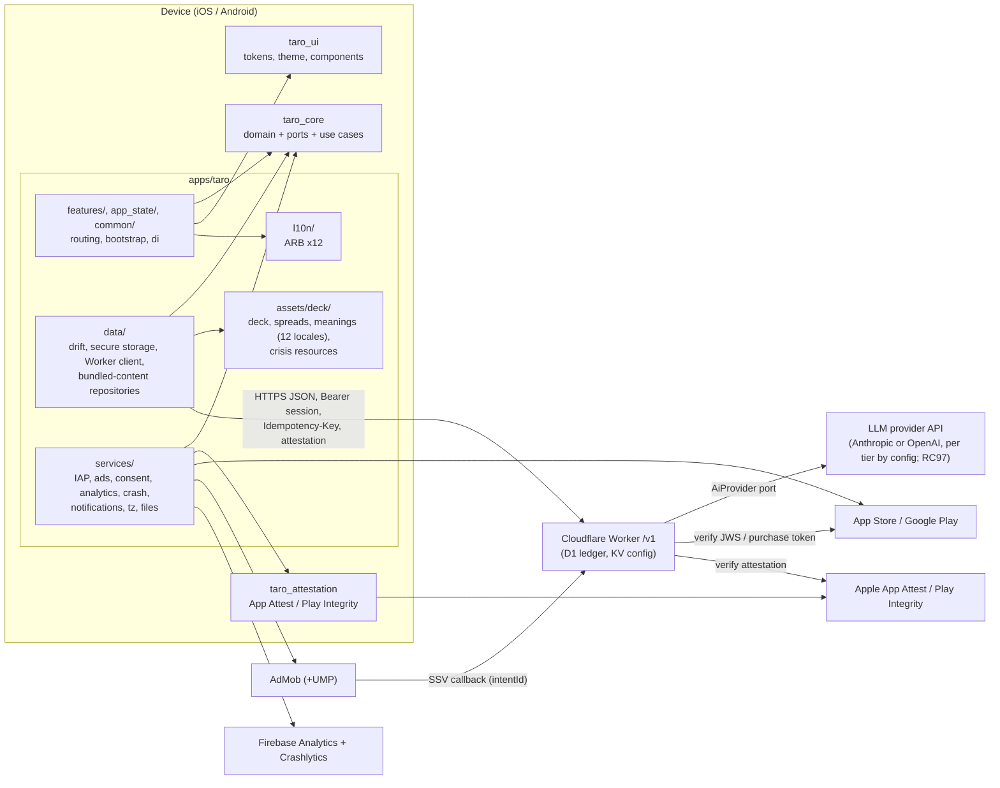

# 02 — Client Architecture (Flutter app + packages)

**Status:** v1.1 reconciled (2026-09-27)
**Canonical names:** see GLOSSARY.md; **decisions:** see 00_DECISIONS.md
**Prefix:** `AR` (locked decisions `AR1…`)
**Scope owner:** the Flutter client (`apps/taro`, `packages/*`).
**Related specs:** `01_PRODUCT.md` (screens, flows, copy), `03_BACKEND_WORKER.md` (API wire format, ledger, attestation verification, remote config schema), `04_MONETIZATION.md` (IAP catalogue, ad placements, rewarded rules), `05_COMPLIANCE_STORE_ASO.md` (consent texts, disclaimers, age rating, store forms), `06_QUALITY_TESTING_CI.md` (coverage tooling, CI, golden pipeline). Context: `../CONTEXT.md` (D1–D16).

---

## Why this exists

Taro must be (a) approvable by Apple/Google in a category Apple explicitly calls saturated, (b) honest about money — credits live on the Worker, never trusted from the client — and (c) maintainable at ≥ 90 % coverage in every coverage unit. `quiz_apps` proved the ports-and-adapters discipline and taught several expensive lessons (unqualified IAP ids, launch-only daily refills, entitlement cache wiped by an offline launch, no UMP). It also showed the costs of a home-made BLoC + two DI systems (InheritedWidget scope for widgets, a global `ServiceLocator` for everything that runs before or outside the tree). This spec fixes the client's structure, contracts and rules before a line is written, so the phase docs can be executed mechanically and Claude Design can produce screens against a known state model and token contract.

## Scope

- Monorepo/package layout, dependency rules and how they are enforced.
- State management, DI, navigation, deep links.
- Result/failure types, domain models, repositories, data sources.
- Ports for every external service, their production adapters, NoOp and fake implementations.
- Worker API client behaviour (headers, auth, retries, idempotency, attestation).
- App lifecycle (launch/resume sync), offline behaviour, l10n (12 locales, RTL), theming from design tokens, flavors/config/secrets, logging, performance budgets.
- Dependency list with version constraints; coding rules for the repo's `CLAUDE.md`.

## Non-goals

- Visual design (Claude Design, D16). This spec defines screens' **states** and a **token contract** only.
- Worker internals and wire schemas (owned by `03_BACKEND_WORKER.md`; this spec states what the client expects and marks each expectation as such).
- Pricing, pack sizes, ad placement policy (`04_MONETIZATION.md`), store copy and consent wording (`05_COMPLIANCE_STORE_ASO.md`).
- CI pipeline mechanics and coverage tooling implementation (`06_QUALITY_TESTING_CI.md`).
- User accounts, cloud sync, push notifications (FCM), web/desktop targets, subscriptions — all out of v1. The ports below leave room for push and subscriptions without restructuring.

---

## Locked decisions

| ID | Decision | Why |
|---|---|---|
| AR1 | **Pub workspace + melos 8** monorepo with **three packages and one app**: `taro_core` (pure Dart: domain, ports, use cases, `Result`/`Failure`; fakes of its ports in `taro_core/test/fakes/`), `taro_ui` (design system, components, generated tokens), `taro_attestation` (own plugin); the app `apps/taro`. Everything else lives in the app as layered folders: `lib/data/` (drift, secure storage, `WorkerClient`, repositories, bundled-content repositories), `lib/services/` (platform SDK adapters), `lib/l10n/` (ARB + generated localizations), `assets/deck/` (generated content), `test/helpers/` (`pumpTaro`, `TaroFakes`). This is the only package list: monetization ports and logic live in `taro_core`, their adapters in `apps/taro/lib/services/`, repositories in `apps/taro/lib/data/`, and the paywall/store UI in `apps/taro/lib/features/paywall`. Reconciled by 00_DECISIONS.md RC15, RC77, RC95 (RC95 replaced the former `taro_data`, `taro_services`, `taro_content`, `taro_l10n` and `taro_testing` packages with app folders). | The pubspec boundary is kept where it buys something: pure-Dart core tests run in milliseconds and cannot touch Flutter or I/O; the design system and the native plugin are self-contained. For one app and one developer, the other five packages gave no reuse and cost pubspecs, melos scripts and CI units (RC95); their layering is kept by the import-graph check (AR2, §2.1). |
| AR2 | **Features and infrastructure layers are folders inside `apps/taro/lib/`, not packages** (`features/`, `services/`, `data/`, `l10n/`, …). Import boundaries between features and between layers are enforced by `tools/check_architecture.dart` (import-graph check) in CI. Reconciled by 00_DECISIONS.md RC95. | One app, one router, one l10n bundle: feature packages would add 7 pubspecs, 7 coverage reports and cross-package route coupling for zero reuse. Mechanical checks give the same isolation. |
| AR3 | **Riverpod 3 (`flutter_riverpod`) is both the DI container and the state-management layer.** Hand-written providers (no `riverpod_generator`). Only the app depends on Riverpod; packages expose plain constructors. State holders are `Notifier`s everywhere, including the monetization screens (`StoreController`, `OutOfReadingsController`, `RewardedController`). Reconciled by 00_DECISIONS.md RC13. | quiz_apps needed two DI mechanisms because InheritedWidget DI cannot reach code that runs outside the tree (purchase stream, lifecycle sync, notification taps). A `ProviderContainer` exists before `runApp`, is overridable per flavor and per test, and gives `AsyncValue` loading/error/data for free. Custom BLoC = boilerplate, manual dispose, no tooling. |
| AR4 | **`go_router`** with a `StatefulShellRoute` for the 4-tab shell (Today `/home`, Journal, Learn, Settings; routes and screen IDs owned by `01_PRODUCT.md` §8.1), route constants in `lib/routing/routes.dart`, redirect guards for onboarding/update. Deep links via Flutter's built-in deep linking (Universal Links / App Links + `taro://`), allowlisted routes only. Reconciled by 00_DECISIONS.md RC17. | Declarative, URL-addressable (deep links and notification taps use the same `router.go`), testable redirect logic. Navigator 1.0 + custom abstraction (quiz_apps) duplicated what go_router provides. |
| AR5 | **`Result<T>` sealed type + sealed `Failure` hierarchy** for every repository/gateway/use-case return. Exceptions are caught at adapter boundaries and never cross into features. No `fpdart`. Failures map 1:1 from the Worker's UPPER_SNAKE error codes (`03_BACKEND_WORKER.md` §2.2, table in §3). A declined reading is a successful response (`200 status: declined`), not a failure. Reconciled by 00_DECISIONS.md RC5, RC27. | Exhaustive `switch` forces every screen to handle every failure (e.g. `InsufficientCreditsFailure` → paywall, `ReadingsPausedFailure` → S31 with the Classic-reading offer). ~80 lines of own code beat a functional-programming dependency. |
| AR6 | **Domain models are immutable `freezed` classes in `taro_core`; wire/storage DTOs are separate (`json_serializable`, drift rows) in `apps/taro/lib/data/`** with explicit mappers. Example: the wire `BalanceDto` (03 §5.1) maps to the domain `CreditBalance`; the wire reading (`title/overview/cards[]/synthesis/reflectionPrompts`) maps to `ReadingContent`. `*.freezed.dart` is excluded from coverage (06 §5.3). Reconciled by 00_DECISIONS.md RC6, RC13, RC30. | Wire format (owned by 03) and backup format can evolve without touching domain code; mappers are trivially testable. |
| AR7 | **drift** (SQLite) is the only local database, split into **two files** (RC75): `taro_journal.db` (readings, daily cards, settings; may be included in OS backups) and `taro_device.db` (purchase outbox, caches, entitlements, consent, sync state; **excluded** from iCloud backup, Android cloud backup and device transfer). **flutter_secure_storage** holds the install identity, install secret, session token and purchase binding; there is no third local store. The purchase queue is the drift `purchase_outbox` table and the Remove Ads cache is the drift `entitlements` table, both in `taro_device.db`. Reconciled by 00_DECISIONS.md RC14, RC75. | Typed queries, reactive streams, versioned migrations, in-memory DB for tests. The split means an OS restore brings back the journal but never another device's purchase tokens, balance cache, entitlements or consent (which must be re-given per device). |
| AR8 | **The Worker is authoritative for credits, allowance, rewarded grants and remote config. The client caches, never computes, balances.** Local cache is display-only and marked stale. | Contract requirement; the client cannot be trusted and must not be able to mint credits (reinstall, clock change, import). |
| AR9 | **Own `taro_attestation` Flutter plugin** (Swift `DCAppAttestService` + DeviceCheck, Kotlin Play Integrity *Standard* API only, no Classic API) behind an `AttestationService` port. Its native code is gated at ≥ 90 % lines like every coverage unit: Xcode `xccov` (Swift) and JaCoCo (Kotlin), reported by `check_coverage.py` as the units `taro_attestation_ios` and `taro_attestation_android`. Reconciled by 00_DECISIONS.md RC12, RC40, RC87. | Pub.dev plugins for App Attest / Play Integrity are unmaintained or single-author (checked 2026-09-26). The native surface is ~150 lines per platform and security-critical. |
| AR10 | **IAP via `in_app_purchase` with StoreKit 2 enabled** and Android `autoConsume: false`. Own `StoreIapService` (learning from quiz_apps' `StoreIAPService`), with a **persistent purchase outbox**: a consumable transaction is finished/consumed only after the Worker confirms the grant (`POST /v1/purchases/verify` → `status: granted`). Each purchase carries the Worker-issued binding (`purchaseBinding.appleAccountToken` as StoreKit `appAccountToken`, `purchaseBinding.playAccountId` as Play `obfuscatedAccountId`). On Play the Worker acknowledges right after the grant; the client still consumes after `granted`. No RevenueCat (D2). Reconciled by 00_DECISIONS.md RC4, RC9, RC10, RC14, RC85. | SK2 gives JWS signed transactions the Worker verifies with the App Store Server API; outbox makes "charged but not credited" impossible across crashes, offline launches and Ask to Buy. |
| AR11 | **Ads via `google_mobile_ads` (includes UMP) + `app_tracking_transparency`**, sequenced UMP → neutral ATT pre-prompt (iOS, `ads.attPrepromptEnabled`, default true; UMP's own IDFA explainer disabled) → ATT → `MobileAds.initialize`. ATT and its pre-prompt are skipped when UMP reports `canRequestAds == false`. Rewarded grants only via **AdMob SSV** with the Worker-issued `intentId` as both `customData` and `userId`; the install id is never sent to Google. Banners only on `kBannerAllowList = {home, journal_list, learn_library}`. Reconciled by 00_DECISIONS.md RC18, RC19, RC56. | UMP was quiz_apps' compliance gap; SSV means the client never claims a reward. |
| AR12 | **AI readings are request/response, not streamed**, in v1: `POST /v1/readings` returns the complete, output-moderated reading. **The draw starts only after a pre-draw hold succeeds** (`POST /v1/readings/holds`, RC50). The reveal may run in parallel with generation while the hold is valid (≥ 120 s left by server time); otherwise the hold is renewed first, and a renewal `402` keeps the picked cards face-down and opens the paywall. Client HTTP timeout for `POST /v1/readings` is **60 s**, with a "taking longer than usual" state at 20 s; on timeout the client polls `GET /v1/readings/{clientReadingId}`. Reconciled by 00_DECISIONS.md RC31, RC48, RC50. | Output moderation must see the whole text before the user does; streaming would show unmoderated text. The hold makes "paywall before the draw" true by construction, not by luck. |
| AR13 | **Cards are drawn on-device with `Random.secure()`** via a `RandomSource` port; Fisher–Yates over the 78-card deck. Seeded source for tests/goldens only. | Contract requirement; testable determinism without weakening production randomness. |
| AR14 | **Every clock-dependent behaviour runs on launch AND resume** through one `SyncCoordinator`, idempotently, plus a foreground timer armed for the server's `free.resetsAt` (`BalanceDto`, RC6). | quiz_apps rule 12 (shipped four times). |
| AR15 | **One ARB bundle in `apps/taro/lib/l10n/`** (`flutter gen-l10n` via `apps/taro/l10n.yaml`, 12 locales); card texts are **content JSON** in `apps/taro/assets/deck/`, generated only by `tools/content build` from `apps/taro/content/source/**` YAML (`01_PRODUCT.md` §11). Spread and position names/descriptions are ARB keys `spread_{spreadId}_pos_{positionId}_name/_desc` (01 §10.2). Reconciled by 00_DECISIONS.md RC26, RC95. | UI strings and ~78×12 long-form meanings have different authoring pipelines and sizes; keeping them apart keeps ARB reviewable. |
| AR16 | **Design tokens are a DTCG JSON file** (`docs/design/taro.tokens.json`, token names per `01_PRODUCT.md` §14) compiled by `tools/tokens/` into `packages/taro_ui/lib/src/tokens/generated/` Dart constants and a `TaroTokens` `ThemeExtension`. Widgets never use raw colors, sizes or durations. Reconciled by 00_DECISIONS.md RC15, RC59, RC90. | Claude Design output becomes a data drop, not a code rewrite; light/dark and reduced motion are handled once. |
| AR17 | **Three flavors: `dev`, `staging`, `prod`**, plus a **`prodStaging` build configuration** of the prod flavor (RC78): prod bundle ID, staging Worker URL, sandbox IAP. It is used for internal TestFlight / internal-track testing, because IAP products and App Attest app IDs exist only for the prod bundle. Configuration via `--dart-define-from-file=config/<config>.json`. The client holds **no secrets**. Firebase projects: `taro-app-dev` (dev + staging + prodStaging) and `taro-app-prod`. Reconciled by 00_DECISIONS.md RC36, RC63, RC78. | Anything shipped in a binary is public; the Anthropic key, store API keys and SSV verification live only in the Worker. `prodStaging` lets testers buy sandbox packs without ever touching the prod ledger. |
| AR18 | **Ports + three implementations each:** production adapter (`apps/taro/lib/services/` or `apps/taro/lib/data/`), `NoOp…` (shipped, used when a feature is disabled or unsupported), `Fake…` (in `packages/taro_core/test/fakes/`, controllable + recording). A shared **port contract test suite** (`packages/taro_core/test/contracts/`) runs against fake and real adapters. Reconciled by 00_DECISIONS.md RC95. | Fakes that drift from reality give false confidence; contract tests keep them honest. |
| AR19 | **Firebase Analytics + Crashlytics only** from Firebase. No Firebase Remote Config, no FCM, no Firebase App Check in v1. Analytics carries **no user id**; the install id never reaches Firebase. Analytics consent is denied by default and events are buffered until UMP resolves. Reconciled by 00_DECISIONS.md RC68. | Remote config and attestation are the Worker's job (single source of truth); avoiding a joinable identifier across vendors simplifies privacy labels. |
| AR20 | **`mocktail` + hand-written fakes; Flutter's built-in `matchesGoldenFile` with the repo `TaroGoldenComparator` for goldens (06 QA8); `patrol` (built on `integration_test`) for integration tests** (native ATT/UMP/purchase dialogs). No `mockito` codegen, no third-party golden package. Goldens include tablet widths (iPad 13", Android tablet) for every ★ screen, because the app is universal. Reconciled by 00_DECISIONS.md RC13, RC24. | No generated mocks to exclude from coverage; the built-in golden matcher needs no dependency (golden_toolkit is discontinued) and is stable on the single macOS reference runner; patrol can drive system dialogs. |

---

## 1. System context



Features reach `data/` and `services/` only through `taro_core` ports resolved in `di/` (§2.1); the arrows show the import graph that `tools/check_architecture.dart` enforces.

---

## 2. Repository and package layout

Reconciled by 00_DECISIONS.md RC15, RC26, RC38, RC95.

```
taro/
├── pubspec.yaml                  # workspace root: `workspace:` list + `melos:` scripts; dev_dep melos
├── analysis_options.yaml         # shared lints (very_good_analysis + overrides), included by all packages
├── apps/
│   └── taro/                     # the only app (package name `taro`)
│       ├── l10n.yaml             # gen-l10n config (§11)
│       ├── lib/                  # features, data, services, l10n, … (§2.2)
│       ├── assets/deck/          # generated by `tools/content build` (deck, spreads, crisis resources)
│       ├── content/source/       # authored content YAML/Markdown (01 §11), input of `tools/content build`; not bundled
│       └── test/                 # helpers/ (pumpTaro, TaroFakes), contract/fixtures/, …
├── packages/
│   ├── taro_core/                # pure Dart (fakes + port contract suites in test/)
│   ├── taro_ui/                  # Flutter (design system, tokens/generated)
│   └── taro_attestation/         # Flutter plugin (Swift + Kotlin)
├── worker/                       # Cloudflare Worker (TypeScript) — see 03
│   ├── src/generated/            # written by `tools/content build` (deck, deck_prompt, crisis resources)
│   └── test/contract/fixtures/   # canonical request/response JSON, source of the Dart contract tests (06 QA15)
├── tools/
│   ├── check_architecture.dart   # import-graph gate for packages and app folders (AR2, §2.1)
│   ├── tokens/                   # DTCG → Dart token generator (AR16)
│   ├── content/                  # `tools/content build` / validate / translate (01 §11); the only content generator
│   ├── check_contract_fixtures.py # Dart fixture copies == worker fixtures (06)
│   └── check_coverage.py …       # per-unit 90 % gate and other checks (owned by 06)
└── docs/ (specs/, phases/, design/taro.tokens.json, ARCHITECTURE.md, ANALYTICS_EVENTS.md, runbooks/)
```

Contract fixtures are copied from `worker/test/contract/fixtures/` to `apps/taro/test/contract/fixtures/` by `melos run contract:sync`; `tools/check_contract_fixtures.py` fails on drift.

The former packages `taro_data`, `taro_services`, `taro_content`, `taro_l10n` and `taro_testing` were replaced by app folders (RC95): `apps/taro/lib/data/`, `apps/taro/lib/services/`, `apps/taro/assets/deck/` + `apps/taro/content/source/` + `apps/taro/lib/data/content/`, `apps/taro/lib/l10n/`, and `apps/taro/test/helpers/` + `packages/taro_core/test/fakes/`.

### 2.1 Dependency rules

Packages (enforced by `pubspec` dependencies and by `tools/check_architecture.dart`):

| Package | May depend on (taro) | Must NOT depend on | Flutter? |
|---|---|---|---|
| `taro_core` | — | anything Flutter, any I/O package, Riverpod | No (pure Dart) |
| `taro_attestation` | — | every taro package | Yes (plugin) |
| `taro_ui` | — | `taro_core`, the app, Riverpod (components take already-localised strings as parameters) | Yes |
| `apps/taro` | all three packages | — | Yes |

Folders inside `apps/taro/lib` (the former package rules, restated as folder rules; RC95). `tools/check_architecture.dart` builds the import graph of `lib/` and applies this table:

| Folder | May import | Must NOT import |
|---|---|---|
| `data/` (drift DBs, secure storage, `WorkerClient`, repositories, `data/content/` asset repositories, backup codec) | `taro_core`, `package:drift`, `package:dio`, `package:flutter_secure_storage`, other storage/HTTP deps | `services/`, `features/`, `app_state/`, `common/`, `routing/`, `l10n/`, `taro_ui`, Riverpod |
| `data/content/` | `taro_core` and the generated assets under `assets/deck/` | every other `data/` subfolder, `services/`, `features/`, `taro_ui` |
| `services/` (platform SDK adapters) | `taro_core`, `taro_attestation`, the vendor SDKs of §18 | `data/` (reach data only through `taro_core` ports), `features/`, `app_state/`, `common/`, `routing/`, `taro_ui`, Riverpod |
| `services/presentation/` (`AdMobBannerSlotView`, `NoOpBannerSlotView`; widgets that wrap SDK views) | `services/`, `taro_core`, `package:google_mobile_ads`, `package:flutter` | `data/`, `features/`, Riverpod |
| `l10n/` (ARB + generated `TaroLocalizations`) | `package:flutter_localizations`, `package:intl` | every other folder, every taro package |
| `bootstrap/`, `di/` | everything (composition root) | — |
| `features/<f>/` | `taro_core`, `taro_ui`, `l10n/`, `di/providers.dart`, `app_state/**`, `routing/routes.dart`, `common/**` | `data/**` (read models come through `taro_core` ports), `services/**`, `package:google_mobile_ads`, `package:in_app_purchase`, `package:firebase_*`, `package:drift`, `package:dio`, other `features/<g>/**` |
| `app_state/` (app-wide controllers: balance, entitlement, consent, config, connectivity) | `taro_core`, `di/` | `features/**`, `data/**`, `services/**` |
| `common/` (shared widgets that need providers, e.g. `BalanceChip`, `BannerSlot`) | `taro_ui`, `l10n/`, `app_state/`, `di/`, `taro_core` (the `BannerSlotView` port) | `features/**`, `data/**`, `services/**` |

`BannerSlot` gets its `BannerSlotView` from a provider in `di/`; only `bootstrap/`/`di/` import `services/presentation/`. `data/` never imports `features/`, and `services/` never imports `data/`: when a service needs stored state it goes through a `taro_core` port wired in `di/`.

`tools/check_architecture.dart` parses every `import`/`export` in `lib/` of each package and of the app, applies both tables, and exits non-zero with the offending file:line. It runs in `melos run check` and CI. A `lib/src` import across packages is also a violation (only barrels are public). For tests it allows one extra edge: `apps/taro/test/**` may import `packages/taro_core/test/fakes/**` and `packages/taro_core/test/contracts/**` by relative path (test-only; no pubspec dependency).

### 2.2 Per-package and per-folder structure

```
packages/taro_core/lib/
  taro_core.dart                        # barrel
  src/
    result/        result.dart, failure.dart
    model/         card.dart, card_text.dart, deck.dart, spread.dart, spread_position.dart,
                   drawn_card.dart, draw.dart, reading.dart, reading_status.dart,
                   reading_content.dart, safety_info.dart, daily_card.dart, credit_balance.dart,
                   entitlement.dart, remote_config.dart, consent_state.dart,
                   install_identity.dart, user_settings.dart, backup.dart, gate_decision.dart, ids.dart
    ports/         (one file per port, see §5)
    usecases/      draw_cards.dart, hold_reading.dart, request_reading.dart, classic_reading.dart,
                   report_reading.dart, sync_account.dart, purchase_credits.dart, earn_reward.dart,
                   export_backup.dart, import_backup.dart, delete_all_data.dart, resolve_reading_gate.dart
    logic/         card_drawer.dart, reading_gate.dart, backup_merge.dart, reset_schedule.dart
packages/taro_core/test/
  fakes/          Fake… for every port (controllable + recording), builders, CapturingLogger
  contracts/      runBalanceRepositoryContract, runIapServiceContract, … (run against fakes here and
                  against the real adapters in apps/taro/test)
packages/taro_ui/lib/src/
  tokens/generated/taro_tokens.g.dart   # generated, excluded from coverage
  theme/ taro_theme.dart, taro_tokens_extension.dart, text_styles.dart
  components/ (see §14.3)
  motion/ taro_motion.dart              # duration/curve accessors honouring reduced motion
  a11y/ semantics_helpers.dart, min_tap_target.dart
packages/taro_ui/test/helpers/golden/   # TaroGoldenComparator + bundled test fonts (06 QA8)
apps/taro/
  l10n.yaml                              # §11
  content/source/**                      # authored YAML (01 §11): {locale}/cards/{cardId}.yaml, glossary,
                                         # articles, crisis/crisis_resources.yaml (RC25); not bundled
  assets/deck/deck_meta.json             # generated: 78 cards, ids, arcana, suit, number, art keys
  assets/deck/{locale}.json              # generated: card texts, 12 files
  assets/deck/spreads.json               # generated: spread definitions + normalized layout coordinates
  assets/deck/crisis_resources.json      # generated: bundled crisis resources (offline S27)
  assets/deck/art/…                      # card art (WebP, 1x/2x/3x) — D15, delivered later
apps/taro/lib/
  main_dev.dart, main_staging.dart, main_prod.dart   # one line each → bootstrap(ProductionEnvironment(Flavor.x)); excluded from coverage (RC16)
  bootstrap/ bootstrap.dart, taro_environment.dart, error_handlers.dart, flavor_config.dart
  di/ providers.dart (port providers, all `throw UnimplementedError` until overridden),
      overrides_prod.dart, overrides_dev.dart
  data/
    db/            taro_database.dart, tables/*.dart, daos/*.dart, migrations/, schema/ (drift_dev dumps)
    secure/        secure_store.dart (port impl over flutter_secure_storage), keys.dart
    api/           worker_client.dart, interceptors/{headers,auth,attestation,retry,error}.dart,
                   dto/*.dart (BalanceDto, ReadingResponseDto, …), endpoints.dart, api_error_mapper.dart
    repositories/  install_repository_impl.dart, balance_repository_impl.dart,
                   reading_repository_impl.dart, journal_repository_impl.dart, daily_card_repository_impl.dart,
                   remote_config_repository_impl.dart, settings_repository_impl.dart,
                   entitlement_cache_impl.dart, purchase_outbox_impl.dart, reward_gateway_impl.dart
    content/       content_assets.dart, asset_deck_repository.dart, asset_spread_repository.dart,
                   asset_card_text_repository.dart, asset_crisis_repository.dart, content_manifest.dart
    backup/        backup_codec.dart, backup_schema_v1.dart, backup_schema_v1.json, backup_migrator.dart
  services/
    iap/  ads/  consent/  analytics/  crash/  notifications/  attestation/
    timezone/  files/  review/  device/  connectivity/  logging/
    presentation/  banner_slot_view.dart (AdMobBannerSlotView, NoOpBannerSlotView)
  l10n/ arb/app_{locale}.arb (12), generated/ (gen-l10n output, not committed)
  routing/ router.dart, routes.dart, guards.dart, deep_link_policy.dart
  app_state/ balance_controller.dart, entitlement_controller.dart, consent_controller.dart,
             remote_config_controller.dart, connectivity_controller.dart, sync_coordinator.dart
  lifecycle/ app_lifecycle_observer.dart, reset_timer.dart
  common/ banner_slot.dart, balance_chip.dart, disclaimer_footer.dart, offline_banner.dart
  features/ onboarding/ consent/ home/ daily_card/ reading/ (spread picker, question, draw, result, classic, report)
            paywall/ (out-of-readings sheet, store, rewarded) journal/ learn/ settings/ backup/ help/ legal/ update/
            debug/ (dev menu; routed only in non-prod flavors, Phase 12)
     <feature>/ view/ (screens, widgets), controller/ (Notifiers + freezed states), <feature>_routes.dart
     (feature folders follow the 01 §8.1 screen list S01–S33; RC17)
  app.dart (MaterialApp.router, theme, localizations)
apps/taro/test/
  helpers/       pump_app.dart (TaroFakes → List<Override>, pumpTaro(...)), pump_taro_widget.dart
                 (pumpTaroWidget(tester, child, {locale, theme, textScale, size}))
  contract/fixtures/   # copy of worker/test/contract/fixtures/ (melos run contract:sync)
  data/ services/ l10n/ features/ …    # mirror lib/
```

---

## 3. Result and failure types (`taro_core/src/result`)

Reconciled by 00_DECISIONS.md RC5, RC27, RC28, RC29, RC47, RC49, RC51, RC66, RC74, RC84, RC85.

```dart
sealed class Result<T> {
  const Result();
  const factory Result.ok(T value) = Ok<T>;
  const factory Result.err(Failure failure) = Err<T>;
  R fold<R>(R Function(T) onOk, R Function(Failure) onErr);
  Result<R> map<R>(R Function(T) f);
  Future<Result<R>> then<R>(Future<Result<R>> Function(T) f);
  T? get valueOrNull;
}
final class Ok<T> extends Result<T> { const Ok(this.value); final T value; }
final class Err<T> extends Result<T> { const Err(this.failure); final Failure failure; }

sealed class Failure { const Failure(); String get code; }   // `code` = stable analytics/log key (values: GLOSSARY §16.1, RC96)
// Transport
final class NetworkFailure extends Failure       // offline / DNS / socket
final class TimeoutFailure extends Failure
final class ServerFailure extends Failure         // 500 INTERNAL, unknown code or unparseable; {int status, String? wireCode, String? requestId}
final class RateLimitedFailure extends Failure    // 429 RATE_LIMITED; {RateLimitReason reason: burst|dailyLimit|declinedLimit|lowTrustCap|reportLimit, Duration? retryAfter}
final class UpgradeRequiredFailure extends Failure// 426 UPGRADE_REQUIRED; {String? storeUrl}
final class ContractFailure extends Failure       // 400 VALIDATION_FAILED / IDEMPOTENCY_KEY_REQUIRED, 422 IDEMPOTENCY_KEY_REUSED / SPREAD_INVALID, 404 NOT_FOUND — a client bug, always reported to crash; {String wireCode}
// Identity / trust
final class SessionExpiredFailure extends Failure // 401 UNAUTHENTICATED, or TOKEN_EXPIRED after a failed token refresh → re-register
final class AttestationFailure extends Failure    // 401 ATTESTATION_REQUIRED, 403 ATTESTATION_FAILED; {AttestationFailureKind kind: unsupported|keyInvalidated|rejected|quota|transient}
// Readings
final class InsufficientCreditsFailure extends Failure  // 402 INSUFFICIENT_CREDITS; {InsufficientReason reason: noCredits|lowTrustCap|freePaused, CreditBalance? balance, DateTime? freeResetsAt}
final class HoldConflictFailure extends Failure         // 409 HOLD_CONFLICT → S10, draw kept face-down (RC48)
final class ReadingExpiredRefundedFailure extends Failure // 410 READING_EXPIRED_REFUNDED; {CreditBalance? balance} (RC51)
final class AiConsentRequiredFailure extends Failure    // 412 AI_CONSENT_REQUIRED → S04 re-prompt (RC28)
final class AiUnavailableRegionFailure extends Failure  // 403 AI_UNAVAILABLE_REGION → Classic-reading offer (RC29)
final class ReadingsPausedFailure extends Failure       // 503 READINGS_DISABLED | AI_BUDGET_EXHAUSTED → S31 readingsPaused + Classic offer, never S10 (RC47); {PausedReason reason: disabled|budgetHard|freeStop, Duration? retryAfter}
final class AiUnavailableFailure extends Failure        // 503 AI_UNAVAILABLE (upstream failed, hold refunded) → generationFailed + Try again
final class RequestInProgressFailure extends Failure    // 409 REQUEST_IN_PROGRESS; retried by the client with Retry-After, surfaced only if it persists
// Rewarded
final class RewardUnavailableFailure extends Failure    // 403 REWARDED_DISABLED, 409 REWARDED_DAILY_CAP, no fill, no ad consent; {RewardUnavailableReason reason: disabled|cap|cooldown|noFill|consent, DateTime? availableAt}
// Account
final class TimezoneChangeRejectedFailure extends Failure // 409 TIMEZONE_CHANGE_TOO_SOON; {DateTime allowedAfter}
// Store
final class PurchaseCancelledFailure extends Failure
final class PurchasePendingFailure extends Failure       // Ask to Buy / deferred payment, or 202 PURCHASE_PENDING
final class PurchaseFailure extends Failure              // store error, 422 PURCHASE_INVALID (incl. reason sandbox_cap) or PRODUCT_UNKNOWN; {String wireCode, String? reason}
final class PurchaseAlreadyClaimedFailure extends Failure // 409 PURCHASE_ALREADY_CLAIMED (iOS binding, RC85); {bool transferEligible, String? transferToken}
final class PurchasesBlockedFailure extends Failure      // client-side: BalanceDto.purchasesAllowed == false; {PurchasesBlockedReason reason: blocked|refundDebt|storeDisabled} (RC66)
final class ProductUnavailableFailure extends Failure
// Local
final class StorageFailure extends Failure
final class BackupInvalidFailure extends Failure         // {BackupInvalidReason reason: notJson|wrongFormat|unsupportedVersion|checksum|schema|tooLarge}
final class UnexpectedFailure extends Failure            // {Object error, StackTrace stack} — always reported to crash
```

**Worker error codes → `Failure`** (codes owned by `03_BACKEND_WORKER.md` §2.2; UPPER_SNAKE on the wire; each `Failure` has one ARB message key; the full mapping table with ARB keys is in GLOSSARY.md):

| HTTP + `code` | `Failure` | Client state (01 §8.3) |
|---|---|---|
| 400 `VALIDATION_FAILED`, 400 `IDEMPOTENCY_KEY_REQUIRED`, 404 `NOT_FOUND`, 422 `IDEMPOTENCY_KEY_REUSED`, 422 `SPREAD_INVALID` | `ContractFailure` | generic error + crash report |
| 401 `UNAUTHENTICATED` | `SessionExpiredFailure` | silent re-registration |
| 401 `TOKEN_EXPIRED` | (handled by the auth interceptor: `POST /v1/installs/token`, one retry) → `SessionExpiredFailure` if it fails | — |
| 401 `ATTESTATION_REQUIRED`, 403 `ATTESTATION_FAILED` | `AttestationFailure` | `deviceUnverified` |
| 402 `INSUFFICIENT_CREDITS` | `InsufficientCreditsFailure` | S10 (`lowTrustCap` → `lowTrustLimited` copy; `freePaused` → S31 `freePaused` variant) |
| 403 `AI_UNAVAILABLE_REGION` | `AiUnavailableRegionFailure` | `aiUnavailableRegion` → Classic offer |
| 403 `REWARDED_DISABLED`, 409 `REWARDED_DAILY_CAP` | `RewardUnavailableFailure` | S10 option disabled / capped |
| 409 `REQUEST_IN_PROGRESS` | `RequestInProgressFailure` | retried, then polling |
| 409 `HOLD_CONFLICT` | `HoldConflictFailure` | S08 `holdLost` → S10 |
| 409 `PURCHASE_ALREADY_CLAIMED` | `PurchaseAlreadyClaimedFailure` | S11 `failed` with transfer hint (RC84) |
| 409 `TIMEZONE_CHANGE_TOO_SOON` | `TimezoneChangeRejectedFailure` | none (server boundary kept) |
| 410 `READING_EXPIRED_REFUNDED` | `ReadingExpiredRefundedFailure` | S08 `deliveryExpired` |
| 412 `AI_CONSENT_REQUIRED` | `AiConsentRequiredFailure` | S04 re-prompt |
| 422 `PURCHASE_INVALID`, 422 `PRODUCT_UNKNOWN` | `PurchaseFailure` | S11 `failed(kind)` (transaction finished) |
| 426 `UPGRADE_REQUIRED` | `UpgradeRequiredFailure` | S30 `/update` |
| 429 `RATE_LIMITED` | `RateLimitedFailure` | `rateLimited`; `reason=dailyLimit` → S07 `dailyLimitReached` (no paywall, RC74); `reason=reportLimit` → S33 `rateLimited` (RC72) |
| 500 `INTERNAL`, unknown code | `ServerFailure` | generic error |
| 503 `AI_UNAVAILABLE` | `AiUnavailableFailure` | S08 `generationFailed` |
| 503 `AI_BUDGET_EXHAUSTED`, 503 `READINGS_DISABLED` | `ReadingsPausedFailure` | S31 `readingsPaused` + Classic offer (never S10) |

A **declined** reading (`200 status: declined`, 03 §9.1) is not a `Failure`: it is `ReadingStatus.refused(SafetyInfo)` with `SafetyInfo{RefusalCategory category, String messageKey, bool canRephrase, List<CrisisResource> crisisResources}`. `RefusalCategory` = 03 §9.4 exactly: `health | pregnancy | death | legal | financial | gambling | selfHarm | harmToOthers | sexualMinors | hateOrHarassment`, plus `other` for unknown codes and model refusals. UI mapping (RC27): `canRephrase == true` → 01's "rephrase" hint on S07; `selfHarm | harmToOthers` → 01's "crisis" (S27); `sexualMinors | hateOrHarassment` → 05's "moderation blocked" copy. Every factory is exposed on `Failure` (`Failure.network()`, …) per the sealed-factory rule. Each `Failure` subtype has the ARB key `failure` + the class name without the `Failure` suffix (e.g. `NetworkFailure` → `failureNetwork`); refusal messages use `safetyDeclined<Category>` (e.g. `safetyDeclinedSelfHarm`). The full key list is GLOSSARY §5 and §5.2 (RC94); `check_l10n.py` enforces that every one exists in `app_en.arb` (06 §6.2).

Rules: repositories, gateways and use cases return `Future<Result<T>>` or `Stream<T>`; they never throw. Adapters wrap SDK calls in `guard(() async {...})` which maps known exceptions and turns anything else into `UnexpectedFailure` (+ crash report). Controllers `switch` exhaustively on `Failure` subtypes relevant to the screen and route the rest to a shared `FailureMessage.of(context, failure)` in `common/`.

---

## 4. Domain model (`taro_core/src/model`)

Reconciled by 00_DECISIONS.md RC1, RC2, RC6, RC17, RC30, RC44, RC45, RC62, RC64, RC66, RC67, RC70, RC74, RC81. The local user-data model is `01_PRODUCT.md` §10.4 (notes live on `Reading` and `DailyCard`; free-form journal entries, mood and tags are v1.2).

All `@freezed` (immutable, value equality, `copyWith`); IDs are extension types over `String` to prevent mixing (`extension type const CardId(String value)`, same for `SpreadId`, `PositionId`, `ReadingId`, `InstallId`, `ProductId`).

| Model | Fields (type) | Notes |
|---|---|---|
| `TarotCard` | `id: CardId` (`major_00` … `major_21`, `{wands,cups,swords,pentacles}_01` … `_14`; 01 = Ace, 11 = Page, 12 = Knight, 13 = Queen, 14 = King), `arcana: Arcana{major,minor}`, `suit: Suit?{wands,cups,swords,pentacles}`, `number: int` (0–21 major, 1–14 minor), `element: Element?`, `astrology: String?`, `artKey: String` | Language-neutral (01 §10.1 `DeckCard`). |
| `CardText` | `cardId`, `locale: String`, `name`, `keywordsUpright: List<String>`, `keywordsReversed`, `shortUpright`, `shortReversed`, `meaningUpright`, `meaningReversed`, `aspects`, `reflectionQuestions: List<String>`, `imageryNote?` | From the bundled content in `apps/taro/assets/deck/` (01 §10.1); used by the daily card, reveal, Classic reading, Learn and offline card detail. |
| `Deck` | `id: String` (`rws_original`), `version: int`, `cards: List<TarotCard>` (exactly 78, validated), `artSet: String` | |
| `Spread` | `id: SpreadId` (`single`, `three_ppf`, `three_sao`, `relationship`, `two_paths`, `celtic_cross` — list owned by 01 §10.3), `version: int`, `positions: List<SpreadPosition>`, `questionSuggestionKeys: List<String>`, `allowsReversals: bool`, `enabled: bool` (from `spreads.enabled`) | No per-spread cost: every reading costs exactly 1 credit (RC62). The question limit is global (`ai.questionMaxChars`, 300 grapheme clusters, RC45). Names and descriptions come from ARB (`spread_{spreadId}_…`). The daily card is not a spread. |
| `SpreadPosition` | `id: PositionId` (`past`, `present`, `future`, `challenge` …), `order: int`, `layout: PositionLayout{x: double, y: double, rotationDeg: double}` (normalized 0..1 of the spread canvas, LTR) | Layout is data, so new spreads ship without UI code. |
| `DrawnCard` | `positionId: PositionId`, `cardId: CardId`, `reversed: bool` | Same shape as the wire `cards[]` (03 §9.1). |
| `Draw` | `spreadId`, `spreadVersion`, `cards: List<DrawnCard>`, `drawnAt: DateTime` (UTC) | Produced by `CardDrawer`; immutable once created. |
| `Reading` | `id: ReadingId` (UUIDv4, client-generated, **= `clientReadingId` = `Idempotency-Key`** for the hold and the reading, RC42), `createdAt`, `updatedAt`, `localDate`, `draw: Draw`, `question: String?`, `status: ReadingStatus`, `content: ReadingContent?`, `contentLocale`, `promptVersion?`, `modelId?`, `chargeSource: ChargeSource?{free,bonus,paid}` (device-local, never exported), `note?`, `favourite: bool`, `rating: Rating?{up,down}`, `ratingReason?`, `deliveryAcked: bool` (device-local), `reported: bool` | 01 §10.4. Persisted locally before the network call (crash-safe). |
| `ReadingStatus` (sealed) | `pending()`, `complete()`, `refused(SafetyInfo)`, `failed(Failure, {bool refunded})`, `classic()` | Local statuses per 01 §10.4. `pending` = persisted, not yet delivered (covers the Worker's `held`/`generating`). The wire `completed` maps to `complete`, the wire `declined` to `refused`. `classic` = no Worker call (RC20). |
| `ReadingContent` | `title: String`, `summary: String` (= wire `overview`), `positions: List<PositionText{positionId, text}>` (= wire `cards[].interpretation`), `synthesis: String`, `reflectionPrompts: List<String>` (1..3) | The wire format is 03's; this is the client domain type (RC30). There is **no** disclaimer from the Worker; the client renders its own static footer (05, PR9). |
| `DailyCard` | `localDate` (PK), `cardId`, `reversed`, `drawnAt`, `note?`, `favourite`, `updatedAt` | 01 §10.4; local only. |
| `CreditBalance` | Mapped from the wire `BalanceDto` (03 §5.1): `free: FreeAllowance{limit, used, remaining, localDate, resetsAt: DateTime (UTC), timezone: String (IANA), paused: bool}`, `bonus: int`, `paid: int`, `canRead: bool`, `canReadReason: CanReadReason?{noCredits, dailyLimit, lowTrustCap, readingsPaused}`, `nextSource: ChargeSource`, `rewarded: RewardedStatus{enabled, amount, dailyCap, grantedToday, available, cooldownEndsAt?}`, `paidBlocked: bool`, `purchasesAllowed: bool`, `purchasesBlockedReason: PurchasesBlockedReason?{blocked, refundDebt, storeDisabled}`, `ledgerVersion: int`, `serverTime: DateTime`, `syncedAt: DateTime` (device clock) | `bonus` is shown as "earned readings" in the UI. `total` getter; `isStaleAt(now)` = `now - syncedAt > balance.staleAfterSec` or `now >= free.resetsAt`. A response is accepted only if its `ledgerVersion ≥` the cached one and replaces the cache when it is greater, or equal with a newer `serverTime` (RC67). Never incremented/decremented by the client except to apply a Worker response. |
| `Entitlement` | `removeAds: EntitlementState{owned, notOwned, unknown}`, `source: EntitlementSource{store, cache}`, `verifiedAt: DateTime?` | `unknown` behaves as "not owned" for ads **unless** the cache says owned (quiz_apps lesson). |
| `RemoteConfig` | typed fields, see §9.4; `version: String`, `fetchedAt` | `RemoteConfig.defaults` compiled in; unknown keys ignored, missing keys → default. |
| `ConsentState` | `ads: AdsConsent{status: unknown\|required\|obtained\|notRequired, canRequestAds: bool, privacyOptionsRequired: bool}`, `tracking: TrackingStatus{notDetermined, restricted, denied, authorized, notSupported}`, `ai: AiConsent{decision: unknown\|granted\|declined, version: int?, at?}`, `analyticsEnabled: bool`, `onboardingStep` | `ai` is valid only if `decision == granted && version >= config.ai.consentVersion` (re-prompt when the disclosure text changes, RC21). Device-local, never backed up. |
| `InstallIdentity` | `installId: InstallId`, `registeredAt: DateTime?`, `registeredTimezone: String?`, `trust: Trust?{high, low}`, `purchaseBinding: PurchaseBinding?{appleAccountToken?, playAccountId?}`, `attestationKeyId: String?` (iOS) | The install secret is never part of a domain object; it is read only by the registration call. |
| `UserSettings` | `localeOverride: String?`, `themeMode: ThemeMode{system,light,dark}`, `reversalsEnabled: bool`, `reminder: ReminderSettings{enabled, time (HH:mm local)}`, `hapticsEnabled`, `reduceMotion: bool?` (null = follow OS) | Exported in backups. |
| `Backup` | `format: "taro.backup"`, `schemaVersion: int`, `exportedAt`, `appVersion`, `data: {settings, readings, dailyCards}`, `checksum` | See §12 and `backup_schema_v1.json`. |
| `CrisisResource` | `name`, `phone?`, `sms?`, `url?`, `hours?`, `languages: List<String>`, `verifiedAt` (canonical schema: 03 §9.5, RC81) | Delivered by the Worker with declined readings (selected by `cf.country`); the bundled copy (compiled by `tools/content build` from `apps/taro/content/source/crisis/crisis_resources.yaml` into `apps/taro/assets/deck/crisis_resources.json`, RC25, RC95) is selected by device region for S27 from Help and offline. |

### 4.1 Pure logic in core

- `CardDrawer(RandomSource rng).draw(Deck, Spread, {required bool reversalsEnabled, required DateTime now}) → Draw` — full Fisher–Yates shuffle of 78 ids with `rng.nextInt`, take `positions.length` (picking position *i* takes `shuffled[i]`, 01 §7.3), `reversed = spread.allowsReversals && reversalsEnabled && rng.nextBool()`. Property tests: no duplicates, uniformity (χ² over 1e5 seeded draws, tolerance documented).
- `ReadingGate.evaluate({InstallIdentity install, CreditBalance? balance, RemoteConfig, ConsentState, bool online, Spread spread, DateTime now}) → GateDecision`. Checks run **in this order** (RC44) and the first failing check wins: registration/trust → AI consent → online → `readings.enabled` / region → spread enabled → balance. `GateDecision` (sealed) = `deviceUnverified()`, `needsAiConsent()`, `offline()`, `readingsPaused({bool freePaused})`, `aiUnavailableRegion()`, `spreadDisabled()`, `needsCredits(PaywallOptions{reason: noCredits|lowTrustCap, packs, rewardedAvailable, nextFreeAt})`, `dailyLimitReached()` (from `canReadReason == dailyLimit`; no paywall, RC74), `needsSync()`, `allowed(ChargeSource expected)`. `canReadReason == readingsPaused` or `free.paused` with nothing else to spend → `readingsPaused`, never `needsCredits` (RC47, RC64). `rewardedAvailable` requires `free.remaining == 0` (RC34). Single place that implements "paywall before the draw"; the pre-draw hold (§9.3) makes it authoritative.
- `ResetSchedule.nextSyncAt(CreditBalance, DateTime now)` — when the foreground timer should fire (at `free.resetsAt`).
- `BackupMerge.merge(local, incoming, MergeMode{merge, replace})` — readings by `id`, daily cards by `localDate`; on conflict the newer `updatedAt` wins; returns `MergeReport{added, updated, skipped}`.

---

## 5. Ports (`taro_core/src/ports`) and implementations

Every port is an `abstract interface class`. Implementations: **Prod** (app `data/` or `services/`), **NoOp** (shipped), **Fake** (`packages/taro_core/test/fakes/`, RC95). Reconciled by 00_DECISIONS.md RC4, RC14, RC15, RC17, RC18, RC22, RC25, RC41, RC51, RC56, RC57, RC72.

| Port | Key methods | Prod adapter | NoOp used when |
|---|---|---|---|
| `InstallRepository` | `Future<InstallIdentity> getOrCreate()`, `Future<Result<InstallIdentity>> ensureRegistered()`, `Future<Result<void>> refreshToken()`, `Future<Result<CreditBalance>> updateTimezone(String iana)`, `Future<Result<void>> deleteServerData()` | `InstallRepositoryImpl` (secure storage + Worker) | — |
| `SessionTokenStore` | `read/write/clear` | `SecureSessionTokenStore` | — |
| `BalanceRepository` | `Stream<CreditBalance?> watch()`, `Future<Result<CreditBalance>> sync({SyncReason reason})`, `CreditBalance? get cached` | `BalanceRepositoryImpl` (Worker `GET /v1/balance` + drift cache) | — |
| `ReadingRepository` | `Future<Result<ReadingHold>> hold(ReadingId, SpreadId, {String locale})`, `Future<Result<Reading>> submit(Reading pending)`, `Future<Result<Reading>> resume(ReadingId)`, `Future<Result<void>> ack(ReadingId)`, `Future<Result<void>> report(ReadingId, ReportReason, {String? note})`, `Future<Result<Reading>> saveClassic(Reading)`, `Stream<Reading?> watch(ReadingId)`, `setNote`, `setFavourite`, `setRating`, `delete` | `ReadingRepositoryImpl` (drift + Worker) | — |
| `JournalRepository` | `Stream<List<JournalItem>> watchAll({JournalQuery})` (readings + daily cards, newest first), `search(String)` (`journal_fts`, RC91) | drift | — |
| `DailyCardRepository` | `Stream<DailyCard?> watchToday()`, `Future<Result<DailyCard>> drawToday()`, `setNote`, `setFavourite` | drift | — |
| `ContentRepository` | `Future<Deck> deck()`, `Future<List<Spread>> spreads()`, `Future<CardText> cardText(CardId, String locale)`, `Future<List<CrisisResource>> fallbackCrisisResources(String region)` (bundled copy, RC25) | `apps/taro/lib/data/content/` asset repos (JSON parsed in isolate, cached per locale) | — |
| `RemoteConfigRepository` | `RemoteConfig get current`, `Stream<RemoteConfig> watch()`, `Future<Result<RemoteConfig>> refresh()` | Worker `GET /v1/config` with ETag, drift cache | `StaticRemoteConfigRepository` (defaults; tests/offline dev) |
| `SettingsRepository` | `watch()`, `update(UserSettings Function(UserSettings))`, consent persistence (`ConsentStore`) | drift | — |
| `IapService` | `Future<Result<List<StoreProduct>>> products(Set<ProductId>)`, `Future<Result<PurchaseOutcome>> buy(ProductId, {PurchaseBinding binding})`, `Future<Result<void>> restore()`, `Stream<IapEvent> events`, `Set<ProductId> get pending` | `StoreIapService` (`in_app_purchase` + SK2) | `NoOpIapService` (products empty; flavor flag `iapEnabled=false`) |
| `PurchaseVerifier` | `Future<Result<GrantResult>> verify(StorePurchase, {required String idempotencyKey, String? transferToken})` (RC84) | Worker `POST /v1/purchases/verify` (single route, `platform` discriminator) | — |
| `PurchaseOutbox` | `enqueue`, `pending()`, `markGranted`, `markFinished`, `recordAttempt` | drift `purchase_outbox` (`taro_device.db`) | — |
| `EntitlementCache` | `Entitlement read()`, `write(Entitlement)` | drift `entitlements` (`taro_device.db`) | — |
| `AdsService` | `Future<void> initialize(AdRequestPolicy)`, `Future<Result<RewardedShowResult>> showRewarded(RewardIntent)`, `Future<void> preloadRewarded()`, `bool get isInitialized` | `AdMobAdsService` | `NoOpAdsService` (Remove Ads owned + rewarded disabled, `adsEnabled=false`, tests) |
| `BannerSlotView` *(presentation port; its adapters live in `apps/taro/lib/services/presentation/` because they return a `Widget`)* | `Widget build(BannerScreen screen, {required bool visible})` (`BannerScreen` ∈ `kBannerAllowList = {home, journal_list, learn_library}`, RC18) | `AdMobBannerSlotView` (adaptive anchored banner, load on first build, dispose on unmount) | `NoOpBannerSlotView` (`SizedBox.shrink`) |
| `RewardGateway` | `Future<Result<RewardIntent>> createIntent(String adUnitId)`, `Future<Result<RewardStatus>> status(String intentId)`, `Future<void> cancel(String intentId)` | Worker `POST /v1/rewards/intents`, `GET /v1/rewards/intents/{intentId}`, `POST /v1/rewards/intents/{intentId}/cancel` | — |
| `ConsentService` (UMP) | `Future<AdsConsent> gather({bool debugEea})`, `Future<void> showPrivacyOptions()`, `Future<AdsConsent> current()` | `UmpConsentService` (`ConsentInformation`, `ConsentForm` from google_mobile_ads) | `NoOpConsentService` (`notRequired, canRequestAds: true`) |
| `TrackingAuthorization` (ATT) | `status()`, `request()` (the neutral pre-prompt is app UI shown before `request()`, §9.7) | `AttTrackingAuthorization` (iOS) | `NotSupportedTrackingAuthorization` (Android) |
| `AnalyticsService` | `log(AnalyticsEvent)`, `screen(String)`, `setCollectionEnabled(bool)`, `setConsent(AnalyticsConsent)` | `FirebaseAnalyticsService`; `ConsoleAnalyticsService` (dev) ; `CompositeAnalyticsService` | `NoOpAnalyticsService` |
| `CrashReporter` | `recordError(Object, StackTrace, {bool fatal, Map context})`, `log(String breadcrumb)`, `setCollectionEnabled(bool)` | `FirebaseCrashReporter` | `NoOpCrashReporter` (dev) |
| `ReminderScheduler` | `schedule(ReminderSettings, String locale)`, `cancelAll()`, `Future<bool> requestPermission()`, `Stream<String> taps` (route) | `LocalReminderScheduler` (`flutter_local_notifications` + `timezone`) | `NoOpReminderScheduler` |
| `AttestationService` | `Future<Result<AttestationBlob>> attest({required String challenge, required String installId, required DeviceSignal signal})` (registration; binds challenge ‖ installId ‖ device signal, §6.4), `Future<Result<AssertionBlob>> assert_({required List<int> clientDataHash, String? keyId})` (`keyId` = App Attest key, iOS) (per-call hash of 03 §3.4), `Future<DeviceSignal> deviceSignal()` (Android `deviceKey`, iOS DeviceCheck token; 03 §3.7), `bool get isSupported` | `PlatformAttestationService` (via `taro_attestation`) | `DebugAttestationService` (dev flavor + simulators/emulators; sends the dev/staging `DEBUG_ATTESTATION_TOKEN` instead of a platform attestation (format per 03 §11), which the Worker honours only when its deploy env sets `ALLOW_DEBUG_ATTESTATION`; never switched by headers alone, RC86) |
| `Clock` | `DateTime now()` (UTC), `DateTime nowLocal()` | `SystemClock` (wraps `package:clock`) | `FixedClock`/`FakeClock` (tests) |
| `TimezoneProvider` | `Future<String> currentIana()` | `FlutterTimezoneProvider` | `FixedTimezoneProvider` |
| `RandomSource` | `int nextInt(int max)`, `bool nextBool()` | `SecureRandomSource` (`Random.secure()`) | `SeededRandomSource` (tests, goldens, screenshot mode only — asserted unreachable in prod builds) |
| `IdGenerator` | `String uuidV4()` (reading ids, idempotency keys, request ids) | `SecureIdGenerator` (over `uuid` with a CSPRNG) | `SequentialIdGenerator` (tests) |
| `Logger` | `fine/info/warning/severe(String message, {Object? error, StackTrace? stack})`, `child(String name)` | `PackageLoggingLogger` (over `package:logging`, sinks per §13) | `SilentLogger` (tests; `CapturingLogger` in `taro_core/test/fakes/`) |
| `FileTransfer` | `Future<Result<void>> share(Uint8List bytes, String fileName, String mime)`, `Future<Result<Uint8List?>> pickJson()` | `PlatformFileTransfer` (`share_plus` + `file_picker`) | — |
| `ConnectivityMonitor` | `Stream<bool> online`, `Future<bool> isOnline()` | `ConnectivityPlusMonitor` (hint only; real truth is the request outcome) | `AlwaysOnlineMonitor` |
| `UrlLauncher` | `Future<Result<void>> open(Uri uri)` (`tel:`, `sms:`, `https:` only; `UrlLauncher.allowedSchemes`) | `PlatformUrlLauncher` (`url_launcher`, external application) | `NoOpUrlLauncher` |
| `ReviewPrompter` | `Future<void> maybePrompt(ReviewTrigger)` | `InAppReviewPrompter` (policy from 01/04, `review.promptAfterPositiveReadings`; Classic readings never count) | `NoOpReviewPrompter` |
| `AppInfo` | `version`, `buildNumber`, `platform`, `osVersion`, `deviceModelClass` | `PackageInfoAppInfo` | `FakeAppInfo` |
| `SecureStore` | `read/write/delete(String key)` | `FlutterSecureStore` | `InMemorySecureStore` (tests) |

`IapEvent` (sealed): `purchased(ProductId, CreditGrant?)`, `pending(ProductId)`, `cancelled`, `failed(Failure)`, `restored(Set<ProductId>)`, `entitlementChanged(Entitlement)`. Product ids are fully qualified: `com.vshyrochuk.taro.readings_3`, `.readings_10`, `.readings_30` (consumables) and `com.vshyrochuk.taro.remove_ads` (displayed as "Remove Banner Ads", RC80). The catalogue is owned by `04_MONETIZATION.md`; credit amounts live only in the Worker (`worker/src/monetization/catalog.ts`) and reach the client as Worker-injected `credits` in `store.packs` (with `enabled`, `sortOrder`); a size change means a new product id (RC3); `IapCatalog.validate()` throws at startup on any unqualified id (quiz_apps rule 10).

---

## 6. Data layer (`apps/taro/lib/data/`)

### 6.1 drift databases (schemaVersion 1 each, RC75)

Reconciled by 00_DECISIONS.md RC14, RC17, RC51, RC70, RC75, RC91.

Two database files, each with its own drift schema and migrations:

- **`taro_journal.db` (`JournalDatabase`)**: `readings`, `reading_cards`, `daily_cards`, `settings` (user settings only), `journal_fts`. User content; it may be included in iCloud backup and Android cloud backup.
- **`taro_device.db` (`DeviceDatabase`)**: `balance_cache`, `remote_config_cache`, `entitlements`, `purchase_outbox`, `consent_state`, `sync_state`, `pending_acks`. Device-bound state. It is **excluded from OS backup**: iOS sets `NSURLIsExcludedFromBackupKey` on the file (and its `-wal`/`-shm` siblings) when it is created; Android lists it in `data_extraction_rules.xml` under both `<cloud-backup>` and `<device-transfer>` excludes (and in `full_backup_content.xml` for API < 31).

After an OS restore to a new device, the journal is present, `taro_device.db` and secure storage are empty, and the app registers as a new install. A restore-simulation test (journal DB present, device DB and secure storage empty) asserts that no purchase token is re-verified, no cached balance is shown, and consent is asked again.

| File | Table | Columns (type) | Notes |
|---|---|---|---|
| journal | `readings` | `id TEXT PK` (= `clientReadingId`), `spread_id`, `spread_version INT`, `local_date TEXT`, `question TEXT NULL`, `status TEXT` (`pending\|complete\|failed\|refused\|classic`), `content_json TEXT NULL` (`ReadingContent`), `safety_json TEXT NULL` (`SafetyInfo` for `refused`), `failure_json TEXT NULL` (`{code, refunded}` for `failed`), `content_locale`, `prompt_version NULL`, `model_id NULL`, `charge_source NULL`, `note TEXT NULL`, `favourite INT`, `rating NULL`, `rating_reason NULL`, `delivery_acked INT`, `reported INT`, `drawn_at INT`, `created_at INT`, `updated_at INT` | Index `(created_at DESC)`, `(favourite, created_at)`. 01 §10.4. `reading_cards` has an index on `card_id` (Journal card filter). |
| journal | `reading_cards` | `reading_id FK ON DELETE CASCADE`, `position_id TEXT`, `position_order INT`, `card_id`, `reversed INT`; PK `(reading_id, position_id)` | |
| journal | `daily_cards` | `local_date TEXT PK`, `card_id`, `reversed INT`, `drawn_at INT`, `note TEXT NULL`, `favourite INT`, `created_at INT`, `updated_at INT` | 01 §10.4. |
| journal | `settings` | `key TEXT PK`, `value_json TEXT` | `UserSettings` only (exported). |
| journal | `journal_fts` | FTS5 (trigram tokenizer: case- and diacritic-insensitive substrings in every locale) over question and note of readings and daily cards; `journal_search_refs(fts_rowid PK, kind, ref)` maps rows back; triggers keep both in sync. Card names are localized content, so the repository resolves them to card IDs and filters `reading_cards` (fallback without FTS5: indexed lowercase column + `LIKE`, RC91) | |
| device | `balance_cache` | single row: `json` (`BalanceDto`), `ledger_version INT`, `server_time INT`, `synced_at INT` | Display-only (AR8). |
| device | `remote_config_cache` | single row: `json`, `etag`, `fetched_at` | |
| device | `entitlements` | `key PK` (`remove_ads`), `state`, `source`, `verified_at` | Cleared only on a definitive store "not owned". Kept by "Delete all data" (RC37). |
| device | `purchase_outbox` | `txn_key TEXT PK` (StoreKit transaction id / Play purchase token hash), `product_id`, `platform`, `transaction_id NULL`, `verification_data TEXT NULL` (JWS / purchase token), `order_id NULL`, `idempotency_key TEXT`, `status` (`awaitingVerification\|granted\|finished\|rejected`), `attempts INT`, `last_error NULL`, `created_at`, `updated_at` | Never exported; rows pruned 30 days after `finished`. Kept by "Delete all data". |
| device | `consent_state` | single row: `ConsentState` JSON, `updated_at` | Never backed up or exported. |
| device | `sync_state` | `key PK`, `value` | e.g. last successful sync instant, last timezone sent, a queued `DELETE /v1/installs/me` (`pending_erasure` = its idempotency key, S26 `partial`); `install_registration` = the registration outcome (`installId`, `registeredAt`, `trust`, `timezone`). Not backed up, so an iOS reinstall (Keychain kept, App Attest key lost) re-registers with the same install ID and secret (§6.4). |
| device | `pending_acks` | `reading_id PK`, `attempts INT`, `created_at` | Delivery acks retried by `SyncCoordinator` (RC51). |

Instants are stored as UTC microseconds (`INT`). Migrations: `drift_dev schema dump` (via `dart run drift_dev make-migrations`) into `apps/taro/db/schema/{journal,device}/drift_schema_v{n}.json` on every bump; `schema generate` produces test helpers; each migration step has a test from every previous version (drift's `SchemaVerifier`). Each database is opened with `driftDatabase(name: 'taro_journal' | 'taro_device', native: DriftNativeOptions(shareAcrossIsolates: true))` so queries run off the UI isolate. Tests use `NativeDatabase.memory()`.

### 6.2 Secure storage keys (`apps/taro/lib/data/secure/keys.dart`)

| Key | Content | iOS accessibility | Android |
|---|---|---|---|
| `taro.install_id` | UUIDv4 | `first_unlock_this_device` (not synced to iCloud Keychain, survives reinstall on same device) | Keystore-backed encrypted prefs; file excluded in `data_extraction_rules.xml` / `full_backup_content.xml` |
| `taro.install_secret` | 32 random bytes, base64url (RC54); sent only in `POST /v1/installs` | same | same |
| `taro.session_token` | the Worker `installToken` (JWT, 7 days) and its `expiresAt` | same | same |
| `taro.purchase_binding` | `purchaseBinding` from the registration response (`appleAccountToken` / `playAccountId`, RC9) | same | same |
| `taro.attest_key_id` | App Attest key id (iOS) | same | — |

On first launch the app writes `install_id` and `install_secret` together **before** anything else; if secure storage throws (rare Keystore corruption), the app surfaces a blocking error screen (S01 `storageError`) with retry and reports to Crashlytics — it never silently generates a second id.

### 6.3 Worker API client (`WorkerClient`, dio)

Base URL from flavor config; all paths under `/v1`. **Wire schemas are owned by `03_BACKEND_WORKER.md`**; the endpoint set below is canonical (RC4) and the shared contract fixtures (§2) keep both sides in sync. **[idem]** and **[attest]** follow 03 exactly. Reconciled by 00_DECISIONS.md RC4, RC11, RC22, RC28, RC31, RC42, RC46, RC49, RC50, RC51, RC54, RC55, RC57, RC84, RC87.

| Client call | Method + path | [attest] | `Idempotency-Key` | Timeout |
|---|---|---|---|---|
| Challenge | `POST /v1/attest/challenge` → `{challenge, expiresAt, powBits}` | — | — | 10 s |
| Register install | `POST /v1/installs` `{installId, installSecret, platform, appVersion, locale, timezone, deviceKey \| deviceCheckToken, attestation{type: app_attest\|play_integrity\|none, challenge, …, pow?}}` → `{installToken, expiresAt, trust, purchaseBinding, balance, config}` | — (the attestation is in the body) | **fresh UUID per registration attempt**, reused only for a network retry of that attempt (RC55) | 15 s |
| Refresh token | `POST /v1/installs/token` | Yes | — | 15 s |
| Update timezone | `PUT /v1/installs/me/timezone` `{timezone}` → `BalanceDto` \| `409 TIMEZONE_CHANGE_TOO_SOON` | — | fresh UUID per change | 15 s |
| Delete server data | `DELETE /v1/installs/me` → `204` | — | fresh UUID per user action (RC55) | 15 s |
| Remote config | `GET /v1/config` (`If-None-Match`) | — | — | 10 s |
| Balance sync | `GET /v1/balance` → `BalanceDto` (Worker applies the daily reset idempotently) | — | — | 10 s |
| Pre-draw hold | `POST /v1/readings/holds` `{clientReadingId, spread{id, version}, locale}` + `X-Taro-AI-Consent` → `{clientReadingId, chargeSource, expiresAt, balance}` \| 402 \| 412 \| 403 region \| 429 \| 503 (RC50) | Yes | `clientReadingId` | 15 s |
| Create reading | `POST /v1/readings` `{clientReadingId, spread{id, version}, cards[{positionId, cardId, reversed}], question?, locale, drawnAt}` + `X-Taro-AI-Consent` → `200 {readingId, status: completed\|declined, chargeSource, promptVersion, reading?, safety?, balance}` \| 409 `HOLD_CONFLICT` \| 410 \| 412 \| 503 | Yes | `clientReadingId` (same UUID as the hold; the scope includes the route, RC42) | **60 s** ("taking longer than usual" at 20 s, RC31) |
| Get reading | `GET /v1/readings/{clientReadingId}` → `{status, attempt, reading?, safety?, balance}` \| 410 | — | — | 10 s |
| Acknowledge delivery | `POST /v1/readings/{clientReadingId}/ack` (after the reading is persisted; queued in `pending_acks` and retried by `SyncCoordinator`, RC51) | — | — | 10 s |
| Report reading | `POST /v1/readings/{clientReadingId}/report` `{reason, note?, question?, reading, locale}` (03 §9.7) (user-initiated, disclosed on S33; stored encrypted 90 days, RC22, RC72) | — | fresh UUID per submission | 15 s |
| Verify purchase | `POST /v1/purchases/verify` `{platform, productId, transactionId + signedTransaction? (ios) \| purchaseToken + orderId (android), transferToken?}` (03 §6.2/§6.3) → `200 {status: granted\|already_granted, purchaseId, productId, creditsGranted, isFirstPurchase, balance}` \| `202 {status: pending}` \| `409 PURCHASE_ALREADY_CLAIMED` \| `422 PURCHASE_INVALID` | — (store proof is stronger, RC11) | UUID stored on the `purchase_outbox` row, reused on every retry (the store transaction is the second, natural key) | 20 s |
| Reward intent | `POST /v1/rewards/intents` `{adUnitId}` → `{intentId, customData, userId, amount, expiresAt}` \| `403 REWARDED_DISABLED` \| `409 REWARDED_DAILY_CAP` | Yes | new UUID per tap | 10 s |
| Reward status | `GET /v1/rewards/intents/{intentId}` → `{status: issued\|granted\|cancelled\|expired\|rejected, amount, balance?}` | — | — | 10 s |
| Cancel reward intent | `POST /v1/rewards/intents/{intentId}/cancel` on load timeout (`rewarded.loadTimeoutSec`), show failure or early dismissal (RC57) | — | — | 10 s |

There is no admin route and no client call for support credit transfers: the owner runs `worker/scripts/credits-transfer.ts` with the `transferToken` that `POST /v1/purchases/verify` issued to the new install (RC84). The client shows that token in Settings → "Move readings from another device" (01 §7.10).

**Headers (interceptor `HeadersInterceptor`, 03 §2.1):** `Authorization: Bearer <installToken>`, `X-Taro-App-Version` (`1.2.0+34`), `X-Taro-Platform` (`ios|android`), `X-Taro-Locale`, `X-Request-Id` (UUID per attempt, logged), `Idempotency-Key` (per table), `X-Taro-AI-Consent: <granted version>` on the hold and the reading (RC28). The attestation interceptor adds `X-Taro-Attestation` on the four [attest] routes: iOS `aa1.<assertion>` with `clientDataHash = SHA256(method ‖ path ‖ SHA256(body) ‖ Idempotency-Key)`, Android `pi1.<standard integrity token>` with the same value as `requestHash`, or `none` for low-trust installs (03 §3.4).

**Interceptor chain order:** headers → auth (single-flight `POST /v1/installs/token` on `401 TOKEN_EXPIRED`, one retry; `401 UNAUTHENTICATED` or a second failure → `SessionExpiredFailure` → re-register flow) → attestation → retry → error mapping.

**Retry policy (`RetryInterceptor`):** max 3 attempts, exponential backoff 0.5 s × 2ⁿ with ±30 % jitter, capped at 8 s (named constants in `ApiTimeouts`, RC90). Retries only on connection errors, 408, 429 `reason=burst` (honour `Retry-After` ≤ 30 s, else fail with `RateLimitedFailure`), `409 REQUEST_IN_PROGRESS` (honour `Retry-After`), 502/503 `AI_UNAVAILABLE`/504 — and **only** for GET or for requests carrying an `Idempotency-Key`. Never retries other 4xx business errors, `503 READINGS_DISABLED` or `503 AI_BUDGET_EXHAUSTED`. A timed-out `POST /v1/readings` is not blindly retried: the repository switches to `GET /v1/readings/{clientReadingId}` polling (1 s, 2 s, 4 s, 8 s; 30 s budget) because the Worker may still be generating. A retry of a failed reading reuses the same `clientReadingId` and cards; the Worker stores only terminal outcomes, so it runs a new attempt instead of replaying a `402`/`503` (RC49).

**Error mapping (`ApiErrorMapper`):** expects 03's envelope `{error: {code, message, requestId, retryable, retryAfterSec?, details?}}` with UPPER_SNAKE codes; maps `code` → `Failure` subtype per the §3 table; unknown code → `ServerFailure`. `426` → `UpgradeRequiredFailure` (router redirects to `/update`).

**Clock skew:** every response's `Date` header (and `BalanceDto.serverTime`) updates `ServerClockOffset`; countdowns ("free reading in 3 h") use `serverTime + (deviceNow - receivedAt)` against `free.resetsAt`, never the raw device clock.

### 6.4 Attestation flow (client side)

Reconciled by 00_DECISIONS.md RC12, RC53, RC54, RC65, RC87.

- iOS: `taro_attestation` exposes `isSupported`, `generateKey() → keyId`, `attestKey(keyId, clientDataHash)`, `generateAssertion(keyId, clientDataHash)`, `deviceCheckToken()`. Registration: `POST /v1/attest/challenge` → generate key → attest with `clientDataHash = SHA256(challenge ‖ installId ‖ deviceCheckToken?)` → `POST /v1/installs`. If `generateAssertion` fails with `invalidKey` (reinstall, OS restore) → new key + attest via `POST /v1/installs` with the **same** `installId` and `installSecret` (Worker rebinds only with the matching secret; 03 §3.3).
- Android: `deviceKey = base64url(SHA-256("taro-device-v1" ‖ ANDROID_ID))`, computed in Dart from `Settings.Secure.ANDROID_ID` exposed by `taro_attestation`, and bound into the registration integrity `requestHash = base64url(SHA256(challenge ‖ installId ‖ deviceKey))` (03 §3.7).
- Android: Play Integrity Standard API only — `prepareIntegrityToken(cloudProjectNumber)` once at launch (warm-up, cached provider), `request(requestHash)` per [attest] call. The Classic API is not used.
- Unsupported devices (`isSupported == false`, old iOS, no Play Services): registration sends `attestation.type = "none"` with the proof-of-work `pow` for the challenge's `powBits`, and [attest] calls send `X-Taro-Attestation: none`; the Worker applies low-trust limits (03 §2.4). Client shows no special UI unless the Worker returns `AttestationFailure(rejected)` → "This device can't be verified" state (`deviceUnverified`) with support link.

---

## 7. State management and DI (Riverpod 3)

- **Composition root:** `bootstrap()` builds a `ProviderContainer(overrides: [...])` with every port provider overridden by the flavor's adapters, runs pre-UI initialisation, then `runApp(UncontrolledProviderScope(container: c, child: TaroApp()))`. Code outside the widget tree (lifecycle observer, purchase stream listener, notification tap handler) holds the same container — one DI graph (AR3).
- **Port providers** live in `apps/taro/lib/di/providers.dart`: `final balanceRepositoryProvider = Provider<BalanceRepository>((_) => throw UnimplementedError('override in bootstrap'));`. Tests override with fakes.
- **App-wide state** (`app_state/`): `balanceProvider` (`StreamNotifier<CreditBalance?>`), `entitlementProvider`, `consentProvider`, `remoteConfigProvider`, `connectivityProvider`, `settingsProvider`. Keep-alive.
- **Feature state:** one `Notifier`/`AsyncNotifier` per screen (`QuestionController`, `DrawController`, `ReadingResultController`, `OutOfReadingsController`, `StoreController`, `RewardedController`, `ReportReadingController`, `DailyCardController`, `BackupController`…), `autoDispose` by default, `family` for id-keyed screens. State classes are `@freezed sealed` unions whose cases are exactly the screen states of `01_PRODUCT.md` §8.3 (e.g. `QuestionState.editing | checking | offline | consentRequired | deviceUnverified | readingsPaused | aiUnavailableRegion | outOfReadings | dailyLimitReached | lowTrustLimited | rephrase | refused | rateLimited`; `DrawState.shuffling | picking | revealing | awaitingReading | slowReading | generationFailed | holdLost | deliveryExpired | crisis`). Reconciled by 00_DECISIONS.md RC13, RC72, RC74.
- **Riverpod 3 automatic retry is disabled globally** (`ProviderScope(retry: (_, __) => null)`); retries belong to the API client only, so side-effecting providers never run twice.
- **Side effects** (buy, draw, export) are controller methods returning `Future<void>` that update state; widgets never call repositories directly. One-shot UI effects (snackbar, navigation) are expressed as state fields consumed via `ref.listen`, not as streams of events.
- **Naming:** `xxxProvider` for providers, `XxxController` for notifiers, `XxxState` for their state. No `ref.read` inside `build` (lint via review checklist + test).
- **Why not quiz_apps' custom BLoC:** see AR3; additionally Riverpod's `ProviderContainer` lets controller tests run without widgets, and `ref.watch(provider.select(...))` avoids the rebuild storms the custom `BlocBuilder` needed manual `buildWhen` for.

---

## 8. Navigation and deep links

### 8.1 Routes (`routing/routes.dart`)

Routes, screen IDs and the tab set are owned by `01_PRODUCT.md` §8.1; this table is the router's view of them. Reconciled by 00_DECISIONS.md RC17, RC20, RC71, RC72, RC73.

| Route | Screen (01 ID) | Notes |
|---|---|---|
| `/` | S01 Launch / bootstrap | `bootstrapping`, `storageError`; then redirects. |
| `/onboarding/welcome`, `/onboarding/disclaimer` | S02, S03 | Redirect target until onboarding is complete. UMP/ATT sequencing (§9.7) runs after S04 without a route of its own. |
| `/consent/ai` | S04 AI consent (onboarding step 3 + gate re-entry) | "Not now" allowed; the gate re-prompts (RC21). |
| `/home` *(shell tab 1, "Today")* | S05 Home | Default location. Banner screen `home`. |
| `/reading/spreads` | S06 Spread picker | Spreads disabled by `spreads.enabled` are hidden. |
| `/reading/question?spread=` | S07 Question input + **Begin** | Gate + pre-draw hold on Begin. S31 (maintenance) is an inline state of S07. |
| `/reading/draw` | S08 Draw ritual | |
| `/reading/:id` | S09 Reading result | Also the journal detail target for completed readings. |
| `/reading/:id?mode=classic` | S32 Classic reading result | No Worker call (RC20, RC71). |
| modal | S10 Out-of-readings sheet, S12 Rewarded overlay, S33 Report reading | Modal routes pushed by controllers, not deep-linkable. |
| `/store` | S11 Store / paywall (packs, Remove Banner Ads, restore) | Pack buttons hidden when `purchasesAllowed == false` (RC66). |
| `/daily` | S13 Daily card | |
| `/journal` *(shell tab 2)*, `/journal/:id` | S14 Journal list, S15 Entry detail + note editor | Banner screen `journal_list` on S14 only. |
| `/learn` *(shell tab 3)*, `/learn/card/:cardId`, `/learn/spreads[/:spreadId]`, `/learn/about` | S16–S19 | Banner screen `learn_library` on S16 only. |
| `/settings` *(shell tab 4)*, `/settings/language`, `/settings/reminder`, `/settings/privacy`, `/settings/export`, `/settings/import`, `/settings/delete` | S20–S26 | |
| `/help`, `/help/crisis` | S28 FAQ / Help, S27 Crisis resources | S27 also opens from S09 refusal and S08 `crisis`. |
| `/legal/:doc` | S29 Legal | |
| `/update` | S30 Update required | Redirect on `UpgradeRequiredFailure` or `app.minVersion.{ios,android}`. `app.recommendedVersion.*` shows only the dismissible S05 `updateAvailable` notice (RC73). |

Tabs (bottom navigation, 4 items): Today (`/home`), Journal, Learn, Settings. Guards (`routing/guards.dart`, pure functions tested without widgets): `updateGuard` → `onboardingGuard` → `deepLinkPolicy`.

### 8.2 Deep links

- Universal Links / App Links on `https://taro.vshyrochuk.com/app/*` (AASA + `assetlinks.json` served from `web/.well-known/` with `application/json`, ASA-10, RC92) and custom scheme `taro://`.
- `DeepLinkPolicy` allowlist (01 §9.1): `taro://daily` → `/daily`, `taro://reading/new?spread={spreadId}` → `/reading/question?spread=`, `taro://journal/{id}` → `/journal/:id`, `taro://learn/card/{cardId}` → `/learn/card/:cardId`, `taro://store` → `/store`. Anything else → `/home`. A deep link during onboarding is queued until Home. **No deep link can start a draw, spend a credit or open a purchase sheet with a pre-selected product action** (anti dark pattern; links only navigate).
- Reminder notification taps deliver `taro://daily` through `ReminderScheduler.taps` → `router.go(policy.sanitize(route))`.

---

## 9. Key flows

### 9.1 Launch (bootstrap sequence)

**Testable composition root (RC76).** All bootstrap logic lives in `Future<void> bootstrap(TaroEnvironment env)`. `TaroEnvironment` is an interface over everything that touches the platform:

```dart
abstract interface class TaroEnvironment {
  FlavorConfig get flavor;
  Future<void> initFirebase();
  Future<(JournalDatabase, DeviceDatabase)> openDatabases();
  SecureStore get secureStore;
  List<Override> buildOverrides(FlavorConfig flavor, TaroDatabases dbs);
  void installErrorHandlers(CrashReporter crash);   // FlutterError.onError, PlatformDispatcher.onError
  void runApp(Widget app);
}
```

`ProductionEnvironment` (≤ 20 lines, pure delegation to the SDK calls) is tested with fakes. `main_<flavor>.dart` is `void main() => bootstrap(ProductionEnvironment(Flavor.x));` and is the only excluded file (RC16). `test/bootstrap/bootstrap_test.dart` drives `bootstrap(FakeTaroEnvironment(...))` through the happy path, the `storageError` branch, the offline first frame, and the prod assertions (no `SeededRandomSource`, no `DebugAttestationService`).

**Analytics consent defaults (RC68).** The native manifests ship with analytics and ad consent **denied** by default: `Info.plist` keys `GOOGLE_ANALYTICS_DEFAULT_ALLOW_ANALYTICS_STORAGE`, `…_AD_STORAGE`, `…_AD_USER_DATA`, `…_AD_PERSONALIZATION` = `false`, and the matching `google_analytics_default_allow_*` `<meta-data>` = `false` in `AndroidManifest.xml`. So nothing is stored for analytics before UMP has resolved.

1. `WidgetsFlutterBinding.ensureInitialized()`; read `FlavorConfig` from `--dart-define-from-file`.
2. `env.initFirebase()`, then `AnalyticsService.setConsent(AnalyticsConsent.allDenied())` before any event; `env.installErrorHandlers(crashReporter)` (collection disabled in dev).
3. `env.openDatabases()`; `InstallRepository.getOrCreate()` (secure storage; blocking, < 50 ms typical).
4. Load cached `RemoteConfig`, `CreditBalance`, `Entitlement`, `UserSettings`, `ConsentState` from drift (so the first frame is correct offline).
5. Build `ProviderContainer(overrides: env.buildOverrides(...))`; `env.runApp(...)` (first frame target §17).
6. Post-frame, non-blocking, in `SyncCoordinator.run(SyncReason.launch)`: `ensureRegistered` (or `POST /v1/installs/token` when the token expires within 24 h) → `config.refresh` (then `updateGuard` re-evaluates `app.minVersion`) → timezone check → `balance.sync` (`GET /v1/balance`, RC46) → `purchaseOutbox.flush` → resume `pending` readings via `GET /v1/readings/{clientReadingId}` → flush `pending_acks` → retry a queued `DELETE /v1/installs/me` → `iap.initialize` (+ restore-quiet for entitlement) → `reminders.reschedule` → `attestation warm-up` (Android).
7. After onboarding completes (first run: S02 → S03 → S04 AI consent → UMP → ATT, 01 PR10) or immediately (later runs): `ConsentService.gather()` → if iOS, `canRequestAds` and ATT status `notDetermined`: neutral pre-prompt (when `ads.attPrepromptEnabled`, default true) → `TrackingAuthorization.request()` → `AdsService.initialize(policy)` unless `ads.enabled == false`, or Remove Ads is owned **and** rewarded is disabled. ATT and the pre-prompt are skipped entirely when `canRequestAds == false` (RC19).

### 9.2 Resume sync (`SyncCoordinator`)

```mermaid
sequenceDiagram
  participant L as AppLifecycleObserver
  participant S as SyncCoordinator
  participant W as Worker
  L->>S: resumed (or launch / reset timer / connectivity regained)
  S->>S: coalesce: if a run is in flight, join it; skip only if last success < balance.resumeSyncThrottleSec ago AND local date unchanged AND now < free.resetsAt
  S->>W: POST /v1/installs/token if the token expires within 24 h
  S->>W: GET /v1/config (If-None-Match)
  S->>S: timezone changed? → PUT /v1/installs/me/timezone (409 → keep server boundary)
  S->>W: GET /v1/balance
  S->>S: flush purchase_outbox (verify → finish/consume)
  S->>W: GET /v1/readings/{clientReadingId} for readings in pending
  S->>W: POST /v1/readings/{clientReadingId}/ack for every row in pending_acks (RC51)
  S->>S: reschedule reminders; arm ResetTimer at balance.free.resetsAt
```

Every step is idempotent and independently failure-tolerant (a failed step logs and continues). `ResetTimer` fires `SyncReason.resetBoundary` at `free.resetsAt + 5 s` while foregrounded and is cancelled on `paused`. The coordinator exposes `Stream<SyncStatus>` for the balance chip's `syncing`/`synced`/`stale`/`unavailable` states (01 §7.1). Reconciled by 00_DECISIONS.md RC4, RC46, RC51, RC67.

### 9.3 Reading flow ("paywall before the draw")

Reconciled by 00_DECISIONS.md RC20, RC28, RC29, RC31, RC42, RC44, RC47, RC48, RC49, RC50, RC51, RC58, RC74.

```mermaid
sequenceDiagram
  participant U as User
  participant C as QuestionController / DrawController
  participant G as ReadingGate
  participant D as CardDrawer
  participant R as ReadingRepository
  participant W as Worker
  U->>C: tap Begin on S07 (spread, question)
  C->>R: balance.sync() if stale
  C->>G: evaluate(install, balance, config, consent, online, spread)
  alt deviceUnverified / offline / spreadDisabled
    C-->>U: matching S07 state, nothing drawn
  else needsAiConsent
    C-->>U: S04 → Allow re-runs the gate; Not now → Classic reading offer (F8)
  else readingsPaused / aiUnavailableRegion
    C-->>U: S31 readingsPaused or aiUnavailableRegion, with the Classic reading offer
  else dailyLimitReached
    C-->>U: "You've reached today's reading limit" (no paywall)
  else needsCredits
    C-->>U: S10 (packs, rewarded, next free time; lowTrustCap copy variant) — no cards drawn
  else allowed
    C->>W: POST /v1/readings/holds (Idempotency-Key = clientReadingId, X-Taro-AI-Consent)
    alt 402 / 412 / 403 region / 429 dailyLimit / 503
      C-->>U: S10 (402) · S04 (412) · Classic offer (403) · dailyLimitReached (429) · S31 (503) — nothing drawn
    else 201 hold
      C->>D: S08 opens: draw(deck, spread) [Random.secure]; user picks N cards
      C->>R: persist Reading(status: pending) when the last card is placed
      C->>W: (if hold < 120 s left) renew hold; 402 → S10, cards stay face-down (holdLost)
      R->>W: POST /v1/readings (Idempotency-Key = clientReadingId, X-Taro-AI-Consent), 60 s timeout
      C-->>U: reveal in parallel (the hold guarantees the credit); slowReading at 20 s
      alt 200 completed
        W-->>R: reading + balance
        R->>R: persist (status complete), then POST /v1/readings/{clientReadingId}/ack
        C-->>U: S09 reading + client-rendered disclaimer footer
      else 200 declined
        C-->>U: selfHarm / harmToOthers → S27 crisis; canRephrase → S07 rephrase hint; else refused(category) view
      else 409 HOLD_CONFLICT (rare)
        C-->>U: S10, draw kept face-down; after a grant the same draw is resubmitted with the same clientReadingId
      else network / timeout
        R->>W: poll GET /v1/readings/{clientReadingId}; else generationFailed + Try again (Worker runs a new attempt, RC49)
      else 503 AI_UNAVAILABLE
        C-->>U: generationFailed ("You haven't been charged") + Try again / Finish later
      else 503 READINGS_DISABLED / AI_BUDGET_EXHAUSTED
        C-->>U: S31 readingsPaused (never S10); the pending reading stays retryable from the Journal
      else 410 READING_EXPIRED_REFUNDED
        C-->>U: deliveryExpired: "you weren't charged" + Try again with the same cards
      end
    end
  end
```

The cards the user sees are exactly those sent to the Worker; a retry of a failed reading reuses the same `Draw` and `clientReadingId` (no re-roll by retrying), and the Worker never replays a stored error for it (03 §2.3). After a purchase or a rewarded grant from S10, the user returns to S07 with **Begin** enabled; nothing auto-starts (RC58).

### 9.4 Remote config keys consumed by the client

Key names are owned by `03_BACKEND_WORKER.md` §8.2 (one schema, `worker/src/config/schema.ts`; one defaults file, `worker/config/remote_config.default.json`); ranges and monetization defaults are in `04_MONETIZATION.md` §13. Client-side typed accessor `RemoteConfig`, defaults in brackets. Reconciled by 00_DECISIONS.md RC8, RC18, RC19, RC33, RC35, RC45, RC57, RC62, RC73, RC82.

`readings.enabled` [true] (the only reading kill switch) · `readings.freeDaily` [1] · `spreads.enabled` [all] · `rewarded.enabled` [true] · `rewarded.amount` [1] · `rewarded.dailyCap` [3] · `rewarded.cooldownSec` [300] · `rewarded.grantPollTimeoutSec` [20] · `rewarded.loadTimeoutSec` [10] · `ads.enabled` [true] · `ads.bannerEnabled` [true] · `ads.bannerScreens` [all of `kBannerAllowList`] · `ads.bannerMinCompletedReadings` [1] · `ads.attPrepromptEnabled` [true] · `store.enabled` [true] · `store.packs[]` (`productId`, `enabled`, `sortOrder`, Worker-injected `credits`) · `store.verifyRetryWindowHours` [72] · `store.pendingHoldMinutes` [30] · `ai.consentVersion` [1] · `ai.questionMaxChars` [300] · `app.minVersion.{ios,android}` ["0.0.0", RC98] · `app.recommendedVersion.{ios,android}` ["0.0.0", RC98] · `balance.staleAfterSec` [300] · `review.promptAfterPositiveReadings` [3] · `legal.termsUrl`, `legal.privacyUrl`, `support.email`. There is no per-spread cost key (RC62). `ai.blockedCountries`, `readings.tzCooldownHours`, `rewarded.intentTtlSec` and `rewarded.allowedAdUnitIds` are enforced by the Worker only; the client reacts to the resulting error codes. The model id and prompts are server-only and never reach the client. Config is not signed; it is trusted because it comes over TLS from the Worker, and the client clamps out-of-range values (RC82).

### 9.5 Purchase flow (consumable)

Reconciled by 00_DECISIONS.md RC3, RC4, RC9, RC10, RC14, RC58, RC63, RC66, RC80, RC84, RC85.

0. Pack buttons are shown only when `balance.purchasesAllowed`; otherwise S11 shows `purchasesBlocked(reason)` and free, rewarded and restore stay available (RC66).
1. `StoreController.buy(productId)` → `IapService.buy(productId, binding: purchaseBinding)` (iOS `appAccountToken`, Android `obfuscatedAccountId`). UI disables the buy button of a product in `pending`.
2. `purchaseStream` delivers `purchased` → `StoreIapService` writes `purchase_outbox(awaitingVerification)` **first**, then calls `PurchaseVerifier.verify` (`POST /v1/purchases/verify`).
3. Worker grants (idempotent by transaction id / token; on Play it also acknowledges) → outbox `granted` → `completePurchase` (iOS finish; Android `consumePurchase` via `InAppPurchaseAndroidPlatformAddition`) → outbox `finished` → `balanceProvider` updated from the response → the user returns to S07 with Begin enabled (RC58).
4. Worker rejects (`422 PURCHASE_INVALID`, including `reason = sandbox_cap`, or `PRODUCT_UNKNOWN`) → outbox `rejected`, transaction finished (it can never be granted), `PurchaseFailure` shown with support link, event logged.
5. `409 PURCHASE_ALREADY_CLAIMED` (iOS binding to another active install, RC85) → nothing granted, transaction left unfinished for a later transfer; S11 shows the transfer hint and Settings → "Move readings from another device" shows the `transferToken` when the Worker issued one (RC84).
6. Network failure → stays `awaitingVerification`; `SyncCoordinator` retries on resume/launch/connectivity until `store.verifyRetryWindowHours`, then on launch only; UI shows `verificationDelayed` ("Your purchase is safe…"), never "failed".
7. `pending` (Ask to Buy / deferred, or `202 PURCHASE_PENDING`) → pending note; lapses after `store.pendingHoldMinutes` (30) without store settlement (quiz_apps `PendingPurchaseTracker` pattern), in memory only.

Remove Ads (non-consumable `com.vshyrochuk.taro.remove_ads`, displayed as "Remove Banner Ads"; rewarded ads stay available, RC80): `completePurchase` right after a `purchased`/`restored` event (acknowledge on Play within 3 days), `EntitlementCache` → owned. Entitlement refreshed on launch via quiet restore (iOS `restorePurchases` without UI is avoided because it can prompt for sign-in on older iOS; SK2 current entitlements are read instead; Android `queryPastPurchases`). Cache cleared **only** when the store authoritatively reports not owned. Explicit "Restore purchases" button on S11 (`/store`) and in Settings (required by 3.1.1).

### 9.6 Rewarded ad flow

Reconciled by 00_DECISIONS.md RC33, RC34, RC35, RC56, RC57, RC58.

1. Entry points: S10 (reached from the gate or the Home balance chip) and S11. Eligibility (`ReadingGate` / `OutOfReadingsController`): `config.ads.enabled && config.rewarded.enabled && balance.rewarded.available && balance.free.remaining == 0 && consent.ads.canRequestAds && online`. `balance.rewarded.cooldownEndsAt` (from the last grant, `rewarded.cooldownSec` = 300) drives the "available again in …" label.
2. `RewardGateway.createIntent(adUnitId)` → `{intentId, amount, expiresAt}` (Worker enforces cap and cooldown; at most one open intent, a new one cancels the old).
3. `AdsService.showRewarded(intent)` loads (or uses preloaded) `RewardedAd` with `ServerSideVerificationOptions(customData: intentId, userId: intentId)` (RC56; never the install ID). A load that exceeds `rewarded.loadTimeoutSec` (10), a show failure or an early dismissal → `POST /v1/rewards/intents/{intentId}/cancel` (best effort, RC57).
4. On `onUserEarnedReward`: poll `GET /v1/rewards/intents/{intentId}` every 1.5 s up to `rewarded.grantPollTimeoutSec` (20, RC33). `granted` → balance updated → the user returns to S07 with **Begin** enabled (no auto-start, RC58); still `issued` at the timeout → `grantDelayed` "Your reading will appear shortly" (resolved by the next `GET /v1/balance`); dismissed early → no grant, no penalty, cap slot freed.
5. Rewarded ads are always user-initiated with an explicit button; never auto-shown, never shown mid-reading.

### 9.7 Consent

Reconciled by 00_DECISIONS.md RC19, RC20, RC21, RC28, RC68, RC93.

- **Onboarding** (01 PR10): S02 Welcome → S03 Disclaimer (content from 05, Apple rating 13+; the policy says "not directed at children under 16", RC93) → S04 AI consent ("Not now" allowed) → UMP → neutral ATT pre-prompt → ATT. No notification prompt.
- **UMP** (`ConsentService.gather`) after S04; ads initialise with UMP-driven TCF signals; if consent not obtained, AdMob serves non-personalized / limited ads per UMP. UMP's own IDFA explainer message is disabled.
- **ATT** (iOS) only after UMP and only when `canRequestAds`: an in-app neutral pre-prompt (copy per 05 CS14, when `ads.attPrepromptEnabled`), then `TrackingAuthorization.request()`; never at first frame. Skipped entirely when `canRequestAds == false`. `ConsentOrchestrator` owns this order and is unit-tested (05 Testing strategy).
- **Analytics consent (RC68):** everything is denied by default (manifest defaults + `setConsent(allDenied)` at bootstrap, §9.1). `ConsentAwareAnalytics` buffers up to 50 events in memory until `ConsentOrchestrator.whenResolved`. Then it sets Firebase consent mode from the UMP purposes (`analytics_storage`, `ad_storage`, `ad_user_data`, `ad_personalization`; all granted where UMP says consent is not required) and flushes the buffer, or drops it if analytics consent was denied. Onboarding events (01 §15) are therefore never sent before consent. The Settings toggle disables analytics entirely.
- **AI data sharing** (`/consent/ai`, S04): asked in onboarding step 3 **and** re-asked by the gate before a reading whenever it is missing or `ai.consentVersion` has increased (RC21); revocable in Settings (revoked → gate returns `needsAiConsent`). The legal basis for AI processing is contract (Art. 6(1)(b)); the sheet is kept as permission UX (RC93). Stored locally in `consent_state` (`taro_device.db`, never backed up) with version + timestamp; sent as the `X-Taro-AI-Consent: <version>` header on the hold and the reading request, and the Worker answers `412 AI_CONSENT_REQUIRED` when it is below `ai.consentVersion` (RC28). There is no separate consent endpoint. Declining never blocks the app: the daily card, Learn, Journal and the Classic reading (§9.8) stay available (RC20).

### 9.8 Classic reading (F8)

Reconciled by 00_DECISIONS.md RC20, RC47, RC71.

Offered on S07 when the gate returns `needsAiConsent` (after "Not now"), `aiUnavailableRegion` or `readingsPaused`, and after `403 AI_UNAVAILABLE_REGION`, `503 READINGS_DISABLED` or `503 AI_BUDGET_EXHAUSTED`. No hold, no Worker call, no network, no credit. S08 runs the same ritual with the CSPRNG draw (no commit request, no `awaitingReading`), then S32 (`/reading/:id?mode=classic`) shows per position the card name, orientation, `shortUpright`/`shortReversed`, `meaningUpright`/`meaningReversed` and the ARB position description. `ReadingRepository.saveClassic` persists it with `status: classic`; it is exported like any other reading, cannot be reported, and does not count toward `ads.bannerMinCompletedReadings` or the review prompt. Events `classic_reading_started` / `classic_reading_completed{reason}`.

### 9.9 Report reading (S33)

Reconciled by 00_DECISIONS.md RC22, RC69, RC72.

From the S09 / S15 menu for AI readings only. S33 (`editing`, `submitting`, `submitted`, `failed`, `offline`, `rateLimited`, `alreadyReported`) collects a reason (`offensive | harmful_advice | sexual | hateful | other`) and an optional note (≤ 500 chars), discloses "Your question and this reading will be sent to Taro and kept for 90 days", and calls `ReadingRepository.report` → `POST /v1/readings/{clientReadingId}/report`. On success the local `reported` flag is set and the menu shows "Reported". This is the only user-initiated exception to "the Worker never stores the question" (03 §13 is the single retention source).

---

## 10. Offline behaviour

| Capability | Offline behaviour |
|---|---|
| Launch, navigation, Journal (readings, daily cards, notes), daily card, Learn mode, card texts, settings, backup export/import, crisis resources (S27, bundled) | Fully available (local). |
| Balance display | Cached value with "last updated" + stale indicator; never used to authorize. |
| Start a reading | Gate returns `offline` **before** drawing; "Readings need a connection" state with retry. The Classic reading (§9.8) works offline. |
| Reading in progress when connection drops | Stays `pending`; resumed via `GET /v1/readings/{clientReadingId}` on reconnect/resume; if the Worker reports failed → `failed(refunded: true)` with retry reusing the same draw; `410` → `deliveryExpired` (RC51). |
| Purchase | Store sheet may still work; verification queued in outbox; credits appear after sync. |
| Rewarded ad | Button hidden/disabled offline. |
| Report reading | S33 `offline` (Send disabled with notice). |
| Delete all data | Local wipe runs; the Worker call is queued in `sync_state` and retried (S26 `partial`). |
| Banner | Slot collapses to zero height when no fill/offline (no layout jump over content). |
| Remote config | Last cached, else compiled defaults. |
| Reminders | Local notifications work offline. |

`ConnectivityMonitor` is only a hint for UI; the authoritative offline signal is a `NetworkFailure` from the request.

---

## 11. Localization (`apps/taro/lib/l10n/`) and RTL

- `apps/taro/l10n.yaml` (RC95): `arb-dir: lib/l10n/arb`, `template-arb-file: app_en.arb`, `output-dir: lib/l10n/generated`, `output-class: TaroLocalizations`, `nullable-getter: false`, `required-resource-attributes: true` (every key has a `@description` for translators). Generated code is not committed; `melos run gen` produces it, and it is excluded from coverage.
- Supported locales: `en, ar, de, es, fr, it, ja, ko, nl, pt, tr, uk`. `pt` = Brazilian Portuguese copy (store `pt-BR`; 05). Fallback `en`. User override in Settings (`localeOverride`).
- ICU plurals/selects for counts ("{count, plural, =1{1 reading} other{{count} readings}}"); `DateFormat`/`NumberFormat` always with the active locale; relative times via own formatter over ARB strings (no `timeago` dep).
- `check_l10n.py` (CI, owned by 06): every key present in all 12 ARB files, placeholders identical, no empty values, no English left in non-en files outside the allowlist.
- Card content is authored as YAML in `apps/taro/content/source/{locale}/` and built only by `tools/content build`; `tools/content validate` checks 78 cards × 12 locales, all fields within 01 §10.1 bounds (RC26). Spread and position names are ARB keys (`spread_{spreadId}_pos_{positionId}_name/_desc`) and are checked with the rest of ARB.
- **AI response language** = active app locale, sent as `locale` in `POST /v1/readings/holds` and `POST /v1/readings`; stored on the reading as `contentLocale`.
- **RTL:** only directional APIs (`EdgeInsetsDirectional`, `AlignmentDirectional`, `PositionedDirectional`, `TextAlign.start`). A check in `check_architecture.dart` flags `EdgeInsets.only(left|right`, `Alignment.centerLeft|Right`, `TextAlign.left|right` in `lib/`. Spread layouts mirror horizontally in RTL (position `x → 1 - x`) — **except** card art itself, which is never mirrored. Directional icons use `Icon(..., matchTextDirection: true)`.
- Fonts: tokens name the families; Latin/Cyrillic display font bundled; Arabic, Japanese and Korean fall back to platform fonts unless 05/Design choose bundled Noto subsets (size budget §17).

---

## 12. Export / import (backup)

- Format, fields and limits: exactly `01_PRODUCT.md` §7.11 and the frozen JSON Schema `docs/specs/backup_schema_v1.json` (RC17, RC70): `{format: "taro.backup", schemaVersion: 1, exportedAt, appVersion, data: {settings, readings[], dailyCards[]}, checksum}` with `checksum` = lowercase hex SHA-256 of the RFC 8785 (JCS) canonical JSON of `data`. File name `taro-backup-YYYY-MM-DD.json`, MIME `application/json`. `apps/taro/lib/data/backup/backup_schema_v1.json` is a byte-identical copy (asserted by a test).
- **Never included:** credits/balance, `chargeSource`, `deliveryAcked`, entitlements, install id, install secret, session token, purchase binding, attestation key id, purchase outbox, pending acks, consent states, remote config, sync state.
- Only `complete`, `refused` and `classic` readings are exported (pending/failed are device-local transient state).
- Import pipeline (`ImportBackup`): size limit 20 MB → JSON parse → `format` check → `schemaVersion` ≤ current (else `unsupportedVersion`, "update the app") → migrate older versions stepwise (`BackupMigrator`) → validate against `backup_schema_v1.json` (types, enums, id formats, `additionalProperties: false`, lengths) → card ids exist in deck → checksum (mismatch → `BackupInvalidFailure(checksum)`; it catches truncated or hand-edited files) → preview (`n readings, m daily cards`) → user chooses **Merge** (default; newer `updatedAt` wins) or **Replace** (confirmation dialog) → single drift transaction on `taro_journal.db`. Nothing in an import can change the Worker ledger (it is never sent to the Worker).
- A golden fixture `test/fixtures/backup_v1_sample.json` with its known checksum pins the canonicalisation.
- Export/import events are analytics-logged with counts only.

---

## 13. Analytics, crash reporting, logging

- **Analytics events** are sealed classes in `taro_core/src/ports/analytics_event.dart` (`AnalyticsEvent` with `name` + `Map<String, Object> params`), grouped as in `01_PRODUCT.md` §15: `ScreenEvent`, `OnboardingEvent`, `ConsentEvent`, `ReadingEvent` (`reading_flow_started`, `reading_gate_blocked{reason}`, `reading_hold_result`, `reading_generated`, `reading_failed{error}`, `reading_refused{category}`, `classic_reading_started` / `classic_reading_completed`, `reading_reported{reason}`, …), monetization events (04), `JournalEvent`, `BackupEvent`, `ErrorEvent`. Event names and params are owned by 01 §15 and 04; catalogue documented in `docs/ANALYTICS_EVENTS.md` ( names ≤ 40 chars, snake_case, params ≤ 25). **Question text, reading text, journal text and install id are never logged anywhere.**
- `AnalyticsService` decorators: `ConsentAwareAnalytics` (buffers up to 50 events until consent is resolved, then flushes or drops them; drops events while collection is disabled; unit test: no event reaches the Firebase adapter before `whenResolved`, RC68), `CompositeAnalyticsService` (Firebase + console in dev).
- **Crash:** Crashlytics with `setCrashlyticsCollectionEnabled` bound to the analytics toggle; custom keys: `flavor`, `locale`, `sync_status`, `last_route`. Non-fatal for every `UnexpectedFailure`. Obfuscated release builds (`--obfuscate --split-debug-info=build/symbols`) with symbols uploaded in CI.
- **Logging:** `package:logging` with hierarchical loggers (`taro.sync`, `taro.iap`, `taro.api`, …). Sinks: debug console (dev/staging, level FINE), Crashlytics breadcrumbs (prod, level INFO+) and a Crashlytics non-fatal per SEVERE record (prod). Loggers are obtained only through the `Logger` port (RC41). `Redactor` scrubs tokens, JWS, purchase tokens, the install secret, install ids (first 8 chars only) and any `question`/`note`/`reading` fields before a record reaches a sink. The user-facing **Support ID** is the first 8 hex chars of `SHA-256(installId)` (01 §7.10, RC43), never the raw install id. `print` is banned by lint.

---

## 14. Theming and design-token contract

### 14.1 Pipeline

Reconciled by 00_DECISIONS.md RC15, RC18, RC24, RC59, RC90.

`docs/design/taro.tokens.json` (W3C DTCG format, `$value`/`$type`, modes `light` and `dark`) — delivered by Claude Design → `dart run tools/tokens/generate.dart` → `packages/taro_ui/lib/src/tokens/generated/taro_tokens.g.dart` (const values) → `TaroTokens extends ThemeExtension<TaroTokens>` (with `lerp`) → `TaroTheme.light()/dark()` builds `ThemeData` (Material 3, `ColorScheme` mapped from semantic tokens) + the extension. Widgets read `context.tokens.color.text.primary`, `context.tokens.space.s4`, `context.motion.ritual.flip`. A test asserts every token name in 01 §14 exists in both modes.

### 14.2 Token names (contract for Claude Design)

**Token names are owned by `01_PRODUCT.md` §14** (the product owns the design contract); the generator maps them 1:1 to Dart accessors and fails on an unknown or missing name. Groups: `color.*` (01 §14.1, including `color.ad.container`), `type.*` with `font.family.{role}.{script}` (01 §14.2), `space.0` … `space.12` and `space.adGap` (≥ 16 dp between the banner container and any tap target, RC59), `layout.gutter`, `layout.maxContentWidth`, `layout.readingMaxWidth`, `size.touchTarget.min` (48), `size.icon.*`, `size.card.*`, `radius.*`, `elevation.0` … `elevation.4`, `opacity.*` (01 §14.3), `motion.duration.*`, `motion.ritual.{shuffle,dealStagger,flip,readingReveal}`, `motion.easing.*` (01 §14.4) and `haptic.*`. Values may change; names may not.

Wide screens (the app is universal: iPhone + iPad, Android phones + tablets, 01 PR16, RC24) use Material window size classes in code (`compact` < 600, `medium` < 840, `expanded`), not tokens; content is constrained to `layout.maxContentWidth` and reading text to `layout.readingMaxWidth`.

Reduced motion: when `MediaQuery.disableAnimations` or `UserSettings.reduceMotion == true`, `context.motion.*` returns the reduced-motion values of 01 §14.4 (instant / cross-fade variants); shuffle, deal and flip become fades.

### 14.3 Components (`taro_ui`, no business logic)

`TaroScaffold`, `TaroAppBar`, `TaroButton` (primary/secondary/tertiary/destructive, loading state), `TaroIconButton`, `TaroTextField` (with grapheme counter), `TaroSheet`, `TaroDialog`, `TaroCardFace` (takes `ImageProvider` + semantics label), `TaroCardBack`, `TaroCardFlip`, `SpreadCanvas` (lays out children from normalized `PositionLayout`, RTL-aware), `ReadingTextView` (long-form, selectable, `layout.readingMaxWidth`), and the shared state widgets of 01 §8.2: `TaroLoadingView`, `TaroEmptyView`, `TaroErrorView(kind, onRetry)`, `TaroOfflineBanner`, `TaroInlineNotice(kind)`; plus `SkeletonBlock`, `SettingsTile`, `SegmentedChoice`, `Badge`, `CountdownText`. All have Semantics, ≥ 48 × 48 targets, golden tests in light/dark × LTR/RTL.

App-level widgets that need state (`BalanceChip`, `BannerSlot`, `DisclaimerFooter`) live in `apps/taro/lib/common/`; the S10 out-of-readings sheet, S11 store and S12 rewarded overlay live in `apps/taro/lib/features/paywall/` (RC15). `BannerSlot` renders only on the screens in `kBannerAllowList = {home, journal_list, learn_library}` (S05, S14, S16; intersected with `ads.bannerScreens`, RC18), in its own `color.ad.container` with `space.adGap` ≥ 16 dp, never inside `ReadingTextView`, over the spread, in a sheet or dialog, and collapses when Remove Ads is owned.

---

## 15. Flavors, configuration, secrets

Reconciled by 00_DECISIONS.md RC24, RC36, RC63, RC78, RC86, and the owner answer to BE Q5 (API hosts, 2026-09-27).

| | dev | staging | prodStaging (RC78) | prod |
|---|---|---|---|---|
| iOS bundle / Android applicationId | `com.vshyrochuk.taro.dev` | `com.vshyrochuk.taro.stg` | `com.vshyrochuk.taro` | `com.vshyrochuk.taro` |
| App name suffix | "Taro Dev" | "Taro Beta" | "Taro" | "Taro" |
| Firebase project | `taro-app-dev` (shared dev+staging) | `taro-app-dev` | `taro-app-dev` | `taro-app-prod` |
| Worker base URL | `http://localhost:8787` (local `wrangler dev`) | `https://api-staging.taro.vshyrochuk.com` | `https://api-staging.taro.vshyrochuk.com` | `https://api.taro.vshyrochuk.com` |
| AdMob | Google test unit ids | Google test unit ids | Google test unit ids | real ids (04) |
| Attestation | `DebugAttestationService` allowed (Worker `[env.dev]` sets `ALLOW_DEBUG_ATTESTATION`, RC86) | real (staging `attest.allowedAppIds` includes `.stg`); debug token accepted for listed test devices | real (prod app ID, accepted by staging) | real only |
| IAP | none (NoOp) | none (products exist only on the prod bundle) | App Store sandbox / Play license testers | production |
| Distribution | local | local / ad hoc | internal TestFlight group, Play internal track | external TestFlight RC, stores |
| Crashlytics | off | on | on | on |
| Devices | iPhone + iPad (`TARGETED_DEVICE_FAMILY = 1,2`), Android phones + tablets — every flavor (01 PR16, RC24) | | | |

`prodStaging` is an Xcode scheme + xcconfig (`Config/ProdStaging.xcconfig`) and an Android build type of the `prod` flavor, built by the fastlane lane `ios beta_internal` / `android internal_staging` with `--dart-define-from-file=config/prod_staging.json`. Public TestFlight links are never used (RC63).

- `apps/taro/config/{dev,staging,prod,prod_staging}.json` (committed; no secrets): `flavor`, `apiBaseUrl`, `admob.{ios,android}.{appId,banner,rewarded}`, `playCloudProjectNumber`, `privacyPolicyUrl`, `termsUrl`, `supportEmail`, `universalLinkHost`. Read via `String.fromEnvironment` into `FlavorConfig`.
- iOS: xcconfig per flavor + schemes `dev|staging|prod`; Android `productFlavors` with `flavorDimensions "env"`; entrypoints `main_<flavor>.dart`. AdMob app id injected into `Info.plist` / manifest via xcconfig / `manifestPlaceholders`.
- `firebase_options_<flavor>.dart` generated by `flutterfire configure` (excluded from coverage, listed in 06).
- **Secrets:** none in the client. Signing material (keystore, ASC API key, Play service account) in `~/pet/secure/taro/` and CI secrets (06). Worker secrets via `wrangler secret` (03).
- `SeededRandomSource`, `DebugAttestationService` and debug menus are compiled only when `FlavorConfig.isProd == false` and additionally asserted in a prod-build test.

---

## 16. Security & privacy (client)

- TLS only (ATS default; Android `usesCleartextTraffic=false` except dev flavor for localhost).
- No certificate pinning in v1 (Cloudflare edge cert rotation risk); integrity comes from attestation + server-side verification.
- Install id, install secret, session token and purchase binding in secure storage only; never in logs, analytics, crash keys, backups or ad requests (SSV uses the `intentId`, RC56).
- Screenshots of readings are allowed (user content); no `FLAG_SECURE`.
- Question text is sent only to the Worker, only after AI consent; stored locally with the reading; exported only in user-initiated backups.
- Delete path (S26 "Delete all data", 01 §7.10, RC37): wipes `taro_journal.db` (readings, daily cards, notes, settings), the device caches and consent in `taro_device.db`, and scheduled notifications, then calls `DELETE /v1/installs/me` (fresh idempotency key, queued for retry if offline → S26 `partial`). It **keeps** `install_id`, `install_secret`, the session token, the purchase binding, the `entitlements` table (Remove Banner Ads) and unfinished `purchase_outbox` rows, because credits are purchased goods. The Worker erases `readings`, `ad_rewards`, `reading_reports`, `idempotency_keys` and past `daily_usage` rows, and keeps `installs` (still `active`), `ledger` and `purchases` (03 §3.6; 03 §13 defines retention).

---

## 17. Performance budgets

| Metric | Budget | How enforced |
|---|---|---|
| Cold start to first frame (mid-range Android, prod profile build) | ≤ 1.5 s | Integration test timing on CI device farm/emulator trend + manual release checklist |
| Cold start to interactive Home (S05, cached data) | ≤ 2.0 s | Same |
| Frame build/raster during shuffle & flip animations | p90 < 8 ms / no jank frames at 60 Hz | `flutter drive --profile` timeline summary in the perf integration test |
| DB queries on UI isolate | 0 (drift background isolate) | Code review + drift options |
| Content JSON parse | in `Isolate.run`, per locale on demand | Unit test on loader |
| Card art | WebP, ≤ 150 KB @3x per card, decoded with `cacheWidth` matching layout; spread art precached on the question screen (S07) | Asset check script |
| App download size | ≤ 60 MB iOS / ≤ 40 MB Android AAB per-ABI | CI size report (06) |
| Reading request end-to-end | p50 ≤ 8 s, p95 ≤ 20 s (Worker/LLM side, 03); client timeout 60 s, slow state at 20 s (RC31) | Analytics `reading_generated.latency_ms` |

Rebuild hygiene: `ref.watch(provider.select(...))`, `const` constructors, `RepaintBoundary` around `SpreadCanvas` and banner, list items keyed by id.

---

## 18. Dependencies (initial constraints; Flutter 3.44.x stable)

Environment for every package and the app: `sdk: ^3.9.0` (melos 8 / pub workspaces; Flutter 3.44 bundles a newer Dart), `flutter: ">=3.44.0"`, `resolution: workspace`. Versions checked on pub.dev 2026-09-26; Phase 2 (repository bootstrap) runs `flutter pub outdated` and pins in `pubspec.lock` (committed for the app). "Where" names the pubspec that declares the dependency: `core` = `taro_core`, `app` = `apps/taro` (the folder in brackets is the only app layer allowed to import it, §2.1), `attestation` = `taro_attestation`. Reconciled by 00_DECISIONS.md RC95.

| Package | Constraint | Where | Purpose |
|---|---|---|---|
| `flutter_riverpod` | ^3.4.3 | app | DI + state (AR3) |
| `go_router` | ^18.0.1 | app | navigation (AR4) |
| `freezed_annotation` / `freezed` (dev) | ^3.1.0 / ^4.0.2 | core, app | immutable models, unions |
| `json_annotation` / `json_serializable` (dev) | ^4.12.0 / ^6.14.1 | app (`data/`) | DTOs, backup schema |
| `build_runner` (dev) | ^2.16.1 | core, app | codegen |
| `meta` · `collection` · `clock` | ^1.19.0 · ^1.19.1 · ^1.1.3 | core | annotations, equality, clock |
| `crypto` | ^3.0.6 | core, app (`data/`) | checksums, request hashes |
| `uuid` | ^4.6.0 | app (`services/`) | `SecureIdGenerator` behind the `IdGenerator` port (RC41) |
| `drift` / `drift_dev` (dev) / `drift_flutter` | ^2.35.0 / ^2.35.0 / ^0.3.1 | app (`data/`) | database (AR7); sqlite bundled via `sqlite3` 3.x build hooks — do **not** add the EOL `sqlite3_flutter_libs` |
| `flutter_secure_storage` | ^11.2.0 | app (`data/`) | identity/session |
| `dio` | ^5.11.1 | app (`data/`) | Worker client |
| `logging` | ^1.3.0 | app (`services/`) | `Logger` port adapter (RC41) |
| `intl` | version pinned by `flutter_localizations` (^0.20.2) | app | formatting |
| `flutter_localizations` | sdk | app | |
| `firebase_core` · `firebase_analytics` · `firebase_crashlytics` | ^4.15.0 · ^12.6.0 · ^5.4.0 | app (`services/`) | analytics, crash (AR19) |
| `google_mobile_ads` | ^9.1.0 | app (`services/`) | AdMob + UMP (AR11) |
| `app_tracking_transparency` | ^2.0.7 | app (`services/`) | ATT |
| `in_app_purchase` · `in_app_purchase_storekit` · `in_app_purchase_android` | ^3.3.1 · ^0.4.13 · ^0.5.3 | app (`services/`) | IAP, SK2, consume (AR10) |
| `flutter_local_notifications` · `timezone` · `flutter_timezone` | ^22.3.1 · ^0.11.1 · ^5.1.0 | app (`services/`) | reminders, IANA tz |
| `share_plus` · `file_picker` | ^13.3.0 · ^13.1.0 | app (`services/`) | backup export/import |
| `package_info_plus` · `device_info_plus` · `connectivity_plus` | ^10.2.1 · ^13.2.0 · ^7.3.1 | app (`services/`) | app/device info, connectivity hint |
| `in_app_review` | ^2.0.12 | app (`services/`) | review prompt |
| `plugin_platform_interface` | ^2.1.8 | attestation | own plugin |
| `flutter_native_splash` (dev) | ^2.4.8 | app | splash |
| `very_good_analysis` (dev) | ^11.0.0 | all | lints |
| `mocktail` (dev) | ^1.0.5 | all | interaction mocks |
| `patrol` (dev) · `integration_test` (sdk) | ^4.10.0 | app | integration tests (AR20); goldens use the SDK's `matchesGoldenFile`, no package (RC13) |
| `melos` (root dev) | ^8.9.0 | root | scripts |

Adding a dependency requires: a port if it touches an external service, a line in this table (or its successor `docs/ARCHITECTURE.md`), and a license check (`tools/licenses`, 06).

---

## 19. Coding rules (to be copied into `taro/CLAUDE.md`)

1. **Layering is law.** Respect §2.1; `tools/check_architecture.dart` must pass. Features never import `lib/data/`, `lib/services/` or vendor SDKs (RC95).
2. **Every external service is a port** in `taro_core` with Prod + NoOp + Fake implementations and a shared contract test.
3. **No throws across boundaries.** Repositories/use cases return `Result<T>`; `switch` on `Failure` exhaustively; no `catch (e) {}` without mapping + logging.
4. **Sealed classes expose factories for every case** (`Failure.network()`, `ReadingStatus.complete()`); states are `@freezed sealed` unions.
5. **The client never computes credits.** Balance changes only by applying a Worker response. No optimistic decrement.
6. **Paywall before the draw.** Only `ReadingGate` decides (RC44 order); `CardDrawer.draw` may be called only on `GateDecision.allowed` **and** after `POST /v1/readings/holds` succeeded; cards are revealed only while the hold is valid (RC50). Budget stops and kill switches are never shown as a paywall (RC47).
7. **Anything clock-dependent runs on launch AND resume** via `SyncCoordinator`, idempotently; ask "what re-runs this when the app has been open since yesterday?".
8. **Purchases are finished/consumed only after the Worker grant** is persisted; the outbox row is written before verification.
9. **IAP product ids are fully qualified** (`com.vshyrochuk.taro.readings_3|readings_10|readings_30|remove_ads`, RC3); `IapCatalog.validate()` enforces it. Credit amounts never live in the client.
10. **All UI strings via ARB (`TaroLocalizations`)**, all 12 locales updated in the same change; content text via the generated JSON in `apps/taro/assets/deck/`. No string literals in widgets except debug-only.
11. **Directional layout only** (`EdgeInsetsDirectional`, `AlignmentDirectional`, `TextAlign.start`); every new screen has LTR + RTL goldens, and every ★ screen also has tablet-width goldens (RC24).
12. **Design tokens only** (names per 01 §14). No `Color(0x…)`, raw `Duration`, magic spacing or `TextStyle(fontSize:)` in UI code (`taro_ui` outside tokens/motion, `features/**/view/**`, `common/**`); non-UI durations (timeouts, backoff) come from named constants or config (RC90).
13. **Accessibility:** Semantics labels on every interactive element and card; ≥ 48 × 48 targets; text scales to 200 % without clipping (golden at 2.0 textScaler for key screens); respect reduced motion.
14. **Shared state widgets:** `TaroLoadingView`, `TaroEmptyView`, `TaroErrorView` (01 §8.2) — never raw `CircularProgressIndicator` or ad-hoc error text.
15. **Typed analytics only** (`AnalyticsEvent` subclasses); never log question, reading or journal text, install id, tokens.
16. **Randomness only via `RandomSource`;** ids only via `IdGenerator`; time only via `Clock`; timezone only via `TimezoneProvider`; logging only via `Logger`. `DateTime.now()`, `Random()`, `Uuid().v4()` and `print` are banned outside adapters (`check_forbidden_apis.py`, 06 QA9, RC41).
17. **Ads never overlay or sit inside reading content**, never interrupt a reading, never auto-show rewarded; banners only on `kBannerAllowList` with `space.adGap` ≥ 16 dp; UMP before ads, neutral pre-prompt then ATT after UMP (RC18, RC19, RC59).
18. **No dark patterns:** no fake timers, countdowns only from server `free.resetsAt`, no pre-checked purchase options, close buttons always visible, disclaimers on reading screens.
19. **Apple-facing text never mentions Android/Google** and vice versa (quiz_apps rule 11; 05 enforces in store metadata).
20. **Coverage ≥ 90 % per coverage unit** (`taro_core`, `taro_ui`, `taro_attestation` and its native units (RC40), `apps/taro`, `worker`, `tools`; RC95); new code ships with tests in the same commit; `// coverage:ignore-*` pragmas are banned — only files in `tools/coverage_exclusions.txt` (06 §5.3) are excluded (RC16).
21. **Conventional commits**, one phase per commit, authored by Volodymyr, no AI references (quiz_apps convention).
22. **Canonical names only.** IDs, endpoints, error codes, tables, config keys and routes come from `docs/specs/GLOSSARY.md`; a new name is added there first.

---

## Testing strategy (how every coverage unit reaches ≥ 90 %)

Reconciled by 00_DECISIONS.md RC13, RC16, RC24, RC38, RC40, RC75, RC76, RC77, RC95. The coverage units are `taro_core`, `taro_ui`, `taro_attestation` (+ `taro_attestation_ios`, `taro_attestation_android`), `apps/taro`, `worker` and `tools` (06 §5); the app rows below are folders of the single `apps/taro` unit.

| Package / folder | Test types | Technique |
|---|---|---|
| `taro_core` | unit, property | Pure Dart `dart test`; `CardDrawer` property tests with `SeededRandomSource`; `ReadingGate` table-driven over the RC44 order (trust × consent × online × `readings.enabled`/region × spread × `canRead`/`canReadReason`); `BackupMerge` matrix; `Result` combinators. Target ~100 %. |
| `apps/taro` — `lib/data/` | unit, integration-in-process | drift `NativeDatabase.memory()` for DAOs/repositories; migration tests via `SchemaVerifier` for every version pair; `WorkerClient` against a fake `HttpClientAdapter` scripted per test (headers, retries with fake clock, 401 refresh single-flight, every 03 error code → `Failure` mapping (§3), 60 s timeout → polling); **contract tests** decode every fixture in `apps/taro/test/contract/fixtures/` (copied from `worker/test/contract/fixtures/` by `melos run contract:sync`, drift checked by `tools/check_contract_fixtures.py`) and encode requests that must equal the request fixtures (catches client/Worker drift); `InMemorySecureStore`; the port contract suites of `taro_core/test/contracts/` run against the real repositories; `data/content/` repositories load the real generated asset JSON through a test `AssetBundle` and validate 78 cards × 12 locales, spread layouts within 0..1, no duplicate position keys. |
| `apps/taro` — `lib/services/` | unit | Adapters take SDK entry points by injection (e.g. `InAppPurchase` instance, `ConsentInformation` wrapper, `FlutterLocalNotificationsPlugin`, platform-interface fakes like `InAppPurchasePlatform`, `FirebaseAnalyticsPlatform`) so every branch (pending, restored, redelivered, consume failure, UMP required/obtained/error, ATT denied) is exercised without devices. Thin SDK-static wrappers (≤ 1 line calls) are the only candidates for the 06 exclusion list. |
| `taro_attestation` | unit + native | Dart side via method-channel mock; Swift `XCTest` and Kotlin JUnit for native code, each gated at ≥ 90 % lines (`xccov` / JaCoCo) as the units `taro_attestation_ios` and `taro_attestation_android` in `check_coverage.py` (RC40). |
| `apps/taro` — `lib/l10n/` | unit | Every locale loads; `check_l10n.py` parity (06); plural smoke per locale. Generated code (`apps/taro/lib/l10n/generated/**`) excluded. |
| `taro_ui` | widget, golden | `matchesGoldenFile` + `TaroGoldenComparator` (`taro_ui/test/helpers/golden/`) goldens per component (06 QA8): light/dark × LTR(en)/RTL(ar) × textScaler 1.0/2.0 (key components); semantics tests (components receive localised strings as parameters, so tests pass literal strings; `meetsGuideline(androidTapTargetGuideline)`, `labeledTapTargetGuideline`, `textContrastGuideline`). |
| `taro_core` fakes (`test/fakes/`, `test/contracts/`) | unit (contract) | The same port contract suites (`runBalanceRepositoryContract`, `runIapServiceContract`, …) run against each fake — proves the fakes behave like the real adapters. Fakes stay Riverpod-free (RC77). Test code is outside the coverage gate (06 §5.3); the suites' value is the contract, not a number. Replaces the former `taro_testing` package (RC95). |
| `apps/taro` — features, app state, routing, bootstrap | unit, widget, golden, integration | Test helpers in `apps/taro/test/helpers/`: `pump_app.dart` (`TaroFakes` → `List<Override>`, `pumpTaro(...)`) and `pump_taro_widget.dart` (`pumpTaroWidget(tester, child, {locale, theme, textScale, size})`), both built on the `taro_core` fakes (RC77, RC95). Controllers tested with `ProviderContainer` + fakes (no widgets); router guards as pure functions; screen widget tests for every state of every `XxxState` union; goldens for every ★ state of 01 §8.3 (S05 Home, S06, S07, S08, S09, S10, S11, S13, S14, S16, S17, S20, S25, S27, S30, S32, S33, …) light/dark × LTR/RTL, plus phone and tablet widths (iPad 13", Android tablet) for ★ screens (RC24); **patrol** integration tests against a local `wrangler dev` Worker with the fake AI provider: onboarding → consent → free reading (hold → draw → reading → ack) → S10 → sandbox-free fake purchase → back to S07 → reading; AI consent declined → Classic reading; resume-after-midnight with `FakeClock`; backup export → import merge; offline mode; OS-restore simulation (journal DB present, device DB and secure storage empty). `bootstrap/` covered by `test/bootstrap/bootstrap_test.dart` with `FakeTaroEnvironment` (RC76). |

Rules: every bug fix starts with a failing test; goldens are rendered with bundled test fonts and generated/compared only on the macOS CI runner with the pinned Flutter version (06 QA8); seeded randomness and `FakeClock` make the reading and countdown goldens deterministic. Coverage aggregation, exclusion list and the CI gate are specified in `06_QUALITY_TESTING_CI.md`.

---

## Risks

| Risk | Impact | Mitigation |
|---|---|---|
| Android reinstall creates a new install id (secure storage excluded from backup) → paid credits lost on reinstall | Support tickets | The free allowance and rewarded cap are keyed on the device key as well (03 §3.7, RC53), so a reinstall does not reset them; 04 documents that consumables are install-bound; the owner-run transfer script requires a `transferToken` from re-verifying the purchase and the Support ID (03 §6.6, RC43, RC84). |
| iOS App Attest keys invalidated after restore/reinstall | Assertion failures → blocked calls | `keyInvalidated` → re-attest with same install id (§6.4); covered by tests with fake plugin. |
| Play Integrity quota (default 10k standard requests/day) | Sensitive calls fail at scale | Attest only the RC11 routes (registration, token refresh, hold, reading, reward intent); request quota increase before launch (runbook). |
| StoreKit 2 path in `in_app_purchase_storekit` still maturing | Missing/duplicate transaction events | Outbox + idempotent Worker grant; sandbox test matrix in integration phase; fallback flag `iap.storekit2_enabled` in flavor config. |
| Riverpod 3 API changes (experimental features like mutations/offline persistence) | Churn | Use only stable APIs (`Provider`, `Notifier`, `AsyncNotifier`, `StreamNotifier`, `family`, `autoDispose`); no `@experimental`. |
| drift's move to `sqlite3` 3.x build hooks | Build issues on CI images | Verified in the Phase 2 bootstrap spike; fallback `drift` + `sqlite3` pinned versions. |
| Reading latency (LLM) with face-down wait | Perceived slowness | Engaging shuffle/interpreting animation, `slowReading` state at 20 s, 60 s client timeout then polling resume (RC31); latency tracked; 03 chooses model for p95 ≤ 20 s. |
| 90 % coverage on platform adapters | Gate failures / pressure to exclude | Injection-friendly adapters from day one; exclusion list is short and reviewed (06). |
| Font coverage for ar/ja/ko | Tofu glyphs or large binary | Platform fallback by default; golden tests per locale catch missing glyphs. |

## Open questions (defaults chosen)

1. **Install id after "Delete my data":** keep or rotate? **Default: keep** the install id (the Worker ledger and daily allowance are bound to it; rotating would reset the free allowance). Server-side data deletion is handled by `DELETE /v1/installs/me` per 05. _Reconciled by 00_DECISIONS.md RC37:_ the install id, install secret, session token and entitlements are kept.
2. **Feature packages later?** **Default: no** in v1 (AR2); revisit if a second app or a Widgetbook catalogue appears.
3. **Streaming readings (SSE)?** **Default: no** in v1 (AR12); revisit if p95 latency > 20 s, with chunk-level output moderation designed in 03.
4. **Firebase App Check in addition to own attestation?** **Default: no** — the Worker verifies App Attest / Play Integrity directly (AR9, AR19).
5. **Widgetbook/design catalogue app?** **Default: no**; goldens serve as the catalogue for Claude Design review.
6. **Attest `POST /v1/readings`?** **Resolved: yes.** The four RC11 routes are always attested (`POST /v1/installs/token`, `POST /v1/readings/holds`, `POST /v1/readings`, `POST /v1/rewards/intents`); the Worker can relax it with `attest.requiredOnReadings` during a Play Integrity outage. _Reconciled by 00_DECISIONS.md RC11._
7. **Home-screen widget in v1?** **Default: no** (01 PR11). The `DailyCardWidgetBridge` port and the `home_widget` dependency are added in Phase 23.1 together with the adapter, not shipped as dead code in v1 (RC89).
8. **`pt` locale = pt-BR or pt-PT copy?** **Default: pt-BR** tone, single `pt` ARB (05 maps store locales).
9. **Push notifications (FCM)?** **Default: not in v1**; `ReminderScheduler` covers the daily-card reminder locally.

---

## Cross-spec assumptions (other specs must honour or explicitly override)

Reconciled by 00_DECISIONS.md RC1–RC95 (names per GLOSSARY.md).

- **03_BACKEND_WORKER:** the canonical endpoint set of RC4 as listed in §6.3 (`POST /v1/attest/challenge`, `POST /v1/installs`, `POST /v1/installs/token`, `PUT /v1/installs/me/timezone`, `DELETE /v1/installs/me`, `GET /v1/config`, `GET /v1/balance`, `POST /v1/readings/holds`, `POST /v1/readings`, `GET /v1/readings/{clientReadingId}`, `POST /v1/readings/{clientReadingId}/ack`, `POST /v1/readings/{clientReadingId}/report`, `POST /v1/purchases/verify` with a `platform` discriminator, `POST /v1/rewards/intents`, `GET /v1/rewards/intents/{intentId}`, `POST /v1/rewards/intents/{intentId}/cancel`); [attest] only on `POST /v1/installs/token`, `POST /v1/readings/holds`, `POST /v1/readings`, `POST /v1/rewards/intents` (RC11); `Idempotency-Key == clientReadingId` for the hold and the reading, only terminal outcomes replayed (RC42, RC49); UPPER_SNAKE error envelope and codes of 03 §2.2 including `412 AI_CONSENT_REQUIRED` and `403 AI_UNAVAILABLE_REGION`, declines as `200 status: declined` (RC5, RC28, RC29); `BalanceDto` with `ledgerVersion` (= `installs.state_version`), `free.paused`, `rewarded.cooldownEndsAt`, `canReadReason`, `purchasesAllowed` / `purchasesBlockedReason` (RC6, RC64, RC66, RC67, RC74); the reading wire schema `title/overview/cards[]/synthesis/reflectionPrompts` with no disclaimer (RC30); `purchaseBinding` in the registration response (RC9, RC85); `intentId` as SSV `customData` and `userId` (RC56); config key names of RC8 (§9.4); the canonical `CrisisResource` (RC81); contract fixtures in `worker/test/contract/fixtures/` (RC38); `Date` header on all responses; debug attestation only in dev/staging deploy envs (RC86). Card IDs `major_00`…`major_21`, `{suit}_01`…`_14` and spread IDs of 01 §10.3 on the wire (RC1, RC2).
- **04_MONETIZATION:** owns the catalogue (`com.vshyrochuk.taro.readings_3`, `.readings_10`, `.readings_30`, `.remove_ads`; credits only in the Worker catalogue, RC3), `kBannerAllowList = {home, journal_list, learn_library}` (RC18), rewarded rules (entry points S10 and S11, offered only when `free.remaining == 0`, RC34), and the monetization Notifiers (`StoreController`, `OutOfReadingsController`) placed per this spec's package list (RC13, RC15). Accepts that consumable credits are bound to the install (Worker ledger) and not restorable across devices/Android reinstalls; drift `purchase_outbox` and `entitlements` are the only local stores for purchases (RC14).
- **05_COMPLIANCE_STORE_ASO:** supplies onboarding disclaimer, age statement (Apple 13+, Play target audience 16+, RC23, RC93), AI consent text + `ai.consentVersion`, the neutral ATT pre-prompt copy (RC19), the Classic-reading copy (RC20), the report-sheet disclosure (RC22), privacy/terms URLs, and AASA/assetlinks hosting on `taro.vshyrochuk.com` (RC92). Crisis resources come from one source, `apps/taro/content/source/crisis/crisis_resources.yaml` (RC25, RC95).
- **06_QUALITY_TESTING_CI:** implements the per-unit coverage gate honouring the package list in §2 (`taro_core`, `taro_ui`, `taro_attestation` with its native units (RC40), `apps/taro`; RC95), the exclusion list (`*.g.dart`, `*.freezed.dart`, `packages/taro_ui/lib/src/tokens/generated/**`, `apps/taro/lib/l10n/generated/**`, `firebase_options_*.dart`, `apps/taro/lib/main_*.dart`; pragmas banned, RC16), goldens with `matchesGoldenFile` + `TaroGoldenComparator` including tablet widths for ★ screens (RC13, RC24), patrol integration tests, the contract-fixture sync (RC38), and runs `check_architecture.dart`, `check_l10n.py`, `tools/content validate` and goldens in CI.
- **01_PRODUCT:** owns screen IDs, routes and the 4-tab set (§8.1), card, spread and position IDs (RC1, RC2), the local data model (`Reading` with notes, `DailyCard`; RC17), token names (RC15), the backup format (RC17, RC70) and the content pipeline (RC26); features stay folders under `apps/taro/lib/features/`.
