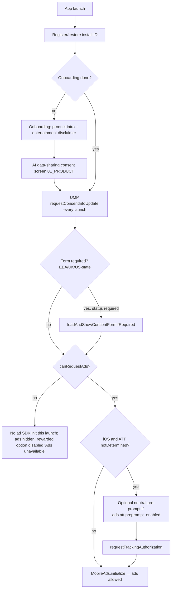

# 04 — Monetization: Credits, IAP, Ads, Consent

**Status:** Draft v1.0.1 (2026-09-26): review fixes applied (RC49–RC93, see `../phases/PHASE_01_SPEC_RECONCILIATION.md`). Owner: Volodymyr. Prefix: **MO**.
**Depends on:** `01_PRODUCT.md` (screens, flows, reading lifecycle), `02_ARCHITECTURE.md` (packages, ports, DI, bloc, storage), `03_BACKEND_WORKER.md` (endpoints, D1 schema, remote config transport, attestation), `05_COMPLIANCE_STORE_ASO.md` (store listings, privacy labels, age rating), `06_QUALITY_TESTING_CI.md` (coverage gate, CI, goldens).

---

## 1. Why this exists

Taro earns money from four sources that interact with each other and with store policy: a **free daily reading**, **consumable reading packs**, a **Remove Ads** non-consumable, and **AdMob ads** (banner + optional rewarded). Each source can double-grant, lose a paid purchase, leak free readings, or trigger a store rejection (Apple 3.1.1, 3.1.2, 5.1.1, 5.1.2(i), 4.3; Play Payments, Ads and Families policies). This spec is the single source of truth for:

- what is sold, for how much, and how many readings each thing grants;
- who decides a grant (always the Worker for credits, always the store for Remove Ads);
- the client IAP/ads/consent services and their state machines;
- the paywall/store UX rules that keep us out of dark-pattern territory;
- every remote-config knob that tunes monetization, with type, default and safe range;
- the analytics funnel and KPIs used to tune those knobs after launch.

`quiz_apps`' `StoreIAPService` is the reference for store-side robustness (pending / Ask to Buy, redelivery, dedupe, finish-after-grant, Remove Ads revocation). It had **no server verification** and **no UMP**; both are mandatory here.

## 2. Scope / Non-goals

**In scope (v1)**
- Product catalogue, store configuration, suggested pricing.
- Reading-credit model: free daily, rewarded, paid buckets; consumption order; refunds of consumed credits.
- Client: `IapPort` + `StoreIapAdapter`, `PurchaseCoordinator`, `CreditsRepository`, `RemoveAdsEntitlement`, `AdsPort` + AdMob adapter (banner, rewarded), `ConsentCoordinator` (UMP + ATT), `ReadingGate`, paywall / store / out-of-readings UI states.
- Worker-side monetization logic: purchase verification, rewarded SSV, store notifications (refund / revoke), ledger rules. Endpoint and table **names** are fixed here; transport, auth, D1 DDL and deployment belong to `03_BACKEND_WORKER.md`.
- Remote config keys for every monetization knob.
- Analytics events and KPIs for the funnel.

**Non-goals (v1)**
- **Subscriptions** (see MO3).
- **Interstitial ads** and app-open ads (see MO9).
- Web / desktop purchases, promo codes, offer codes, win-back offers, introductory pricing.
- Server-side Remove Ads entitlement (the store is the entitlement source, MO7).
- Cross-device credit sync without an account (only support-assisted transfer, §12.9).
- Mediation networks other than AdMob.
- Apple Consumption API responses to `CONSUMPTION_REQUEST` (Open question Q3).

## 3. Locked decisions

| ID | Decision | Why |
|---|---|---|
| MO1 | **The Worker ledger is the only source of truth for reading credits** (paid + rewarded buckets and free-daily usage). The client shows a cached `CreditState` and never grants or debits locally. | No accounts; client state is trivially tampered with; reinstall must not reset free readings or restore spent credits. |
| MO2 | **Credits per product are defined in Worker code (`PRODUCT_CATALOG`), not remote config.** Remote config may only enable/disable, reorder and badge packs. Changing a pack size requires a **new product ID**. | Store listings say "10 readings"; a remote change of the grant would contradict the listing (Apple 2.3.1 / Play misleading-claims) and silently alter what was bought. |
| MO3 | **No subscriptions in v1.** Consumable packs + Remove Ads only. | Pay-per-reading maps to the value unit; avoids 3.1.2 disclosure surface and renewal / grace / billing-retry state without accounts; `asa` cannot create iOS subscriptions (CONTEXT §5). Revisit as "Taro Plus" once retention data exists (Q1). |
| MO4 | **One reading costs exactly one credit, for every spread.** There is no per-spread cost override in config (RC62). | Simple, honest price communication; no "this spread costs 3" surprises after the user has chosen; pack names ("10 Readings") stay true. |
| MO5 | **Consumption order: free daily → rewarded → paid.** | Users never burn a paid credit while a free one is available; paid credits are the most valuable to the user. |
| MO6 | **A credit is consumed only when a reading is successfully generated and delivered.** The Worker *reserves* a credit with the pre-draw hold (`POST /v1/readings/holds`, on Begin, before the shuffle; RC50), *commits* on success, and *releases* on hold expiry, failure, moderation refusal, timeout or non-delivery (RC51). | Contract; a refused, failed or lost reading must never cost the user. The pre-draw hold also makes the paywall-before-draw rule hold under races. |
| MO7 | **Remove Ads entitlement comes from the store** (StoreKit 2 current entitlements / Play `queryPurchases`), cached locally in secure storage; the Worker is not consulted. | Restorable by the store on any device of the same store account; no server state to lose; a spoof only hides our own ads. |
| MO8 | **Consumable transactions are finished / consumed only after the Worker confirms the grant** (`granted` or `already_granted`). Until then they stay unfinished and are retried. On Android `autoConsume: false`; consume happens explicitly after the grant. | Store redelivers unfinished transactions; Play auto-refunds unacknowledged purchases after 3 days, which is the correct fallback if the Worker never grants. Lesson from `quiz_apps` `_finishConsumable`. |
| MO9 | **Ad formats in v1: anchored adaptive banner + user-initiated rewarded. No interstitials, no app-open ads, no rewarded interstitials.** | Interstitials interrupt a reflective flow, are a common reviewer complaint for this category and raise 4.3 "low quality" risk; revenue is expected from IAP. Re-evaluate only with data (Q2). |
| MO10 | **Rewarded grants happen only via AdMob Server-Side Verification to the Worker**, bound to a Worker-issued `RewardIntent`. `onUserEarnedReward` on the client never grants. | Client callbacks are spoofable; SSV is signed by Google (ECDSA). |
| MO11 | **Banner ads are allowed only on screens in a hard-coded allow-list** (§8); remote config can narrow the list, never widen it. Banners never overlay content, never appear inside or over reading text, and never on onboarding, consent, paywall/store, draw, refusal/crisis, or import/export screens. | Policy (AdMob "ads near content/accidental clicks"), 4.3 quality, and reviewer perception. A config mistake must not put an ad on the crisis-resources screen. |
| MO12 | **Consent order: onboarding → AI data-sharing consent (`01_PRODUCT.md`) → UMP → ATT (iOS) → `MobileAds.initialize()`**. No ad SDK request before UMP says `canRequestAds`. | Google UMP requirement for EEA/UK/US-state; Apple ATT before any tracking; we want the user to see the product before any consent wall. |
| MO13 | **Paywall appears before the draw**, never after cards are revealed, and always offers a free path (tomorrow's free reading, rewarded ad when available). | Contract + Apple/Play dark-pattern guidance; CONTEXT §3.9. |
| MO14 | **Free daily readings minimum is 1** (config range 1–5). | Store descriptions promise a daily free reading; `0` would make the listing misleading. Worker config validator rejects `0`. |
| MO15 | **Purchases are bound to the install through the Worker's `purchaseBinding`** (03 §6.1, RC9): iOS `appAccountToken = purchaseBinding.appleAccountToken` (a UUIDv5 the Worker derives), Android `obfuscatedAccountId = purchaseBinding.playAccountId` (an HMAC). The raw install ID is never given to a store. On iOS a token bound to another active install blocks the claim (RC85); on Android first valid claim wins. | Lets the Worker attribute store notifications (refunds, late Play cash payments) and reject replay of iOS transactions, without exposing the install ID. |
| MO16 | **Refunded consumables are clawed back; the paid bucket may go negative.** Free daily and rewarded readings remain usable. **While `paid < 0`, pack purchases are disabled** (`purchasesAllowed = false`, reason `refundDebt`) with a neutral explanation and support link, so nobody pays for a pack that only repays a debt (RC66). Always on; not a config key (RC82). | Stops buy → use → refund abuse without charging the user for readings they cannot use (Apple 3.1.1, consumer law). |
| MO17 | **Remove Ads Family Sharing: enabled on iOS.** Consumables are never family-shareable (Apple rule). | Good-will for a cheap non-consumable; revocation (`REVOKE`) is handled by the store entitlement check (MO7). Irreversible in App Store Connect — deliberate. |
| MO18 | **All prices shown come from the store's localized `ProductDetails`**; nothing hard-coded. Per-reading price is derived from `rawPrice` / `currencyCode`. "Best value" badge is computed, never asserted. | 3.1.1 price clarity; avoids false claims across 175 storefronts. |

## 4. Product catalogue

All IDs are fully qualified (`quiz_apps` rule): `com.vshyrochuk.taro.<suffix>`. Same IDs on App Store and Google Play.

| Product ID | Type | Grants | Family Sharing | Review note |
|---|---|---|---|---|
| `com.vshyrochuk.taro.readings_3` | Consumable | 3 paid credits | n/a | Entry pack |
| `com.vshyrochuk.taro.readings_10` | Consumable | 10 paid credits | n/a | Default "popular" position |
| `com.vshyrochuk.taro.readings_30` | Consumable | 30 paid credits | n/a | Best per-reading price |
| `com.vshyrochuk.taro.remove_ads` | Non-consumable | Hides banner ads | iOS: on | Rewarded ads remain optional |

**`PRODUCT_CATALOG`** (Worker, `worker/src/monetization/catalog.ts`, versioned in git):

```ts
export const PRODUCT_CATALOG = {
  'com.vshyrochuk.taro.readings_3':  { kind: 'consumable', credits: 3 },
  'com.vshyrochuk.taro.readings_10': { kind: 'consumable', credits: 10 },
  'com.vshyrochuk.taro.readings_30': { kind: 'consumable', credits: 30 },
  'com.vshyrochuk.taro.remove_ads':  { kind: 'non_consumable' },
} as const;
```

The client has a mirror `TaroProducts` constant (IDs + kind only, **no credit counts** — the UI shows credits from `GET /v1/config` `monetization.packs[*].credits`, which the Worker fills from `PRODUCT_CATALOG`, so the two can't disagree). A CI test in the worker asserts that the config builder and catalog agree; a Dart test asserts the client ID list equals the catalog's keys (via a generated JSON fixture, see §14).

**Store metadata** (created with `asa`, see `05_COMPLIANCE_STORE_ASO.md`): display name "3 Readings" / "10 Readings" / "30 Readings" / **"Remove Banner Ads"** (RC80; ≤ 30 chars in all 12 locales, checked by `check_store_copy.py`); descriptions state *"Adds N AI tarot readings to this app on this device. Readings don't expire."* and for Remove Banner Ads *"Removes banner ads. Optional reward videos stay available."* Localized into all 12 locales. Review screenshot: the store screen. The product ID stays `com.vshyrochuk.taro.remove_ads`.

### 4.1 Pricing suggestions (USD base, store auto-equalizes other storefronts)

| Product | Price | Per reading | Net @15% (Small Business / Play 15% tier) |
|---|---|---|---|
| `readings_3` | $1.99 | $0.66 | $0.56 / reading |
| `readings_10` | $4.99 | $0.50 | $0.42 / reading |
| `readings_30` | $9.99 | $0.33 | $0.28 / reading |
| `remove_ads` | $3.99 | — | — |

Rationale: AI cost per reading is budgeted at ≤ $0.05 (`03_BACKEND_WORKER.md` owns the model/cost estimate), leaving ≥ 80% margin on the cheapest per-reading price. Enroll in **App Store Small Business Program** and Play's 15% tier before launch. Price changes after launch are done in the store consoles (no code change) and logged in `docs/CHANGELOG.md`.

## 5. Credit model

### 5.1 Buckets

| Bucket | Source | Expires | Stored as |
|---|---|---|---|
| `free` | `monetization.free_daily_readings` per local day | Unused ones lapse at the install's local midnight (not carried over) | Derived: `free_daily_readings − count(debits with bucket='free' in current local day)` |
| `reward` | Rewarded ad SSV grants | Never | Ledger entries |
| `paid` | Verified consumable purchases | Never | Ledger entries |

Free readings not accumulating is disclosed on the out-of-readings sheet ("1 free reading every day") and is not a dark pattern because it is never presented as a balance the user "loses".

### 5.2 Ledger entries (logical; DDL in `03_BACKEND_WORKER.md`, table `ledger_entries`)

| `kind` | Bucket | Delta | Idempotency key |
|---|---|---|---|
| `grant_purchase` | paid | +credits | `store:transaction_id` (Apple `transactionId`, Play `orderId`, fallback `purchaseToken`) |
| `grant_reward` | reward | +`readings_per_ad` | `admob:transaction_id` |
| `reserve_reading` | free/reward/paid | −1 (pending) | `reading:<readingRequestId>` |
| `commit_reading` | — | 0 (marks reservation final) | same |
| `release_reading` | — | +1 (voids reservation) | same |
| `revoke_refund` | paid | −credits of refunded txn | `refund:<store>:<transaction_id>` |
| `revoke_refund_reversed` | paid | +credits (Apple `REFUND_REVERSED`) | `refund_reversed:<transaction_id>` |
| `admin_adjust` | any | ± | `admin:<ticket_id>` (support tool, §12.9) |

Every write is a single D1 transaction that inserts the entry with a `UNIQUE(idempotency_key)` constraint and returns the resulting `CreditState`; a unique-violation returns the existing outcome (`already_granted`).

### 5.3 `CreditState` (response body of `GET /v1/credits` and embedded in every mutating monetization response)

```json
{
  "paid": 7,
  "reward": 1,
  "freeRemainingToday": 0,
  "freeDailyLimit": 1,
  "nextFreeResetAt": "2026-09-27T21:00:00Z",
  "rewarded": { "enabled": true, "usedToday": 2, "maxPerDay": 3, "nextEligibleAt": "2026-09-26T18:05:00Z" },
  "serverTime": "2026-09-26T18:00:12Z",
  "ledgerVersion": 412
}
```

`paid` may be negative (MO16). `ledgerVersion` is `installs.state_version` (03 §5.1, RC67): it increases on every change for the install, including free-allowance consumption. The client accepts a response only if its `ledgerVersion ≥` the cached one, and replaces the cache on a strictly greater version or on an equal version with newer `serverTime` (out-of-order resume/launch syncs). The client computes countdowns as `nextFreeResetAt − (serverTime + elapsedSinceResponse)` using a monotonic clock — device wall-clock changes cannot move the countdown or the reset.

### 5.4 Day boundary

Worker computes the current local day from **server UTC time** and the install's registered IANA timezone (`installs.timezone`). `PATCH /v1/install/timezone` is accepted at most once per `monetization.timezone_change_cooldown_hours` (24); rejected changes return `429 timezone_change_throttled` and the old zone stays. DST is handled by the IANA rules (a 23h or 25h day is still one day). Travelling east to reach midnight earlier gives at most one extra free reading per 24h — accepted.

### 5.5 Reading gate

`ReadingGate.evaluate(CreditState, RemoteConfig) → ReadingGateDecision` (pure function, client):

```dart
sealed class ReadingGateDecision {
  const factory ReadingGateDecision.allowed(CreditBucket bucket) = GateAllowed;
  const factory ReadingGateDecision.outOfReadings({
    required bool rewardedAvailable, // enabled && usedToday < max && now >= nextEligibleAt && canRequestAds
    required DateTime nextFreeResetAt,
    required bool storeAvailable,
  }) = GateOutOfReadings;
  const factory ReadingGateDecision.unknown() = GateUnknown; // no cached state and offline
}
```

The gate is evaluated when the user taps **Begin** on the question screen, **before** the shuffle / draw animation. The Worker is then asked for a **pre-draw hold** (`POST /v1/readings/holds`, 03 §9.0, RC50). If the cache was stale, the hold returns `402 INSUFFICIENT_CREDITS` with a fresh balance, and the out-of-readings sheet opens before anything is drawn. Only in the rare case of a lost hold (expired and not renewable) can the sheet appear after the pick; then the cards stay face-down and are reused after a purchase (§12.1). The typed question and chosen spread survive the sheet.

## 6. Client architecture

Package placement is decided by `02_ARCHITECTURE.md`; this spec refers to the **monetization module** (`packages/taro_monetization` unless 02 says otherwise). Everything external is behind a port with `Fake*` (scriptable, for tests) and `NoOp*` implementations.

```
taro_monetization/lib/src/
  catalog/        taro_products.dart, product_offer.dart (store product + credits + perReadingPrice + badge)
  config/         monetization_config.dart (typed view of remote config, defaults, clamping)
  credits/        credit_state.dart, credits_repository.dart, credits_sync_service.dart, reading_gate.dart
  iap/            iap_port.dart, store_iap_adapter.dart, fake_iap_adapter.dart, noop_iap_adapter.dart,
                  purchase_coordinator.dart, purchase_outcome.dart, pending_purchase_tracker.dart,
                  unverified_purchase_queue.dart, remove_ads_entitlement.dart
  ads/            ads_port.dart, admob_ads_adapter.dart, noop_ads_adapter.dart, fake_ads_adapter.dart,
                  banner_policy.dart, banner_slot.dart (widget), rewarded_controller.dart
  consent/        consent_port.dart (UMP), ump_consent_adapter.dart, att_port.dart, att_adapter.dart,
                  consent_coordinator.dart, consent_state.dart
  worker_api/     monetization_api.dart (port), http_monetization_api.dart, fake_monetization_api.dart
  analytics/      monetization_events.dart (sealed typed events)
  ui/             store_bloc.dart, out_of_readings_bloc.dart, store_screen.dart, out_of_readings_sheet.dart
```

### 6.1 `IapPort` (thin store wrapper; the only file importing `in_app_purchase` is `store_iap_adapter.dart`)

```dart
abstract interface class IapPort {
  Future<bool> isAvailable();
  Future<List<StoreProduct>> queryProducts(Set<String> ids);   // localized price, rawPrice, currencyCode
  Future<void> buy(String productId, {required String accountToken, required bool consumable}); // accountToken = purchaseBinding value (MO15)
  Stream<List<StoreTransaction>> get transactions;              // every delivery: purchased, restored, pending, error, cancelled
  Future<void> finish(StoreTransaction tx);                     // completePurchase (+ consume on Android for consumables)
  Future<OwnershipSnapshot> queryOwnership();                   // silent: SK2 currentEntitlements / Play queryPurchases
  Future<OwnershipSnapshot> restore();                          // user-initiated "Restore purchases"
}
```

`StoreTransaction` carries `productId`, `transactionId`, `purchaseToken` (Android), `verificationData` (iOS JWS `signedTransaction`, Android token), `status`, `isRestored`, `deliveryId = transactionId ?? purchaseToken`.

`buy` passes `PurchaseParam(applicationUserName: …)` with `purchaseBinding.appleAccountToken` on iOS (StoreKit 2 → `appAccountToken`) and `purchaseBinding.playAccountId` on Android (→ `obfuscatedAccountId`) (MO15, RC9). Consumables use `buyConsumable(autoConsume: Platform.isIOS)` (StoreKit requires `true`; Android consumes explicitly in `finish`) — same reasoning as `quiz_apps`.

### 6.2 `PurchaseCoordinator` (the heart; subscribes to `IapPort.transactions` **at construction**, before UI exists)

Per consumable delivery:

1. `deliveryId` in-flight set → drop concurrent duplicates (stream + in-call redelivery).
2. Status `pending` → `PendingPurchaseTracker.markPending(productId)`; emit `PurchaseOutcome.pending`; **do not** call the Worker.
3. Status `purchased`/`restored` → persist to `UnverifiedPurchaseQueue` (sqflite table `unverified_purchases`: delivery_id PK, product_id, platform, verification_data, first_seen_at, attempts, last_error) **before** any network call, so a kill mid-verify is recoverable even if the store were slow to redeliver.
4. `MonetizationApi.verifyPurchase(...)` →
   - `granted` / `already_granted` → `IapPort.finish(tx)`, delete from queue, update `CreditsRepository` with returned `CreditState`, settle tracker, emit `PurchaseOutcome.granted(credits, isFirst)` (analytics revenue event fires only for `granted`).
   - `pending` (Play cash / pending state server-side) → keep unfinished; tracker stays pending.
   - `rejected` (invalid signature, wrong bundle/package, unknown product, sandbox tx in production, already refunded) → finish the transaction (it will never be valid), delete from queue, emit `PurchaseOutcome.failed(verificationRejected)`, log non-fatal. *Never* finish on a transport error.
   - network / 5xx / timeout → keep unfinished and queued; emit `PurchaseOutcome.verificationDeferred`; retry with backoff (2s, 10s, 60s, then on every launch/resume/connectivity-regained) until `monetization.purchase.verify_retry_window_hours` (72) has passed, then keep retrying on launch only and raise a `iap_verify_stuck` analytics event. Android auto-refunds after 3 days unacknowledged — the correct user outcome if we cannot grant.
5. Status `error` / `canceled` → settle tracker; emit `failed(reason)` / `cancelled`.

Non-consumable (`remove_ads`) delivery: `RemoveAdsEntitlement.set(true, source: purchase)` → persist → `finish(tx)`. No Worker call.

`PurchaseOutcome` (sealed): `granted`, `alreadyGranted`, `pending`, `cancelled`, `failed(PurchaseFailure reason)`, `verificationDeferred`, `notAvailable`, `alreadyOwned`.

The coordinator also runs `drainQueue()` on: app launch (after install registration), `AppLifecycleState.resumed`, connectivity-regained. Idempotent: the Worker dedupes by transaction id, the queue by delivery id.

### 6.3 `PendingPurchaseTracker`

Reused concept from `quiz_apps`: in-memory map productId → since; settles on completed/cancelled/failed; lapses after `monetization.purchase.pending_hold_minutes` (30). While a pack is pending, its button shows "Waiting for approval" and is disabled. Other packs stay purchasable.

### 6.4 `RemoveAdsEntitlement`

- Persisted flag + `lastConfirmedAt` in secure storage (`remove_ads_entitlement`).
- On launch: read cache (instant, so a paying user never sees a banner flash), then `IapPort.queryOwnership()` with a 10 s bound. If the store answers **and** the snapshot lacks `remove_ads` → set `false` (refund, revoke, Family Sharing stopped). If the store doesn't answer → keep cache (never revoke on silence). This is `quiz_apps`' `RemoveAdsOwnershipSource` lesson.
- `Stream<bool> changes` drives `BannerPolicy`. Banner preload waits up to 2 s for the first ownership answer when the cache says `false` (a reinstalled owner shouldn't see an ad) — `whenOwnershipLoaded()` pattern.
- **Restore Purchases** button (Store screen + Settings) calls `IapPort.restore()`; result message: "Remove Ads restored" / "No purchases to restore. Reading packs are tied to this app installation and can't be restored." (honest; consumables are not restorable by design).

### 6.5 `CreditsRepository` / `CreditsSyncService`

- `CreditsRepository` holds the latest `CreditState` (memory + sqflite cache for offline display), exposes `Stream<CreditState>`, ignores stale `ledgerVersion`.
- `CreditsSyncService.sync()` = `GET /v1/credits`; called on launch, on resume (contract), after any purchase/reward/reading response, and when the timezone is re-registered. Coalesces concurrent calls into one in-flight future. Resume sync is throttled to once per 30 s but always runs if `now >= nextFreeResetAt`.

### 6.6 Ads (`AdsPort`, `AdMobAdsAdapter`)

```dart
abstract interface class AdsPort {
  Future<void> initialize();                         // only after ConsentCoordinator.canRequestAds
  Future<BannerHandle?> loadBanner({required String screenId, required double width});
  Future<RewardedLoadResult> loadRewarded({required String intentId}); // SSV options: userId = customData = intentId (RC56)
  Future<RewardedShowResult> showRewarded();         // earned | dismissedEarly | failedToShow
}
```

- Ad unit IDs come from build config (`config/secrets.json`, per platform, test IDs in debug), not remote config.
- `BannerSlot(screenId:)` widget reserves a fixed-height region **outside** the scrollable content (a `Column` sibling below the scroll view, above the bottom safe area / nav bar). It renders `SizedBox.shrink()` when `BannerPolicy.shouldShow(screenId)` is false, collapses when the load fails (no empty grey box), and never animates over content.
- `BannerPolicy.shouldShow(screenId)` = `ads.banner.enabled && screenId ∈ (kBannerAllowList ∩ ads.banner.screens) && !removeAds && consent.canRequestAds && completedReadings >= ads.banner.min_completed_readings`, with `kBannerAllowList = {home, journal_list, learn_library}` (RC18). Readings are non-streaming and never show banners.
- Rewarded: loaded lazily when the out-of-readings sheet opens (if eligible), not preloaded app-wide (avoid wasted fills). Expires after 1 h per AdMob guidance.

### 6.7 `ConsentCoordinator` (UMP + ATT)

State: `ConsentState { umpStatus, canRequestAds, privacyOptionsRequired, attStatus }`. Runs once per launch (UMP requires `requestConsentInfoUpdate` every launch) and exposes `Future<void> whenResolved`. Settings shows **"Privacy choices"** when `privacyOptionsRequired` (UMP `showPrivacyOptionsForm`) — mandatory for EEA/UK. See §10 for order.

## 7. Worker monetization endpoints (names fixed here; transport/auth in `03_BACKEND_WORKER.md`)

All client endpoints require the install auth defined in 03 (install ID + request signature/attestation). Responses embed `CreditState` where marked.

| Method & path | Purpose | Attestation | Returns |
|---|---|---|---|
| `GET /v1/credits` | Current `CreditState` | no (auth only) | `CreditState` |
| `POST /v1/purchases/verify` | Verify a consumable and grant | **yes** | `{ status: granted \| already_granted \| pending \| rejected, reason?, creditsGranted?, isFirstPurchase?, credits: CreditState }` |
| `POST /v1/rewards/intents` | Ask to watch a rewarded ad; checks enabled/cap/cooldown; at most one open intent per install (a new one cancels the previous) | **yes** | `{ intentId, customData, userId, expiresAt }` (both SSV fields = `intentId`, RC56) or `409 REWARDED_DAILY_CAP {reason: cap\|cooldown}` |
| `GET /v1/rewards/intents/{intentId}` | Poll grant status | no | `{ status: issued \| granted \| cancelled \| expired \| rejected, credits?: CreditState }` |
| `POST /v1/rewards/intents/{intentId}/cancel` | Free the slot after a load failure, show failure or early dismissal (RC57) | no | `204` |
| `POST /v1/readings/holds` | (03 §9.0) pre-draw hold on Begin | yes | hold + `CreditState`; `402` |
| `GET /v1/ads/admob/ssv` | AdMob SSV callback (public, signature-verified) | n/a | `200` always after signature verification (AdMob retries non-200) |
| `POST /v1/webhooks/appstore` | App Store Server Notifications V2 | n/a (JWS verified) | `200` |
| `POST /v1/webhooks/googleplay` | Play RTDN via Pub/Sub push | n/a (Pub/Sub OIDC JWT verified) | `200` |
| `POST /v1/readings` | (03) generate reading; consumes the hold (commit/release) | yes | reading + `CreditState`; `409 HOLD_CONFLICT` only if the hold was lost |
| cron `voided-purchases` | Poll Play Voided Purchases API (every 6 h) | — | — |

**Verify request body:** `{ platform: "ios"|"android", productId, transactionId?, signedTransaction? (iOS JWS), purchaseToken? (Android), deliveryId }`.

**iOS verification:** verify the JWS `x5c` chain to **Apple Root CA – G3** (pinned in the Worker), signature ES256, then check `bundleId == com.vshyrochuk.taro`, `productId ∈ PRODUCT_CATALOG` and consumable, `environment` matches the Worker env (Sandbox allowed in staging, and in production for App Review — Apple reviews with sandbox receipts, so production accepts `Sandbox` transactions, tags them `environment='sandbox'`, excludes them from revenue KPIs and **caps them** at 30 credits per install and 1,000 credits globally per UTC day, RC63), `revocationDate` absent, `appAccountToken` equal to the caller's `purchaseBinding.appleAccountToken` **when present** (absent or unknown → first valid claim wins; bound to another active install → `409 PURCHASE_ALREADY_CLAIMED` with `transferEligible` and a `transferToken`, RC85). If the client has no JWS (StoreKit 1 fallback), the Worker calls App Store Server API `GET /inApps/v1/transactions/{transactionId}` and verifies the returned `signedTransactionInfo` the same way.

**Android verification:** Play Developer API `purchases.products.get(packageName, productId, token)` with the service account; require `purchaseState == 0` (1 → `rejected: canceled`, 2 → `pending`), `obfuscatedExternalAccountId == purchaseBinding.playAccountId` when present (a mismatch is logged, not blocking), `orderId` as idempotency key, `consumptionState == 0` *or* already present in `purchases` for this install (so a consumed-then-reverified token still returns `already_granted`). The Worker acknowledges server-side right after the grant (RC10); the client consumes after the `granted` response (MO8). Test purchases (`purchaseType == 0`) are tagged `is_test=1` and share the sandbox caps (RC63). A valid purchase is **always** granted, including for blocked or indebted installs; verify never returns `403` for a valid transaction (RC66).

**Server-side safety net:** App Store `ONE_TIME_CHARGE` and Play RTDN `ONE_TIME_PRODUCT_PURCHASED` notifications trigger the same grant routine when the install can be resolved from `appAccountToken` / `obfuscatedExternalAccountId`. This grants late Ask-to-Buy / cash purchases even if the client never returns; the client's later verify gets `already_granted`.

## 8. Banner placements

Screen IDs are defined in `01_PRODUCT.md`. `kBannerAllowList` is a compile-time constant and equals 01 PR13 (RC18): **`{home, journal_list, learn_library}`** (S05, S14, S16). Every other screen, including the spread picker, reading, journal entry and card detail, never shows a banner.

| Screen ID | Banner | Rule |
|---|---|---|
| `home` (S05, Today) | ✅ allowed | Bottom slot, below the scroll view, above the tab bar |
| `journal_list` (S14) | ✅ allowed | Bottom slot |
| `learn_library` (S16) | ✅ allowed | Bottom slot |
| everything else (spread picker, question, draw, reading, Classic reading, refusal, crisis, journal entry, card detail, onboarding, consent, ATT pre-prompt, store, out-of-readings sheet, settings, privacy, legal, export, import, report sheet) | ❌ | Not in the allow-list |
| Home-screen widget (v1.1) | ❌ | Not supported by AdMob; policy |

Additional rules: one banner per screen max; no banner in a bottom sheet or dialog; banner hidden when a modal is shown; the banner container keeps at least **`space.adGap` ≥ 16 dp** from any tap target (RC59; 05 §2, layout test in Phase 17.2); label "Ad" provided by AdMob creative is not overridden; banners are not shown to anyone until `ads.banner.min_completed_readings` (default 1) AI readings are completed (Classic readings do not count), so a first-time user's and App Reviewer's first session is ad-free until they have had their free reading.

## 9. Rewarded ads

### 9.1 Rules

- **User-initiated only**, offered in exactly two places: the out-of-readings sheet and the Store screen ("Watch an ad for 1 reading"). Never auto-played, never presented as the only option, never labelled as "free" without "watch an ad".
- Shown only if `ads.rewarded.enabled`, `usedToday < max_per_day`, `now >= nextEligibleAt` (cooldown), `consent.canRequestAds`, and the ad loaded. Otherwise the option is visible but **disabled with a reason** ("Available again in 4 min", "Daily limit reached — new ones tomorrow", "No ads available right now") — no hidden states that look like bugs to reviewers.
- Available to Remove Ads owners too (MO7; Remove Ads removes banners only; product description says so).
- Grant amount = the amount snapshotted on the intent when it was issued; `reward_amount` in the SSV payload is ignored.
- The rewarded credit goes to the `reward` bucket and does not expire.

### 9.2 SSV flow

```mermaid
sequenceDiagram
  autonumber
  participant U as User
  participant C as Client (RewardedController)
  participant W as Worker
  participant A as AdMob
  U->>C: Tap "Watch an ad for 1 reading"
  C->>W: POST /v1/rewards/intents (attested)
  W->>W: check enabled, cap, cooldown, rate-limit (KV)
  W-->>C: {intentId, customData = intentId, expiresAt (+15 min)}
  C->>A: RewardedAd.load(SSV userId=intentId, customData=intentId)
  A-->>C: loaded
  C->>U: show ad
  U-->>C: watches to completion (onUserEarnedReward)
  A->>W: GET /v1/ads/admob/ssv?...&user_id&custom_data&transaction_id&signature&key_id
  W->>W: verify ECDSA sig (keys from gstatic verifier-keys.json, KV-cached 24h)
  W->>W: ad_unit ∈ configured units; intent exists, unexpired, unused, user_id == custom_data (no cap/cooldown re-check)
  W->>W: INSERT grant_reward (idempotency admob:transaction_id), mark intent granted
  W-->>A: 200
  loop poll every 1.5s up to ads.rewarded.grant_poll_timeout_seconds
    C->>W: GET /v1/rewards/intents/{intentId}
    W-->>C: granted + CreditState
  end
  C->>U: "+1 reading added" → back to S07 with Begin enabled (no auto-start, RC58)
```

- If the poll times out: show "Your reward is on its way" and keep the out-of-readings sheet open with a spinner-free message; `CreditsSyncService` picks up the grant on next sync. The intent stays valid until `expiresAt`; late SSV callbacks within that window still grant.
- Signature failure, unknown key, ad unit mismatch → `200` with no grant (avoid AdMob retries), logged as `ssv_rejected{reason}`.
- Cap and cooldown are checked **only when the intent is issued** (03 §7, RC57). The cap counts granted rewards; one open intent at a time reserves the next slot. When the SSV callback arrives, the Worker grants **any valid, unexpired, unused intent**, even if the cap was lowered or a cooldown started meanwhile, because the user has already watched the ad (AdMob rewarded policy). The cooldown runs from the last grant.
- Dismissed early (no `onUserEarnedReward`), load timeout (`rewarded.loadTimeoutSec`, 10 s) or show failure → the client calls `POST /v1/rewards/intents/{intentId}/cancel` and does not poll. The slot is free immediately, so dismissed ads never count against the cap.

## 10. Consent: UMP + ATT



Rules:
- UMP runs **after** onboarding and AI consent on first launch (the product is shown first), and at the start of every later launch (non-blocking to the UI; ads just wait for it).
- `requestConsentInfoUpdate` uses `ConsentRequestParameters(tagForUnderAgeOfConsent: false)`; debug builds can force geography via `ConsentDebugSettings` from a hidden debug menu.
- UMP message configuration in AdMob console: GDPR message (EEA/UK/CH), US state regulations message, and the **IDFA explainer disabled** if our own pre-prompt is used (only one explainer). Default: use our own pre-prompt (localized via ARB, 12 locales) because it fits the design contract; Q4.
- ATT pre-prompt copy is neutral ("Allow tracking to see more relevant ads. You'll still get the same app either way."), single button "Continue" that leads to the system prompt; no "Not now" that skips the system prompt forever, no incentives, no blocking. Apple 5.1.1(iv).
- ATT denied or UMP non-consent → ads still serve **non-personalized / limited** via TCF string / no IDFA. The app is fully functional; rewarded ads still work (NPA).
- `NSUserTrackingUsageDescription` and SKAdNetwork IDs in `Info.plist` (list maintained in `apps/taro/ios/Runner/skadnetwork_ids.plist`, updated from Google's list; `05` checklists it).
- "Privacy choices" row in Settings re-opens UMP; "Tracking" row deep-links to iOS Settings.
- `tagForUnderAgeOfConsent: false` is justified because the Play target audience is 16+ and the app is not directed at children or EEA users under their digital-consent age (05 CS4, RC93); no mixed-audience flag.

## 11. Paywall / Store UX rules (compliance)

Surfaces: **out-of-readings sheet** (triggered by the gate) and **Store screen** (from Home "Readings" chip and Settings). Both show the same `ProductOffer` list.

| Rule | Detail |
|---|---|
| Before the draw | Gate evaluated on "Draw" tap before any card animation or reveal (MO13). |
| Free path always visible | Sheet shows "Your next free reading: in 5 h 12 min (at 00:00)" computed from server time; rewarded option if eligible. |
| Price clarity | Each pack: localized store price (`ProductDetails.price`), number of readings, per-reading price ("€0.50 per reading"). No fake strikethrough "was" prices. |
| Honest badge | "Best value" only on the pack with the lowest computed per-reading price; "Most popular" not used in v1 (unverifiable). |
| No preselection | Each pack is its own buy button; no default-selected pack, no single "Continue" button hiding which product is bought. |
| Close | Visible close (X) and system back/swipe work immediately; no delayed close, no countdown. Decline copy neutral: "Not now". No confirmshaming. |
| No fake urgency | No timers other than the real free-reset countdown; no "limited offer", no scarcity copy, no fear-based copy about the future ("don't miss what the cards say"). |
| Restore | "Restore purchases" link on Store screen and in Settings. |
| Legal | Links to Terms of Use (EULA) and Privacy Policy on the Store screen and sheet footer; the note "Readings are for entertainment and self-reflection." (`05` owns text). |
| Consumable disclosure | Footer: "Readings don't expire and are kept for this app installation. They can't be restored with Restore Purchases." |
| Remove Banner Ads copy | Title "Remove Banner Ads" (RC80); body "Remove banner ads — $3.99 once. Optional reward videos stay available." Hidden once owned; replaced by "Banner ads removed ✓". |
| States | `loading` (skeleton), `ready`, `storeUnavailable` ("Purchases aren't available on this device" — e.g. parental controls), `productsFailed` (retry), `purchasing(productId)` (that button spinner, others enabled), `pending(productId)` ("Waiting for approval"), `verificationDeferred` ("Payment received — adding your readings…"), `granted` (toast "+10 readings"; the sheet closes and returns to S07 with **Begin** enabled; nothing auto-starts, matching 01 F3, RC58), `failed(reason)` (localized, retry), `offline`, `purchasesBlocked(blocked \| refundDebt)` (pack buttons hidden, neutral line + support contact, RC66). |
| Kill switch | `monetization.store.enabled = false` hides pack buttons and shows only the free path (e.g., store outage or a pricing mistake). The same UI applies when `purchasesAllowed == false` (blocked install or refund debt, RC66). |
| No purchases in onboarding | Onboarding never shows prices or the Store. First paywall exposure is when the free reading is used. |
| Accessibility | Prices and buttons are Semantics-labelled ("10 readings for 4.99 US dollars, 50 cents per reading"); 48×48 targets; RTL mirrored (ar). |

Goldens for these states are listed in §14.

## 12. Edge cases

| # | Case | Behaviour |
|---|---|---|
| 12.1 | **Hold lost after the pick** (rare; the pre-draw hold expired and could not be renewed) | The drawn cards (CSPRNG, client) stay face-down in the pending reading; S10 opens; after a grant the same draw is submitted with the same `clientReadingId`. The Worker does not replay the earlier error; it runs a new attempt with a new hold (RC48, RC49, RC50). |
| 12.2 | **Offline purchase** | Store itself needs network; if the store charged but the Worker is unreachable: queued in `UnverifiedPurchaseQueue`, transaction unfinished, UI "Payment received — adding your readings…", retried on resume/connectivity. Readings cannot be generated offline anyway. |
| 12.3 | **Worker down** | Verify deferred as above; `GET /v1/credits` fails → cached state shown with "last updated" hint; `POST /v1/readings` fails → no credit consumed (MO6), friendly retry. Store screen still lists products (store data doesn't need the Worker) but purchases show a warning that credits will be added once the service is back. Alert fires when verify error rate > 2% for 10 min (03 runbook). |
| 12.4 | **Double tap on buy** | Button disabled on first tap (`purchasing`); `PendingPurchaseTracker`; store rejects parallel purchases of same product; Worker dedupes by transaction id. |
| 12.5 | **Double tap on Begin / retries** | `clientReadingId` UUID generated once per draw; the hold and the reading are keyed on it, and every hold/refund is a compare-and-set → at most one credit per attempt, and a failed attempt is refunded before the next one (RC52). |
| 12.6 | **Redelivery / crash between grant and finish** | Worker returns `already_granted`; coordinator finishes; revenue event not re-logged. |
| 12.7 | **Ask to Buy / Play slow payment** | `pending` state per product; parent declines → StoreKit is silent → lapses after 30 min hold; approved later → stream delivery or server notification grants (§7 safety net). |
| 12.8 | **Reinstall (iOS)** | Install ID in Keychain survives → same ledger → balance and used-free-today intact. Remove Ads restored by silent ownership check. |
| 12.9 | **Reinstall / new device (Android) or new iPhone without Keychain migration** | New install ID; paid balance not visible. Disclosed on paywall footer. Support path (03 §6.6, RC84): Settings → Help → "Move readings from another device" re-submits the user's past purchases from the same store account to `POST /v1/purchases/verify`; a transaction claimed by the old install returns `409 PURCHASE_ALREADY_CLAIMED` with a single-use `transferToken`, shown as a transfer code. The user emails the code; the owner runs `worker/scripts/credits-transfer.ts`, which moves `min(unspent paid of the old install, credits of the proven transactions)` with paired `admin_adjust` entries. There is no admin HTTP route and an order ID alone is never enough. Remove Banner Ads restores via the store. Free resources do not reset on the new install (device key, 03 §3.7). |
| 12.10 | **Device transfer with Keychain migration (iOS Quick Start / encrypted backup)** | Same install ID on two devices → they share one balance and one free reading per day. Acceptable; documented in FAQ. Attestation handling of a second device key is 03's concern. |
| 12.11 | **Family Sharing** | Consumables: not shareable. Remove Ads: family members get it via restore/ownership check; `REVOKE` → next ownership check drops it. |
| 12.12 | **Refund of a consumable (Apple)** | `REFUND` notification → `revoke_refund` of that transaction's credits (may go negative, MO16) → next sync shows it; client shows no accusatory message, just the balance. `REFUND_REVERSED` restores. |
| 12.13 | **Refund / chargeback (Play)** | RTDN `voidedPurchaseNotification` and the 6-hourly Voided Purchases API cron → `revoke_refund` keyed on `orderId`. |
| 12.14 | **Refund of Remove Ads** | Store entitlement disappears → banners return next launch. No Worker action. |
| 12.15 | **Clock tampering** | Irrelevant to grants: Worker uses server time. Client countdown uses server time + monotonic clock. Changing device timezone doesn't change the registered zone except via throttled `PATCH` (§5.4). |
| 12.16 | **Rewarded SSV delayed / lost** | Poll timeout message; grant arrives on later sync while intent is valid; lost callback (rare) = no grant, no cap consumed; `ssv_grant_lag_ms` monitored. |
| 12.17 | **Ad blocker / no fill** | Rewarded option disabled with "No ads available right now"; banner slot collapses. |
| 12.18 | **Sandbox purchases in production (App Review)** | Accepted and granted, tagged `environment='sandbox'`; excluded from KPIs; capped at `purchases.sandboxMaxCreditsPerInstallPerDay` (30) and `purchases.sandboxGlobalCreditsPerDay` (1,000), beyond which verify returns `422 PURCHASE_INVALID` `sandbox_cap` and the client finishes the transaction (RC63). Required: Apple reviews production builds with sandbox. Internal testers use `prodStaging` builds (staging Worker); public TestFlight links are never used. |
| 12.19 | **Price / currency not loaded** | Pack buttons disabled with "Prices unavailable — retry"; never show a hard-coded price. |
| 12.20 | **Store product missing / not approved yet** | Pack omitted from the list; if all missing → `productsFailed` state; logged. |
| 12.21 | **Negative paid balance** | Gate treats `paid ≤ 0` as none; Store shows balance as "0 readings" plus a neutral line "A refunded purchase was deducted" and a support link. **Pack purchases are disabled while `paid < 0`** (`purchasesAllowed = false`, `refundDebt`), so nobody pays for a pack that only repays a debt; free and rewarded readings keep working; support can settle the debt (RC66). |
| 12.22 | **Remote config unavailable** | Compiled `MonetizationConfig.defaults` (§13) used; Worker applies its own active config regardless. |
| 12.23 | **Verify returns an unexpected 401/403** (e.g. token revoked) | Purchases need no call attestation (RC11), and verify never returns 403 for a valid transaction (RC66). An auth error means re-register, then retry; the transaction stays unfinished meanwhile. Never finish on 401/403. |
| 12.24 | **Export / import** | Never contains credits, entitlements, install ID, pending purchases or reward intents (contract). Importing on a new install does not move credits (see 12.9). |
| 12.25 | **Timezone travel** | Client re-registers zone on launch/resume if `DateTime.now().timeZoneName`/IANA zone changed; throttled server-side. |

## 13. Remote config key catalogue (monetization + ads)

Delivered by `GET /v1/config` (transport, caching and ETag in `03_BACKEND_WORKER.md`; config is not signed, it is served over TLS from the Worker, RC82). Flat, namespaced keys. The Worker validates on publish (`tools/config_validate.ts`) and rejects out-of-range values; the client additionally clamps and logs `config_value_clamped`. Values the Worker enforces are read **server-side** from the same active config; the client copy is only for UI.

| Key | Type | Default | Range / values | Enforced by |
|---|---|---|---|---|
| `monetization.free_daily_readings` | int | 1 | 1–5 (MO14) | Worker |
| `monetization.timezone_change_cooldown_hours` | int | 24 | 12–168 | Worker |
| `monetization.store.enabled` | bool | true | — | Client (UI) + Worker (verify still accepted when false — never refuse to grant a paid txn) |
| `monetization.remove_ads.enabled` | bool | true | — | Client (hide offer; owners keep entitlement) |
| `monetization.packs` | list<object> | see below | 1–4 items; `productId ∈ PRODUCT_CATALOG` consumables | Client (display) |
| `monetization.packs[].productId` | string | — | catalog ID | — |
| `monetization.packs[].enabled` | bool | true | — | Client |
| `monetization.packs[].sortOrder` | int | 0..n | 0–9 | Client |
| `monetization.packs[].credits` | int | from catalog | **read-only, injected by Worker** | Worker |
| `monetization.paywall.show_best_value_badge` | bool | true | — | Client |
| `monetization.paywall.show_per_reading_price` | bool | true | — | Client |
| `monetization.purchase.verify_retry_window_hours` | int | 72 | 24–168 | Client |
| `monetization.purchase.pending_hold_minutes` | int | 30 | 5–240 | Client |
| `monetization.credits.resume_sync_throttle_seconds` | int | 30 | 0–600 | Client |
| `ads.enabled` | bool | true | — | Client (global kill switch; also disables rewarded) |
| `ads.banner.enabled` | bool | true | — | Client |
| `ads.banner.screens` | list<string> | all of `kBannerAllowList` | subset of `kBannerAllowList` (§8); unknown IDs ignored | Client |
| `ads.banner.min_completed_readings` | int | 1 | 0–10 | Client |
| `ads.rewarded.enabled` | bool | true | — | Worker + Client |
| `ads.rewarded.readings_per_ad` | int | 1 | 1–2 | Worker |
| `ads.rewarded.max_per_day` | int | 3 | 0–10 (0 ≡ disabled) | Worker |
| `ads.rewarded.cooldown_seconds` | int | 300 | 0–3600 | Worker |
| `ads.rewarded.intent_ttl_seconds` | int | 900 | 300–3600 | Worker |
| `ads.rewarded.grant_poll_timeout_seconds` | int | 20 | 5–60 | Client |
| `ads.rewarded.load_timeout_seconds` | int | 10 | 5–30 | Client (then `noFill` + cancel intent) |
| `ads.rewarded.allowed_ad_unit_ids` | list<string> | prod unit IDs | non-empty | Worker (SSV `ad_unit` check) |
| `ads.att.preprompt_enabled` | bool | true | — | Client (iOS) |

Default `monetization.packs`:
```json
[
  {"productId":"com.vshyrochuk.taro.readings_3","enabled":true,"sortOrder":0},
  {"productId":"com.vshyrochuk.taro.readings_10","enabled":true,"sortOrder":1},
  {"productId":"com.vshyrochuk.taro.readings_30","enabled":true,"sortOrder":2}
]
```

Not remote-configurable by design: credits per product (MO2), cost per reading (MO4, RC62), refund clawback (MO16), banner allow-list (MO11), interstitials (MO9), consent order (MO12), ad unit IDs on the client. RC8 maps these names onto 03's namespaces (`ads.rewarded.load_timeout_seconds` → `rewarded.loadTimeoutSec`).

## 14. Analytics funnel & KPIs

Typed sealed events (`MonetizationEvent`) through the analytics port from `02_ARCHITECTURE.md`; catalogued in `docs/ANALYTICS_EVENTS.md`. No free text, no question content, no install ID in params.

| Event | Params | Fired when |
|---|---|---|
| `reading_gate_evaluated` | `decision` (free/reward/paid/out), `spread_id` | Draw tapped |
| `free_reading_used` / `reading_credit_consumed` | `bucket` | Worker commit confirmed |
| `paywall_viewed` | `trigger` (gate/home_chip/settings/402), `rewarded_available`, `free_reset_in_min` | Sheet/Store shown |
| `paywall_dismissed` | `trigger`, `seconds_visible`, `action_taken` (none/purchase/reward) | Closed |
| `iap_products_loaded` | `count`, `ms`, `result` | Query done |
| `iap_purchase_started` | `product_id`, `price_micros`, `currency` | Buy tapped |
| `iap_purchase_pending` | `product_id` | Pending delivery |
| `iap_purchase_cancelled` / `iap_purchase_failed` | `product_id`, `reason` | Store result |
| `iap_verify_result` | `product_id`, `status`, `ms`, `attempt` | Worker answered |
| `iap_verify_stuck` | `product_id`, `hours` | Past retry window |
| `iap_purchase_completed` | `product_id`, `value`, `currency`, `credits`, `is_first_purchase` | **Only** on `granted` — revenue source of truth for analytics |
| `restore_completed` | `restored_remove_ads`, `result` | Restore finished |
| `remove_ads_changed` | `owned`, `source` (purchase/restore/ownership_check/revoked) | Entitlement flips |
| `rewarded_offer_shown` | `eligible`, `ineligible_reason` | Option rendered |
| `rewarded_started` / `rewarded_earned` / `rewarded_dismissed_early` | `placement` | Ad lifecycle |
| `rewarded_grant_confirmed` / `rewarded_grant_timeout` | `lag_ms` | Poll result |
| `ad_banner_impression` / `ad_banner_failed` | `screen_id`, `error_code` | Banner lifecycle |
| `consent_ump_result` | `status`, `form_shown`, `can_request_ads` | UMP done |
| `consent_att_result` | `status`, `preprompt_shown` | ATT done |
| `config_value_clamped` | `key` | Client clamp |

Worker-side metrics (D1 aggregates, `03` dashboards): grants by product/day, `ssv_rejected{reason}`, `ssv_grant_lag_ms` p50/p95, verify error rate, refunds/day, negative-balance installs, sandbox vs production.

**KPIs (targets for v1, reviewed at +30 days):**

| KPI | Target |
|---|---|
| Verify success rate (granted+already / all non-rejected verifies) | ≥ 99.5% |
| Verify p95 latency | < 1.5 s |
| SSV grant lag p95 | < 10 s |
| Payer conversion (installs → ≥1 purchase, 30 d) | 2–4% |
| Paywall → purchase CVR | ≥ 3% |
| Rewarded completion rate (started → earned) | ≥ 80% |
| Remove Ads attach rate among D7-retained | ≥ 1.5% |
| Refund rate (refunded txns / txns) | < 2% |
| Gross margin per paid reading (net revenue − AI cost) | ≥ 80% |
| ARPDAU (IAP + ads), D1/D7 retention | baseline; tuned via config |

## 15. Testing strategy (≥ 90% line coverage per `06_QUALITY_TESTING_CI.md`)

**Client (`taro_monetization`)**
- **Unit — pure logic (target ~100%)**: `ReadingGate`, `MonetizationConfig` parsing/clamping/defaults, `ProductOffer` per-reading price + best-value computation across currencies (JPY no decimals, KWD 3 decimals), `BannerPolicy` truth table (every screen × flags), `PendingPurchaseTracker` with injected clock, `CreditState` JSON + stale `ledgerVersion` rejection, countdown with server-time offset.
- **Unit — `PurchaseCoordinator`** with `FakeIapAdapter` (scriptable transaction stream) + `FakeMonetizationApi`: table-driven scenarios — happy path; pending → purchased; pending → silent (lapse); duplicate delivery in-flight; redelivery after "crash" (queue pre-populated); verify 5xx → deferred → retry → granted; `rejected` finishes; 403 never finishes; `already_granted` doesn't re-log revenue; Android consume only after grant; non-consumable path; restore batch without Remove Ads revokes; silent store keeps cache. Assertion: `finish()` is never called before a `granted/already_granted/rejected` response (property-style check over randomized event orders, seeded).
- **Unit — adapters**: `StoreIapAdapter` tested against a fake `InAppPurchasePlatform` / `InAppPurchasePlatformAddition` registered via the plugin platform interface; `AdMobAdsAdapter` and `UmpConsentAdapter` via method-channel mocks (`TestDefaultBinaryMessengerBinding`); `AttAdapter` via its platform interface. Adapters are not in the coverage exclusion list (only generated code is).
- **Unit — `ConsentCoordinator`**: order enforcement (no `AdsPort.initialize` before `canRequestAds`; ATT only on iOS after UMP), every UMP status × ATT status.
- **Bloc**: `StoreBloc`, `OutOfReadingsBloc` state sequences for every state in §11.
- **Widget**: store/sheet states, close button present in all states, Restore/Terms/Privacy links present, no pack preselected, Semantics labels, `BannerSlot` collapses and never overlaps (layout test asserting banner rect ∩ scroll viewport = ∅).
- **Golden** (light/dark × LTR(en)/RTL(ar) + one long-string locale (de)): Store `ready`, `pending`, `verificationDeferred`, `storeUnavailable`; out-of-readings sheet with rewarded eligible / cooldown / cap reached; Remove Ads owned; ATT pre-prompt.
- **Integration** (`apps/taro/integration_test`): free reading → Begin with zero balance → hold 402 → S10 before any draw → fake purchase → grant → back to S07 → Begin → hold → reading; hold-lost path keeps the cards face-down and reuses them; rewarded flow with fake SSV grant and a cancelled intent; reinstall simulation (same install ID) keeps balance.

**Worker (vitest + `@cloudflare/vitest-pool-workers`/miniflare, D1 + KV bindings)**
- JWS verification with a **test root CA** generated in fixtures (production pins Apple Root G3; root is injected via env in tests): valid, bad signature, wrong root, wrong bundle, unknown product, revoked, sandbox-in-prod tagging and caps, appAccountToken bound to another active install (409 + `transferToken`), blocked install still granted.
- Play verification with a fake `PlayDeveloperApi` port: states 0/1/2, obfuscated ID mismatch, consumed-and-known.
- SSV with generated ECDSA P-256 keys and a fake key-fetcher: valid, tampered query, unknown `key_id`, wrong ad unit, expired/used intent, **intent issued under the cap is honoured after a cap reduction**, cancelled intent within/after the 2-minute grace, duplicate `transaction_id`; intents: three cancelled intents keep the install eligible, cooldown measured from the last grant.
- Webhooks: `REFUND`, `REFUND_REVERSED`, `REVOKE`, `ONE_TIME_CHARGE`, `TEST`; Play RTDN purchased/voided; voided-purchases cron.
- Ledger invariants: idempotency (same key twice → one row), concurrent holds on the last credit (two parallel `POST /v1/readings/holds` → one `402`), hold/commit/release with CAS, 402 → grant → same `clientReadingId` → 200, negative balance → `purchasesAllowed=false`, day boundary across DST and timezone change throttling with a fake clock.
- Catalog/config agreement test; config validator range tests for every key in §13; a generated `worker/test/fixtures/product_ids.json` consumed by the Dart test that checks `TaroProducts`.

**Manual release checklist** (`06`): StoreKit Configuration file (`apps/taro/ios/Taro.storekit`) local tests incl. Ask to Buy & refund simulation; App Store sandbox; Play license testers incl. "slow test card" (pending) and "declined"; AdMob test devices with SSV "Verify URL"; UMP debug geography EEA; ATT allow/deny.

## 16. Risks

| Risk | Mitigation |
|---|---|
| Apple rejects Remove Ads + rewarded ("still has ads after purchase") | Product named "Remove Banner Ads" in all 12 locales and in-app (RC80); description "Optional reward videos stay available"; rewarded strictly optional; review notes explain. |
| Guideline 5.1.1(iv)/ATT pre-prompt judged manipulative | Neutral copy, single path to system prompt, no incentive; can be disabled via `ads.att.preprompt_enabled`. |
| SSV callbacks delayed or failing → users watch ads and get nothing | Intent TTL, poll + later sync, lag monitoring, alert on `ssv_rejected` spike; support can `admin_adjust`. |
| Worker outage blocks grants | Unfinished transactions persist; Play auto-refund after 3 days as last resort; status alerting; Cloudflare global availability. |
| Consumables lost on Android reinstall → 1-star reviews | Up-front disclosure; support transfer tool; consider Play Integrity device recall (Q5). |
| Free-reading abuse via Android reinstall | New install requires attestation; the free allowance and rewarded cap are keyed on an `ANDROID_ID`-derived device key in D1 (03 §3.7, RC53), so a reinstall or "Clear storage" gets no second free reading that day; iOS uses DeviceCheck bits. |
| Refund abuse (buy, use, refund) | Negative balance clawback; refund-rate KPI; Apple consumption info later (Q3). |
| `in_app_purchase` StoreKit 2 path differences (JWS availability, `appAccountToken` mapping) | Worker also supports transaction-ID lookup; adapter tests against the platform interface; verify on device before phase sign-off. |
| AdMob policy strike for placement | Hard-coded allow-list, gap tokens, no banners in sheets/dialogs, layout test. |
| Config mistake (e.g., rewarded cap 100) | Publish-time validator + client clamp + Worker enforcement. |

## 17. Open questions (defaults chosen)

| # | Question | Default |
|---|---|---|
| Q1 | Add a "Taro Plus" subscription (unlimited readings / extra spreads)? | **No for v1.** Revisit at +60 days if payer conversion < 2% or repeat-purchase rate is high; would need `asa` subscription support. |
| Q2 | Add interstitials (e.g., after closing a reading, capped)? | **No.** Only if ad ARPDAU is < 30% of target after 60 days, and then via a new spec amendment with a frequency-cap policy. |
| Q3 | Respond to Apple `CONSUMPTION_REQUEST` with consumption data? | **Not in v1** (requires explicit user consent to share). Log requests; decide with refund-rate data. |
| Q4 | Own ATT pre-prompt vs UMP IDFA explainer? | **Own pre-prompt** (localized, matches design); UMP IDFA explainer disabled. |
| Q5 | How do we stop free-reading farming across Android reinstalls? | **`ANDROID_ID`-derived device key in v1** (03 §3.7, RC53): free allowance and rewarded cap are per device and per install. Play Integrity device recall is revisited once GA. Paid credits stay install-bound (support transfer, §12.9). |
| Q6 | Pack sizes 3/10/30 vs 5/15/40? | **3/10/30** at $1.99/$4.99/$9.99; A/B only via new product IDs later. |
| Q7 | Should rewarded be offered while the user still has a free reading? | **No** — only when out of free readings (gate) or from the Store screen. |
| Q8 | Remove Ads Family Sharing on? | **Yes** (MO17), accepting it can't be turned off. |
| Q9 | Should reward credits expire at midnight? | **No** — simpler, honest; daily cap already limits volume. |
| Q10 | Show paid balance on Home? | **Yes**, as a small "N readings" chip opening the Store (01 places it). |

## 18. Cross-spec contract (others must honour)

- **03_BACKEND_WORKER**: implement endpoints in §7 with these names; the ledger and table names are 03's (RC7); pre-draw hold and reserve/commit/release semantics (MO6) keyed by `clientReadingId` + attempt; config keys of §13 served from KV with the validator; `PRODUCT_CATALOG` in `worker/src/monetization/catalog.ts`; support transfer as an owner-run script with `transferToken` proof (no admin route, RC84); sandbox caps (RC63); `purchasesAllowed` (RC66); Apple Root CA G3 pinning; Pub/Sub OIDC verification; voided-purchases cron.
- **01_PRODUCT**: screen IDs used in §8; paywall is before the draw; balance chip; "Support ID" in About; out-of-readings sheet and Store screen exist.
- **02_ARCHITECTURE**: hosts the monetization module; provides analytics port, secure storage port (install ID, Remove Ads cache), sqflite for `unverified_purchases` and credit cache, lifecycle-resume hook, connectivity signal.
- **05_COMPLIANCE_STORE_ASO**: IAP metadata strings (§4), Remove Ads wording, Family Sharing on for Remove Ads, SKAdNetwork IDs, ATT usage string, privacy labels / Data Safety declare AdMob (device ID, advertising data) and purchase history; review notes describe free reading, rewarded optional, sandbox.
- **06_QUALITY_TESTING_CI**: goldens and manual checklist of §15; `.storekit` config file committed.
