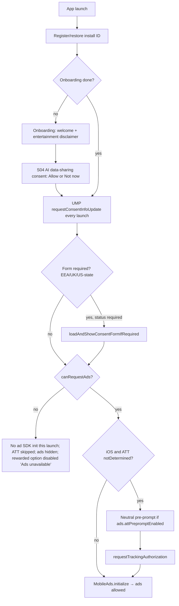

# 04 — Monetization: Credits, IAP, Ads, Consent

**Status:** v1.1 reconciled (2026-09-27). Owner: Volodymyr. Prefix: **MO**.
**Canonical names:** see GLOSSARY.md; **decisions:** see 00_DECISIONS.md
**Depends on:** `01_PRODUCT.md` (screens, flows, reading lifecycle, analytics aliases), `02_ARCHITECTURE.md` (packages, ports, DI, Riverpod, drift storage), `03_BACKEND_WORKER.md` (endpoints, D1 schema, remote config schema and transport, attestation, error codes), `05_COMPLIANCE_STORE_ASO.md` (store listings, privacy labels, age rating), `06_QUALITY_TESTING_CI.md` (coverage gate, CI, goldens).

---

## 1. Why this exists

Taro earns money from four sources that interact with each other and with store policy: a **free daily reading**, **consumable reading packs**, a **Remove Ads** non-consumable (displayed as "Remove Banner Ads", RC80), and **AdMob ads** (banner + optional rewarded). Each source can double-grant, lose a paid purchase, leak free readings, or trigger a store rejection (Apple 3.1.1, 3.1.2, 5.1.1, 5.1.2(i), 4.3; Play Payments, Ads and Families policies). This spec is the single source of truth for:

- what is sold, for how much, and how many readings each thing grants;
- who decides a grant (always the Worker for credits, always the store for Remove Ads);
- the client IAP/ads/consent services and their state machines;
- the paywall/store UX rules that keep us out of dark-pattern territory;
- every remote-config knob that tunes monetization, with type, default and safe range (key names follow 03's namespaces, RC8);
- the analytics funnel and KPIs used to tune those knobs after launch.

`quiz_apps`' `StoreIAPService` is the reference for store-side robustness (pending / Ask to Buy, redelivery, dedupe, finish-after-grant, Remove Ads revocation). It had **no server verification** and **no UMP**; both are mandatory here.

## 2. Scope / Non-goals

**In scope (v1)**
- Product catalogue, store configuration, suggested pricing.
- Reading-credit model: free daily, bonus (earned: rewarded ads), paid buckets; consumption order; refunds of consumed credits.
- Client (ports and names per `02_ARCHITECTURE.md` §5, RC15): `IapService` + `StoreIapService`, `PurchaseVerifier`, `PurchaseOutbox`, `BalanceRepository`, `EntitlementCache`, `AdsService` + `AdMobAdsService` (rewarded), `BannerSlotView` (banner), `RewardGateway`, `ConsentService` (UMP) + `TrackingAuthorization` (ATT) orchestrated by `ConsentOrchestrator`, `ReadingGate`, and the `StoreController` / `OutOfReadingsController` UI states (S10, S11).
- Worker-side monetization logic: purchase verification, rewarded SSV, store notifications (refund / revoke), ledger rules. Endpoint names are the canonical RC4 set; transport, auth, D1 DDL and deployment belong to `03_BACKEND_WORKER.md`.
- Remote config keys for every monetization knob.
- Analytics events and KPIs for the funnel.

**Non-goals (v1)**
- **Subscriptions** (see MO3).
- **Interstitial ads** and app-open ads (see MO9).
- Web / desktop purchases, promo codes, offer codes, win-back offers, introductory pricing.
- Server-side Remove Ads entitlement (the store is the entitlement source, MO7).
- Cross-device credit sync without an account (only support-assisted transfer, §12.9).
- Mediation networks other than AdMob.
- Apple Consumption API responses to `CONSUMPTION_REQUEST` (Open question Q3; owner confirmed "off" on 2026-09-27).

## 3. Locked decisions

| ID | Decision | Why |
|---|---|---|
| MO1 | **The Worker ledger is the only source of truth for reading credits** (paid + bonus buckets and free-daily usage). The client shows a cached `CreditBalance` (client domain type in `taro_core`, built from the wire `BalanceDto`) and never grants or debits locally. *Reconciled by 00_DECISIONS.md RC6, RC7.* | No accounts; client state is trivially tampered with; reinstall must not reset free readings or restore spent credits. |
| MO2 | **Credits per product are defined in Worker code (`PRODUCT_CATALOG`, `worker/src/monetization/catalog.ts`), not remote config.** Remote config may only enable/disable and reorder packs (`store.packs[]`); the Worker injects the credits. Changing a pack size requires a **new product ID**. *Reconciled by 00_DECISIONS.md RC3, RC8.* | Store listings say "10 readings"; a remote change of the grant would contradict the listing (Apple 2.3.1 / Play misleading-claims) and silently alter what was bought. |
| MO3 | **No subscriptions in v1.** Consumable packs + Remove Ads only. | Pay-per-reading maps to the value unit; avoids 3.1.2 disclosure surface and renewal / grace / billing-retry state without accounts; `asa` cannot create iOS subscriptions (CONTEXT §5). Revisit as "Taro Plus" once retention data exists (Q1). |
| MO4 | **One reading costs exactly one credit, for every spread.** There is no per-spread cost key in config. *Reconciled by 00_DECISIONS.md RC62.* | Simple, honest price communication; no "this spread costs 3" surprises after the user has chosen; pack names ("10 Readings") stay true. |
| MO5 | **Consumption order: free daily → bonus → paid.** The bonus bucket holds rewarded-ad grants; it is named `bonus` on the wire and "earned readings" in the UI. *Reconciled by 00_DECISIONS.md RC6.* | Users never burn a paid credit while a free one is available; paid credits are the most valuable to the user. |
| MO6 | **A credit is consumed only when a reading is successfully generated and delivered.** The Worker *reserves* a credit with the pre-draw hold (`POST /v1/readings/holds`, on Begin, before the shuffle; ledger `reading_hold` or `daily_usage.free_used`), *commits* on success (`readings.status = 'completed'`, `hold_state = 'consumed'`), and *releases* on hold expiry, failure, moderation refusal, timeout or non-delivery (`reading_refund` / `reading_undelivered`). *Reconciled by 00_DECISIONS.md RC7, RC50, RC51, RC52.* | Contract; a refused, failed or lost reading must never cost the user. The pre-draw hold also makes the paywall-before-draw rule hold under races. |
| MO7 | **Remove Ads entitlement comes from the store** (StoreKit 2 current entitlements / Play `queryPurchases`), cached locally in drift `entitlements` (`taro_device.db`, excluded from OS backup); the Worker is not consulted. *Reconciled by 00_DECISIONS.md RC14, RC75.* | Restorable by the store on any device of the same store account; no server state to lose; a spoof only hides our own ads. |
| MO8 | **Consumable transactions are finished / consumed only after the Worker confirms the grant** (`granted` or `already_granted`). Until then they stay unfinished in `purchase_outbox` and are retried. On Android `autoConsume: false`; the Worker acknowledges server-side right after the grant and the client consumes explicitly after the `granted` response. *Reconciled by 00_DECISIONS.md RC10, RC14.* | Store redelivers unfinished transactions; Play auto-refunds unacknowledged purchases after 3 days, which is the correct fallback if the Worker never grants. Lesson from `quiz_apps` `_finishConsumable`. |
| MO9 | **Ad formats in v1: anchored adaptive banner + user-initiated rewarded. No interstitials, no app-open ads, no rewarded interstitials.** | Interstitials interrupt a reflective flow, are a common reviewer complaint for this category and raise 4.3 "low quality" risk; revenue is expected from IAP. Re-evaluate only with data (Q2). |
| MO10 | **Rewarded grants happen only via AdMob Server-Side Verification to the Worker**, bound to a Worker-issued reward intent (`ad_rewards` row). `onUserEarnedReward` on the client never grants. *Reconciled by 00_DECISIONS.md RC56, RC57.* | Client callbacks are spoofable; SSV is signed by Google (ECDSA). |
| MO11 | **Banner ads are allowed only on screens in a hard-coded allow-list** (`kBannerAllowList = {home, journal_list, learn_library}`, §8); remote config (`ads.bannerScreens`) can narrow the list, never widen it. Banners never overlay content, never appear inside or over reading text, and never on onboarding, consent, paywall/store, draw, reading, Classic reading, refusal/crisis, or import/export screens. *Reconciled by 00_DECISIONS.md RC18, RC71.* | Policy (AdMob "ads near content/accidental clicks"), 4.3 quality, and reviewer perception. A config mistake must not put an ad on the crisis-resources screen. |
| MO12 | **Consent order: onboarding → AI data-sharing consent (S04, with "Not now"; re-asked by the gate before a reading if missing or `ai.consentVersion` increased) → UMP → neutral ATT pre-prompt + ATT (iOS, only if `canRequestAds`) → `MobileAds.initialize()`**. No ad SDK request before UMP says `canRequestAds`; analytics stays denied and buffered until consent resolves. *Reconciled by 00_DECISIONS.md RC19, RC21, RC68.* | Google UMP requirement for EEA/UK/US-state; Apple ATT before any tracking; we want the user to see the product before any consent wall. |
| MO13 | **Paywall (S10) appears before the draw**, never after cards are revealed, and always offers a free path (tomorrow's free reading, rewarded ad when available). The pre-draw hold makes this authoritative. *Reconciled by 00_DECISIONS.md RC48, RC50.* | Contract + Apple/Play dark-pattern guidance; CONTEXT §3.9. |
| MO14 | **Free daily readings minimum is 1** (`readings.freeDaily`, range 1–5). *Reconciled by 00_DECISIONS.md RC8.* | Store descriptions promise a daily free reading; `0` would make the listing misleading. The Worker config schema rejects `0`. |
| MO15 | **Purchases are bound to the install through the Worker's `purchaseBinding`** (03 §6.1): iOS `appAccountToken = purchaseBinding.appleAccountToken` (a UUIDv5 the Worker derives), Android `obfuscatedAccountId = purchaseBinding.playAccountId` (an HMAC). The raw install ID is never given to a store. On iOS a token bound to another active install blocks the claim; on Android first valid claim wins. *Reconciled by 00_DECISIONS.md RC9, RC85.* | Lets the Worker attribute store notifications (refunds, late Play cash payments) and reject replay of iOS transactions, without exposing the install ID. |
| MO16 | **Refunded consumables are clawed back; the paid bucket may go negative.** Free daily and bonus readings remain usable. **While `paid < 0`, pack purchases are disabled** (`purchasesAllowed = false`, `purchasesBlockedReason = refundDebt`) with a neutral explanation and support link, so nobody pays for a pack that only repays a debt. Always on; not a config key. *Reconciled by 00_DECISIONS.md RC66, RC82.* | Stops buy → use → refund abuse without charging the user for readings they cannot use (Apple 3.1.1, consumer law). |
| MO17 | **Remove Ads Family Sharing: enabled on iOS.** Consumables are never family-shareable (Apple rule). | Good-will for a cheap non-consumable; revocation (`REVOKE`) is handled by the store entitlement check (MO7). Irreversible in App Store Connect — deliberate. |
| MO18 | **All prices shown come from the store's localized `ProductDetails`**; nothing hard-coded. Per-reading price is derived from `rawPrice` / `currencyCode`. "Best value" badge is computed, never asserted. | 3.1.1 price clarity; avoids false claims across 175 storefronts. |

## 4. Product catalogue

*Reconciled by 00_DECISIONS.md RC3, RC80.* All IDs are fully qualified (`quiz_apps` rule): `com.vshyrochuk.taro.<suffix>`. Same IDs on App Store and Google Play. Analytics uses the aliases `pack_s | pack_m | pack_l | remove_ads` (01 §15), never the raw ID.

| Product ID | Analytics alias | Type | Grants | Family Sharing | Review note |
|---|---|---|---|---|---|
| `com.vshyrochuk.taro.readings_3` | `pack_s` | Consumable | 3 paid credits | n/a | Entry pack |
| `com.vshyrochuk.taro.readings_10` | `pack_m` | Consumable | 10 paid credits | n/a | Middle position |
| `com.vshyrochuk.taro.readings_30` | `pack_l` | Consumable | 30 paid credits | n/a | Best per-reading price |
| `com.vshyrochuk.taro.remove_ads` | `remove_ads` | Non-consumable | Hides banner ads | iOS: on | Rewarded ads remain optional |

**`PRODUCT_CATALOG`** (Worker, `worker/src/monetization/catalog.ts`, versioned in git; the single source of credit amounts):

```ts
export const PRODUCT_CATALOG = {
  'com.vshyrochuk.taro.readings_3':  { kind: 'consumable', credits: 3 },
  'com.vshyrochuk.taro.readings_10': { kind: 'consumable', credits: 10 },
  'com.vshyrochuk.taro.readings_30': { kind: 'consumable', credits: 30 },
  'com.vshyrochuk.taro.remove_ads':  { kind: 'non_consumable' },
} as const;
```

The client has a mirror `TaroProducts` constant in `taro_core` (IDs + kind + analytics alias only, **no credit counts** — the UI shows credits from `GET /v1/config` `store.packs[*].credits`, which the Worker fills from `PRODUCT_CATALOG`, so the two can't disagree). A Worker test asserts that the config builder and catalog agree; a Dart test asserts the client ID list equals the catalog's keys (via a generated JSON fixture, see §15); `tools/check_iap_ids.py` (06) cross-checks the app, `worker/src/monetization/catalog.ts` and `store/aso.yaml`. Retired products stay in the catalog (marked retired) so old transactions still verify.

**Store metadata** (created with `asa`, see `05_COMPLIANCE_STORE_ASO.md` CS12): display name "3 Readings" / "10 Readings" / "30 Readings" / **"Remove Banner Ads"** (≤ 30 chars in all 12 locales, checked by `check_store_copy.py`); descriptions state *"Adds N AI tarot readings to this app on this device. Readings don't expire."* and for Remove Banner Ads *"Removes banner ads. Optional reward videos stay available."* Localized into all 12 locales. Review screenshot: the store screen (S11). The product ID stays `com.vshyrochuk.taro.remove_ads`.

### 4.1 Pricing (USD base, store auto-equalizes other storefronts; owner confirmed 2026-09-27)

| Product | Price | Per reading | Net @15% (Small Business / Play 15% tier) |
|---|---|---|---|
| `readings_3` | $1.99 | $0.66 | $0.56 / reading |
| `readings_10` | $4.99 | $0.50 | $0.42 / reading |
| `readings_30` | $9.99 | $0.33 | $0.28 / reading |
| `remove_ads` | $3.99 | — | — |

Rationale: AI cost per paid reading is budgeted at ≤ $0.05 (`03_BACKEND_WORKER.md` owns the model/cost estimate), leaving ≥ 80% margin on the cheapest per-reading price. Free readings run on the cheaper `ai.model.free` with budget tiers (RC64); the choice of the free model is deferred by the owner until Phase 21 cost data (BE Q1) and stays remote-configurable. Enroll in **App Store Small Business Program** and Play's 15% tier before launch (manual, Phase 10). Price changes after launch are done in the store consoles (no code change) and logged in `docs/CHANGELOG.md`.

## 5. Credit model

### 5.1 Buckets

*Reconciled by 00_DECISIONS.md RC6, RC7, RC53.*

| Bucket (wire) | UI name | Source | Expires | Stored as (03 §4) |
|---|---|---|---|---|
| `free` | "free reading" | `readings.freeDaily` per local day | Unused ones lapse at the install's local midnight (not carried over) | `daily_usage.free_limit − free_used` for the current local date (and `device_daily_usage` on Android, per device) |
| `bonus` | "earned readings" | Rewarded ad SSV grants (`ad_reward`) | Never | `ledger` rows, `bucket = 'bonus'` |
| `paid` | "readings" | Verified consumable purchases | Never | `ledger` rows, `bucket = 'paid'` |

Free readings not accumulating is disclosed on the out-of-readings sheet ("1 free reading every day") and is not a dark pattern because it is never presented as a balance the user "loses".

### 5.2 Ledger operations (logical → 03 `ledger` DDL)

*Reconciled by 00_DECISIONS.md RC7, RC49, RC52, RC84.* The D1 schema is 03's. Logical operations map onto it as follows:

| Operation | Bucket | Storage (03 §4, §5.3) | Natural idempotency |
|---|---|---|---|
| Purchase grant | paid | `ledger` `+credits`, reason `purchase`, `ref_type 'purchase'`, `ref_id = purchaseId` | `purchases UNIQUE(platform, store_txn_id)` (Apple `transactionId`, Play `orderId`, fallback purchase-token hash) |
| Rewarded grant | bonus | `ledger` `+amount`, reason `ad_reward`, `ref_id = intentId` | `ad_rewards.admob_txn_id UNIQUE`, `webhook_events` `ssv:{transaction_id}` |
| Reserve (hold) | free | `daily_usage.free_used + 1` (+ `device_daily_usage`), `readings.hold_state = 'held'` | CAS on `readings.hold_state` |
| Reserve (hold) | bonus/paid | `ledger` `−1`, reason `reading_hold`, `ref_id = {readingId}#{attempt}` | `ledger UNIQUE(reason, ref_type, ref_id, bucket)` + CAS |
| Commit | — | `readings.hold_state = 'consumed'`, `readings.status = 'completed'` | CAS |
| Release (refund) | free | `daily_usage.free_used − 1` on `hold_local_date` | CAS |
| Release (refund) | bonus/paid | `ledger` `+1`, reason `reading_refund` (or `reading_undelivered`, RC51) | CAS + ledger UNIQUE |
| Refund clawback | paid | `ledger` `−credits`, reason `refund_revoke` | webhook dedupe + `purchases.status` |
| Refund reversed | paid | `ledger` `+credits`, reason `purchase_reversal_regrant` | webhook dedupe + `purchases.status` |
| Support adjustment | any | `ledger` `±`, reason `admin_adjust`, `ref_id = ticket id` (owner-run `worker/scripts/credits-transfer.ts`, RC84) | `ledger UNIQUE` |

Every mutation is one D1 batch that also bumps `installs.state_version`, and returns the resulting `BalanceDto`; a repeated grant returns the existing outcome (`already_granted`). `purchases.is_test` / `environment = 'sandbox'` tag test purchases (RC7, RC63).

### 5.3 `BalanceDto` (response body of `GET /v1/balance`, embedded as `balance` in every mutating monetization response)

*Reconciled by 00_DECISIONS.md RC6, RC64, RC66, RC67, RC74.* The wire shape is 03 §5.1 (canonical; reproduced for reference):

```json
{
  "free":   { "limit": 1, "used": 0, "remaining": 1, "localDate": "2026-09-26",
              "resetsAt": "2026-09-26T22:00:00Z", "timezone": "Europe/Berlin", "paused": false },
  "bonus":  2,
  "paid":   5,
  "canRead": true,
  "canReadReason": null,
  "nextSource": "free",
  "rewarded": { "enabled": true, "amount": 1, "dailyCap": 3, "grantedToday": 1,
                "available": true, "cooldownEndsAt": null },
  "paidBlocked": false,
  "purchasesAllowed": true,
  "purchasesBlockedReason": null,
  "ledgerVersion": 412,
  "serverTime": "2026-09-26T09:12:44Z"
}
```

`paid` may be negative (MO16; `paidBlocked = paid < 0`). `canReadReason` ∈ `noCredits | dailyLimit | lowTrustCap | readingsPaused`. `purchasesBlockedReason` ∈ `blocked | refundDebt | storeDisabled`. `free.paused` is true while the budget free-stop tier is active (RC64). `ledgerVersion` is `installs.state_version`: it increases on every change for the install, including free-allowance consumption. The client accepts a response only if its `ledgerVersion ≥` the cached one, and replaces the cache on a strictly greater version or on an equal version with newer `serverTime` (out-of-order resume/launch syncs). The client maps the DTO to its domain type `CreditBalance` (`taro_core`, 02 §4) and computes countdowns as `free.resetsAt − (serverTime + elapsedSinceResponse)` using a monotonic clock — device wall-clock changes cannot move the countdown or the reset.

### 5.4 Day boundary

*Reconciled by 00_DECISIONS.md RC4, RC5, RC8.* The Worker computes the current local day from **server UTC time** and the install's registered IANA timezone (`installs.timezone`). `PUT /v1/installs/me/timezone` is accepted at most once per `readings.tzCooldownHours` (24); a change that is too soon returns `409 TIMEZONE_CHANGE_TOO_SOON` (`details.allowedAfter`) and the old zone stays. DST is handled by the IANA rules (a 23h or 25h day is still one day). Travelling east to reach midnight earlier gives at most one extra free reading per 24h — accepted.

### 5.5 Reading gate

*Reconciled by 00_DECISIONS.md RC20, RC28, RC29, RC44, RC47, RC50, RC64, RC74.* The gate is `ReadingGate` in `taro_core` (pure function, 02 §4). It checks, in this order: registration/trust → AI consent → online → `readings.enabled` / region → spread enabled → balance, and returns:

```dart
sealed class GateDecision {
  // deviceUnverified | needsAiConsent | offline | readingsPaused({bool freePaused}) | aiUnavailableRegion
  // | spreadDisabled | needsCredits(PaywallOptions) | dailyLimitReached | needsSync | allowed(ChargeSource expected)
}
// PaywallOptions { reason: noCredits|lowTrustCap, packs, rewardedAvailable, nextFreeAt }   (02 §4.1)
// rewardedAvailable = rewarded.available && free.remaining == 0 && consent.canRequestAds && online
```

Monetization-relevant mapping of the balance step (`canReadReason`, 03 §5.1):

| Balance / Worker answer | Gate / screen | Paywall? |
|---|---|---|
| `canReadReason = noCredits`, or hold `402 INSUFFICIENT_CREDITS` `reason=noCredits` | `needsCredits` → S10 | yes |
| `canReadReason = lowTrustCap`, or `402` `reason=lowTrustCap` | `needsCredits` with `reason: lowTrustCap` → S10 copy "Free readings aren't available on this device right now" (S07 `lowTrustLimited`) | yes (packs and rewarded stay) |
| `canReadReason = dailyLimit`, or `429 RATE_LIMITED` `reason=dailyLimit` | S07 `dailyLimitReached` | **no** |
| `canReadReason = readingsPaused`, `402` `reason=freePaused`, `503 AI_BUDGET_EXHAUSTED`, `503 READINGS_DISABLED` | `readingsPaused` → S31 (copy variant `freePaused` for users with no other readings), with the Classic-reading offer | **never** |
| `403 AI_UNAVAILABLE_REGION` | `aiUnavailableRegion` → Classic-reading offer | no |
| `412 AI_CONSENT_REQUIRED` | `needsAiConsent` → S04 | no |
| stale or missing cache | `needsSync` (sync `GET /v1/balance` first) | — |

The gate is evaluated when the user taps **Begin** on the question screen (S07), **before** the shuffle / draw animation. The Worker is then asked for a **pre-draw hold** (`POST /v1/readings/holds`, 03 §9.0). If the cache was stale, the hold returns `402 INSUFFICIENT_CREDITS` with a fresh balance, and the out-of-readings sheet opens before anything is drawn. Only in the rare case of a lost hold (expired and not renewable) can the sheet appear after the pick; then the cards stay face-down and are reused after a purchase (§12.1). The typed question and chosen spread survive the sheet. Budget stops and the kill switch are never presented as a paywall (RC47).

## 6. Client architecture

*Reconciled by 00_DECISIONS.md RC13, RC14, RC15, RC75, RC77, RC95.* Package placement is `02_ARCHITECTURE.md`'s. There is no separate monetization package: ports and pure logic live in `taro_core`, adapters in `apps/taro/lib/services/`, repositories and drift tables in `apps/taro/lib/data/`, UI in `apps/taro/lib/features/paywall`, and fakes in `packages/taro_core/test/fakes/`. Every external dependency is behind a port with `Fake*` (scriptable, `taro_core/test/fakes/`) and `NoOp*` implementations. State management is Riverpod 3 + freezed.

```
packages/taro_core/lib/src/
  model/     credit_balance.dart, entitlement.dart, remote_config.dart (typed view incl. store.*, ads.*, rewarded.*),
             consent_state.dart, taro_products.dart (IDs + kind + analytics alias)
  ports/     iap_service.dart, purchase_verifier.dart, purchase_outbox.dart, entitlement_cache.dart,
             balance_repository.dart, reward_gateway.dart, ads_service.dart, consent_service.dart,
             tracking_authorization.dart
  usecases/  purchase_credits.dart (purchase coordination, §6.2), earn_reward.dart (§9)
  logic/     reading_gate.dart, reset_schedule.dart, product_offer.dart (per-reading price + best value),
             banner_policy.dart, pending_purchase_tracker.dart
apps/taro/lib/services/
  iap/       store_iap_service.dart          (the only file importing in_app_purchase)
  ads/       admob_ads_service.dart
  presentation/ banner_slot_view.dart        (AdMobBannerSlotView, NoOpBannerSlotView)
  consent/   ump_consent_service.dart, att_tracking_authorization.dart, consent_orchestrator.dart
apps/taro/lib/data/
  repositories/ balance_repository_impl.dart (GET /v1/balance + drift balance_cache),
                purchase_outbox_impl.dart (drift purchase_outbox), entitlement_cache_impl.dart (drift entitlements),
                reward_gateway_impl.dart
  api/          purchase verification via POST /v1/purchases/verify
apps/taro/lib/
  app_state/    balanceProvider, entitlementProvider, consentProvider, remoteConfigProvider
  common/       banner_slot.dart (BannerSlot), balance_chip.dart (BalanceChip)
  features/paywall/  store_controller.dart (StoreController), out_of_readings_controller.dart
                     (OutOfReadingsController), view/ store_screen.dart (S11), out_of_readings_sheet.dart (S10),
                     rewarded (S12)
```

The drift tables `purchase_outbox`, `entitlements` and `balance_cache` live in `taro_device.db`, which is excluded from iCloud / Android cloud backup and device transfer (RC75). The analytics events are typed `MonetizationEvent`s (§14).

### 6.1 `IapService` (02 §5) and `StoreIapService`

```dart
abstract interface class IapService {
  Future<Result<List<StoreProduct>>> products(Set<ProductId> ids); // localized price, rawPrice, currencyCode
  Future<Result<PurchaseOutcome>> buy(ProductId id, {required PurchaseBinding binding}); // MO15
  Future<Result<void>> restore();                                  // user-initiated "Restore purchases"
  Stream<IapEvent> get events;
  Set<ProductId> get pending;
}
```

Inside `StoreIapService` (adapter-internal, not part of the port): the store transaction stream (purchased, restored, pending, error, cancelled), `finish(tx)` (`completePurchase`, + `consumePurchase` on Android for consumables) and a silent ownership query (SK2 current entitlements / Play `queryPurchases`). A store transaction carries `productId`, `transactionId`, `purchaseToken` (Android), `orderId` (Android), `verificationData` (iOS JWS `signedTransaction`, Android token), `status`, `isRestored`, and `txnKey = transactionId ?? sha256(purchaseToken)` (the `purchase_outbox` primary key).

`buy` passes `PurchaseParam(applicationUserName: …)` with `purchaseBinding.appleAccountToken` on iOS (StoreKit 2 → `appAccountToken`) and `purchaseBinding.playAccountId` on Android (→ `obfuscatedAccountId`) (MO15). Consumables use `buyConsumable(autoConsume: Platform.isIOS)` (StoreKit requires `true`; Android consumes explicitly in `finish`) — same reasoning as `quiz_apps`.

### 6.2 Purchase coordination (`StoreIapService` + `purchase_credits.dart`; subscribes to the store stream **at construction**, before UI exists)

*Reconciled by 00_DECISIONS.md RC5, RC11, RC14, RC42, RC66.* Per consumable delivery:

1. `txnKey` in-flight set → drop concurrent duplicates (stream + in-call redelivery).
2. Status `pending` → `PendingPurchaseTracker.markPending(productId)`; emit `PurchaseOutcome.pending`; **do not** call the Worker.
3. Status `purchased`/`restored` → `PurchaseOutbox.enqueue` (drift `purchase_outbox`, status `awaitingVerification`) **before** any network call, so a kill mid-verify is recoverable even if the store were slow to redeliver.
4. `PurchaseVerifier.verify(...)` (`POST /v1/purchases/verify`, one `Idempotency-Key` per transaction, reused on retry) →
   - `200 granted` / `already_granted` → outbox `granted` → `finish(tx)` → outbox `finished`, update `BalanceRepository` from the returned `balance`, settle tracker, emit `PurchaseOutcome.granted(credits, isFirst)` (analytics revenue event fires only for `granted`).
   - `202 pending` (Play cash / pending state server-side) → keep unfinished; tracker stays pending.
   - `422 PURCHASE_INVALID` / `422 PRODUCT_UNKNOWN` (invalid signature, wrong bundle/package, unknown product, cancelled, already refunded, `sandbox_cap`) → finish the transaction (it will never be valid), outbox `rejected`, emit `PurchaseOutcome.failed(verificationRejected)`, log non-fatal.
   - `409 PURCHASE_ALREADY_CLAIMED` → outbox `rejected` but the transaction is **not** finished by this install; if `details.transferEligible`, show the transfer code (§12.9).
   - network / 5xx / timeout / `401` → keep unfinished and queued (re-register on `401`); emit `PurchaseOutcome.verificationDelayed`; retry with backoff (2s, 10s, 60s — named constants, then on every launch/resume/connectivity-regained via `SyncCoordinator`) until `store.verifyRetryWindowHours` (72) has passed, then keep retrying on launch only and log `iap_verify_stuck`. Android auto-refunds after 3 days unacknowledged — the correct user outcome if we cannot grant. *Never* finish on a transport or auth error.
5. Status `error` / `canceled` → settle tracker; emit `failed(reason)` / `cancelled`.

Non-consumable (`remove_ads`) delivery: `EntitlementCache.write(owned, source: store)` → `finish(tx)`. No Worker call.

`PurchaseOutcome` (sealed): `granted`, `alreadyGranted`, `pending`, `cancelled`, `failed(PurchaseFailure reason)`, `verificationDelayed`, `notAvailable`, `alreadyOwned`.

The outbox is drained on: app launch (after install registration), `AppLifecycleState.resumed`, connectivity-regained. Idempotent: the Worker dedupes by store transaction ID, the outbox by `txnKey`. Rows are pruned 30 days after `finished` and never exported.

### 6.3 `PendingPurchaseTracker`

Reused concept from `quiz_apps`: in-memory map productId → since; settles on completed/cancelled/failed; lapses after `store.pendingHoldMinutes` (30). While a pack is pending, its button shows "Waiting for approval" and is disabled. Other packs stay purchasable.

### 6.4 Remove Ads entitlement (`Entitlement`, `EntitlementCache`, `entitlementProvider`)

*Reconciled by 00_DECISIONS.md RC14, RC75, RC80.*
- `Entitlement.removeAds` ∈ `owned | notOwned | unknown`, `source` ∈ `store | cache`, `verifiedAt`; persisted in drift `entitlements` (`taro_device.db`).
- On launch: read cache (instant, so a paying user never sees a banner flash), then the silent ownership query with a 10 s bound. If the store answers **and** the snapshot lacks `remove_ads` → set `notOwned` (refund, revoke, Family Sharing stopped). If the store doesn't answer → keep cache (never revoke on silence). This is `quiz_apps`' `RemoveAdsOwnershipSource` lesson.
- `entitlementProvider` drives `BannerPolicy`. Banner preload waits up to 2 s for the first ownership answer when the cache says `notOwned` (a reinstalled owner shouldn't see an ad) — `whenOwnershipLoaded()` pattern.
- **Restore Purchases** button (S11 + Settings S20) calls `IapService.restore()`; result message: "Remove Banner Ads restored" / "No purchases to restore. Reading packs are tied to this app installation and can't be restored." (honest; consumables are not restorable by design).

### 6.5 `BalanceRepository`

*Reconciled by 00_DECISIONS.md RC4, RC6, RC46, RC67.*
- `BalanceRepositoryImpl` holds the latest `CreditBalance` (memory + drift `balance_cache` for offline display), exposes `Stream<CreditBalance?> watch()`, ignores stale `ledgerVersion`. The cache is display-only and is marked stale after `balance.staleAfterSec`.
- `sync()` = `GET /v1/balance`; called on launch, on resume (contract), after any purchase/reward/reading response, and when the timezone is re-registered. Coalesces concurrent calls into one in-flight future. Resume sync is throttled to once per `balance.resumeSyncThrottleSec` (30 s) but always runs if `now >= free.resetsAt`.

### 6.6 Ads (`AdsService`, `AdMobAdsService`, `BannerSlotView`)

*Reconciled by 00_DECISIONS.md RC18, RC56, RC57, RC59.*

```dart
abstract interface class AdsService {
  Future<void> initialize(AdRequestPolicy policy);      // only after ConsentOrchestrator says canRequestAds
  Future<void> preloadRewarded();                        // called when S10/S11 opens and rewarded is eligible
  Future<Result<RewardedShowResult>> showRewarded(RewardIntent intent); // SSV userId = customData = intentId
  bool get isInitialized;
}
// RewardedShowResult: earned | dismissedEarly | failedToShow | noFill
```

- Ad unit IDs come from build config (per platform, test IDs in debug), not remote config; the Worker checks SSV `ad_unit` against `rewarded.allowedAdUnitIds`.
- `BannerSlot(placement:)` (`apps/taro/lib/common/`) wraps `BannerSlotView.build(placement, visible:)` and reserves a fixed-height region **outside** the scrollable content (a `Column` sibling below the scroll view, above the bottom safe area / tab bar). It renders `SizedBox.shrink()` when `BannerPolicy.shouldShow(placement)` is false, collapses when the load fails (no empty grey box), and never animates over content.
- `BannerPolicy.shouldShow(placement)` = `ads.enabled && ads.bannerEnabled && placement ∈ (kBannerAllowList ∩ ads.bannerScreens) && removeAds != owned && consent.canRequestAds && completedAiReadings >= ads.bannerMinCompletedReadings`, with `kBannerAllowList = {home, journal_list, learn_library}` (S05, S14, S16). Readings are non-streaming and never show banners.
- Rewarded: loaded lazily when S10 or S11 opens (if eligible), not preloaded app-wide (avoid wasted fills). Expires after 1 h per AdMob guidance.

### 6.7 `ConsentOrchestrator` (UMP + ATT)

*Reconciled by 00_DECISIONS.md RC19, RC68.* State: `ConsentState { umpStatus, canRequestAds, privacyOptionsRequired, attStatus }`, persisted in drift `taro_device.db` (never backed up). Runs once per launch (UMP requires `requestConsentInfoUpdate` every launch) and exposes `Future<void> whenResolved`; `ConsentAwareAnalytics` buffers up to 50 events until then (02 §9.7). Settings shows **"Privacy choices"** when `privacyOptionsRequired` (UMP `showPrivacyOptionsForm`) — mandatory for EEA/UK. See §10 for order.

## 7. Worker monetization endpoints (canonical names; transport/auth in `03_BACKEND_WORKER.md`)

*Reconciled by 00_DECISIONS.md RC4, RC5, RC11, RC42, RC50, RC51, RC56, RC57, RC66, RC84, RC85.* All client endpoints require the install session token defined in 03. `[attest]` applies only to `POST /v1/installs/token`, `POST /v1/readings/holds`, `POST /v1/readings` and `POST /v1/rewards/intents` (RC11). Error bodies use 03's envelope and UPPER_SNAKE codes (RC5). Responses embed `balance: BalanceDto` where marked.

| Method & path | Purpose | Attestation | Returns |
|---|---|---|---|
| `GET /v1/config` | Public remote config (incl. `store.packs[*].credits` from `PRODUCT_CATALOG`) | no (public) | `PublicConfigDto`, ETag |
| `GET /v1/balance` | Current balance | no (auth only) | `BalanceDto` |
| `PUT /v1/installs/me/timezone` | Re-register IANA zone | no | `BalanceDto`; `409 TIMEZONE_CHANGE_TOO_SOON` |
| `POST /v1/purchases/verify` **[idem]** | Verify a consumable and grant; body has a `platform` discriminator (Apple/Google handlers are internal services) | **no** (RC11) | `200 { status: granted \| already_granted, purchaseId, productId, creditsGranted, isFirstPurchase, balance }`; `202 { status: pending }`; `409 PURCHASE_ALREADY_CLAIMED` (`details.transferEligible`, `details.transferToken`); `422 PURCHASE_INVALID` (`details.reason`, e.g. `sandbox_cap`); `422 PRODUCT_UNKNOWN`. Never `403` for a valid transaction (RC66) |
| `POST /v1/rewards/intents` **[idem]** | Ask to watch a rewarded ad; checks enabled/cap/cooldown; at most one open intent per install (a new one cancels the previous) | **yes** | `201 { intentId, customData, userId, amount, expiresAt }` (both SSV fields = `intentId`); `403 REWARDED_DISABLED`; `409 REWARDED_DAILY_CAP` (`details.reason: cap \| cooldown`, `details.availableAt`) |
| `GET /v1/rewards/intents/{intentId}` | Poll grant status | no | `{ status: issued \| granted \| cancelled \| expired \| rejected, amount, balance? }` |
| `POST /v1/rewards/intents/{intentId}/cancel` | Free the slot after a load failure, show failure or early dismissal | no | `204` |
| `POST /v1/readings/holds` **[idem]** | (03 §9.0) pre-draw hold on Begin; `Idempotency-Key == clientReadingId` | **yes** | `201` hold + `balance`; `402 INSUFFICIENT_CREDITS` (`details.reason`) |
| `POST /v1/readings` **[idem]** | (03 §9.1) generate reading; commits or releases the hold; `Idempotency-Key == clientReadingId` | **yes** | reading + `balance`; `409 HOLD_CONFLICT` only if the hold was lost; `503 AI_BUDGET_EXHAUSTED` / `READINGS_DISABLED` → S31, never a paywall |
| `POST /v1/readings/{clientReadingId}/ack` | Delivery acknowledgement; undelivered readings are refunded hourly (`reading_undelivered`) | no | `204`; later `410 READING_EXPIRED_REFUNDED` if never acked |
| `GET /v1/ads/admob/ssv` | AdMob SSV callback (public, signature-verified) | n/a | see §9.2 |
| `POST /v1/webhooks/appstore` | App Store Server Notifications V2 | n/a (JWS verified) | `200` once verified |
| `POST /v1/webhooks/googleplay` | Play RTDN via Pub/Sub push | n/a (Pub/Sub OIDC JWT verified) | `2xx` once verified |
| cron (03 §12) | Google Voided Purchases API backstop; stale-hold refunds; undelivered-reading refunds; intent expiry | — | — |

There is **no admin HTTP route**; support transfers run through the owner-run `worker/scripts/credits-transfer.ts` (RC84, §12.9).

**Verify request body:** `{ platform: "ios"|"android", productId, transactionId? (iOS), signedTransaction? (iOS JWS), purchaseToken? (Android), orderId? (Android) }`.

**iOS verification** (03 §6.2): the Worker calls App Store Server API `GET /inApps/v1/transactions/{transactionId}` (authoritative even when a JWS is supplied), verifies the returned `signedTransactionInfo` `x5c` chain to **Apple Root CA – G3** (pinned in the Worker), signature ES256, then checks `bundleId ∈ purchases.allowedBundleIds` (`com.vshyrochuk.taro` in prod; staging also accepts `.stg`, RC78), `productId ∈ PRODUCT_CATALOG` and consumable, `revocationDate` absent, environment (Sandbox allowed in staging, and in production for App Review — Apple reviews with sandbox receipts, so production accepts `Sandbox` transactions, tags them `environment='sandbox'`, excludes them from revenue KPIs and **caps them** at `purchases.sandboxMaxCreditsPerInstallPerDay` (30) and `purchases.sandboxGlobalCreditsPerDay` (1,000), RC63), and `appAccountToken` equal to the caller's `purchaseBinding.appleAccountToken` **when present** (absent or unknown → first valid claim wins; bound to another active install → `409 PURCHASE_ALREADY_CLAIMED` with `transferEligible` and a `transferToken`, RC85).

**Android verification** (03 §6.3): Play Developer API `purchases.products.get(packageName, productId, token)` with the service account; require `purchaseState == 0` (1 → `422 PURCHASE_INVALID`, 2 → `202 pending`), `obfuscatedExternalAccountId == purchaseBinding.playAccountId` when present (a mismatch is logged, not blocking), `orderId` as idempotency key, `consumptionState == 0` *or* already present in `purchases` for this install (so a consumed-then-reverified token still returns `already_granted`). The Worker acknowledges server-side right after the grant (RC10); the client consumes after the `granted` response (MO8). Test purchases (`purchaseType == 0`) are tagged `is_test=1` and share the sandbox caps (RC63). A valid purchase is **always** granted, including for blocked or indebted installs.

**Server-side safety net:** App Store `ONE_TIME_CHARGE` and Play RTDN `ONE_TIME_PRODUCT_PURCHASED` notifications trigger the same grant routine when the install can be resolved from `appAccountToken` / `obfuscatedExternalAccountId`. This grants late Ask-to-Buy / cash purchases even if the client never returns; the client's later verify gets `already_granted`.

## 8. Banner placements

*Reconciled by 00_DECISIONS.md RC18, RC59, RC71, RC89.* Screen IDs are defined in `01_PRODUCT.md`. `kBannerAllowList` is a compile-time constant and equals 01 PR13: **`{home, journal_list, learn_library}`** (S05, S14, S16). Every other screen, including the spread picker, reading, journal entry and card detail, never shows a banner.

| Banner placement | Banner | Rule |
|---|---|---|
| `home` (S05, Today tab, `/home`) | ✅ allowed | Bottom slot, below the scroll view, above the tab bar |
| `journal_list` (S14) | ✅ allowed | Bottom slot |
| `learn_library` (S16) | ✅ allowed | Bottom slot |
| everything else (spread picker, question, draw, reading, Classic reading S32, refusal, crisis, journal entry, card detail, onboarding, consent, ATT pre-prompt, store S11, out-of-readings sheet S10, rewarded S12, settings, privacy, legal, export, import, report sheet S33) | ❌ | Not in the allow-list |
| Home-screen widget (not in v1; Phase 23.1) | ❌ | Not supported by AdMob; policy |

Additional rules: one banner per screen max; no banner in a bottom sheet or dialog; banner hidden when a modal is shown; the banner container keeps at least **`space.adGap` ≥ 16 dp** from any tap target (01 §14.3, 05 §2, layout test in Phase 17.2); label "Ad" provided by AdMob creative is not overridden; banners are not shown to anyone until `ads.bannerMinCompletedReadings` (default 1) AI readings are completed (Classic readings do not count), so a first-time user's and App Reviewer's first session is ad-free until they have had their free reading.

## 9. Rewarded ads

### 9.1 Rules

*Reconciled by 00_DECISIONS.md RC33, RC34, RC35, RC57, RC80.*
- **User-initiated only**, offered in exactly two places: the out-of-readings sheet S10 (reached from the gate or the Home balance chip) and the Store screen S11 ("Watch an ad for 1 reading"), and **only when `free.remaining == 0`** (Q7). Never auto-played, never presented as the only option, never labelled as "free" without "watch an ad".
- Shown only if `rewarded.enabled`, `rewarded.grantedToday < rewarded.dailyCap`, `now >= rewarded.cooldownEndsAt` (cooldown `rewarded.cooldownSec`, 300 s, from the last grant), `consent.canRequestAds`, and the ad loaded — i.e. `BalanceDto.rewarded.available`. Otherwise the option is visible but **disabled with a reason** ("Available again in 4 min", "Daily limit reached — new ones tomorrow", "No ads available right now") — no hidden states that look like bugs to reviewers.
- Available to Remove Ads owners too (MO7; "Remove Banner Ads" removes banners only; product description says so).
- Grant amount = the amount snapshotted on the intent when it was issued (`rewarded.amount`); `reward_amount` in the SSV payload is ignored.
- The rewarded credit goes to the `bonus` bucket ("earned readings") and does not expire.

### 9.2 SSV flow

*Reconciled by 00_DECISIONS.md RC33, RC56, RC57, RC58.*

```mermaid
sequenceDiagram
  autonumber
  participant U as User
  participant C as Client (earn_reward use case, S12)
  participant W as Worker
  participant A as AdMob
  U->>C: Tap "Watch an ad for 1 reading"
  C->>W: POST /v1/rewards/intents (attested)
  W->>W: check enabled, cap, cooldown, device key, low-trust caps
  W-->>C: {intentId, customData = userId = intentId, amount, expiresAt (+rewarded.intentTtlSec)}
  C->>A: RewardedAd.load(SSV userId=intentId, customData=intentId)
  A-->>C: loaded (within rewarded.loadTimeoutSec)
  C->>U: show ad
  U-->>C: watches to completion (onUserEarnedReward)
  A->>W: GET /v1/ads/admob/ssv?...&user_id&custom_data&transaction_id&signature&key_id
  W->>W: verify ECDSA sig (keys from gstatic verifier-keys.json, KV-cached 24h)
  W->>W: ad_unit ∈ rewarded.allowedAdUnitIds; intent exists, unexpired, unused, user_id == custom_data (no cap/cooldown re-check)
  W->>W: ledger bonus +amount reason ad_reward (dedupe transaction_id), ad_rewards.status = granted
  W-->>A: 200
  loop poll every 1.5s up to rewarded.grantPollTimeoutSec (20)
    C->>W: GET /v1/rewards/intents/{intentId}
    W-->>C: granted + balance
  end
  C->>U: "+1 reading added" → back to S07 with Begin enabled (no auto-start)
```

- If the poll times out: S12 `grantDelayed` ("Your reading will appear shortly") and the sheet stays usable with a spinner-free message; `BalanceRepository.sync()` picks up the grant on next sync. The intent stays valid until `expiresAt`; late SSV callbacks within that window still grant.
- An invalid signature → `403` (03 §7.2; it did not come from AdMob). A correctly signed callback that cannot be honoured (unknown, expired or used intent, ad unit mismatch, intent cancelled more than 2 minutes earlier) → `200` with no grant (avoids AdMob retries), logged as `ssv_rejected{reason}`.
- Cap and cooldown are checked **only when the intent is issued** (03 §7). The cap counts granted rewards; one open intent at a time reserves the next slot. When the SSV callback arrives, the Worker grants **any valid, unexpired, unused intent**, even if the cap was lowered or a cooldown started meanwhile, because the user has already watched the ad (AdMob rewarded policy). The cooldown runs from the last grant.
- Dismissed early (no `onUserEarnedReward`), load timeout (`rewarded.loadTimeoutSec`, 10 s) or show failure → the client calls `POST /v1/rewards/intents/{intentId}/cancel` and does not poll. The slot is free immediately, so dismissed ads never count against the cap.

## 10. Consent: UMP + ATT

*Reconciled by 00_DECISIONS.md RC19, RC21, RC68, RC93.*



Rules:
- UMP runs **after** onboarding and AI consent on first launch (the product is shown first), and at the start of every later launch (non-blocking to the UI; ads just wait for it). AI consent declined ("Not now") is re-asked by the gate before a reading, and the Classic reading is offered instead (RC20, RC21).
- Until consent resolves, analytics consent is denied (manifest defaults + `setConsent(allDenied)` at bootstrap) and `ConsentAwareAnalytics` buffers ≤ 50 events, then flushes or drops them (RC68).
- `requestConsentInfoUpdate` uses `ConsentRequestParameters(tagForUnderAgeOfConsent: false)`; debug builds can force geography via `ConsentDebugSettings` from a hidden debug menu.
- UMP message configuration in AdMob console: GDPR message (EEA/UK/CH), US state regulations message, and the **IDFA explainer disabled** because our own pre-prompt is used (only one explainer). The pre-prompt is localized via ARB (12 locales) because it fits the design contract; Q4.
- ATT pre-prompt copy is neutral ("Allow tracking to see more relevant ads. You'll still get the same app either way."), single button "Continue" that leads to the system prompt; no "Not now" that skips the system prompt forever, no incentives, no blocking. Apple 5.1.1(iv). ATT is skipped entirely when UMP gives `canRequestAds == false`.
- ATT denied or UMP non-consent → ads still serve **non-personalized / limited** via TCF string / no IDFA. The app is fully functional; rewarded ads still work (NPA).
- `NSUserTrackingUsageDescription` and SKAdNetwork IDs in `Info.plist` (list maintained in `apps/taro/ios/Runner/skadnetwork_ids.plist`, updated from Google's list; `05` checklists it).
- "Privacy choices" row in Settings re-opens UMP; "Tracking" row deep-links to iOS Settings.
- `tagForUnderAgeOfConsent: false` is justified because the Play target audience is 16–17 and 18+ (Apple rating 13+) and the app is not directed at children under 16 (05 CS4, RC93); no mixed-audience flag.

## 11. Paywall / Store UX rules (compliance)

*Reconciled by 00_DECISIONS.md RC34, RC47, RC58, RC66, RC80.* Surfaces: **out-of-readings sheet S10** (triggered by the gate, or the Home balance chip) and **Store screen S11** (`/store`, from the Home balance chip, S10 "Get more readings" and Settings). Both show the same `ProductOffer` list and are driven by `OutOfReadingsController` and `StoreController`.

| Rule | Detail |
|---|---|
| Before the draw | Gate evaluated on the **Begin** tap on S07, before any card animation or reveal (MO13). |
| Free path always visible | Sheet shows "Your next free reading: in 5 h 12 min (at 00:00)" computed from server time; rewarded option if eligible (§9.1). |
| Price clarity | Each pack: localized store price (`ProductDetails.price`), number of readings, per-reading price ("€0.50 per reading"). No fake strikethrough "was" prices. |
| Honest badge | "Best value" only on the pack with the lowest computed per-reading price (toggle `store.showBestValueBadge`); "Most popular" not used in v1 (unverifiable). |
| No preselection | Each pack is its own buy button; no default-selected pack, no single "Continue" button hiding which product is bought. |
| Close | Visible close (X) and system back/swipe work immediately; no delayed close, no countdown. Decline copy neutral: "Not now". No confirmshaming. |
| No fake urgency | No timers other than the real free-reset countdown; no "limited offer", no scarcity copy, no fear-based copy about the future ("don't miss what the cards say"). |
| Restore | "Restore purchases" link on S11 and in Settings (S20). |
| Legal | Links to Terms of Use (EULA) and Privacy Policy on S11 and the S10 footer; the note "Readings are for entertainment and self-reflection." (`05` owns text). |
| Consumable disclosure | Footer: "Readings don't expire and are kept for this app installation. They can't be restored with Restore Purchases." |
| Remove Banner Ads copy | Title "Remove Banner Ads"; body "Remove banner ads — $3.99 once. Optional reward videos stay available." (price from the store). Hidden once owned; replaced by "Banner ads removed ✓" (S11 `removeAdsOwned`). |
| States (01 §8.3 S11 names) | `loading` (skeleton), `content`, `storeUnavailable` ("Purchases aren't available on this device" — e.g. parental controls, or products failed to load; retry), `purchasing(productId)` (that button spinner, others enabled), `pending(productId)` ("Waiting for approval"), `verifying` ("Confirming your purchase…"), `verificationDelayed` ("Your purchase is safe. We'll add your readings when you're back online."), `success` (toast "+10 readings"; the sheet closes and returns to S07 with **Begin** enabled; nothing auto-starts, matching 01 F3), `failed(kind)` (localized, retry), `cancelled` (silent return), `removeAdsOwned`, `purchasesBlocked(blocked \| refundDebt)` (pack buttons hidden, neutral line + support contact; free, rewarded and restore stay available). |
| Kill switch | `store.enabled = false` hides pack buttons and shows only the free path (e.g., store outage or a pricing mistake); the Worker then reports `purchasesBlockedReason = storeDisabled`. The same UI applies when `purchasesAllowed == false` for `blocked` or `refundDebt`. |
| Not a paywall | Budget stops (`AI_BUDGET_EXHAUSTED`, `free.paused`), `READINGS_DISABLED` and `dailyLimit` never open S10 or S11 (RC47, RC74). |
| No purchases in onboarding | Onboarding never shows prices or the Store. First paywall exposure is when the free reading is used. |
| Accessibility | Prices and buttons are Semantics-labelled ("10 readings for 4.99 US dollars, 50 cents per reading"); 48×48 targets; RTL mirrored (ar); layouts hold at phone and tablet widths (RC24). |

Goldens for these states are listed in §15.

## 12. Edge cases

| # | Case | Behaviour |
|---|---|---|
| 12.1 | **Hold lost after the pick** (rare; the pre-draw hold expired and could not be renewed) | The drawn cards (CSPRNG, client) stay face-down in the pending reading; S10 opens; after a grant the same draw is submitted with the same `clientReadingId`. The Worker does not replay the earlier error; it runs a new attempt with a new hold. *Reconciled by 00_DECISIONS.md RC48, RC49, RC50.* |
| 12.2 | **Offline purchase** | Store itself needs network; if the store charged but the Worker is unreachable: kept in `purchase_outbox` (`awaitingVerification`), transaction unfinished, S11 `verificationDelayed`, retried on resume/connectivity. Readings cannot be generated offline anyway. *Reconciled by 00_DECISIONS.md RC14.* |
| 12.3 | **Worker down** | Verify delayed as above; `GET /v1/balance` fails → cached `balance_cache` shown with "last updated" hint; `POST /v1/readings` fails → no credit consumed (MO6), friendly retry. S11 still lists products (store data doesn't need the Worker) but purchases show a warning that credits will be added once the service is back. Alert fires when verify error rate > 2% for 10 min (03 runbook). *Reconciled by 00_DECISIONS.md RC4.* |
| 12.4 | **Double tap on buy** | Button disabled on first tap (`purchasing`); `PendingPurchaseTracker`; store rejects parallel purchases of same product; Worker dedupes by transaction ID. |
| 12.5 | **Double tap on Begin / retries** | `clientReadingId` UUID (from `IdGenerator`) generated once per draw and sent as both `Idempotency-Key` and `clientReadingId`; the hold and the reading are keyed on it, and every hold/refund is a compare-and-set → at most one credit per attempt, and a failed attempt is refunded before the next one. *Reconciled by 00_DECISIONS.md RC41, RC42, RC52.* |
| 12.6 | **Redelivery / crash between grant and finish** | Worker returns `already_granted`; coordinator finishes; revenue event not re-logged. |
| 12.7 | **Ask to Buy / Play slow payment** | `pending` state per product; parent declines → StoreKit is silent → lapses after `store.pendingHoldMinutes` (30); approved later → stream delivery or server notification grants (§7 safety net). |
| 12.8 | **Reinstall (iOS)** | Install ID in Keychain survives → same ledger → balance and used-free-today intact. Remove Ads restored by silent ownership check. |
| 12.9 | **Reinstall / new device (Android) or new iPhone without Keychain migration** | New install ID; paid balance not visible. Disclosed on the paywall footer. Support path (03 §6.6): Settings → Help → "Move readings from another device" re-submits the user's past purchases from the same store account to `POST /v1/purchases/verify`; a transaction claimed by the old install returns `409 PURCHASE_ALREADY_CLAIMED` with a single-use `transferToken`, shown as a transfer code. The user emails the code together with the **Support ID** shown in About (first 8 hex chars of `SHA-256(installId)`, 01 format); the owner runs `worker/scripts/credits-transfer.ts`, which moves `min(unspent paid of the old install, credits of the proven transactions)` with paired `admin_adjust` entries. There is no admin HTTP route and an order ID alone is never enough. Remove Banner Ads restores via the store. Free resources do not reset on the new install (device key, 03 §3.7). *Reconciled by 00_DECISIONS.md RC43, RC53, RC84.* |
| 12.10 | **Device transfer with Keychain migration (iOS Quick Start / encrypted backup)** | Same install ID on two devices → they share one balance and one free reading per day. Acceptable; documented in FAQ. Attestation handling of a second device key is 03's concern. `taro_device.db` (outbox, entitlements, balance cache) is not transferred (RC75). |
| 12.11 | **Family Sharing** | Consumables: not shareable. Remove Ads: family members get it via restore/ownership check; `REVOKE` → next ownership check drops it. |
| 12.12 | **Refund of a consumable (Apple)** | `REFUND` notification → ledger `refund_revoke` of that transaction's credits (may go negative, MO16) → next sync shows it; client shows no accusatory message, just the balance. `REFUND_REVERSED` → `purchase_reversal_regrant`. *Reconciled by 00_DECISIONS.md RC7.* |
| 12.13 | **Refund / chargeback (Play)** | RTDN `voidedPurchaseNotification` and the daily Voided Purchases API backstop cron (03 §12) → `refund_revoke` keyed on `orderId`. |
| 12.14 | **Refund of Remove Ads** | Store entitlement disappears → banners return next launch. No Worker action. |
| 12.15 | **Clock tampering** | Irrelevant to grants: Worker uses server time. Client countdown uses server time + monotonic clock. Changing device timezone doesn't change the registered zone except via throttled `PUT /v1/installs/me/timezone` (§5.4). *Reconciled by 00_DECISIONS.md RC4.* |
| 12.16 | **Rewarded SSV delayed / lost** | Poll timeout message (S12 `grantDelayed`); grant arrives on later sync while intent is valid; lost callback (rare) = no grant, no cap consumed; `ssv_grant_lag_ms` monitored. |
| 12.17 | **Ad blocker / no fill** | Rewarded option disabled with "No ads available right now"; banner slot collapses. |
| 12.18 | **Sandbox purchases in production (App Review)** | Accepted and granted, tagged `environment='sandbox'`; excluded from KPIs; capped at `purchases.sandboxMaxCreditsPerInstallPerDay` (30) and `purchases.sandboxGlobalCreditsPerDay` (1,000), beyond which verify returns `422 PURCHASE_INVALID` `sandbox_cap` and the client finishes the transaction. Required: Apple reviews production builds with sandbox. Internal testers use `prodStaging` builds (staging Worker); public TestFlight links are never used. *Reconciled by 00_DECISIONS.md RC63, RC78.* |
| 12.19 | **Price / currency not loaded** | Pack buttons disabled with "Prices unavailable — retry"; never show a hard-coded price. |
| 12.20 | **Store product missing / not approved yet** | Pack omitted from the list; if all missing → `storeUnavailable` state with retry; logged. |
| 12.21 | **Negative paid balance** | Gate treats `paid ≤ 0` as none; S11 shows balance as "0 readings" plus a neutral line "A refunded purchase was deducted" and a support link. **Pack purchases are disabled while `paid < 0`** (`purchasesAllowed = false`, `refundDebt`), so nobody pays for a pack that only repays a debt; free and bonus readings keep working; support can settle the debt. *Reconciled by 00_DECISIONS.md RC66.* |
| 12.22 | **Remote config unavailable** | Compiled `RemoteConfig` defaults (mirroring `worker/config/remote_config.default.json`, §13) used; Worker applies its own active config regardless. *Reconciled by 00_DECISIONS.md RC8.* |
| 12.23 | **Verify returns an unexpected 401/403** (e.g. token revoked) | Purchases need no call attestation, and verify never returns 403 for a valid transaction. An auth error means re-register, then retry; the transaction stays unfinished meanwhile. Never finish on 401/403. *Reconciled by 00_DECISIONS.md RC11, RC66.* |
| 12.24 | **Export / import** | Never contains credits, entitlements, install ID, pending purchases or reward intents (contract; backup schema v1). Importing on a new install does not move credits (see 12.9). *Reconciled by 00_DECISIONS.md RC70.* |
| 12.25 | **Timezone travel** | Client re-registers the IANA zone on launch/resume if it changed; throttled server-side (`409 TIMEZONE_CHANGE_TOO_SOON`); after a 409 the client keeps using server-provided `free.resetsAt`. |
| 12.26 | **"Delete all data"** (Settings) | `DELETE /v1/installs/me` erases readings, ad rewards, reading reports, idempotency keys and past daily-usage rows on the Worker; it **keeps** the install (status stays `active`), `ledger` and `purchases`. The client keeps the install ID, session token and entitlements, so paid and bonus credits and Remove Banner Ads survive; the confirmation copy says so and does not warn that credits are lost. *Reconciled by 00_DECISIONS.md RC37.* |
| 12.27 | **Budget stop / kill switch** | `503 AI_BUDGET_EXHAUSTED`, `503 READINGS_DISABLED`, or `free.paused` with no bonus/paid credits → S31 `readingsPaused` (copy `freePaused` where it applies) with the Classic-reading offer; the hold is refunded; never S10. *Reconciled by 00_DECISIONS.md RC47, RC64.* |
| 12.28 | **Daily reading limit / low-trust cap** | `canReadReason = dailyLimit` (or `429 RATE_LIMITED` `dailyLimit`) → S07 `dailyLimitReached`, no purchase offer. `lowTrustCap` → S10 with the low-trust copy; packs and rewarded stay available. Declined readings count toward `safety.maxDeclinedPerDay`; failed readings do not. *Reconciled by 00_DECISIONS.md RC74.* |

## 13. Remote config key catalogue (monetization + ads)

*Reconciled by 00_DECISIONS.md RC8, RC33, RC35, RC57, RC62, RC63, RC82.* Delivered by `GET /v1/config` (transport, caching and ETag in `03_BACKEND_WORKER.md`; config is not signed, it is served over TLS from the Worker). Key names are 03's namespaces; there is one schema (`worker/src/config/schema.ts`) and one defaults file (`worker/config/remote_config.default.json`). The Worker validates on push and rejects out-of-range values; the client additionally clamps and logs `config_value_clamped`. Values the Worker enforces are read **server-side** from the same active config; the client copy is only for UI.

| Key | Type | Default | Range / values | Enforced by |
|---|---|---|---|---|
| `readings.freeDaily` | int | 1 | 1–5 (MO14) | Worker |
| `readings.tzCooldownHours` | int | 24 | 12–168 | Worker |
| `store.enabled` | bool | true | — | Client (UI) + Worker (`purchasesBlockedReason = storeDisabled`; verify still accepted when false — never refuse to grant a paid txn) |
| `store.removeAdsEnabled` | bool | true | — | Client (hide offer; owners keep entitlement) |
| `store.packs` | list<object> | see below | 1–4 items; `productId ∈ PRODUCT_CATALOG` consumables | Client (display) |
| `store.packs[].productId` | string | — | catalog ID | — |
| `store.packs[].enabled` | bool | true | — | Client |
| `store.packs[].sortOrder` | int | 0..n | 0–9 | Client |
| `store.packs[].credits` | int | from catalog | **read-only, injected by Worker** from `PRODUCT_CATALOG` | Worker |
| `store.showBestValueBadge` | bool | true | — | Client |
| `store.showPerReadingPrice` | bool | true | — | Client |
| `store.verifyRetryWindowHours` | int | 72 | 24–168 | Client |
| `store.pendingHoldMinutes` | int | 30 | 5–240 | Client |
| `balance.staleAfterSec` | int | 300 | 30–3600 | Client |
| `balance.resumeSyncThrottleSec` | int | 30 | 0–600 | Client |
| `ads.enabled` | bool | true | — | Client (global kill switch; also disables rewarded) |
| `ads.bannerEnabled` | bool | true | — | Client |
| `ads.bannerScreens` | list<string> | all of `kBannerAllowList` | subset of `kBannerAllowList` (§8); unknown IDs ignored | Client |
| `ads.bannerMinCompletedReadings` | int | 1 | 0–10 | Client |
| `ads.attPrepromptEnabled` | bool | true | — | Client (iOS) |
| `rewarded.enabled` | bool | true | — | Worker + Client |
| `rewarded.amount` | int | 1 | 1–2 | Worker |
| `rewarded.dailyCap` | int | 3 | 0–10 (0 ≡ disabled) | Worker |
| `rewarded.cooldownSec` | int | 300 | 0–3600 | Worker (from the last grant) |
| `rewarded.intentTtlSec` | int | 900 | 300–3600 | Worker |
| `rewarded.grantPollTimeoutSec` | int | 20 | 5–60 | Client (poll every 1.5 s) |
| `rewarded.loadTimeoutSec` | int | 10 | 5–30 | Client (then `noFill` + cancel intent) |
| `rewarded.allowedAdUnitIds` | list<string> | prod unit IDs | non-empty | Worker (intent + SSV `ad_unit` check) |
| `purchases.sandboxMaxCreditsPerInstallPerDay` | int | 30 | server-only | Worker |
| `purchases.sandboxGlobalCreditsPerDay` | int | 1000 | server-only | Worker |

Default `store.packs`:
```json
[
  {"productId":"com.vshyrochuk.taro.readings_3","enabled":true,"sortOrder":0},
  {"productId":"com.vshyrochuk.taro.readings_10","enabled":true,"sortOrder":1},
  {"productId":"com.vshyrochuk.taro.readings_30","enabled":true,"sortOrder":2}
]
```

Not remote-configurable by design: credits per product (MO2), cost per reading (MO4), refund clawback (MO16), banner allow-list (MO11), interstitials (MO9), consent order (MO12), ad unit IDs on the client. The only reading kill switch is `readings.enabled` (03).

## 14. Analytics funnel & KPIs

*Reconciled by 00_DECISIONS.md RC3, RC68.* Typed sealed events (`MonetizationEvent`) through the `AnalyticsService` port (02 §5), behind `ConsentAwareAnalytics`; catalogued in `docs/ANALYTICS_EVENTS.md`. Event names shared with 01 §15 use 01's names; product parameters always use the alias `product` ∈ `pack_s | pack_m | pack_l | remove_ads`, never the raw product ID. No free text, no question content, no install ID in params.

| Event | Params | Fired when |
|---|---|---|
| `reading_gate_evaluated` | `decision` (GateDecision variant), `spread_id` | Begin tapped |
| `free_reading_used` / `reading_credit_consumed` | `bucket` (free/bonus/paid) | Worker commit confirmed |
| `out_of_readings_viewed` | `source` (question_gate\|hold_402\|balance_chip\|hold_lost\|low_trust; RC74), `rewarded_available`, `free_reset_in_min` | S10 shown |
| `store_viewed` | `source` (out_of_readings\|settings\|balance_chip\|deep_link) | S11 shown |
| `paywall_dismissed` | `surface` (out_of_readings\|store), `seconds_visible`, `action_taken` (none/purchase/reward) | S10/S11 closed |
| `iap_products_loaded` | `count`, `ms`, `result` | Query done |
| `purchase_started` | `product`, `price_micros`, `currency` | Buy tapped |
| `purchase_pending` | `product` | Pending delivery |
| `purchase_cancelled` / `purchase_failed` | `product`, `error?` (enum) | Store or verify result |
| `purchase_verification_delayed` | `product` | Verify deferred (Worker unreachable) |
| `iap_verify_result` | `product`, `status`, `ms`, `attempt` | Worker answered |
| `iap_verify_stuck` | `product`, `hours` | Past `store.verifyRetryWindowHours` |
| `purchase_completed` | `product`, `value`, `currency`, `credits`, `is_first_purchase` | **Only** on `granted` — revenue source of truth for analytics |
| `restore_completed` | `result` (nothing\|remove_ads) | Restore finished |
| `remove_ads_changed` | `owned`, `source` (purchase/restore/ownership_check/revoked) | Entitlement flips |
| `rewarded_offer_shown` | `eligible`, `ineligible_reason` | Option rendered |
| `rewarded_offer_tapped` | `source` | Rewarded option tapped |
| `rewarded_ad_result` | `result` (completed\|dismissed\|no_fill\|error) | Ad lifecycle |
| `rewarded_grant_result` | `result` (granted\|delayed\|capped\|cooldown; RC57), `wait_ms` | Poll result |
| `ad_banner_impression` / `ad_banner_failed` | `screen_id` (home\|journal_list\|learn_library; `kBannerAllowList`, RC18), `error_code?` | Banner lifecycle |
| `consent_ump_result` | `status` (obtained\|not_required\|required_declined\|error), `form_shown` (bool), `can_request_ads` (bool) | UMP done |
| `consent_att_result` | `status` (authorized\|denied\|restricted\|not_determined), `preprompt_shown` (bool) | ATT done |
| `config_value_clamped` | `key` | Client clamp |

Worker-side metrics (D1 aggregates, `03` dashboards): grants by product/day, `ssv_rejected{reason}`, `ssv_grant_lag_ms` p50/p95, verify error rate, refunds/day, negative-balance installs, `blocked_purchase`, sandbox vs production (`sandbox_volume` alert).

**KPIs (targets for v1, reviewed at +30 days):**

| KPI | Target |
|---|---|
| Verify success rate (granted+already / all non-rejected verifies) | ≥ 99.5% |
| Verify p95 latency | < 1.5 s |
| SSV grant lag p95 | < 10 s |
| Payer conversion (installs → ≥1 purchase, 30 d) | 2–4% |
| Paywall (S10/S11) → purchase CVR | ≥ 3% |
| Rewarded completion rate (tapped → completed) | ≥ 80% |
| Remove Ads attach rate among D7-retained | ≥ 1.5% |
| Refund rate (refunded txns / txns) | < 2% |
| Gross margin per paid reading (net revenue − AI cost) | ≥ 80% |
| ARPDAU (IAP + ads), D1/D7 retention | baseline; tuned via config |

## 15. Testing strategy (≥ 90% line coverage per `06_QUALITY_TESTING_CI.md`)

*Reconciled by 00_DECISIONS.md RC13, RC16, RC24, RC38, RC77, RC95.*

**Client (`taro_core`, `apps/taro/lib/services/`, `apps/taro/lib/data/`, `apps/taro/lib/features/paywall`)**
- **Unit — pure logic (target ~100%)**: `ReadingGate` (table-driven over the RC44 order and every `canReadReason`), `RemoteConfig` parsing/clamping/defaults, `ProductOffer` per-reading price + best-value computation across currencies (JPY no decimals, KWD 3 decimals), `BannerPolicy` truth table (every placement × flags), `PendingPurchaseTracker` with injected `Clock`, `BalanceDto` → `CreditBalance` mapping + stale `ledgerVersion` rejection, countdown with server-time offset.
- **Unit — purchase coordination** with `FakeIapService`'s scriptable store stream + `FakePurchaseVerifier` + in-memory `PurchaseOutbox`: table-driven scenarios — happy path; pending → purchased; pending → silent (lapse); duplicate delivery in-flight; redelivery after "crash" (outbox pre-populated); verify 5xx → delayed → retry → granted; `422` finishes; `409 PURCHASE_ALREADY_CLAIMED` does not finish; 401/403 never finishes; `already_granted` doesn't re-log revenue; Android consume only after grant; non-consumable path; restore batch without Remove Ads revokes; silent store keeps cache. Assertion: `finish()` is never called before a `granted/already_granted/422` response (property-style check over randomized event orders, seeded).
- **Unit — adapters**: `StoreIapService` tested against a fake `InAppPurchasePlatform` / `InAppPurchasePlatformAddition` registered via the plugin platform interface; `AdMobAdsService` and `UmpConsentService` via method-channel mocks (`TestDefaultBinaryMessengerBinding`); `AttTrackingAuthorization` via its platform interface. Adapters are not in the coverage exclusion list (only generated code is), and coverage pragmas are banned (RC16).
- **Unit — `ConsentOrchestrator`**: order enforcement (no `AdsService.initialize` before `canRequestAds`; ATT only on iOS after UMP and skipped when `canRequestAds == false`), every UMP status × ATT status; no analytics event before `whenResolved`.
- **Controllers**: `StoreController`, `OutOfReadingsController` state sequences for every state in §11, tested with `ProviderContainer` + fakes (Riverpod wiring from `apps/taro/test/helpers/pump_app.dart`; the `taro_core` fakes stay Riverpod-free).
- **Widget**: S10/S11 states, close button present in all states, Restore/Terms/Privacy links present, no pack preselected, Semantics labels, `BannerSlot` collapses and never overlaps (layout test asserting banner rect ∩ scroll viewport = ∅, gap ≥ `space.adGap`).
- **Golden** (06 QA8: built-in `matchesGoldenFile` + `TaroGoldenComparator`; matrix light/dark × LTR(en)/RTL(ar) + one long-string locale (de); phone sizes plus **tablet width** (iPad 13", Android tablet) for ★ screens, RC24): S11 `loading`, `content`, `pending`, `verificationDelayed`, `storeUnavailable`, `purchasesBlocked`; S10 `content` with rewarded eligible / cooldown / cap reached; S12 `granted`; Remove Ads owned; ATT pre-prompt.
- **Integration** (patrol on `integration_test`, `apps/taro/integration_test/flows`, 06): free reading → Begin with zero balance → hold 402 → S10 before any draw → fake purchase → grant → back to S07 → Begin → hold → reading; hold-lost path keeps the cards face-down and reuses them; rewarded flow with fake SSV grant and a cancelled intent; reinstall simulation (same install ID) keeps balance; OS-restore simulation (journal DB present, `taro_device.db` empty) re-verifies nothing and shows no cached balance.

**Worker (vitest + `@cloudflare/vitest-pool-workers`/miniflare, D1 + KV bindings)**
- iOS verification with a **test root CA** generated in fixtures (production pins Apple Root G3; root is injected via env in tests) and a fake App Store Server API: valid, bad signature, wrong root, wrong bundle, unknown product, revoked, sandbox-in-prod tagging and caps, appAccountToken bound to another active install (409 + `transferToken`), blocked install still granted.
- Play verification with a fake `PlayDeveloperApi` port: states 0/1/2, obfuscated ID mismatch, consumed-and-known, server-side acknowledge.
- SSV with generated ECDSA P-256 keys and a fake key-fetcher: valid, tampered query (403), unknown `key_id`, wrong ad unit, expired/used intent, **intent issued under the cap is honoured after a cap reduction**, cancelled intent within/after the 2-minute grace, duplicate `transaction_id`; intents: three cancelled intents keep the install eligible, cooldown measured from the last grant.
- Webhooks: `REFUND`, `REFUND_REVERSED`, `REVOKE`, `ONE_TIME_CHARGE`, `TEST`; Play RTDN purchased/voided; voided-purchases cron.
- Ledger invariants (03 names): idempotency (same key twice → one row), concurrent holds on the last credit (two parallel `POST /v1/readings/holds` → one `402`), hold/commit/release with CAS, 402 → grant → same `clientReadingId` → 200, negative balance → `purchasesAllowed=false`, day boundary across DST and timezone change throttling with a fake clock.
- Catalog/config agreement test; schema range tests for every key in §13 (`worker/src/config/schema.ts`); a generated `worker/test/fixtures/product_ids.json` consumed by the Dart test that checks `TaroProducts`; contract fixtures under `worker/test/contract/fixtures/` (RC38).

**Manual release checklist** (`06`): StoreKit Configuration file (`apps/taro/ios/Taro.storekit`) local tests incl. Ask to Buy & refund simulation; App Store sandbox on iPhone **and iPad** (universal app, RC24); Play license testers incl. "slow test card" (pending) and "declined"; AdMob test devices with SSV "Verify URL"; UMP debug geography EEA; ATT allow/deny.

## 16. Risks

| Risk | Mitigation |
|---|---|
| Apple rejects Remove Ads + rewarded ("still has ads after purchase") | Product named "Remove Banner Ads" in all 12 locales and in-app (RC80); description "Optional reward videos stay available"; rewarded strictly optional; review notes explain. |
| Guideline 5.1.1(iv)/ATT pre-prompt judged manipulative | Neutral copy, single path to system prompt, no incentive; can be disabled via `ads.attPrepromptEnabled`. |
| SSV callbacks delayed or failing → users watch ads and get nothing | Intent TTL, poll + later sync, lag monitoring, alert on `ssv_rejected` spike; support can apply an `admin_adjust` via the owner-run script. |
| Worker outage blocks grants | Unfinished transactions persist in `purchase_outbox`; Play auto-refund after 3 days as last resort; status alerting; Cloudflare global availability. |
| Consumables lost on Android reinstall → 1-star reviews | Up-front disclosure; support transfer with `transferToken` (§12.9); consider Play Integrity device recall (Q5). |
| Free-reading abuse via Android reinstall | New install requires attestation; the free allowance and rewarded cap are keyed on an `ANDROID_ID`-derived device key in D1 (03 §3.7, RC53), so a reinstall or "Clear storage" gets no second free reading that day; iOS uses DeviceCheck bits. |
| Refund abuse (buy, use, refund) | Negative balance clawback; refund-rate KPI; Apple consumption info later (Q3). |
| `in_app_purchase` StoreKit 2 path differences (JWS availability, `appAccountToken` mapping) | Worker verifies by transaction-ID lookup; adapter tests against the platform interface; verify on device before phase sign-off. |
| AdMob policy strike for placement | Hard-coded allow-list, `space.adGap` ≥ 16 dp, no banners in sheets/dialogs, layout test. |
| Config mistake (e.g., rewarded cap 100) | Publish-time schema validation + client clamp + Worker enforcement. |

## 17. Open questions (defaults chosen; owner confirmed all defaults on 2026-09-27)

| # | Question | Default |
|---|---|---|
| Q1 | Add a "Taro Plus" subscription (unlimited readings / extra spreads)? | **No for v1.** Revisit at +60 days if payer conversion < 2% or repeat-purchase rate is high; would need `asa` subscription support. |
| Q2 | Add interstitials (e.g., after closing a reading, capped)? | **No.** Only if ad ARPDAU is < 30% of target after 60 days, and then via a new spec amendment with a frequency-cap policy. |
| Q3 | Respond to Apple `CONSUMPTION_REQUEST` with consumption data? | **Not in v1** (requires explicit user consent to share; `purchases.apple.sendConsumptionInfo = false`). Log requests; decide with refund-rate data. Owner confirmed 2026-09-27 (BE Q4). |
| Q4 | Own ATT pre-prompt vs UMP IDFA explainer? | **Own neutral pre-prompt** (localized, matches design, `ads.attPrepromptEnabled`); UMP IDFA explainer disabled. *Reconciled by 00_DECISIONS.md RC19.* |
| Q5 | How do we stop free-reading farming across Android reinstalls? | **`ANDROID_ID`-derived device key in v1** (03 §3.7, RC53): free allowance and rewarded cap are per device and per install. Play Integrity device recall is revisited once GA. Paid credits stay install-bound (support transfer, §12.9). |
| Q6 | Pack sizes 3/10/30 vs 5/15/40? | **3/10/30** at $1.99/$4.99/$9.99 (owner confirmed 2026-09-27); A/B only via new product IDs later. *Reconciled by 00_DECISIONS.md RC3.* |
| Q7 | Should rewarded be offered while the user still has a free reading? | **No** — offered on S10 and S11 only when `free.remaining == 0`. *Reconciled by 00_DECISIONS.md RC34.* |
| Q8 | Remove Ads Family Sharing on? | **Yes** (MO17), accepting it can't be turned off. |
| Q9 | Should bonus (reward) credits expire at midnight? | **No** — simpler, honest; daily cap already limits volume. |
| Q10 | Show paid balance on Home? | **Yes**, as the Home balance chip ("1 free today · 12 readings") opening S10/S11 (01 places it). |

## 18. Cross-spec contract (others must honour)

*Reconciled by 00_DECISIONS.md RC3, RC4, RC7, RC8, RC13, RC14, RC15, RC18, RC24, RC37, RC63, RC66, RC84.*
- **03_BACKEND_WORKER**: implement the §7 endpoints with the RC4 names (single `POST /v1/purchases/verify` with a `platform` discriminator; `POST /v1/webhooks/appstore`, `POST /v1/webhooks/googleplay`; `GET /v1/balance`); the ledger and table names are 03's, with the §5.2 mapping; pre-draw hold and reserve/commit/release semantics (MO6) keyed by `clientReadingId` + attempt; config keys of §13 in `worker/src/config/schema.ts` with `store.packs[].credits` injected from `PRODUCT_CATALOG` in `worker/src/monetization/catalog.ts` (the only credit source; product IDs `readings_3/10/30`, `remove_ads`); support transfer as an owner-run script with `transferToken` proof (no admin route); sandbox caps; `purchasesAllowed`; "Delete all data" keeps the install, ledger and purchases (RC37); Apple Root CA G3 pinning; Pub/Sub OIDC verification; voided-purchases cron.
- **01_PRODUCT**: screen IDs used in §8 (`home`, `journal_list`, `learn_library`); paywall S10 is before the draw; S11 states used in §11; Home balance chip; "Support ID" in About; analytics aliases `pack_s|pack_m|pack_l|remove_ads`.
- **02_ARCHITECTURE**: hosts the ports named in §6 (`IapService`, `PurchaseVerifier`, `PurchaseOutbox`, `EntitlementCache`, `BalanceRepository`, `RewardGateway`, `AdsService`, `BannerSlotView`, `ConsentService`, `TrackingAuthorization`); drift `purchase_outbox`, `entitlements` and `balance_cache` in `taro_device.db`; Riverpod `StoreController` / `OutOfReadingsController` in `features/paywall`; analytics port with `ConsentAwareAnalytics`; lifecycle-resume hook; connectivity signal.
- **05_COMPLIANCE_STORE_ASO**: IAP product IDs `com.vshyrochuk.taro.{readings_3, readings_10, readings_30, remove_ads}` and metadata strings (§4), "Remove Banner Ads" wording, Family Sharing on for Remove Ads, SKAdNetwork IDs, ATT usage string and neutral pre-prompt, privacy labels / Data Safety declare AdMob (device ID, advertising data) and purchase history; review notes describe free reading, rewarded optional, sandbox; iPad screenshot set for the Store screen.
- **06_QUALITY_TESTING_CI**: goldens (incl. tablet width for ★ screens) and manual checklist of §15; `.storekit` config file committed; `check_iap_ids.py` reads `worker/src/monetization/catalog.ts`.
